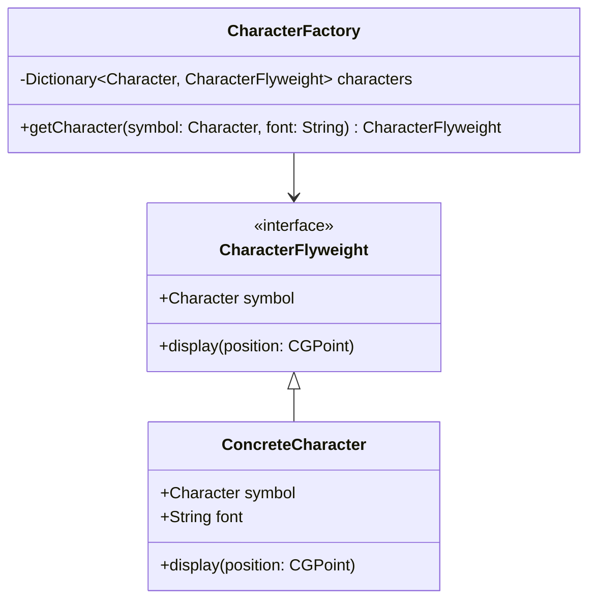

## 5.6 Flyweight Design Pattern

In the realm of software development, particularly in resource-constrained environments like mobile devices, efficient memory usage is paramount. The Flyweight Design Pattern is a structural pattern that addresses this concern by enabling the sharing of common parts of objects to minimize memory usage. This pattern is particularly useful when dealing with a large number of similar objects, such as graphical elements in a game or characters in a text rendering system. In this section, we'll explore how to implement the Flyweight Design Pattern in Swift, discuss its use cases, and provide practical examples.

### Intent

The primary intent of the Flyweight Design Pattern is to use sharing to support large numbers of fine-grained objects efficiently. By sharing common parts of objects, the Flyweight Pattern reduces memory consumption and improves performance.

### Key Concepts

- **Intrinsic State**: This is the state that is shared between objects. It is stored externally and does not change from one object to another.
- **Extrinsic State**: This is the state that is unique to each object and must be supplied by the client code.
- **Flyweight Factory**: This is responsible for managing and creating Flyweight objects. It ensures that shared objects are reused rather than recreated.

### Implementing Flyweight in Swift

To implement the Flyweight Design Pattern in Swift, we need to focus on two main aspects: storing shared data externally and using factories to manage shared instances.

#### Storing Shared Data Externally

In Swift, we can store shared data in a dictionary or any other collection type that allows us to efficiently retrieve and store shared objects. The key is to separate the intrinsic state (shared) from the extrinsic state (unique) to each instance.

#### Using Factories to Manage Shared Instances

A Flyweight Factory is essential in the Flyweight Design Pattern. It manages the lifecycle of Flyweight objects and ensures that shared objects are reused. The factory checks if an object with the required intrinsic state already exists and returns it; otherwise, it creates a new one.

### Use Cases and Examples

#### Rendering Text Characters

One classic example of the Flyweight Design Pattern is in text rendering systems, where each character can be represented as a Flyweight object. The intrinsic state includes the character's font, size, and style, while the extrinsic state includes the position of the character on the screen.

```swift
import Foundation

// Flyweight Interface
protocol CharacterFlyweight {
    var symbol: Character { get }
    func display(position: CGPoint)
}

// Concrete Flyweight
class ConcreteCharacter: CharacterFlyweight {
    let symbol: Character
    let font: String
    
    init(symbol: Character, font: String) {
        self.symbol = symbol
        self.font = font
    }
    
    func display(position: CGPoint) {
        print("Displaying '\\(symbol)' at position \\(position) with font \\(font)")
    }
}

// Flyweight Factory
class CharacterFactory {
    private var characters: [Character: CharacterFlyweight] = [:]
    
    func getCharacter(symbol: Character, font: String) -> CharacterFlyweight {
        if let character = characters[symbol] {
            return character
        } else {
            let character = ConcreteCharacter(symbol: symbol, font: font)
            characters[symbol] = character
            return character
        }
    }
}

// Usage
let factory = CharacterFactory()
let charA1 = factory.getCharacter(symbol: "A", font: "Arial")
let charA2 = factory.getCharacter(symbol: "A", font: "Arial")

charA1.display(position: CGPoint(x: 10, y: 20))
charA2.display(position: CGPoint(x: 30, y: 40))
```

In this example, the `CharacterFactory` ensures that the character "A" with the font "Arial" is shared between `charA1` and `charA2`, thus saving memory.

#### Game Object Management

In game development, the Flyweight Pattern can be used to manage a large number of similar game objects, such as trees in a forest or enemies in a level.

```swift
import Foundation

// Flyweight Interface
protocol GameObjectFlyweight {
    var texture: String { get }
    func render(position: CGPoint)
}

// Concrete Flyweight
class ConcreteGameObject: GameObjectFlyweight {
    let texture: String
    
    init(texture: String) {
        self.texture = texture
    }
    
    func render(position: CGPoint) {
        print("Rendering object with texture \\(texture) at position \\(position)")
    }
}

// Flyweight Factory
class GameObjectFactory {
    private var gameObjects: [String: GameObjectFlyweight] = [:]
    
    func getGameObject(texture: String) -> GameObjectFlyweight {
        if let gameObject = gameObjects[texture] {
            return gameObject
        } else {
            let gameObject = ConcreteGameObject(texture: texture)
            gameObjects[texture] = gameObject
            return gameObject
        }
    }
}

// Usage
let gameObjectFactory = GameObjectFactory()
let tree1 = gameObjectFactory.getGameObject(texture: "TreeTexture")
let tree2 = gameObjectFactory.getGameObject(texture: "TreeTexture")

tree1.render(position: CGPoint(x: 100, y: 200))
tree2.render(position: CGPoint(x: 300, y: 400))
```

Here, the `GameObjectFactory` ensures that the texture for trees is shared between `tree1` and `tree2`, reducing the memory footprint.

### Visualizing the Flyweight Pattern

To better understand the Flyweight Design Pattern, let's visualize the relationships between the key components using a class diagram.



**Diagram Description**: This class diagram illustrates the Flyweight Design Pattern for a text rendering system. The `CharacterFlyweight` interface defines the common method `display`, implemented by `ConcreteCharacter`. The `CharacterFactory` manages and provides shared instances of `CharacterFlyweight`.

### Design Considerations

When implementing the Flyweight Design Pattern, consider the following:

- **Identify Shared and Unique States**: Clearly distinguish between intrinsic and extrinsic states. Only intrinsic states should be shared.
- **Use Factories**: Always use a factory to manage Flyweight objects. This ensures that instances are reused and not duplicated.
- **Performance Trade-offs**: While the Flyweight Pattern reduces memory usage, it may introduce complexity in managing extrinsic states. Ensure that this complexity does not outweigh the benefits of memory savings.
- **Concurrency**: If your application is multi-threaded, ensure that access to shared Flyweight objects is thread-safe.

### Swift Unique Features

Swift's features such as protocols, generics, and value types can be leveraged to implement the Flyweight Design Pattern effectively.

- **Protocols**: Use protocols to define the Flyweight interface, allowing for flexible and reusable code.
- **Generics**: Implement Flyweight factories using generics to handle different types of Flyweight objects.
- **Value Types**: Use value types (e.g., structs) for extrinsic states to ensure immutability and thread safety.

### Differences and Similarities

The Flyweight Design Pattern is often confused with other structural patterns like the Singleton Pattern. However, the Flyweight Pattern focuses on sharing instances to reduce memory usage, while the Singleton Pattern ensures a single instance of a class.

### Try It Yourself

Experiment with the Flyweight Design Pattern by modifying the examples above. Try changing the intrinsic and extrinsic states, or implement a Flyweight Pattern for a different use case, such as managing UI components in an app.

### Knowledge Check

- **What is the primary intent of the Flyweight Design Pattern?**
- **How does the Flyweight Pattern differ from the Singleton Pattern?**
- **What are intrinsic and extrinsic states in the context of the Flyweight Pattern?**

### Embrace the Journey

Remember, mastering design patterns like the Flyweight Pattern is a journey. As you continue to explore and implement these patterns, you'll gain a deeper understanding of how to build efficient and scalable applications. Keep experimenting, stay curious, and enjoy the journey!

## Quiz Time!



### What is the primary intent of the Flyweight Design Pattern?

- [x] To use sharing to support large numbers of fine-grained objects efficiently.
- [ ] To ensure a single instance of a class.
- [ ] To provide a way to create objects without specifying their concrete classes.
- [ ] To define a family of algorithms and make them interchangeable.

> **Explanation:** The Flyweight Design Pattern aims to reduce memory usage by sharing common parts of objects, making it efficient for handling large numbers of similar objects.

### In the Flyweight Design Pattern, what is the intrinsic state?

- [x] The state that is shared between objects.
- [ ] The state that is unique to each object.
- [ ] The state that is stored in a database.
- [ ] The state that is managed by the operating system.

> **Explanation:** Intrinsic state refers to the shared part of an object that does not change across different instances, allowing it to be reused.

### What role does the Flyweight Factory play in the pattern?

- [x] It manages the lifecycle of Flyweight objects and ensures shared objects are reused.
- [ ] It creates new instances of objects without sharing.
- [ ] It destroys objects when they are no longer needed.
- [ ] It manages the database connections for objects.

> **Explanation:** The Flyweight Factory is responsible for managing Flyweight objects, ensuring that shared instances are reused rather than recreated.

### Which of the following is a common use case for the Flyweight Pattern?

- [x] Rendering text characters in a text editor.
- [ ] Managing database connections.
- [ ] Handling user authentication.
- [ ] Implementing a logging system.

> **Explanation:** The Flyweight Pattern is commonly used in scenarios like text rendering, where many similar objects (characters) can share common data (fonts, styles).

### How does the Flyweight Pattern differ from the Singleton Pattern?

- [x] Flyweight focuses on sharing instances, while Singleton ensures a single instance.
- [ ] Both patterns ensure a single instance of a class.
- [ ] Flyweight is used for creating objects, while Singleton is used for destroying objects.
- [ ] Both patterns are unrelated and serve different purposes.

> **Explanation:** The Flyweight Pattern is about sharing instances to reduce memory usage, whereas the Singleton Pattern ensures that only one instance of a class exists.

### What is the extrinsic state in the Flyweight Pattern?

- [x] The state that is unique to each object and must be supplied by the client.
- [ ] The state that is shared between objects.
- [ ] The state that is stored in a file.
- [ ] The state that is managed by the Flyweight Factory.

> **Explanation:** Extrinsic state refers to the unique part of an object that is not shared and must be provided by the client code.

### Which Swift feature can be leveraged to define the Flyweight interface?

- [x] Protocols
- [ ] Enums
- [ ] Closures
- [ ] Extensions

> **Explanation:** Protocols in Swift allow for defining interfaces, making them suitable for implementing the Flyweight interface.

### Why is it important to use a factory in the Flyweight Pattern?

- [x] To ensure that instances are reused and not duplicated.
- [ ] To create new instances without sharing.
- [ ] To manage database connections.
- [ ] To handle user authentication.

> **Explanation:** A factory in the Flyweight Pattern ensures that shared instances are reused, preventing unnecessary duplication.

### Can the Flyweight Pattern be used in game development?

- [x] True
- [ ] False

> **Explanation:** The Flyweight Pattern is useful in game development for managing large numbers of similar objects, such as textures or game entities.

### What should be considered when implementing the Flyweight Pattern?

- [x] Identifying shared and unique states.
- [ ] Ensuring a single instance of a class.
- [ ] Managing database connections.
- [ ] Handling user authentication.

> **Explanation:** When implementing the Flyweight Pattern, it's crucial to clearly distinguish between shared (intrinsic) and unique (extrinsic) states.




