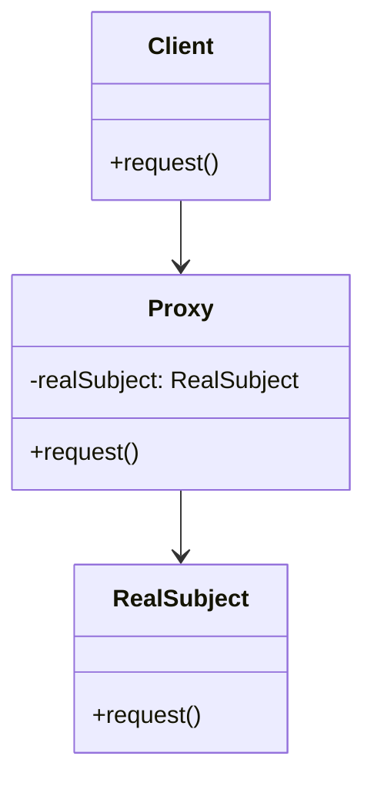

## 5.7 Proxy Design Pattern

In the realm of software design, the Proxy Design Pattern stands out as a versatile structural pattern that provides a surrogate or placeholder for another object to control access. By implementing proxies, we can manage resource-intensive objects, control access, and even enhance functionality without modifying the original object. 

### Intent

The primary intent of the Proxy Design Pattern is to provide a surrogate or placeholder for another object to control access to it. This pattern is particularly useful in situations where direct access to an object is either costly or undesirable. By using a proxy, we can defer the creation of expensive objects, manage remote resources, or add additional layers of security.

### Key Participants

1. **Proxy**: The interface that represents the subject. It maintains a reference to the real subject and controls access to it.
2. **RealSubject**: The actual object that the proxy represents. It defines the real functionality that the proxy controls access to.
3. **Client**: The entity that interacts with the proxy to access the real subject.

### Diagrams

To better understand how the Proxy Design Pattern operates, let's visualize the components and their interactions:



**Diagram Description:** In this class diagram, the `Client` interacts with the `Proxy`, which in turn manages access to the `RealSubject`. This setup allows the proxy to control when and how the real subject's methods are invoked.

### Implementing Proxy in Swift

In Swift, implementing the Proxy Design Pattern involves creating proxy classes that manage access to the real subject. There are various types of proxies, such as virtual, remote, and protection proxies, each serving different purposes.

#### Virtual Proxy

A virtual proxy is used to control access to an object that is expensive to create. It defers the creation of the object until it is absolutely necessary.

```swift
protocol Image {
    func display()
}

class RealImage: Image {
    private var filename: String

    init(filename: String) {
        self.filename = filename
        loadFromDisk()
    }

    private func loadFromDisk() {
        print("Loading \\(filename)")
    }

    func display() {
        print("Displaying \\(filename)")
    }
}

class ProxyImage: Image {
    private var realImage: RealImage?
    private var filename: String

    init(filename: String) {
        self.filename = filename
    }

    func display() {
        if realImage == nil {
            realImage = RealImage(filename: filename)
        }
        realImage?.display()
    }
}

// Usage
let image = ProxyImage(filename: "test_image.jpg")
image.display() // Loading test_image.jpg
image.display() // Displaying test_image.jpg
```

**Explanation:** In this example, the `ProxyImage` class acts as a virtual proxy for the `RealImage` class. The real image is only loaded from disk when the `display` method is called for the first time.

#### Remote Proxy

A remote proxy is used to represent an object that exists in a different address space. This is common in distributed systems where objects are accessed over a network.

```swift
protocol Service {
    func fetchData() -> String
}

class RemoteService: Service {
    func fetchData() -> String {
        // Simulate network delay
        return "Data from remote service"
    }
}

class RemoteProxy: Service {
    private var remoteService: RemoteService?

    func fetchData() -> String {
        if remoteService == nil {
            remoteService = RemoteService()
        }
        return remoteService?.fetchData() ?? "No data"
    }
}

// Usage
let service = RemoteProxy()
print(service.fetchData()) // Data from remote service
```

**Explanation:** Here, `RemoteProxy` acts as a proxy for `RemoteService`, simulating a network call. The proxy ensures that the remote service is only instantiated when required.

#### Protection Proxy

A protection proxy controls access to an object based on access rights. This is useful in scenarios where different users have different levels of access.

```swift
protocol Document {
    func displayContent()
}

class RealDocument: Document {
    private var content: String

    init(content: String) {
        self.content = content
    }

    func displayContent() {
        print(content)
    }
}

class ProtectionProxy: Document {
    private var realDocument: RealDocument
    private var userRole: String

    init(document: RealDocument, userRole: String) {
        self.realDocument = document
        self.userRole = userRole
    }

    func displayContent() {
        if userRole == "admin" {
            realDocument.displayContent()
        } else {
            print("Access denied")
        }
    }
}

// Usage
let document = RealDocument(content: "Sensitive Information")
let proxy = ProtectionProxy(document: document, userRole: "user")
proxy.displayContent() // Access denied
```

**Explanation:** In this example, `ProtectionProxy` checks the `userRole` before allowing access to the `RealDocument`. Only users with the "admin" role can view the document content.

### Use Cases and Examples

The Proxy Design Pattern is widely used in various scenarios:

- **Lazy Loading**: Proxies can defer the creation of expensive objects until they are needed, improving application performance.
- **Remote Object Interaction**: In distributed systems, proxies can represent remote objects, handling network communication seamlessly.
- **Access Control**: Proxies can restrict access to sensitive objects based on user roles or permissions.

### Design Considerations

When implementing the Proxy Design Pattern, consider the following:

- **Performance Overhead**: While proxies can improve performance by deferring object creation, they can also introduce overhead due to additional layers of abstraction.
- **Complexity**: Adding proxies can increase the complexity of the codebase, so use them judiciously.
- **Security**: In protection proxies, ensure that access control logic is robust and cannot be bypassed.

### Swift Unique Features

Swift's protocol-oriented programming paradigm aligns well with the Proxy Design Pattern. By defining protocols for the proxy and real subject, we can ensure that the proxy seamlessly integrates into existing codebases. Additionally, Swift's type safety and optionals provide a robust framework for implementing proxies without runtime errors.

### Differences and Similarities

The Proxy Design Pattern is often confused with other structural patterns such as Decorator and Adapter. However, there are key differences:

- **Decorator**: Adds additional responsibilities to an object without changing its interface.
- **Adapter**: Converts the interface of a class into another interface expected by the client.
- **Proxy**: Controls access to an object, potentially adding additional functionality.

### Try It Yourself

Experiment with the provided code examples by modifying them to suit different scenarios. For instance, try implementing a caching proxy that stores results of expensive operations to avoid redundant computations.

### Knowledge Check

- What is the primary intent of the Proxy Design Pattern?
- How does a virtual proxy differ from a remote proxy?
- In what scenarios would you use a protection proxy?
- How can Swift's protocol-oriented programming enhance the implementation of proxies?

### Embrace the Journey

As you delve deeper into the Proxy Design Pattern, remember that mastering design patterns is a journey. Each pattern you learn and implement enhances your ability to write efficient, scalable, and maintainable code. Keep experimenting, stay curious, and enjoy the process of becoming a proficient Swift developer!

## Quiz Time!



### What is the primary intent of the Proxy Design Pattern?

- [x] To provide a surrogate or placeholder for another object to control access
- [ ] To convert the interface of a class into another interface
- [ ] To add additional responsibilities to an object
- [ ] To encapsulate a group of individual factories

> **Explanation:** The Proxy Design Pattern is intended to provide a surrogate or placeholder for another object to control access to it.

### Which type of proxy defers the creation of an expensive object until it is needed?

- [x] Virtual Proxy
- [ ] Remote Proxy
- [ ] Protection Proxy
- [ ] Adapter Proxy

> **Explanation:** A Virtual Proxy defers the creation of an expensive object until it is needed, optimizing resource usage.

### What is a key use case for a remote proxy?

- [ ] Adding responsibilities to an object
- [x] Representing an object in a different address space
- [ ] Converting interfaces
- [ ] Managing object lifecycles

> **Explanation:** A Remote Proxy is used to represent an object that exists in a different address space, often over a network.

### How does a protection proxy control access to an object?

- [x] Based on user roles or permissions
- [ ] By converting interfaces
- [ ] By adding responsibilities
- [ ] By deferring object creation

> **Explanation:** A Protection Proxy controls access to an object based on user roles or permissions, ensuring security.

### Which Swift feature enhances the implementation of proxies?

- [x] Protocol-Oriented Programming
- [ ] Inheritance
- [ ] Global Variables
- [ ] Singleton Pattern

> **Explanation:** Swift's Protocol-Oriented Programming enhances the implementation of proxies by providing a robust framework for defining interfaces.

### What is a potential downside of using proxies?

- [ ] They simplify code
- [x] They can introduce performance overhead
- [ ] They eliminate all security risks
- [ ] They always reduce complexity

> **Explanation:** While proxies can optimize resource usage, they can also introduce performance overhead due to additional abstraction layers.

### What distinguishes a proxy from a decorator?

- [x] A proxy controls access, while a decorator adds responsibilities
- [ ] A proxy adds responsibilities, while a decorator controls access
- [ ] Both control access
- [ ] Both add responsibilities

> **Explanation:** A Proxy controls access to an object, while a Decorator adds additional responsibilities to an object.

### In which scenario would you use a virtual proxy?

- [x] When deferring the creation of an expensive object
- [ ] When converting interfaces
- [ ] When adding responsibilities
- [ ] When managing object lifecycles

> **Explanation:** A Virtual Proxy is used to defer the creation of an expensive object, optimizing resource usage.

### True or False: A proxy can be used to enhance security by controlling access to sensitive objects.

- [x] True
- [ ] False

> **Explanation:** True. A Proxy can enhance security by controlling access to sensitive objects, often through a protection proxy.

### True or False: The Proxy Design Pattern is only applicable in networked applications.

- [ ] True
- [x] False

> **Explanation:** False. The Proxy Design Pattern is applicable in various scenarios, including lazy loading, access control, and remote object interaction.



Remember, this is just the beginning. As you progress, you'll build more complex and interactive applications. Keep experimenting, stay curious, and enjoy the journey!


