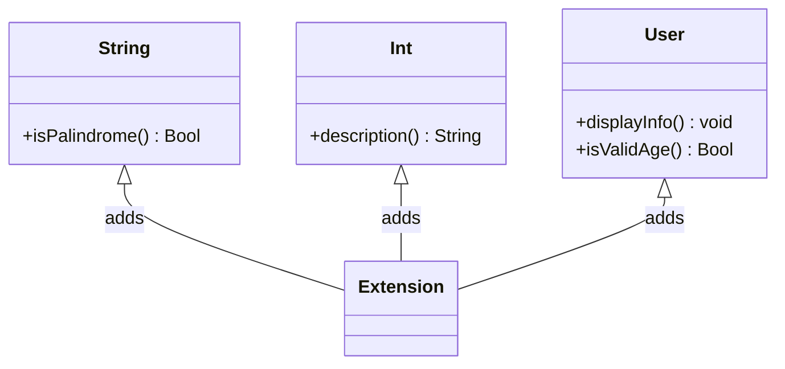

## 5.8 Extension Pattern in Swift

In Swift, the Extension Pattern is a powerful tool that allows developers to add new functionality to existing classes, structs, and enums without modifying their original source code. This pattern is particularly useful for enhancing built-in types, logically separating code, and adhering to the open/closed principle, which states that software entities should be open for extension but closed for modification.

### Intent

The primary intent of the Extension Pattern in Swift is to enable developers to extend the capabilities of existing types by adding new methods, computed properties, initializers, and even conforming to protocols. This allows for a more modular and organized codebase, promoting code reuse and reducing redundancy.

### Implementing Extensions

#### Extending Types with New Methods and Computed Properties

Extensions in Swift can be used to add new methods and computed properties to existing types. This is particularly useful when you want to add functionality to types that you do not own or cannot modify directly, such as those provided by the Swift Standard Library or third-party libraries.

Here's an example of extending the `String` type to include a method that checks if the string is a palindrome:

```swift
extension String {
    /// Checks if the string is a palindrome.
    func isPalindrome() -> Bool {
        let cleaned = self.lowercased().filter { $0.isLetter }
        return cleaned == String(cleaned.reversed())
    }
}

// Usage
let word = "Racecar"
print("\\(word) is a palindrome: \\(word.isPalindrome())") // Output: Racecar is a palindrome: true
```

In this example, we define an extension on `String` that adds a method `isPalindrome()`. This method processes the string to check if it reads the same backward as forward, ignoring case and non-letter characters.

#### Conforming to Protocols via Extensions

Extensions can also be used to make existing types conform to protocols. This is particularly useful for adding protocol conformance to types you do not own or for organizing your code by separating protocol conformance into extensions.

Consider the following example where we extend the `Int` type to conform to a custom protocol `Descriptive`:

```swift
protocol Descriptive {
    func description() -> String
}

extension Int: Descriptive {
    /// Provides a description of the integer.
    func description() -> String {
        return "The number is \\(self)"
    }
}

// Usage
let number = 42
print(number.description()) // Output: The number is 42
```

In this example, we define a protocol `Descriptive` with a method `description()`. We then extend `Int` to conform to this protocol, providing a simple implementation for the `description()` method.

### Limitations

While extensions are incredibly powerful, they do come with certain limitations:

- **Stored Properties**: Extensions cannot add stored properties to types. This is because stored properties require memory allocation, which cannot be done through extensions. Instead, extensions can only add computed properties, which are derived from other properties or methods.

- **Overriding**: Extensions cannot override existing methods. This limitation ensures that extensions do not alter the existing behavior of a type, maintaining the integrity of the original implementation.

### Use Cases and Examples

#### Enhancing Built-in Types

One of the most common use cases for extensions is enhancing built-in types. For example, you might want to add additional functionality to `Array`, `Dictionary`, or `String` to suit your application's needs.

```swift
extension Array where Element: Numeric {
    /// Computes the sum of all elements in the array.
    func sum() -> Element {
        return self.reduce(0, +)
    }
}

// Usage
let numbers = [1, 2, 3, 4, 5]
print("Sum of numbers: \\(numbers.sum())") // Output: Sum of numbers: 15
```

In this example, we extend `Array` to add a `sum()` method that calculates the sum of all elements, provided they conform to the `Numeric` protocol.

#### Separating Code Logically

Extensions can be used to logically separate code by grouping related functionality together. This is particularly useful in large projects where organizing code can become challenging.

```swift
class User {
    var name: String
    var age: Int
    
    init(name: String, age: Int) {
        self.name = name
        self.age = age
    }
}

// Extension for User's display functionality
extension User {
    /// Displays the user's information.
    func displayInfo() {
        print("Name: \\(name), Age: \\(age)")
    }
}

// Extension for User's validation functionality
extension User {
    /// Validates the user's age.
    func isValidAge() -> Bool {
        return age >= 18
    }
}

// Usage
let user = User(name: "Alice", age: 25)
user.displayInfo() // Output: Name: Alice, Age: 25
print("Is valid age: \\(user.isValidAge())") // Output: Is valid age: true
```

In this example, we use extensions to separate the `User` class's display and validation functionalities, making the code more modular and easier to maintain.

### Swift Unique Features

Swift's extension mechanism is unique in several ways:

- **Generic Extensions**: Swift allows you to create extensions that are generic, meaning they can work with any type that satisfies certain constraints. This makes extensions highly flexible and reusable.

- **Protocol Extensions**: Swift allows you to extend protocols themselves, providing default implementations for protocol methods. This feature is a cornerstone of Swift's protocol-oriented programming paradigm.

- **Conditional Conformance**: Swift supports conditional conformance in extensions, allowing you to make a type conform to a protocol only when certain conditions are met.

Here's an example demonstrating these features:

```swift
protocol Summable {
    static func +(lhs: Self, rhs: Self) -> Self
}

extension Array: Summable where Element: Summable {
    /// Sums all elements in the array.
    func total() -> Element {
        return self.reduce(0, +)
    }
}

// Usage
let intArray = [1, 2, 3]
print("Total: \\(intArray.total())") // Output: Total: 6
```

In this example, we define a protocol `Summable` and extend `Array` to conform to it, but only when its elements also conform to `Summable`. This demonstrates Swift's support for conditional conformance and generic extensions.

### Design Considerations

When using extensions in Swift, consider the following:

- **Clarity**: Use extensions to improve code clarity by logically grouping related methods and properties.
- **Maintainability**: Keep extensions focused on a single responsibility to enhance maintainability.
- **Performance**: While extensions themselves do not introduce performance overhead, ensure that the methods and properties added are efficient and well-optimized.

### Differences and Similarities

Extensions are often compared to other mechanisms for adding functionality, such as inheritance and mixins. However, they differ in key ways:

- **Inheritance**: Unlike inheritance, extensions do not create a new type or subclass. They simply add functionality to existing types.
- **Mixins**: Extensions can be thought of as mixins in languages that support them, but with the limitation that they cannot add stored properties.

### Visualizing Extensions

To better understand how extensions work in Swift, let's visualize the concept using a class diagram:



In this diagram, we see how extensions add methods to existing classes like `String`, `Int`, and `User`, enhancing their functionality without altering their original structure.

### Try It Yourself

Now that we've explored the Extension Pattern in Swift, it's time to try it yourself. Modify the code examples provided to:

- Add a `reverse()` method to the `String` extension that returns the reversed string.
- Extend `Double` to conform to the `Descriptive` protocol by providing a method that returns a formatted string representation of the double value.
- Create an extension for `Dictionary` that adds a method to merge two dictionaries.

Experiment with these modifications to deepen your understanding of extensions in Swift.

### Knowledge Check

Before we wrap up, let's reinforce what we've learned:

- **What is the primary intent of the Extension Pattern in Swift?**
- **Can extensions add stored properties to existing types?**
- **How can extensions be used to conform to protocols?**
- **What are some limitations of extensions?**
- **How do extensions differ from inheritance?**

### Embrace the Journey

Remember, mastering the Extension Pattern in Swift is just one step on your journey to becoming a proficient Swift developer. As you continue to explore and experiment with extensions, you'll discover new ways to enhance and organize your code. Keep pushing the boundaries, stay curious, and enjoy the journey!

## Quiz Time!



### What is the primary intent of the Extension Pattern in Swift?

- [x] To add new functionality to existing classes without modifying them.
- [ ] To create new classes from scratch.
- [ ] To override existing methods in a class.
- [ ] To remove functionality from existing classes.

> **Explanation:** The primary intent of the Extension Pattern is to add new functionality to existing classes without modifying their original implementation.

### Can extensions in Swift add stored properties to existing types?

- [ ] Yes, they can add both stored and computed properties.
- [x] No, they can only add computed properties.
- [ ] Yes, but only to classes, not structs.
- [ ] No, they cannot add any properties.

> **Explanation:** Extensions in Swift cannot add stored properties; they can only add computed properties because stored properties require memory allocation, which extensions cannot perform.

### How can extensions be used to conform to protocols?

- [x] By adding protocol methods and properties to the extension.
- [ ] By modifying the original class definition.
- [ ] By creating a subclass that conforms to the protocol.
- [ ] By using inheritance to implement protocol methods.

> **Explanation:** Extensions can be used to add methods and properties required by a protocol, allowing a type to conform to the protocol without modifying the original class definition.

### What is a limitation of extensions in Swift?

- [ ] They cannot add new methods to a class.
- [x] They cannot override existing methods.
- [ ] They cannot be used with structs.
- [ ] They cannot be used with enums.

> **Explanation:** Extensions cannot override existing methods in a class, ensuring that the original behavior of the class remains unchanged.

### How do extensions differ from inheritance?

- [x] Extensions add functionality without creating a new subclass.
- [ ] Extensions create a new subclass with added functionality.
- [ ] Extensions are used to remove functionality from classes.
- [ ] Extensions are a form of inheritance.

> **Explanation:** Extensions differ from inheritance in that they add functionality to existing classes without creating a new subclass, whereas inheritance involves creating a subclass that inherits from a parent class.

### Which of the following is a valid use case for extensions?

- [x] Enhancing built-in types with additional methods.
- [ ] Removing methods from existing classes.
- [ ] Creating new subclasses with added functionality.
- [ ] Overriding existing methods in a class.

> **Explanation:** Extensions are commonly used to enhance built-in types by adding additional methods, making them more versatile and tailored to specific needs.

### What is a unique feature of Swift extensions?

- [x] They support conditional conformance.
- [ ] They can add stored properties.
- [ ] They can override existing methods.
- [ ] They are only applicable to classes.

> **Explanation:** One unique feature of Swift extensions is their support for conditional conformance, allowing a type to conform to a protocol only when certain conditions are met.

### Can extensions be used to logically separate code?

- [x] Yes, they can group related functionality together.
- [ ] No, they must be part of the main class definition.
- [ ] Yes, but only for built-in types.
- [ ] No, they cannot be used for code organization.

> **Explanation:** Extensions can be used to logically separate code by grouping related functionality together, improving code organization and readability.

### What is a benefit of using extensions in Swift?

- [x] They promote code reuse and modularity.
- [ ] They allow for the creation of new classes.
- [ ] They enable the removal of methods from classes.
- [ ] They provide a way to override existing methods.

> **Explanation:** Extensions promote code reuse and modularity by allowing developers to add functionality to existing types without modifying their original implementation.

### True or False: Extensions can be used to add initializers to existing types.

- [x] True
- [ ] False

> **Explanation:** True. Extensions can be used to add initializers to existing types, allowing for additional ways to instantiate objects.




