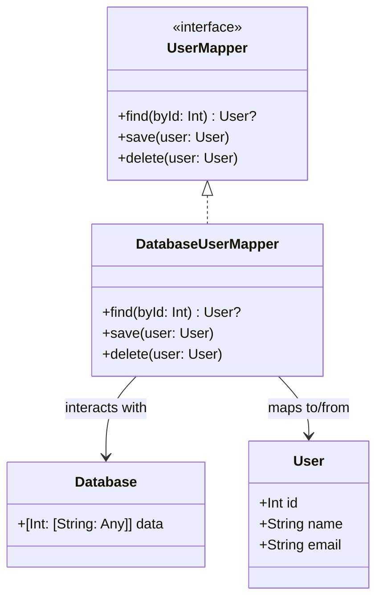

## 5.9 Data Mapper Pattern

In the world of software development, maintaining a clean separation between business logic and data persistence logic is crucial for creating maintainable and scalable applications. The Data Mapper Pattern is a structural design pattern that facilitates this separation by abstracting the data access logic from the business logic. This pattern is particularly useful in applications where complex data transformations are required or where the data source is likely to change.

### Intent

The primary intent of the Data Mapper Pattern is to separate business logic from data persistence logic. This separation ensures that domain objects remain unaware of how data is stored or retrieved, promoting a clean architecture and making the system easier to maintain and extend.

### Key Participants

- **Domain Model**: Represents the core business logic and data structure of the application. It remains agnostic of the data persistence mechanism.
- **Data Mapper**: Acts as a bridge between the domain model and the data source. It handles the conversion of domain objects to data source representations and vice versa.
- **Data Source**: The underlying storage mechanism, such as a database or a file system.

### Applicability

Use the Data Mapper Pattern when:

- You need to maintain a strict separation between business logic and data access logic.
- Your application requires complex data transformations that are not easily handled by Active Record patterns.
- You anticipate changes in the data source or persistence mechanism.
- You want to test business logic independently of data access code.

### Implementing Data Mapper in Swift

Let's delve into how we can implement the Data Mapper Pattern in Swift. We'll create a simple example involving a `User` domain model and a hypothetical database.

#### Step 1: Define the Domain Model

First, define the `User` domain model. This model should be free of any persistence logic.

```swift
struct User {
    let id: Int
    var name: String
    var email: String
}
```

#### Step 2: Create the Data Mapper Interface

Next, create a protocol that defines the responsibilities of the data mapper. This protocol will include methods for converting between domain models and data source representations.

```swift
protocol UserMapper {
    func find(byId id: Int) -> User?
    func save(_ user: User)
    func delete(_ user: User)
}
```

#### Step 3: Implement the Data Mapper

Implement the data mapper by creating a class that conforms to the `UserMapper` protocol. This class will interact with the database to perform CRUD operations.

```swift
class DatabaseUserMapper: UserMapper {
    private var database: [Int: [String: Any]] = [:] // Simulating a database with a dictionary

    func find(byId id: Int) -> User? {
        guard let data = database[id],
              let name = data["name"] as? String,
              let email = data["email"] as? String else {
            return nil
        }
        return User(id: id, name: name, email: email)
    }

    func save(_ user: User) {
        database[user.id] = ["name": user.name, "email": user.email]
    }

    func delete(_ user: User) {
        database.removeValue(forKey: user.id)
    }
}
```

### Swift Unique Features

Swift offers several unique features that can enhance the implementation of the Data Mapper Pattern:

- **Protocol-Oriented Programming (POP)**: Use protocols to define the data mapper interface, promoting flexibility and testability.
- **Extensions**: Extend existing types to add data mapping capabilities without modifying the original type.
- **Generics**: Implement generic data mappers that can handle multiple domain models.

### Differences and Similarities

The Data Mapper Pattern is often compared to the Active Record Pattern. While both patterns deal with data persistence, they have distinct differences:

- **Data Mapper**: Separates domain logic from data access logic. Domain objects are unaware of the database.
- **Active Record**: Combines domain logic and data access logic within the same object. Domain objects are responsible for their persistence.

### Visualizing the Data Mapper Pattern

To better understand the Data Mapper Pattern, let's visualize the relationship between the domain model, data mapper, and data source.



### Use Cases and Examples

The Data Mapper Pattern is particularly useful in scenarios where:

- **Complex Data Transformations**: When data needs to be transformed significantly between the domain model and the data source.
- **Multiple Data Sources**: When an application needs to interact with multiple data sources, such as a database and a web service.
- **Decoupled Architecture**: When maintaining a clean separation between business logic and data access logic is a priority.

#### Example: Implementing a Data Layer

Consider an application that manages a collection of books. We can use the Data Mapper Pattern to separate the book management logic from the data persistence logic.

```swift
struct Book {
    let id: Int
    var title: String
    var author: String
}

protocol BookMapper {
    func find(byId id: Int) -> Book?
    func save(_ book: Book)
    func delete(_ book: Book)
}

class DatabaseBookMapper: BookMapper {
    private var database: [Int: [String: Any]] = [:]

    func find(byId id: Int) -> Book? {
        guard let data = database[id],
              let title = data["title"] as? String,
              let author = data["author"] as? String else {
            return nil
        }
        return Book(id: id, title: title, author: author)
    }

    func save(_ book: Book) {
        database[book.id] = ["title": book.title, "author": book.author]
    }

    func delete(_ book: Book) {
        database.removeValue(forKey: book.id)
    }
}
```

### Design Considerations

When implementing the Data Mapper Pattern, consider the following:

- **Complexity**: The pattern can introduce additional complexity, especially in simple applications where the Active Record Pattern might suffice.
- **Performance**: Ensure that the data mapper is optimized for performance, particularly when dealing with large datasets.
- **Testing**: The separation of concerns makes it easier to test business logic independently of data access logic.

### Try It Yourself

To gain a deeper understanding of the Data Mapper Pattern, try modifying the code examples:

- Add additional fields to the `User` and `Book` models and update the data mapper implementations accordingly.
- Implement a new data mapper for a different domain model, such as an `Order` or `Product`.
- Experiment with different data sources, such as a file-based storage system or a web API.

### Knowledge Check

- Explain the primary intent of the Data Mapper Pattern.
- How does the Data Mapper Pattern differ from the Active Record Pattern?
- What are some scenarios where the Data Mapper Pattern is particularly useful?

### Embrace the Journey

Remember, mastering design patterns is a journey. The Data Mapper Pattern is just one tool in your toolbox for creating robust and maintainable Swift applications. Keep experimenting, stay curious, and enjoy the process of learning and applying design patterns in your projects.

## Quiz Time!



### What is the primary intent of the Data Mapper Pattern?

- [x] To separate business logic from data persistence logic.
- [ ] To combine business logic and data persistence logic.
- [ ] To enhance the performance of data access.
- [ ] To simplify the user interface.

> **Explanation:** The Data Mapper Pattern aims to separate business logic from data persistence logic, ensuring domain objects remain unaware of how data is stored or retrieved.

### In the Data Mapper Pattern, which component is responsible for converting domain objects to data source representations?

- [x] Data Mapper
- [ ] Domain Model
- [ ] Data Source
- [ ] User Interface

> **Explanation:** The Data Mapper is responsible for converting domain objects to data source representations and vice versa.

### What is a key benefit of using the Data Mapper Pattern?

- [x] It promotes a clean separation of concerns.
- [ ] It simplifies data access logic.
- [ ] It reduces the complexity of domain models.
- [ ] It enhances the performance of data retrieval.

> **Explanation:** The Data Mapper Pattern promotes a clean separation of concerns by decoupling business logic from data access logic.

### Which Swift feature is particularly useful for implementing the Data Mapper Pattern?

- [x] Protocol-Oriented Programming
- [ ] Automatic Reference Counting
- [ ] Optionals
- [ ] SwiftUI

> **Explanation:** Protocol-Oriented Programming in Swift allows for defining flexible and testable data mapper interfaces.

### How does the Data Mapper Pattern differ from the Active Record Pattern?

- [x] Data Mapper separates domain logic from data access logic, while Active Record combines them.
- [ ] Data Mapper combines domain logic and data access logic, while Active Record separates them.
- [ ] Data Mapper is used for simple applications, while Active Record is used for complex applications.
- [ ] Data Mapper is a behavioral pattern, while Active Record is a structural pattern.

> **Explanation:** The Data Mapper Pattern separates domain logic from data access logic, whereas the Active Record Pattern combines them within the same object.

### What is a potential drawback of using the Data Mapper Pattern?

- [x] It can introduce additional complexity.
- [ ] It simplifies data access logic.
- [ ] It reduces the flexibility of the architecture.
- [ ] It enhances the performance of data retrieval.

> **Explanation:** The Data Mapper Pattern can introduce additional complexity, especially in simple applications where the Active Record Pattern might suffice.

### In the provided code example, what does the `find(byId:)` method do?

- [x] It retrieves a domain object from the data source by its ID.
- [ ] It saves a domain object to the data source.
- [ ] It deletes a domain object from the data source.
- [ ] It updates a domain object in the data source.

> **Explanation:** The `find(byId:)` method retrieves a domain object from the data source by its ID.

### What is a common use case for the Data Mapper Pattern?

- [x] Complex data transformations between domain models and data sources.
- [ ] Simple CRUD operations in a database.
- [ ] Enhancing the user interface.
- [ ] Improving application performance.

> **Explanation:** The Data Mapper Pattern is commonly used for complex data transformations between domain models and data sources.

### Which of the following is NOT a component of the Data Mapper Pattern?

- [ ] Domain Model
- [x] User Interface
- [ ] Data Mapper
- [ ] Data Source

> **Explanation:** The User Interface is not a component of the Data Mapper Pattern, which focuses on domain models, data mappers, and data sources.

### True or False: The Data Mapper Pattern is useful when you anticipate changes in the data source or persistence mechanism.

- [x] True
- [ ] False

> **Explanation:** True. The Data Mapper Pattern is useful when you anticipate changes in the data source or persistence mechanism, as it decouples the domain model from the data access logic.


