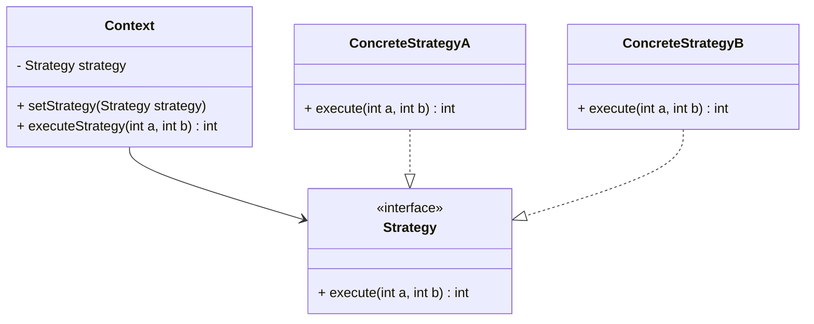

## 6.1 Strategy Design Pattern

The Strategy Design Pattern is a powerful tool in a developer's arsenal, allowing for the definition and encapsulation of a family of algorithms, making them interchangeable. This pattern is particularly useful when you need to switch between different algorithms or behaviors at runtime, offering flexibility and scalability in software design.

### Intent

The primary intent of the Strategy Design Pattern is to define a family of algorithms, encapsulate each one, and make them interchangeable. This allows the algorithm to vary independently from the clients that use it. In Swift, this can be achieved through the use of protocols, classes, structs, and closures.

### Implementing Strategy in Swift

#### Using Protocols

In Swift, protocols are a natural fit for defining the strategy interface. A protocol can declare the methods that any strategy must implement, ensuring consistency across different strategies.

```swift
protocol Strategy {
    func execute(a: Int, b: Int) -> Int
}
```

#### Concrete Strategies

Concrete strategies are specific implementations of the strategy protocol. They provide the actual logic for the algorithm.

```swift
class AdditionStrategy: Strategy {
    func execute(a: Int, b: Int) -> Int {
        return a + b
    }
}

class MultiplicationStrategy: Strategy {
    func execute(a: Int, b: Int) -> Int {
        return a * b
    }
}
```

#### Context Class

The context class maintains a reference to a strategy instance and delegates the algorithm execution to the strategy.

```swift
class Context {
    private var strategy: Strategy
    
    init(strategy: Strategy) {
        self.strategy = strategy
    }
    
    func setStrategy(strategy: Strategy) {
        self.strategy = strategy
    }
    
    func executeStrategy(a: Int, b: Int) -> Int {
        return strategy.execute(a: a, b: b)
    }
}
```

#### Dynamic Assignment

One of the key benefits of the Strategy Pattern is the ability to change the strategy at runtime, providing dynamic behavior.

```swift
let context = Context(strategy: AdditionStrategy())
print("Addition: \\(context.executeStrategy(a: 5, b: 3))") // Output: 8

context.setStrategy(strategy: MultiplicationStrategy())
print("Multiplication: \\(context.executeStrategy(a: 5, b: 3))") // Output: 15
```

#### Closures as Strategies

For lightweight scenarios, closures can serve as strategies, reducing boilerplate and enhancing readability.

```swift
typealias StrategyClosure = (Int, Int) -> Int

let additionClosure: StrategyClosure = { a, b in a + b }
let multiplicationClosure: StrategyClosure = { a, b in a * b }

class ClosureContext {
    private var strategy: StrategyClosure
    
    init(strategy: @escaping StrategyClosure) {
        self.strategy = strategy
    }
    
    func setStrategy(strategy: @escaping StrategyClosure) {
        self.strategy = strategy
    }
    
    func executeStrategy(a: Int, b: Int) -> Int {
        return strategy(a, b)
    }
}

let closureContext = ClosureContext(strategy: additionClosure)
print("Addition with Closure: \\(closureContext.executeStrategy(a: 5, b: 3))") // Output: 8

closureContext.setStrategy(strategy: multiplicationClosure)
print("Multiplication with Closure: \\(closureContext.executeStrategy(a: 5, b: 3))") // Output: 15
```

### Use Cases and Examples

#### Sorting Algorithms

The Strategy Pattern is ideal for implementing different sorting algorithms that can be swapped at runtime.

```swift
protocol SortingStrategy {
    func sort(_ array: [Int]) -> [Int]
}

class BubbleSortStrategy: SortingStrategy {
    func sort(_ array: [Int]) -> [Int] {
        var arr = array
        for i in 0..<arr.count {
            for j in 1..<arr.count - i {
                if arr[j] < arr[j - 1] {
                    arr.swapAt(j, j - 1)
                }
            }
        }
        return arr
    }
}

class QuickSortStrategy: SortingStrategy {
    func sort(_ array: [Int]) -> [Int] {
        if array.count <= 1 { return array }
        let pivot = array[array.count / 2]
        let less = array.filter { $0 < pivot }
        let equal = array.filter { $0 == pivot }
        let greater = array.filter { $0 > pivot }
        return sort(less) + equal + sort(greater)
    }
}

class SortingContext {
    private var strategy: SortingStrategy
    
    init(strategy: SortingStrategy) {
        self.strategy = strategy
    }
    
    func setStrategy(strategy: SortingStrategy) {
        self.strategy = strategy
    }
    
    func sortArray(_ array: [Int]) -> [Int] {
        return strategy.sort(array)
    }
}

let sortingContext = SortingContext(strategy: BubbleSortStrategy())
print("Bubble Sort: \\(sortingContext.sortArray([5, 3, 8, 1, 2]))")

sortingContext.setStrategy(strategy: QuickSortStrategy())
print("Quick Sort: \\(sortingContext.sortArray([5, 3, 8, 1, 2]))")
```

#### Payment Methods

Switching between various payment processing algorithms can be efficiently managed using the Strategy Pattern.

```swift
protocol PaymentStrategy {
    func pay(amount: Double)
}

class CreditCardPayment: PaymentStrategy {
    func pay(amount: Double) {
        print("Paid \\(amount) using Credit Card.")
    }
}

class PayPalPayment: PaymentStrategy {
    func pay(amount: Double) {
        print("Paid \\(amount) using PayPal.")
    }
}

class PaymentContext {
    private var strategy: PaymentStrategy
    
    init(strategy: PaymentStrategy) {
        self.strategy = strategy
    }
    
    func setStrategy(strategy: PaymentStrategy) {
        self.strategy = strategy
    }
    
    func processPayment(amount: Double) {
        strategy.pay(amount: amount)
    }
}

let paymentContext = PaymentContext(strategy: CreditCardPayment())
paymentContext.processPayment(amount: 100.0)

paymentContext.setStrategy(strategy: PayPalPayment())
paymentContext.processPayment(amount: 200.0)
```

#### Dynamic Behaviors

Changing behaviors such as logging or validation strategies at runtime can enhance the flexibility and maintainability of your codebase.

```swift
protocol LoggingStrategy {
    func log(message: String)
}

class ConsoleLogging: LoggingStrategy {
    func log(message: String) {
        print("Console Log: \\(message)")
    }
}

class FileLogging: LoggingStrategy {
    func log(message: String) {
        // Assume file logging implementation
        print("File Log: \\(message)")
    }
}

class LoggerContext {
    private var strategy: LoggingStrategy
    
    init(strategy: LoggingStrategy) {
        self.strategy = strategy
    }
    
    func setStrategy(strategy: LoggingStrategy) {
        self.strategy = strategy
    }
    
    func log(message: String) {
        strategy.log(message: message)
    }
}

let logger = LoggerContext(strategy: ConsoleLogging())
logger.log(message: "This is a console log.")

logger.setStrategy(strategy: FileLogging())
logger.log(message: "This is a file log.")
```

### Design Considerations

- **When to Use**: Use the Strategy Pattern when you have a family of algorithms or behaviors that need to be interchangeable. This pattern is particularly useful when the algorithm's behavior needs to be selected at runtime.
- **Important Considerations**: Ensure that the strategies are interchangeable and that the context is decoupled from the strategy implementations. Avoid tight coupling between the context and strategy to maintain flexibility.
- **Pitfalls**: Overusing the Strategy Pattern can lead to unnecessary complexity. Use it only when the flexibility it provides is genuinely needed.

### Swift Unique Features

- **Protocols and Protocol Extensions**: Swift's protocols and extensions allow for clean and flexible strategy interfaces.
- **Closures**: Swift's first-class function support allows for using closures as strategies, reducing boilerplate code.
- **Value Types**: Swift's structs can be used for lightweight strategy implementations, leveraging value semantics for safety and performance.

### Differences and Similarities

- **Strategy vs. State Pattern**: Both patterns involve encapsulating behavior, but the Strategy Pattern is focused on interchangeable algorithms, while the State Pattern is about managing state transitions.
- **Strategy vs. Template Method**: The Strategy Pattern allows for interchangeable algorithms, whereas the Template Method defines a skeleton of an algorithm with steps overridden by subclasses.

### Visualizing the Strategy Pattern



This diagram illustrates the relationship between the context and the strategies, showing how different concrete strategies implement the strategy interface.

### Try It Yourself

Experiment with the Strategy Pattern by implementing your own strategies. Try creating different algorithms, such as various discount strategies for an e-commerce platform. Modify the context to switch between these strategies at runtime, and observe how the flexibility of the Strategy Pattern can simplify your codebase.

### Knowledge Check

- What is the primary intent of the Strategy Design Pattern?
- How can protocols be used to implement the Strategy Pattern in Swift?
- What are some common use cases for the Strategy Pattern?
- How do closures simplify the implementation of strategies in Swift?
- What are the differences between the Strategy and State Patterns?

### Embrace the Journey

Remember, mastering design patterns like the Strategy Pattern is a journey. As you continue to explore and implement these patterns, you'll gain a deeper understanding of how they can enhance your software design. Keep experimenting, stay curious, and enjoy the process of learning and growing as a Swift developer!

## Quiz Time!



### What is the primary intent of the Strategy Design Pattern?

- [x] Define a family of algorithms, encapsulate each one, and make them interchangeable.
- [ ] Define a single algorithm and make it non-interchangeable.
- [ ] Define a family of algorithms and make them non-interchangeable.
- [ ] Define a single algorithm and encapsulate it.

> **Explanation:** The Strategy Design Pattern aims to define a family of algorithms, encapsulate each one, and make them interchangeable, allowing for flexibility in algorithm selection.

### How can protocols be used to implement the Strategy Pattern in Swift?

- [x] By defining a protocol that represents the strategy interface.
- [ ] By using protocols to define the context class.
- [ ] By using protocols to define concrete strategies only.
- [ ] By using protocols to define the client class.

> **Explanation:** In Swift, protocols are used to define the strategy interface, ensuring consistency across different strategy implementations.

### What are some common use cases for the Strategy Pattern?

- [x] Sorting algorithms and payment methods.
- [ ] Single-use algorithms and static methods.
- [ ] Non-interchangeable algorithms and fixed behaviors.
- [ ] Immutable data structures and constant values.

> **Explanation:** Common use cases for the Strategy Pattern include sorting algorithms, payment methods, and other scenarios where interchangeable behaviors are needed.

### How do closures simplify the implementation of strategies in Swift?

- [x] By reducing boilerplate and enhancing readability.
- [ ] By increasing boilerplate and reducing readability.
- [ ] By making strategies non-interchangeable.
- [ ] By making strategies less flexible.

> **Explanation:** Closures in Swift allow for simplified strategy implementations by reducing boilerplate code and enhancing readability.

### What are the differences between the Strategy and State Patterns?

- [x] Strategy focuses on interchangeable algorithms, while State manages state transitions.
- [ ] Strategy and State both focus on interchangeable algorithms.
- [ ] Strategy manages state transitions, while State focuses on algorithms.
- [ ] Strategy and State both manage state transitions.

> **Explanation:** The Strategy Pattern focuses on interchangeable algorithms, whereas the State Pattern is concerned with managing state transitions.

### Which Swift feature allows for clean and flexible strategy interfaces?

- [x] Protocols and Protocol Extensions
- [ ] Classes and Inheritance
- [ ] Static Methods and Constants
- [ ] Enums and Switch Statements

> **Explanation:** Swift's protocols and protocol extensions provide clean and flexible interfaces for implementing the Strategy Pattern.

### What is a potential pitfall of overusing the Strategy Pattern?

- [x] Unnecessary complexity
- [ ] Increased simplicity
- [ ] Reduced flexibility
- [ ] Enhanced performance

> **Explanation:** Overusing the Strategy Pattern can lead to unnecessary complexity in the codebase.

### How does the Strategy Pattern enhance code flexibility?

- [x] By allowing the algorithm to vary independently from clients.
- [ ] By making the algorithm fixed and non-interchangeable.
- [ ] By reducing the number of algorithms available.
- [ ] By making the context class non-modifiable.

> **Explanation:** The Strategy Pattern enhances flexibility by allowing the algorithm to vary independently from the clients that use it.

### What is the role of the context class in the Strategy Pattern?

- [x] To maintain a reference to a strategy instance and delegate algorithm execution.
- [ ] To implement the strategy interface directly.
- [ ] To define the algorithm itself.
- [ ] To encapsulate multiple strategies without delegation.

> **Explanation:** The context class maintains a reference to a strategy instance and delegates the execution of the algorithm to the strategy.

### True or False: The Strategy Pattern is useful when the algorithm's behavior needs to be selected at runtime.

- [x] True
- [ ] False

> **Explanation:** The Strategy Pattern is particularly useful when the algorithm's behavior needs to be selected at runtime, providing flexibility and scalability.




