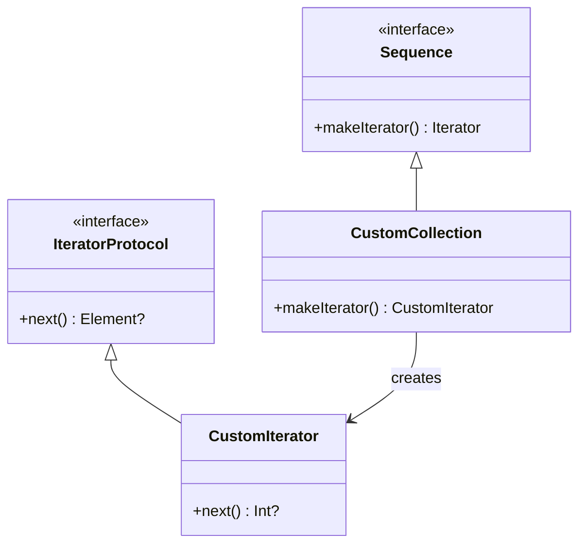

## 6.10 Iterator Design Pattern

### Introduction

The Iterator Design Pattern is a fundamental concept in software development that provides a way to access the elements of an aggregate object sequentially without exposing its underlying representation. In Swift, this pattern is elegantly implemented using the `Sequence` and `IteratorProtocol` protocols. By leveraging these protocols, developers can create custom iterators for complex data structures, enabling seamless iteration through various collection types.

### Intent

The primary intent of the Iterator Design Pattern is to separate the traversal logic from the collection itself. This separation allows for flexibility and reusability of traversal algorithms, enabling developers to iterate over different data structures without modifying their internal representation. This pattern is particularly useful when dealing with complex or non-linear data structures such as trees, graphs, or custom collections.

### Implementing Iterator in Swift

Swift provides built-in support for the Iterator Design Pattern through the `Sequence` and `IteratorProtocol` protocols. Let's explore how to implement these protocols to create custom iterators.

#### Sequence and IteratorProtocol

To implement the Iterator Design Pattern in Swift, you need to conform your custom collection to the `Sequence` protocol and create an iterator by conforming to the `IteratorProtocol`.

```swift
// Define a custom collection
struct CustomCollection: Sequence {
    let items: [Int]
    
    // Conform to Sequence by defining a makeIterator method
    func makeIterator() -> CustomIterator {
        return CustomIterator(items: items)
    }
}

// Define an iterator conforming to IteratorProtocol
struct CustomIterator: IteratorProtocol {
    private var currentIndex = 0
    private let items: [Int]
    
    init(items: [Int]) {
        self.items = items
    }
    
    // Implement the next() method to traverse elements
    mutating func next() -> Int? {
        guard currentIndex < items.count else {
            return nil
        }
        let item = items[currentIndex]
        currentIndex += 1
        return item
    }
}

// Example usage
let collection = CustomCollection(items: [1, 2, 3, 4, 5])
for item in collection {
    print(item) // Output: 1 2 3 4 5
}
```

In this example, `CustomCollection` conforms to the `Sequence` protocol by implementing the `makeIterator()` method, which returns an instance of `CustomIterator`. The `CustomIterator` struct conforms to the `IteratorProtocol` by implementing the `next()` method, which returns the next element in the collection or `nil` if no more elements are available.

#### For-In Loops

By conforming to the `Sequence` protocol, custom collections can be iterated using Swift's native `for-in` loop syntax. This feature enhances the readability and simplicity of code that interacts with custom data structures.

#### Generic Iterators

Swift's type system allows for the creation of generic iterators, which can be reused across different types of collections. By defining a generic iterator, you can create flexible and reusable traversal logic.

```swift
// Define a generic iterator
struct GenericIterator<T>: IteratorProtocol {
    private var currentIndex = 0
    private let items: [T]
    
    init(items: [T]) {
        self.items = items
    }
    
    mutating func next() -> T? {
        guard currentIndex < items.count else {
            return nil
        }
        let item = items[currentIndex]
        currentIndex += 1
        return item
    }
}

// Define a generic collection
struct GenericCollection<T>: Sequence {
    let items: [T]
    
    func makeIterator() -> GenericIterator<T> {
        return GenericIterator(items: items)
    }
}

// Example usage
let stringCollection = GenericCollection(items: ["apple", "banana", "cherry"])
for fruit in stringCollection {
    print(fruit) // Output: apple banana cherry
}
```

In this example, `GenericIterator` is a generic iterator that can traverse any collection of elements, regardless of their type. The `GenericCollection` struct demonstrates how to use this iterator to create a sequence of strings.

### Use Cases and Examples

The Iterator Design Pattern is versatile and can be applied in various scenarios. Let's explore some common use cases.

#### Custom Collections

Custom collections often require specialized iteration logic. By implementing the Iterator Design Pattern, you can create collections that are easy to traverse without exposing their internal structure.

```swift
// Define a custom node for a binary tree
class TreeNode<T> {
    var value: T
    var left: TreeNode?
    var right: TreeNode?
    
    init(value: T) {
        self.value = value
    }
}

// Define a binary tree collection
struct BinaryTree<T>: Sequence {
    var root: TreeNode<T>?
    
    func makeIterator() -> BinaryTreeIterator<T> {
        return BinaryTreeIterator(root: root)
    }
}

// Define a binary tree iterator
struct BinaryTreeIterator<T>: IteratorProtocol {
    private var stack: [TreeNode<T>] = []
    
    init(root: TreeNode<T>?) {
        var current = root
        while let node = current {
            stack.append(node)
            current = node.left
        }
    }
    
    mutating func next() -> T? {
        guard !stack.isEmpty else {
            return nil
        }
        let node = stack.removeLast()
        var current = node.right
        while let rightNode = current {
            stack.append(rightNode)
            current = rightNode.left
        }
        return node.value
    }
}

// Example usage
let rootNode = TreeNode(value: 1)
rootNode.left = TreeNode(value: 2)
rootNode.right = TreeNode(value: 3)
rootNode.left?.left = TreeNode(value: 4)
rootNode.left?.right = TreeNode(value: 5)

let binaryTree = BinaryTree(root: rootNode)
for value in binaryTree {
    print(value) // Output: 4 2 5 1 3 (in-order traversal)
}
```

In this example, we define a binary tree and an iterator that performs an in-order traversal. The iterator uses a stack to keep track of nodes, allowing it to traverse the tree without modifying its structure.

#### File Systems

Iterating over files and directories in a file system is another common use case for the Iterator Design Pattern. By implementing a custom iterator, you can navigate through file hierarchies efficiently.

```swift
import Foundation

// Define a file system iterator
struct FileSystemIterator: IteratorProtocol {
    private var fileManager = FileManager.default
    private var directoryEnumerator: FileManager.DirectoryEnumerator?
    
    init(path: String) {
        directoryEnumerator = fileManager.enumerator(atPath: path)
    }
    
    mutating func next() -> String? {
        return directoryEnumerator?.nextObject() as? String
    }
}

// Define a file system collection
struct FileSystemCollection: Sequence {
    let path: String
    
    func makeIterator() -> FileSystemIterator {
        return FileSystemIterator(path: path)
    }
}

// Example usage
let documentsPath = FileManager.default.urls(for: .documentDirectory, in: .userDomainMask).first!.path
let fileSystem = FileSystemCollection(path: documentsPath)
for file in fileSystem {
    print(file)
}
```

In this example, `FileSystemIterator` uses `FileManager` to iterate over files in a specified directory. The iterator returns the path of each file, allowing you to process them sequentially.

#### Data Streams

Processing incoming data streams, such as network packets or sensor data, often requires sequential iteration. The Iterator Design Pattern can be used to handle these scenarios efficiently.

```swift
// Define a data stream iterator
struct DataStreamIterator: IteratorProtocol {
    private var dataStream: [Int]
    private var currentIndex = 0
    
    init(dataStream: [Int]) {
        self.dataStream = dataStream
    }
    
    mutating func next() -> Int? {
        guard currentIndex < dataStream.count else {
            return nil
        }
        let data = dataStream[currentIndex]
        currentIndex += 1
        return data
    }
}

// Define a data stream collection
struct DataStreamCollection: Sequence {
    let dataStream: [Int]
    
    func makeIterator() -> DataStreamIterator {
        return DataStreamIterator(dataStream: dataStream)
    }
}

// Example usage
let sensorData = DataStreamCollection(dataStream: [100, 200, 300, 400, 500])
for data in sensorData {
    print(data) // Output: 100 200 300 400 500
}
```

In this example, `DataStreamIterator` iterates over a collection of integers representing data from a sensor. This approach allows you to process each data point sequentially, making it ideal for real-time data processing.

### Visualizing the Iterator Pattern

To better understand the Iterator Design Pattern, let's visualize its structure using a class diagram.



In this diagram, `Sequence` and `IteratorProtocol` are interfaces that define the structure for collections and iterators, respectively. `CustomCollection` implements the `Sequence` interface and creates an instance of `CustomIterator`, which implements the `IteratorProtocol`.

### Design Considerations

When implementing the Iterator Design Pattern, consider the following:

- **Performance**: Ensure that your iterator is efficient, especially when dealing with large data sets or complex data structures.
- **State Management**: Iterators often maintain internal state (e.g., current index or stack) to track traversal progress. Be mindful of how this state is managed to avoid errors.
- **Reusability**: Design iterators to be reusable across different collections or data types by leveraging generics.
- **Error Handling**: Consider how your iterator handles errors or unexpected conditions, such as reaching the end of a collection.

### Swift Unique Features

Swift's powerful type system and protocol-oriented programming model make it well-suited for implementing the Iterator Design Pattern. Here are some Swift-specific features to consider:

- **Generics**: Use generics to create flexible and reusable iterators that can handle different data types.
- **Protocol Extensions**: Leverage protocol extensions to provide default implementations for common iterator functionality.
- **Value Semantics**: Swift's value semantics ensure that iterators are safe to use in concurrent environments, as they do not share state.

### Differences and Similarities

The Iterator Design Pattern is often compared to other patterns, such as the Composite and Visitor patterns. While all three patterns deal with traversing data structures, they serve different purposes:

- **Composite Pattern**: Focuses on treating individual objects and compositions of objects uniformly.
- **Visitor Pattern**: Allows adding new operations to a data structure without modifying its elements.
- **Iterator Pattern**: Provides a way to access elements sequentially without exposing the underlying representation.

### Try It Yourself

To deepen your understanding of the Iterator Design Pattern, try modifying the code examples provided:

- **Custom Collection**: Implement a post-order traversal for the binary tree example.
- **File System**: Extend the file system iterator to filter files based on their extensions.
- **Data Streams**: Create an iterator that processes data in chunks, rather than one element at a time.

### Knowledge Check

- **What is the primary intent of the Iterator Design Pattern?**
- **How does Swift's `Sequence` protocol facilitate iteration?**
- **What are some common use cases for the Iterator Design Pattern?**

### Embrace the Journey

Remember, mastering design patterns is an ongoing journey. As you continue to explore and implement these patterns, you'll gain a deeper understanding of their nuances and applications. Keep experimenting, stay curious, and enjoy the process of building robust and efficient Swift applications!

## Quiz Time!



### What is the primary intent of the Iterator Design Pattern?

- [x] To provide a way to access the elements of an aggregate object sequentially without exposing its underlying representation.
- [ ] To allow adding new operations to a data structure without modifying its elements.
- [ ] To treat individual objects and compositions of objects uniformly.
- [ ] To separate the construction of a complex object from its representation.

> **Explanation:** The Iterator Design Pattern's primary intent is to provide a mechanism to traverse an aggregate object without exposing its underlying structure.

### Which Swift protocol is used to create custom iterators?

- [ ] Codable
- [x] IteratorProtocol
- [ ] Equatable
- [ ] Hashable

> **Explanation:** The `IteratorProtocol` is used in Swift to define custom iterators by implementing the `next()` method.

### What method must be implemented to conform to the IteratorProtocol?

- [ ] makeIterator()
- [x] next()
- [ ] start()
- [ ] iterate()

> **Explanation:** The `next()` method must be implemented to conform to the `IteratorProtocol`, providing the next element in the sequence.

### How can custom collections be iterated using Swift's native syntax?

- [ ] By implementing the Codable protocol
- [ ] By conforming to the Hashable protocol
- [x] By conforming to the Sequence protocol
- [ ] By implementing the Equatable protocol

> **Explanation:** Custom collections can be iterated using Swift's native `for-in` loop syntax by conforming to the `Sequence` protocol.

### What is a common use case for the Iterator Design Pattern?

- [x] Navigating through data structures like trees or graphs.
- [ ] Treating individual objects and compositions of objects uniformly.
- [x] Iterating over files and directories.
- [ ] Adding new operations to a data structure without modifying its elements.

> **Explanation:** The Iterator Design Pattern is commonly used for navigating complex data structures and iterating over file systems.

### What Swift feature enhances the reusability of iterators?

- [ ] Extensions
- [x] Generics
- [ ] Closures
- [ ] Tuples

> **Explanation:** Generics enhance the reusability of iterators by allowing them to work with different data types.

### What should be considered when implementing an iterator?

- [x] Performance
- [x] State Management
- [ ] Code Signing
- [ ] User Interface Design

> **Explanation:** When implementing an iterator, it's important to consider performance and state management to ensure efficient and error-free traversal.

### What is the role of the `makeIterator()` method in a custom collection?

- [ ] To initialize the collection
- [x] To return an iterator for the collection
- [ ] To sort the elements of the collection
- [ ] To filter the elements of the collection

> **Explanation:** The `makeIterator()` method returns an iterator for the collection, enabling iteration over its elements.

### How does Swift's value semantics benefit iterators?

- [x] Ensures iterators are safe to use in concurrent environments
- [ ] Allows iterators to share state
- [ ] Enables iterators to modify the collection
- [ ] Provides default implementations for iterators

> **Explanation:** Swift's value semantics ensure that iterators do not share state, making them safe to use in concurrent environments.

### True or False: The Iterator Design Pattern exposes the internal structure of the collection it iterates over.

- [ ] True
- [x] False

> **Explanation:** False. The Iterator Design Pattern does not expose the internal structure of the collection, maintaining encapsulation.


