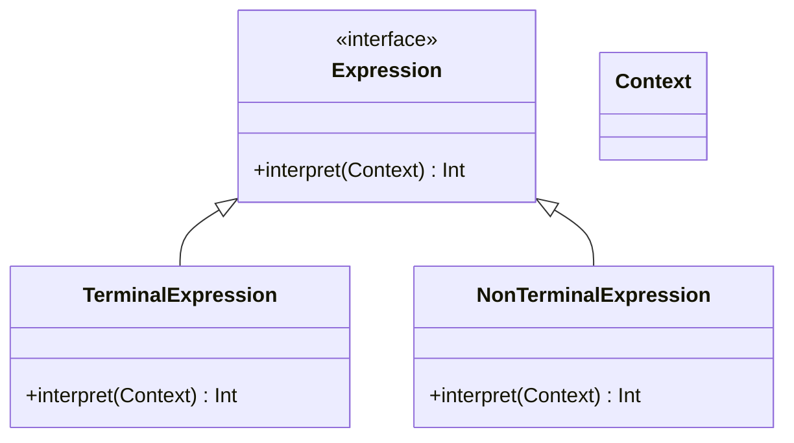

## 6.11 Interpreter Design Pattern

The Interpreter Design Pattern is a powerful behavioral pattern that allows you to define a representation for a language's grammar and create an interpreter that can process sentences in that language. This pattern is particularly useful when you need to evaluate expressions or commands that follow a specific syntax.

### Intent

The primary intent of the Interpreter Design Pattern is to provide a way to evaluate sentences in a language by defining a grammar and using an interpreter to process it. This pattern is often used in scenarios where a language needs to be parsed or interpreted, such as in expression evaluators, command parsers, or domain-specific languages (DSLs).

### Implementing Interpreter in Swift

Implementing the Interpreter Design Pattern in Swift involves several key components:

- **Abstract Expression Protocol**: Define an interface for interpreting expressions.
- **Terminal and Non-Terminal Expressions**: Implement classes for each grammar rule.
- **Context**: Contains information that's global to the interpreter.
- **Recursive Interpretation**: Build an abstract syntax tree (AST) and evaluate it.

Let's explore each of these components in detail.

#### Abstract Expression Protocol

The first step in implementing the Interpreter Design Pattern is to define an abstract expression protocol. This protocol will serve as the foundation for all expressions in the language.

```swift
protocol Expression {
    func interpret(context: Context) -> Int
}
```

In this protocol, we define a single method `interpret(context:)`, which takes a `Context` object and returns an integer result. This method will be implemented by all concrete expression classes.

#### Terminal and Non-Terminal Expressions

In the Interpreter Design Pattern, terminal expressions represent the simplest elements of the language, while non-terminal expressions represent more complex structures.

##### Terminal Expression

A terminal expression is a basic element of the language that does not contain any other expressions. For example, a number in a mathematical expression would be a terminal expression.

```swift
class NumberExpression: Expression {
    private let number: Int
    
    init(number: Int) {
        self.number = number
    }
    
    func interpret(context: Context) -> Int {
        return number
    }
}
```

In this example, `NumberExpression` is a terminal expression that simply returns a predefined number.

##### Non-Terminal Expression

A non-terminal expression is a composite expression that contains other expressions. For example, an addition operation in a mathematical expression would be a non-terminal expression.

```swift
class AddExpression: Expression {
    private let left: Expression
    private let right: Expression
    
    init(left: Expression, right: Expression) {
        self.left = left
        self.right = right
    }
    
    func interpret(context: Context) -> Int {
        return left.interpret(context: context) + right.interpret(context: context)
    }
}
```

In this example, `AddExpression` is a non-terminal expression that adds the results of interpreting two sub-expressions.

#### Context

The context class contains information that is global to the interpreter and may be used during the interpretation process.

```swift
class Context {
    // Contextual information for the interpreter
}
```

In this simple example, the `Context` class does not contain any specific information, but in a real-world scenario, it might include variables, functions, or other data relevant to the interpretation process.

#### Recursive Interpretation

To interpret a sentence in the language, we build an abstract syntax tree (AST) using the expression classes and then evaluate it recursively.

```swift
let context = Context()
let expression: Expression = AddExpression(
    left: NumberExpression(number: 5),
    right: NumberExpression(number: 10)
)

let result = expression.interpret(context: context)
print("Result: \\(result)") // Output: Result: 15
```

In this example, we create an AST for the expression "5 + 10" and interpret it using the `interpret(context:)` method, resulting in the output "Result: 15".

### Use Cases and Examples

The Interpreter Design Pattern is versatile and can be applied to various use cases, including:

#### Expression Evaluators

Expression evaluators are a common use case for the Interpreter Design Pattern. They allow you to parse and evaluate mathematical expressions, logical expressions, or any other type of expression that follows a specific syntax.

#### Command Parsers

Command parsers interpret textual commands and execute corresponding actions. This is useful in applications where users can input commands to perform specific tasks.

#### Domain-Specific Languages (DSLs)

Domain-specific languages (DSLs) are mini-languages designed for specific tasks within an application. The Interpreter Design Pattern can be used to implement DSLs, allowing users to write scripts or configurations in a custom language.

### Visualizing the Interpreter Pattern

To better understand the structure of the Interpreter Design Pattern, let's visualize it using a class diagram.



In this diagram, we see the `Expression` interface, which is implemented by both `TerminalExpression` and `NonTerminalExpression`. The `Context` class is used to provide information during interpretation.

### Design Considerations

When implementing the Interpreter Design Pattern, consider the following:

- **Complexity**: The pattern can become complex if the language has many grammar rules. Consider using other patterns, such as the Visitor Pattern, to manage complexity.
- **Performance**: Recursive interpretation may impact performance for large expressions. Optimize the AST or use caching techniques if necessary.
- **Extensibility**: The pattern is highly extensible, allowing you to add new grammar rules by creating new expression classes.

### Swift Unique Features

Swift provides several features that can enhance the implementation of the Interpreter Design Pattern:

- **Protocols and Extensions**: Use protocols to define expression interfaces and extensions to add functionality.
- **Generics**: Use generics to create flexible and reusable expression classes.
- **Functional Programming**: Leverage Swift's functional programming capabilities to simplify expression evaluation.

### Differences and Similarities

The Interpreter Design Pattern is often compared to other patterns, such as:

- **Visitor Pattern**: Both patterns involve traversing a structure, but the Visitor Pattern separates the algorithm from the object structure, while the Interpreter Pattern embeds the algorithm within the structure.
- **Composite Pattern**: The Interpreter Pattern uses a composite structure for expressions, similar to the Composite Pattern, but focuses on interpreting rather than composing objects.

### Try It Yourself

To deepen your understanding of the Interpreter Design Pattern, try modifying the code examples:

- Add support for subtraction, multiplication, and division operations.
- Implement a command parser that interprets textual commands.
- Create a simple DSL for configuring application settings.

### Knowledge Check

To reinforce your learning, consider the following questions:

- How would you extend the Interpreter Design Pattern to support additional operations?
- What are the advantages and disadvantages of using the Interpreter Design Pattern?
- How does the Interpreter Design Pattern differ from the Visitor Pattern?

### Embrace the Journey

Remember, mastering design patterns is an ongoing journey. As you continue to explore and implement patterns like the Interpreter Design Pattern, you'll gain valuable insights into software architecture and design. Keep experimenting, stay curious, and enjoy the journey!

## Quiz Time!



### What is the primary intent of the Interpreter Design Pattern?

- [x] To define a representation for a language's grammar and create an interpreter to process it.
- [ ] To separate the algorithm from the object structure.
- [ ] To compose objects into tree structures to represent part-whole hierarchies.
- [ ] To define a family of algorithms, encapsulate each one, and make them interchangeable.

> **Explanation:** The Interpreter Design Pattern is intended to define a representation for a language's grammar and create an interpreter to process it.

### Which of the following is a terminal expression in the Interpreter Pattern?

- [x] A number in a mathematical expression.
- [ ] An addition operation in a mathematical expression.
- [ ] A command parser.
- [ ] A domain-specific language.

> **Explanation:** A terminal expression is a basic element of the language, such as a number in a mathematical expression.

### What is the role of the Context class in the Interpreter Pattern?

- [x] It contains information that's global to the interpreter.
- [ ] It defines the interface for interpreting expressions.
- [ ] It represents a composite expression that contains other expressions.
- [ ] It provides a way to evaluate sentences in a language.

> **Explanation:** The Context class contains information that's global to the interpreter and may be used during the interpretation process.

### How does the Interpreter Pattern differ from the Visitor Pattern?

- [x] The Interpreter Pattern embeds the algorithm within the structure, while the Visitor Pattern separates it.
- [ ] The Interpreter Pattern focuses on composing objects, while the Visitor Pattern focuses on interpreting.
- [ ] The Interpreter Pattern is used for command parsers, while the Visitor Pattern is used for expression evaluators.
- [ ] The Interpreter Pattern is less extensible than the Visitor Pattern.

> **Explanation:** The Interpreter Pattern embeds the algorithm within the structure, while the Visitor Pattern separates the algorithm from the object structure.

### Which of the following is a use case for the Interpreter Design Pattern?

- [x] Expression evaluators.
- [x] Command parsers.
- [ ] Object composition.
- [ ] Algorithm encapsulation.

> **Explanation:** The Interpreter Design Pattern is commonly used for expression evaluators and command parsers.

### What is a key consideration when implementing the Interpreter Pattern?

- [x] Complexity can increase with many grammar rules.
- [ ] It is not extensible.
- [ ] It cannot be used with domain-specific languages.
- [ ] It does not support recursive interpretation.

> **Explanation:** Complexity can increase with many grammar rules, so it's important to manage complexity effectively.

### How can Swift's functional programming capabilities enhance the Interpreter Pattern?

- [x] By simplifying expression evaluation.
- [ ] By increasing complexity.
- [ ] By separating the algorithm from the object structure.
- [ ] By composing objects into tree structures.

> **Explanation:** Swift's functional programming capabilities can simplify expression evaluation in the Interpreter Pattern.

### What is a non-terminal expression in the Interpreter Pattern?

- [x] A composite expression that contains other expressions.
- [ ] A basic element of the language.
- [ ] A context class.
- [ ] A protocol for interpreting expressions.

> **Explanation:** A non-terminal expression is a composite expression that contains other expressions.

### How does the Interpreter Pattern handle recursive interpretation?

- [x] By building an abstract syntax tree (AST) and evaluating it.
- [ ] By separating the algorithm from the object structure.
- [ ] By composing objects into tree structures.
- [ ] By encapsulating each algorithm and making them interchangeable.

> **Explanation:** The Interpreter Pattern handles recursive interpretation by building an abstract syntax tree (AST) and evaluating it.

### True or False: The Interpreter Pattern is not suitable for implementing domain-specific languages (DSLs).

- [ ] True
- [x] False

> **Explanation:** The Interpreter Pattern is suitable for implementing domain-specific languages (DSLs) and can be used to create mini-languages within an application.




