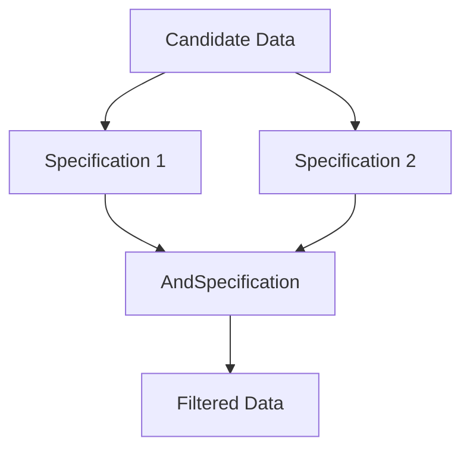

## 6.12 Specification Pattern

The Specification Pattern is a powerful tool in the developer's toolkit, allowing for the separation of business logic from the data it operates on. This pattern is particularly useful in scenarios where complex conditional logic is required, such as filtering data or applying business rules. In this section, we'll explore how to implement the Specification Pattern in Swift, examine its use cases, and provide practical examples to help you master this pattern.

### Intent

The primary intent of the Specification Pattern is to separate the statement of how to match a candidate from the candidate object that it is matched against. This pattern allows for the combination of specifications using logical operations, such as `and`, `or`, and `not`, to create complex conditional logic that is both reusable and easy to maintain.

### Implementing Specification in Swift

#### Specification Protocol

To implement the Specification Pattern in Swift, we start by defining a protocol that represents a specification. This protocol will include a method that checks if a candidate satisfies the criteria defined by the specification.

```swift
protocol Specification {
    associatedtype T
    func isSatisfied(by candidate: T) -> Bool
}
```

In this protocol, `T` is a generic type that represents the type of the candidate object. The `isSatisfied(by:)` method returns a Boolean value indicating whether the candidate satisfies the specification.

#### Composite Specifications

Composite specifications allow us to combine multiple specifications using logical operators. We can define classes or structs for `AndSpecification`, `OrSpecification`, and `NotSpecification`.

```swift
struct AndSpecification<T>: Specification {
    private let first: AnySpecification<T>
    private let second: AnySpecification<T>
    
    init(_ first: AnySpecification<T>, _ second: AnySpecification<T>) {
        self.first = first
        self.second = second
    }
    
    func isSatisfied(by candidate: T) -> Bool {
        return first.isSatisfied(by: candidate) && second.isSatisfied(by: candidate)
    }
}

struct OrSpecification<T>: Specification {
    private let first: AnySpecification<T>
    private let second: AnySpecification<T>
    
    init(_ first: AnySpecification<T>, _ second: AnySpecification<T>) {
        self.first = first
        self.second = second
    }
    
    func isSatisfied(by candidate: T) -> Bool {
        return first.isSatisfied(by: candidate) || second.isSatisfied(by: candidate)
    }
}

struct NotSpecification<T>: Specification {
    private let specification: AnySpecification<T>
    
    init(_ specification: AnySpecification<T>) {
        self.specification = specification
    }
    
    func isSatisfied(by candidate: T) -> Bool {
        return !specification.isSatisfied(by: candidate)
    }
}
```

#### Generic Specifications

Using generics, we can create type-safe and reusable specifications. This allows us to apply specifications to different types of data without duplicating code.

```swift
struct AnySpecification<T>: Specification {
    private let _isSatisfied: (T) -> Bool
    
    init<S: Specification>(_ specification: S) where S.T == T {
        _isSatisfied = specification.isSatisfied
    }
    
    func isSatisfied(by candidate: T) -> Bool {
        return _isSatisfied(candidate)
    }
}
```

#### Filtering Collections

One of the most common uses of the Specification Pattern is to filter collections of data. By applying a specification to each element in a collection, we can easily filter out elements that do not meet the criteria.

```swift
extension Array {
    func filter<S: Specification>(_ specification: S) -> [Element] where S.T == Element {
        return self.filter { specification.isSatisfied(by: $0) }
    }
}
```

### Use Cases and Examples

#### Validation Rules

Specifications can be used to define validation rules for objects. For example, we can create specifications to validate user input or ensure that objects meet certain criteria before processing them.

```swift
struct AgeSpecification: Specification {
    func isSatisfied(by candidate: Int) -> Bool {
        return candidate >= 18
    }
}

let ageSpec = AgeSpecification()
let isAdult = ageSpec.isSatisfied(by: 20) // true
```

#### Search Filters

In applications that require complex search functionality, specifications can be used to build dynamic search queries. This allows users to filter search results based on multiple criteria.

```swift
struct NameSpecification: Specification {
    private let name: String
    
    init(name: String) {
        self.name = name
    }
    
    func isSatisfied(by candidate: String) -> Bool {
        return candidate.contains(name)
    }
}

let nameSpec = NameSpecification(name: "John")
let names = ["John Doe", "Jane Smith", "Johnny Appleseed"]
let filteredNames = names.filter(nameSpec) // ["John Doe", "Johnny Appleseed"]
```

#### Business Rules

Specifications are ideal for encapsulating business rules, allowing for easy modification and testing. By defining business rules as specifications, we can ensure that our code remains flexible and maintainable.

```swift
struct PremiumCustomerSpecification: Specification {
    func isSatisfied(by candidate: Customer) -> Bool {
        return candidate.isPremium
    }
}

let premiumSpec = PremiumCustomerSpecification()
let customers = [Customer(name: "Alice", isPremium: true), Customer(name: "Bob", isPremium: false)]
let premiumCustomers = customers.filter(premiumSpec) // [Customer(name: "Alice", isPremium: true)]
```

### Visualizing the Specification Pattern

To better understand the Specification Pattern, let's visualize how specifications can be combined and applied to filter data.



In this diagram, candidate data is evaluated against two specifications. The results are combined using an `AndSpecification`, producing the final filtered data.

### Design Considerations

When using the Specification Pattern, consider the following:

- **Complexity**: While the pattern provides flexibility, it can also introduce complexity. Ensure that the benefits outweigh the added complexity.
- **Performance**: Applying multiple specifications can impact performance, especially with large datasets. Optimize specifications to minimize performance overhead.
- **Reusability**: Design specifications to be reusable across different parts of your application. Use generics to achieve type safety and reusability.

### Swift Unique Features

Swift's powerful type system and support for generics make it an ideal language for implementing the Specification Pattern. By leveraging Swift's features, we can create specifications that are both type-safe and reusable.

- **Generics**: Use generics to create flexible and reusable specifications.
- **Protocol Extensions**: Extend protocols to add default implementations for common specification operations.
- **Functional Programming**: Use Swift's functional programming features, such as higher-order functions, to simplify specification logic.

### Differences and Similarities

The Specification Pattern is similar to other patterns, such as the Strategy Pattern, in that it encapsulates logic. However, the Specification Pattern is specifically designed for defining and combining conditional logic, making it more suitable for scenarios involving complex conditions.

### Try It Yourself

To solidify your understanding of the Specification Pattern, try modifying the code examples provided. Experiment with creating your own specifications and applying them to different types of data. Consider how you might use the Specification Pattern in your own projects to simplify complex conditional logic.

### Knowledge Check

Before moving on, let's review some key concepts:

- The Specification Pattern separates the statement of how to match a candidate from the candidate object.
- Specifications can be combined using logical operators to create complex conditions.
- The pattern is useful for filtering data, defining validation rules, and encapsulating business logic.

Remember, mastering design patterns takes practice. Continue experimenting with the Specification Pattern and explore how it can enhance your Swift development projects.

## Quiz Time!



### What is the primary intent of the Specification Pattern?

- [x] To separate the statement of how to match a candidate from the candidate object.
- [ ] To encapsulate object creation.
- [ ] To define a one-to-many dependency between objects.
- [ ] To allow an object to alter its behavior when its internal state changes.

> **Explanation:** The Specification Pattern is intended to separate the logic of matching a candidate from the candidate object itself.

### How can specifications be combined in the Specification Pattern?

- [x] Using logical operators such as `and`, `or`, and `not`.
- [ ] By inheriting from a base specification class.
- [ ] By using a factory method.
- [ ] By implementing a singleton pattern.

> **Explanation:** Specifications can be combined using logical operators to form complex conditional logic.

### Which Swift feature is particularly useful for creating type-safe and reusable specifications?

- [x] Generics
- [ ] Extensions
- [ ] Optionals
- [ ] Closures

> **Explanation:** Generics allow for type-safe and reusable specifications in Swift.

### What is a common use case for the Specification Pattern?

- [x] Filtering collections of data.
- [ ] Managing object lifecycles.
- [ ] Handling concurrency.
- [ ] Implementing caching strategies.

> **Explanation:** The Specification Pattern is commonly used to filter collections of data based on specific criteria.

### Which design pattern is similar to the Specification Pattern in that it encapsulates logic?

- [x] Strategy Pattern
- [ ] Singleton Pattern
- [ ] Observer Pattern
- [ ] Factory Pattern

> **Explanation:** The Strategy Pattern also encapsulates logic, but the Specification Pattern is specifically for conditional logic.

### What is a potential downside of using the Specification Pattern?

- [x] It can introduce complexity.
- [ ] It cannot be combined with other patterns.
- [ ] It is not reusable.
- [ ] It is language-specific.

> **Explanation:** While the Specification Pattern provides flexibility, it can also introduce complexity.

### How can you optimize specifications to minimize performance overhead?

- [x] By designing efficient algorithms within specifications.
- [ ] By using more specifications.
- [ ] By avoiding the use of generics.
- [ ] By implementing them as classes only.

> **Explanation:** Efficient algorithms within specifications help minimize performance overhead.

### What is a benefit of using protocol extensions in the Specification Pattern?

- [x] They allow adding default implementations for common operations.
- [ ] They make the code less readable.
- [ ] They limit the use of generics.
- [ ] They prevent reusability.

> **Explanation:** Protocol extensions allow adding default implementations for common operations, enhancing reusability.

### True or False: The Specification Pattern is only useful for filtering data.

- [ ] True
- [x] False

> **Explanation:** The Specification Pattern is also useful for defining validation rules and encapsulating business logic.

### What should you consider when deciding to use the Specification Pattern?

- [x] The complexity and performance impact.
- [ ] The availability of third-party libraries.
- [ ] The number of developers on the team.
- [ ] The color scheme of the application.

> **Explanation:** Consider the complexity and performance impact when deciding to use the Specification Pattern.



Remember, this is just the beginning. As you progress, you'll build more complex and interactive applications. Keep experimenting, stay curious, and enjoy the journey!
