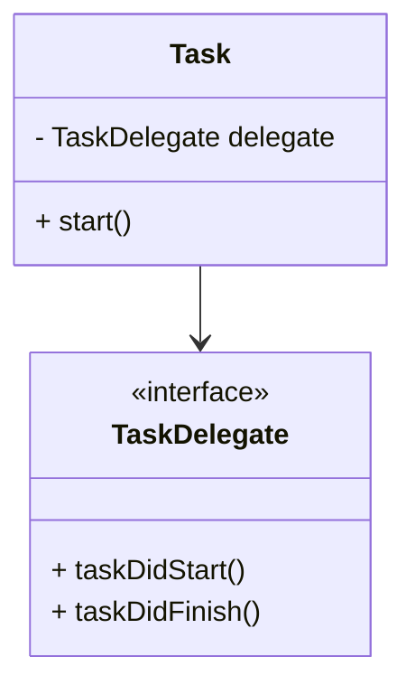

## 6.13 Delegation and Callback Patterns

In the realm of software design, delegation and callback patterns are pivotal for creating flexible and decoupled systems. These patterns are especially prevalent in Swift, where they enable objects to communicate and share responsibilities without being tightly coupled. Let's delve into these patterns, understand their intent, and explore how they can be effectively implemented in Swift.

### Intent

The primary intent of the delegation and callback patterns is to allow one object to delegate tasks to another. This approach helps in reducing coupling between objects and promotes the sharing of responsibilities. By leveraging these patterns, you can create systems that are easier to maintain and extend.

### Implementing Delegation in Swift

Delegation is a design pattern that enables an object to delegate some of its responsibilities to another object. In Swift, this is typically achieved using protocols. Here's how you can implement delegation:

#### Delegate Protocol

First, define a protocol that outlines the methods the delegate must implement. This protocol acts as a contract between the delegating object and its delegate.

```swift
protocol TaskDelegate: AnyObject {
    func taskDidStart()
    func taskDidFinish()
}
```

#### Delegate Property

The delegating object holds a reference to the delegate, which conforms to the protocol. This allows the delegating object to call the delegate's methods.

```swift
class Task {
    weak var delegate: TaskDelegate?
    
    func start() {
        delegate?.taskDidStart()
        // Perform task...
        delegate?.taskDidFinish()
    }
}
```

#### Weak References

To prevent strong reference cycles, delegates are typically declared as weak references. This is crucial in avoiding memory leaks, especially in scenarios involving view controllers.

#### Optional Protocol Methods

In some cases, you might want to make certain protocol methods optional. This can be achieved using protocol extensions or by defining methods with default implementations.

```swift
extension TaskDelegate {
    func taskDidStart() {}
    func taskDidFinish() {}
}
```

### Use Cases and Examples

Delegation is widely used across various domains in Swift development. Here are some common use cases:

#### UIKit Components

UIKit extensively uses delegation for various components. For instance, `UITableView` uses `UITableViewDelegate` to handle user interactions and configure cells.

```swift
class ViewController: UIViewController, UITableViewDelegate {
    // Implement UITableViewDelegate methods here
}
```

#### Custom Components

When creating custom UI components, delegation allows customization of behavior without modifying the component itself. This approach promotes reusability and flexibility.

```swift
class CustomView: UIView {
    weak var delegate: CustomViewDelegate?
    
    func triggerAction() {
        delegate?.customViewDidPerformAction(self)
    }
}
```

#### Networking Libraries

Delegation is also prevalent in networking libraries, where it is used to handle success and failure callbacks. This allows for a clean separation of networking logic and UI updates.

```swift
protocol NetworkManagerDelegate: AnyObject {
    func didReceiveData(_ data: Data)
    func didFailWithError(_ error: Error)
}

class NetworkManager {
    weak var delegate: NetworkManagerDelegate?
    
    func fetchData() {
        // Fetch data...
        delegate?.didReceiveData(data)
    }
}
```

### Callback Patterns

Callbacks are another mechanism to achieve similar goals as delegation but with a different approach. Instead of using protocols, callbacks use closures to communicate between objects.

#### Implementing Callbacks

Callbacks in Swift are typically implemented using closures. This approach can lead to more concise and flexible code, especially for asynchronous operations.

```swift
class DataFetcher {
    func fetchData(completion: @escaping (Result<Data, Error>) -> Void) {
        // Perform data fetching...
        completion(.success(data))
    }
}
```

#### Use Cases for Callbacks

Callbacks are particularly useful in scenarios where you need to handle asynchronous operations, such as network requests or animations.

```swift
let fetcher = DataFetcher()
fetcher.fetchData { result in
    switch result {
    case .success(let data):
        print("Data received: \\(data)")
    case .failure(let error):
        print("Error: \\(error)")
    }
}
```

### Differences and Similarities

While both delegation and callbacks are used for communication between objects, they have distinct differences:

- **Delegation** involves a formal contract (protocol) and is often used for long-term relationships between objects.
- **Callbacks** are more informal and are typically used for short-lived interactions, such as completion handlers for asynchronous tasks.

### Swift Unique Features

Swift offers several unique features that enhance the implementation of delegation and callbacks:

- **Protocol Extensions**: Allow you to provide default implementations for protocol methods.
- **Type Safety**: Ensures that only objects conforming to the protocol can be assigned as delegates.
- **Closures**: Provide a powerful and flexible way to implement callbacks, with support for capturing values and executing asynchronously.

### Design Considerations

When choosing between delegation and callbacks, consider the following:

- **Complexity**: Delegation can introduce more complexity due to the need for protocol definitions and weak references.
- **Flexibility**: Callbacks offer more flexibility and are often easier to implement for simple tasks.
- **Memory Management**: Be mindful of memory management, especially with closures, to avoid retain cycles.

### Try It Yourself

To better understand delegation and callbacks, try modifying the code examples provided. For instance, create a custom UI component that uses delegation to notify a view controller of user interactions. Alternatively, implement a network request using callbacks and experiment with error handling.

### Visualizing Delegation and Callback Patterns

To further enhance your understanding, let's visualize the delegation pattern using a class diagram:



This diagram illustrates the relationship between the `Task` class and the `TaskDelegate` protocol, highlighting how the `Task` class delegates responsibilities to its delegate.

### References and Links

For further reading on delegation and callbacks in Swift, consider the following resources:

- [Apple's Swift Documentation](https://developer.apple.com/documentation/swift)
- [Ray Wenderlich's Swift Tutorials](https://www.raywenderlich.com/swift)
- [Swift by Sundell](https://www.swiftbysundell.com/)

### Knowledge Check

Before we wrap up, let's engage with some questions to reinforce your understanding of delegation and callback patterns. Consider the following scenarios and think about how you would apply these patterns.

### Embrace the Journey

Remember, mastering design patterns is a journey. As you continue to explore and experiment with delegation and callbacks, you'll gain a deeper understanding of how to create robust and maintainable Swift applications. Keep experimenting, stay curious, and enjoy the journey!

## Quiz Time!



### What is the primary intent of the delegation pattern?

- [x] To allow one object to delegate tasks to another object
- [ ] To increase coupling between objects
- [ ] To eliminate the need for protocols
- [ ] To simplify memory management

> **Explanation:** The delegation pattern allows one object to delegate tasks to another, reducing coupling and sharing responsibilities.

### How do you prevent strong reference cycles in delegation?

- [x] By declaring delegates as weak references
- [ ] By using strong references
- [ ] By using unowned references
- [ ] By avoiding protocols

> **Explanation:** Declaring delegates as weak references prevents strong reference cycles, which can lead to memory leaks.

### What is a common use case for delegation in UIKit?

- [x] Handling user interactions in UITableView
- [ ] Performing network requests
- [ ] Parsing JSON data
- [ ] Managing memory

> **Explanation:** Delegation is commonly used in UIKit to handle user interactions, such as in `UITableViewDelegate`.

### How can you make protocol methods optional in Swift?

- [x] By providing default implementations in protocol extensions
- [ ] By using optional types
- [ ] By declaring methods as optional
- [ ] By using closures

> **Explanation:** Protocol extensions allow you to provide default implementations, making methods effectively optional.

### What is a key difference between delegation and callbacks?

- [x] Delegation uses protocols, while callbacks use closures
- [ ] Delegation is more flexible than callbacks
- [ ] Callbacks require protocols, while delegation uses closures
- [ ] Callbacks are used for long-term relationships

> **Explanation:** Delegation uses protocols for communication, whereas callbacks use closures.

### Which Swift feature enhances the implementation of callbacks?

- [x] Closures
- [ ] Protocols
- [ ] Classes
- [ ] Enums

> **Explanation:** Closures provide a powerful and flexible way to implement callbacks in Swift.

### When should you choose callbacks over delegation?

- [x] For short-lived interactions, such as completion handlers
- [ ] For long-term relationships between objects
- [ ] When using protocols
- [ ] When avoiding memory management issues

> **Explanation:** Callbacks are ideal for short-lived interactions, such as handling asynchronous tasks.

### What is a potential drawback of using delegation?

- [x] It can introduce more complexity due to protocol definitions
- [ ] It simplifies memory management
- [ ] It eliminates the need for protocols
- [ ] It increases coupling between objects

> **Explanation:** Delegation can introduce complexity due to the need for protocol definitions and weak references.

### Which of the following is a benefit of using callbacks?

- [x] Flexibility and ease of implementation for simple tasks
- [ ] Increased complexity
- [ ] Long-term relationships between objects
- [ ] Strong reference cycles

> **Explanation:** Callbacks offer flexibility and are often easier to implement for simple tasks.

### True or False: Delegation and callbacks are interchangeable and serve the same purpose.

- [ ] True
- [x] False

> **Explanation:** While both serve to enable communication between objects, delegation and callbacks have distinct use cases and implementations.




