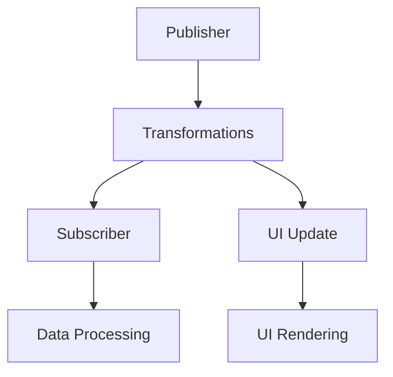

## 6.14 Functional Reactive Programming in Swift

Functional Reactive Programming (FRP) is a powerful paradigm that combines the principles of functional programming with reactive programming to manage asynchronous data streams and the propagation of change. In Swift, FRP is primarily implemented using the Combine framework, which provides a declarative Swift API for processing values over time. Let's dive into the intricacies of FRP in Swift, exploring its concepts, implementation, and practical applications.

### Intent

The intent of Functional Reactive Programming in Swift is to manage asynchronous data streams and the propagation of change using a functional paradigm. This approach emphasizes immutability, pure functions, and declarative code, allowing developers to define what should happen rather than how it should happen.

### Implementing FRP in Swift

#### Combine Framework

The Combine framework is Apple's native implementation for handling asynchronous events by processing values over time. It provides a robust set of tools to work with publishers and subscribers, enabling the creation of reactive streams.

- **Publishers**: These are the sources of data that emit values over time. Publishers can represent anything from simple values to complex asynchronous operations like network requests.
- **Subscribers**: These are the endpoints that receive and handle the emitted values from publishers. Subscribers can perform actions such as updating the UI or processing data.

Here's a simple example demonstrating the use of Combine to handle a data stream:

```swift
import Combine

// Create a publisher that emits a sequence of numbers
let numbersPublisher = [1, 2, 3, 4, 5].publisher

// Create a subscriber to receive and print the numbers
let _ = numbersPublisher
    .sink(receiveCompletion: { completion in
        switch completion {
        case .finished:
            print("Finished receiving numbers.")
        case .failure(let error):
            print("Error: \\(error)")
        }
    }, receiveValue: { number in
        print("Received number: \\(number)")
    })
```

In this code, `numbersPublisher` is a publisher that emits a sequence of integers. The `sink` method is used to subscribe to the publisher and print each number as it is received.

#### Reactive Streams

Reactive streams allow you to transform, combine, and react to data changes. With Combine, you can chain operations to create complex data processing pipelines.

- **Transforming Data**: Use operators like `map`, `filter`, and `reduce` to transform data emitted by publishers.
- **Combining Streams**: Use operators like `merge`, `combineLatest`, and `zip` to combine multiple data streams.

Consider the following example, which demonstrates data transformation and combination:

```swift
import Combine

// Create two publishers emitting strings and integers
let stringPublisher = ["Hello", "World"].publisher
let numberPublisher = [1, 2, 3].publisher

// Combine the latest values from both publishers
let combinedPublisher = stringPublisher
    .combineLatest(numberPublisher)
    .map { string, number in
        return "\\(string) \\(number)"
    }

// Subscribe to the combined publisher
let _ = combinedPublisher
    .sink(receiveValue: { combinedValue in
        print("Combined value: \\(combinedValue)")
    })
```

In this example, `combineLatest` is used to combine the latest values from `stringPublisher` and `numberPublisher`, and `map` transforms the combined values into a single string.

#### Immutability and Pure Functions

FRP emphasizes the use of immutability and pure functions for transformations. Pure functions are functions that always produce the same output for the same input and have no side effects. This approach leads to more predictable and testable code.

For example, consider a function that transforms an array of integers by squaring each number:

```swift
func squareNumbers(_ numbers: [Int]) -> [Int] {
    return numbers.map { $0 * $0 }
}

let numbers = [1, 2, 3, 4, 5]
let squaredNumbers = squareNumbers(numbers)
print(squaredNumbers) // Output: [1, 4, 9, 16, 25]
```

In this example, `squareNumbers` is a pure function that transforms an array of integers by squaring each element.

#### Declarative Code

Declarative programming is a key aspect of FRP, where you define what should happen rather than how it should happen. This approach leads to more readable and maintainable code.

Consider the following example, which uses Combine to filter and transform a data stream:

```swift
import Combine

// Create a publisher that emits a sequence of numbers
let numbersPublisher = [1, 2, 3, 4, 5].publisher

// Filter and transform the numbers
let transformedPublisher = numbersPublisher
    .filter { $0 % 2 == 0 } // Keep only even numbers
    .map { $0 * 2 } // Double each number

// Subscribe to the transformed publisher
let _ = transformedPublisher
    .sink(receiveValue: { number in
        print("Transformed number: \\(number)")
    })
```

In this example, the `filter` operator is used to keep only even numbers, and the `map` operator doubles each number. The code is declarative, specifying what transformations should occur.

### Use Cases and Examples

#### Live Data Feeds

FRP is ideal for handling live data feeds, such as stock prices or chat messages. By using Combine, you can create a reactive pipeline that updates the UI whenever new data is received.

```swift
import Combine

// Simulate a live data feed with a timer
let timerPublisher = Timer.publish(every: 1.0, on: .main, in: .common).autoconnect()

// Subscribe to the timer and print the current date
let _ = timerPublisher
    .sink(receiveValue: { date in
        print("Current date: \\(date)")
    })
```

In this example, a timer publisher emits the current date every second, simulating a live data feed.

#### UI Binding

FRP allows for seamless UI binding, where UI components automatically update in response to data changes. This is particularly useful in SwiftUI, where the Combine framework can be used to bind data to views.

```swift
import SwiftUI
import Combine

struct ContentView: View {
    @State private var text: String = ""
    private var cancellable: AnyCancellable?

    var body: some View {
        VStack {
            Text(text)
            Button("Update Text") {
                updateText()
            }
        }
    }

    func updateText() {
        let textPublisher = Just("Hello, SwiftUI!")
        cancellable = textPublisher
            .sink(receiveValue: { newText in
                text = newText
            })
    }
}
```

In this SwiftUI example, a button click triggers an update to the text displayed in the view, demonstrating UI binding with Combine.

#### Asynchronous Operations

FRP is well-suited for chaining asynchronous operations, such as network requests and data processing. Combine allows you to create complex asynchronous workflows with ease.

```swift
import Combine

// Simulate a network request with a delay
func fetchData() -> AnyPublisher<String, Never> {
    return Future<String, Never> { promise in
        DispatchQueue.global().asyncAfter(deadline: .now() + 2.0) {
            promise(.success("Data received"))
        }
    }
    .eraseToAnyPublisher()
}

// Chain asynchronous operations
let _ = fetchData()
    .sink(receiveValue: { data in
        print(data)
    })
```

In this example, a simulated network request is chained with a delay, and the result is printed when the data is received.

### Visualizing FRP Concepts

To better understand the flow of data in FRP, let's visualize a simple reactive pipeline using a Mermaid.js flowchart.



**Diagram Description**: This flowchart represents a simple reactive pipeline in FRP. The `Publisher` emits data, which undergoes `Transformations` before reaching the `Subscriber`. The transformations can also trigger `UI Updates`, leading to `UI Rendering`. The subscriber can perform additional `Data Processing`.

### References and Links

For further reading and a deeper dive into Functional Reactive Programming and the Combine framework, consider exploring the following resources:

- [Apple's Combine Documentation](https://developer.apple.com/documentation/combine)
- [Reactive Programming with Swift](https://www.raywenderlich.com/books/combine-asynchronous-programming-with-swift/v2.0)
- [Functional Programming in Swift](https://www.objc.io/books/functional-swift/)

### Knowledge Check

- **Question**: What is the primary purpose of using the Combine framework in Swift?
- **Exercise**: Modify the provided code examples to include error handling using the `catch` operator.

### Embrace the Journey

Remember, mastering Functional Reactive Programming in Swift is a journey. As you progress, you'll build more complex and interactive applications. Keep experimenting, stay curious, and enjoy the process!

### Formatting and Structure

Organize your code with clear headings and subheadings. Use bullet points to break down complex information and highlight important terms or concepts.

### Writing Style

Use first-person plural (we, let's) to create a collaborative feel. Avoid gender-specific pronouns and define acronyms and abbreviations upon first use.

## Quiz Time!



### What is the primary purpose of Functional Reactive Programming in Swift?

- [x] Manage asynchronous data streams and the propagation of change using a functional paradigm.
- [ ] Simplify synchronous operations.
- [ ] Enhance object-oriented programming.
- [ ] Replace all imperative programming constructs.

> **Explanation:** FRP is designed to manage asynchronous data streams and change propagation using functional programming principles.

### Which framework is used in Swift for Functional Reactive Programming?

- [ ] UIKit
- [ ] SwiftUI
- [x] Combine
- [ ] Foundation

> **Explanation:** The Combine framework is used for Functional Reactive Programming in Swift.

### What is a publisher in the context of the Combine framework?

- [x] A source of data that emits values over time.
- [ ] A function that processes data.
- [ ] A UI component.
- [ ] A network request handler.

> **Explanation:** In Combine, a publisher is a source of data that emits values over time.

### What operator is used to transform data in Combine?

- [ ] merge
- [x] map
- [ ] zip
- [ ] combineLatest

> **Explanation:** The `map` operator is used to transform data emitted by a publisher.

### What is the role of immutability in Functional Reactive Programming?

- [x] It ensures predictability and testability by avoiding side effects.
- [ ] It reduces memory usage.
- [ ] It simplifies UI design.
- [ ] It enhances network performance.

> **Explanation:** Immutability ensures predictability and testability by avoiding side effects in FRP.

### How does declarative programming benefit FRP?

- [x] It allows developers to define what should happen rather than how it should happen.
- [ ] It improves performance.
- [ ] It reduces code complexity.
- [ ] It enhances error handling.

> **Explanation:** Declarative programming allows developers to focus on what should happen, improving code readability and maintainability.

### Which operator combines the latest values from multiple publishers?

- [ ] map
- [ ] filter
- [ ] reduce
- [x] combineLatest

> **Explanation:** The `combineLatest` operator combines the latest values from multiple publishers.

### What is the purpose of the `sink` method in Combine?

- [x] To subscribe to a publisher and handle emitted values.
- [ ] To transform data.
- [ ] To combine multiple streams.
- [ ] To handle errors.

> **Explanation:** The `sink` method is used to subscribe to a publisher and handle emitted values.

### What is a pure function?

- [x] A function that always produces the same output for the same input and has no side effects.
- [ ] A function that modifies global state.
- [ ] A function that performs I/O operations.
- [ ] A function that handles errors.

> **Explanation:** A pure function always produces the same output for the same input and has no side effects.

### True or False: FRP is only applicable to UI development.

- [ ] True
- [x] False

> **Explanation:** FRP is applicable to various domains, including UI development, live data feeds, and asynchronous operations.




