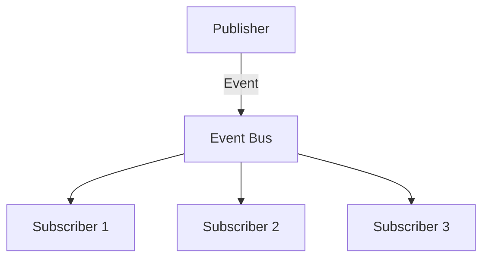

## 6.15 Event Bus Pattern

In the realm of software design patterns, the Event Bus Pattern stands out as a powerful tool for decoupling event producers from consumers. This pattern enables flexible communication through a central event bus, which acts as a mediator for event distribution. This section will delve into the Event Bus Pattern, its implementation in Swift, and its applicability in various use cases.

### Intent

The primary intent of the Event Bus Pattern is to decouple the components that produce events from those that consume them. By introducing a central event bus, we facilitate communication in a way that allows for greater modularity and flexibility. This pattern is particularly useful in scenarios where multiple components need to react to the same events without being directly aware of each other.

### Key Participants

1. **Event Protocols**: Define the types of events that can be published and subscribed to.
2. **Event Bus Class**: Manages the registration of subscribers and the dispatching of events.
3. **Subscribers**: Components that register with the event bus to receive notifications about specific events.
4. **Publishers**: Components that generate events and send them to the event bus.

### Implementing Event Bus in Swift

To implement the Event Bus Pattern in Swift, we will follow a structured approach that includes defining event protocols, creating an event bus class, managing subscriptions, and ensuring thread safety.

#### Event Protocols

Start by defining protocols for the events. Each event type should conform to a base protocol, which allows the event bus to handle them generically.

```swift
protocol Event {}

struct UserLoggedInEvent: Event {
    let userId: String
}

struct DataUpdatedEvent: Event {
    let dataId: String
}
```

#### Event Bus Class

The event bus class is responsible for managing subscriptions and dispatching events to subscribers. It maintains a registry of subscribers for each event type.

```swift
class EventBus {
    private var subscribers: [ObjectIdentifier: [Any]] = [:]
    
    func subscribe<T: Event>(_ subscriber: AnyObject, eventType: T.Type, handler: @escaping (T) -> Void) {
        let id = ObjectIdentifier(subscriber)
        let eventHandler = EventHandler(handler: handler)
        
        if var handlers = subscribers[id] {
            handlers.append(eventHandler)
            subscribers[id] = handlers
        } else {
            subscribers[id] = [eventHandler]
        }
    }
    
    func unsubscribe(_ subscriber: AnyObject) {
        let id = ObjectIdentifier(subscriber)
        subscribers.removeValue(forKey: id)
    }
    
    func publish<T: Event>(_ event: T) {
        for handlers in subscribers.values {
            for handler in handlers {
                if let eventHandler = handler as? EventHandler<T> {
                    eventHandler.handle(event)
                }
            }
        }
    }
}

private class EventHandler<T: Event> {
    let handler: (T) -> Void
    
    init(handler: @escaping (T) -> Void) {
        self.handler = handler
    }
    
    func handle(_ event: T) {
        handler(event)
    }
}
```

#### Subscription Management

The event bus allows objects to subscribe and unsubscribe from events. Subscriptions are managed using a dictionary where keys are object identifiers and values are arrays of handlers.

- **Subscribe**: Objects register to receive notifications for specific event types.
- **Unsubscribe**: Objects can deregister, preventing further notifications.

#### Thread Safety

To ensure the event bus is safe for concurrent use, we need to synchronize access to the subscribers' dictionary. This can be achieved using a serial dispatch queue.

```swift
class SafeEventBus {
    private var subscribers: [ObjectIdentifier: [Any]] = [:]
    private let queue = DispatchQueue(label: "com.eventbus.queue")
    
    func subscribe<T: Event>(_ subscriber: AnyObject, eventType: T.Type, handler: @escaping (T) -> Void) {
        queue.sync {
            let id = ObjectIdentifier(subscriber)
            let eventHandler = EventHandler(handler: handler)
            
            if var handlers = subscribers[id] {
                handlers.append(eventHandler)
                subscribers[id] = handlers
            } else {
                subscribers[id] = [eventHandler]
            }
        }
    }
    
    func unsubscribe(_ subscriber: AnyObject) {
        queue.sync {
            let id = ObjectIdentifier(subscriber)
            subscribers.removeValue(forKey: id)
        }
    }
    
    func publish<T: Event>(_ event: T) {
        queue.sync {
            for handlers in subscribers.values {
                for handler in handlers {
                    if let eventHandler = handler as? EventHandler<T> {
                        eventHandler.handle(event)
                    }
                }
            }
        }
    }
}
```

### Use Cases and Examples

The Event Bus Pattern is versatile and can be applied in various scenarios. Here are some common use cases:

#### Modular Applications

In modular applications, different components can communicate through the event bus without being tightly coupled. This is particularly useful in large-scale applications where components are developed independently.

#### Game Development

In game development, the event bus can be used to broadcast global events, such as changes in game state, to various game entities. This allows for a clean separation between game logic and rendering.

#### Logging Systems

An event bus can be employed in logging systems to collect logs from various parts of an application. Each component can publish log events to the bus, which are then processed by a centralized logging service.

### Design Considerations

When using the Event Bus Pattern, consider the following:

- **Performance**: The event bus introduces a level of indirection, which may impact performance in high-frequency event scenarios.
- **Memory Management**: Ensure that subscribers are properly unsubscribed to prevent memory leaks.
- **Complexity**: While the event bus simplifies communication, it can also obscure the flow of data, making debugging more challenging.

### Swift Unique Features

Swift's strong type system and protocol-oriented programming paradigm make it well-suited for implementing the Event Bus Pattern. By leveraging protocols, we can define flexible and reusable event types. Additionally, Swift's memory management features, such as Automatic Reference Counting (ARC), help manage the lifecycle of subscribers.

### Differences and Similarities

The Event Bus Pattern is often compared to the Observer Pattern. While both facilitate communication between components, the Event Bus Pattern centralizes event distribution, whereas the Observer Pattern requires direct registration with the subject.

### Visualizing the Event Bus Pattern

Below is a diagram illustrating the flow of events through an event bus:



**Diagram Description**: The diagram shows a publisher sending an event to the event bus, which then distributes the event to multiple subscribers.

### Try It Yourself

Experiment with the event bus implementation by:

- Adding new event types and subscribers.
- Testing the thread safety by publishing events from multiple threads.
- Modifying the event bus to support priority-based event handling.

### Knowledge Check

1. How does the Event Bus Pattern decouple event producers from consumers?
2. What are the key components involved in the Event Bus Pattern?
3. Why is thread safety important in an event bus implementation?

### Embrace the Journey

Remember, mastering the Event Bus Pattern is just one step in your journey to becoming a proficient Swift developer. Keep exploring, experimenting, and building upon the concepts you've learned. The world of design patterns is vast and full of opportunities to enhance your software architecture skills.

## Quiz Time!



### What is the primary intent of the Event Bus Pattern?

- [x] To decouple event producers from consumers
- [ ] To enhance performance in event handling
- [ ] To simplify user interface design
- [ ] To replace the Observer Pattern

> **Explanation:** The Event Bus Pattern's primary intent is to decouple event producers from consumers, enabling flexible communication through a central event bus.

### Which component in the Event Bus Pattern is responsible for managing subscriptions?

- [ ] Event Protocols
- [x] Event Bus Class
- [ ] Subscribers
- [ ] Publishers

> **Explanation:** The Event Bus Class is responsible for managing subscriptions and event publishing.

### What is a key benefit of using the Event Bus Pattern in modular applications?

- [ ] It tightly couples components
- [x] It allows components to communicate without tight coupling
- [ ] It simplifies UI design
- [ ] It enhances database access

> **Explanation:** The Event Bus Pattern allows components to communicate without tight coupling, which is beneficial in modular applications.

### Why is thread safety important in an event bus implementation?

- [ ] To enhance user interface design
- [x] To ensure safe concurrent use
- [ ] To simplify event protocols
- [ ] To improve memory management

> **Explanation:** Thread safety is important to ensure that the event bus can be used safely in concurrent environments.

### What is a common use case for the Event Bus Pattern in game development?

- [ ] UI design
- [x] Responding to global events like game state changes
- [ ] Database management
- [ ] Enhancing graphics rendering

> **Explanation:** In game development, the Event Bus Pattern is commonly used to respond to global events like game state changes.

### How does the Event Bus Pattern differ from the Observer Pattern?

- [x] It centralizes event distribution
- [ ] It requires direct registration with the subject
- [ ] It enhances performance
- [ ] It simplifies UI design

> **Explanation:** The Event Bus Pattern centralizes event distribution, whereas the Observer Pattern requires direct registration with the subject.

### What should be considered to prevent memory leaks in the Event Bus Pattern?

- [ ] Enhancing graphics rendering
- [ ] Simplifying UI design
- [x] Properly unsubscribing subscribers
- [ ] Centralizing event distribution

> **Explanation:** Properly unsubscribing subscribers is crucial to prevent memory leaks in the Event Bus Pattern.

### What is the role of event protocols in the Event Bus Pattern?

- [ ] To manage subscriptions
- [x] To define different event types
- [ ] To enhance performance
- [ ] To simplify UI design

> **Explanation:** Event protocols are used to define different event types in the Event Bus Pattern.

### Which Swift feature is particularly useful in implementing the Event Bus Pattern?

- [ ] UI design
- [ ] Database management
- [x] Protocol-oriented programming
- [ ] Graphics rendering

> **Explanation:** Swift's protocol-oriented programming paradigm is particularly useful in implementing the Event Bus Pattern.

### True or False: The Event Bus Pattern is often used to enhance user interface design.

- [ ] True
- [x] False

> **Explanation:** The Event Bus Pattern is primarily used to decouple event producers from consumers, not specifically to enhance user interface design.


