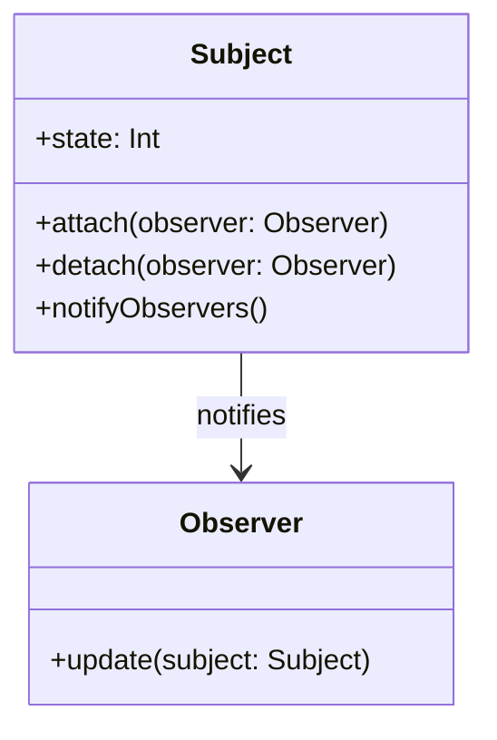

## 6.2 Observer Design Pattern

The Observer Design Pattern is a fundamental behavioral pattern that establishes a one-to-many relationship between objects. When the state of one object changes, all its dependents are automatically notified and updated. This pattern is instrumental in creating reactive and responsive applications, especially in the context of iOS and macOS development.

### Intent

The primary intent of the Observer Design Pattern is to define a one-to-many dependency between objects. This ensures that when one object changes state, all its dependents are notified and updated automatically. This pattern is particularly useful in scenarios where multiple objects need to respond to changes in another object, such as updating UI components in response to data changes.

### Implementing Observer in Swift

Swift provides several mechanisms to implement the Observer Design Pattern, each with its own advantages and use cases. Let's explore these mechanisms in detail:

#### Protocols and Delegates

One of the most straightforward ways to implement the Observer Design Pattern in Swift is through protocols and delegates. This approach involves defining a protocol that observers conform to and having the subject maintain a list of observers.

```swift
// Define the protocol that observers must conform to
protocol Observer: AnyObject {
    func update(subject: Subject)
}

// Define the subject that maintains a list of observers
class Subject {
    private var observers = [Observer]()
    
    var state: Int = { 
        didSet {
            notifyObservers()
        }
    }()
    
    func attach(observer: Observer) {
        observers.append(observer)
    }
    
    func detach(observer: Observer) {
        observers = observers.filter { $0 !== observer }
    }
    
    private func notifyObservers() {
        for observer in observers {
            observer.update(subject: self)
        }
    }
}

// An example observer
class ConcreteObserver: Observer {
    func update(subject: Subject) {
        print("Observer notified. Subject's state is now \\(subject.state)")
    }
}

// Usage
let subject = Subject()
let observer = ConcreteObserver()
subject.attach(observer: observer)
subject.state = 5  // This will notify the observer
```

In this example, the `Subject` class maintains a list of `Observer` objects. When the `state` changes, it notifies all attached observers by calling their `update` method.

#### NotificationCenter

Swift's `NotificationCenter` is a powerful tool for implementing the Observer Design Pattern, especially for broadcasting notifications across different parts of an application.

```swift
import Foundation

// Define a notification name
extension Notification.Name {
    static let didUpdateState = Notification.Name("didUpdateState")
}

// Post a notification
class Subject {
    var state: Int = 0 {
        didSet {
            NotificationCenter.default.post(name: .didUpdateState, object: self)
        }
    }
}

// Observe the notification
class Observer {
    init() {
        NotificationCenter.default.addObserver(self, selector: #selector(handleStateChange(_:)), name: .didUpdateState, object: nil)
    }
    
    @objc func handleStateChange(_ notification: Notification) {
        if let subject = notification.object as? Subject {
            print("Observer notified. Subject's state is now \\(subject.state)")
        }
    }
}

// Usage
let subject = Subject()
let observer = Observer()
subject.state = 10  // This will notify the observer
```

`NotificationCenter` allows for decoupled communication between objects, making it ideal for scenarios where the observer and subject do not have a direct relationship.

#### Key-Value Observing (KVO)

KVO is a mechanism that allows objects to be notified of changes to specified properties. It is particularly useful when working with classes that inherit from `NSObject`.

```swift
import Foundation

class Subject: NSObject {
    @objc dynamic var state: Int = 0
}

class Observer: NSObject {
    private var observation: NSKeyValueObservation?
    
    init(subject: Subject) {
        super.init()
        observation = subject.observe(\.state, options: [.new]) { [weak self] (subject, change) in
            if let newState = change.newValue {
                print("Observer notified. Subject's state is now \\(newState)")
            }
        }
    }
}

// Usage
let subject = Subject()
let observer = Observer(subject: subject)
subject.state = 20  // This will notify the observer
```

KVO is a powerful feature, but it requires careful management of memory and observation lifecycles to avoid retain cycles and crashes.

#### Combine Framework

The Combine framework introduces a modern approach to reactive programming in Swift, providing a declarative Swift API for processing values over time.

```swift
import Combine

class Subject {
    @Published var state: Int = 0
}

class Observer {
    private var cancellable: AnyCancellable?
    
    init(subject: Subject) {
        cancellable = subject.$state.sink { newState in
            print("Observer notified. Subject's state is now \\(newState)")
        }
    }
}

// Usage
let subject = Subject()
let observer = Observer(subject: subject)
subject.state = 30  // This will notify the observer
```

Combine provides a powerful and flexible way to handle asynchronous events and data streams, making it ideal for complex data flows and UI updates.

### Use Cases and Examples

The Observer Design Pattern is widely used in various scenarios, including:

- **UI Updates**: Automatically updating views when the underlying data model changes.
- **Event Handling**: Broadcasting events to multiple listeners in an application.
- **Reactive Programming**: Implementing reactive data flows with Combine.

#### UI Updates

In iOS development, the Observer Design Pattern is often used to update UI components in response to changes in the data model. For example, a table view might observe changes to a data source and automatically reload its data when the source changes.

#### Event Handling

Applications often need to broadcast events to multiple listeners. For instance, a music player app might broadcast playback events to update the UI, save playback history, and log analytics data.

#### Reactive Programming

The Combine framework enables developers to implement reactive programming patterns, allowing for seamless data flow and transformation. This is particularly useful in SwiftUI applications, where UI components can reactively update in response to data changes.

### Visualizing the Observer Pattern

To better understand the Observer Design Pattern, let's visualize the relationship between the subject and its observers.



In this diagram, the `Subject` class maintains a list of `Observer` objects. When the `state` changes, the `Subject` notifies all attached `Observer` instances by calling their `update` method.

### Design Considerations

When implementing the Observer Design Pattern, consider the following:

- **Decoupling**: The pattern promotes loose coupling between the subject and its observers, allowing for flexible and maintainable code.
- **Performance**: Be mindful of performance implications, especially when dealing with a large number of observers or frequent state changes.
- **Memory Management**: Ensure proper management of observer lifecycles to avoid memory leaks and retain cycles.

### Swift Unique Features

Swift offers several unique features that enhance the implementation of the Observer Design Pattern:

- **Protocols and Extensions**: Swift's protocol-oriented programming paradigm allows for flexible and reusable observer implementations.
- **Combine Framework**: Leverage Combine for modern, declarative reactive programming patterns.
- **SwiftUI**: Utilize SwiftUI's reactive data binding capabilities for seamless UI updates.

### Differences and Similarities

The Observer Design Pattern is often compared to other patterns, such as:

- **Mediator Pattern**: While both patterns facilitate communication between objects, the Mediator Pattern centralizes communication through a mediator, whereas the Observer Pattern involves direct communication between the subject and observers.
- **Publish-Subscribe Pattern**: The Observer Pattern is a type of publish-subscribe pattern, where the subject publishes changes and observers subscribe to receive updates.

### Try It Yourself

To deepen your understanding, try modifying the code examples:

- **Add More Observers**: Create additional observer classes and attach them to the subject.
- **Experiment with Combine**: Use Combine to create a chain of transformations and observe how the data flows through the system.
- **Integrate with SwiftUI**: Implement a SwiftUI view that reacts to changes in a Combine publisher.

### Knowledge Check

- **What are the key components of the Observer Design Pattern?**
- **How does Swift's Combine framework enhance the Observer Pattern?**
- **What are some common use cases for the Observer Pattern in iOS development?**

### Embrace the Journey

Remember, mastering the Observer Design Pattern is just one step in your journey to becoming a proficient Swift developer. As you explore more patterns and techniques, you'll gain the skills needed to build robust and responsive applications. Keep experimenting, stay curious, and enjoy the journey!

## Quiz Time!



### What is the primary intent of the Observer Design Pattern?

- [x] To define a one-to-many dependency between objects so that when one object changes state, all its dependents are notified and updated automatically.
- [ ] To define a one-to-one relationship between objects.
- [ ] To centralize communication between objects.
- [ ] To decouple the interface from the implementation.

> **Explanation:** The Observer Design Pattern aims to establish a one-to-many relationship, ensuring that all dependents are notified of changes.

### Which Swift feature is NOT typically used to implement the Observer Design Pattern?

- [ ] Protocols and Delegates
- [ ] NotificationCenter
- [ ] Key-Value Observing (KVO)
- [x] Singleton Pattern

> **Explanation:** The Singleton Pattern is not used for implementing the Observer Design Pattern; it serves a different purpose.

### How does the Combine framework enhance the Observer Pattern?

- [x] By providing a declarative Swift API for processing values over time.
- [ ] By centralizing communication through a mediator.
- [ ] By creating a one-to-one relationship between objects.
- [ ] By enforcing strict type safety.

> **Explanation:** Combine offers a declarative API for handling asynchronous events and data streams, enhancing the Observer Pattern.

### What is a common use case for the Observer Pattern in iOS development?

- [x] Automatically updating views when the underlying data model changes.
- [ ] Centralizing business logic in a single class.
- [ ] Enforcing strict memory management.
- [ ] Implementing a singleton for global state management.

> **Explanation:** The Observer Pattern is commonly used for updating UI components in response to data changes.

### What is the role of the `Subject` class in the Observer Pattern?

- [x] To maintain a list of observers and notify them of state changes.
- [ ] To act as a mediator between observers.
- [ ] To enforce a one-to-one relationship with observers.
- [ ] To provide a global point of access to observers.

> **Explanation:** The `Subject` class is responsible for maintaining observers and notifying them of changes.

### Which of the following is a benefit of using the Observer Pattern?

- [x] Loose coupling between the subject and its observers.
- [ ] Centralized control of all observers.
- [ ] Reduced memory usage.
- [ ] Simplified error handling.

> **Explanation:** The Observer Pattern promotes loose coupling, allowing for flexible and maintainable code.

### What is a potential drawback of using the Observer Pattern?

- [x] Performance implications with a large number of observers.
- [ ] Increased coupling between components.
- [ ] Difficulty in managing global state.
- [ ] Lack of support for asynchronous operations.

> **Explanation:** Managing a large number of observers can lead to performance issues.

### How can memory leaks be avoided when using the Observer Pattern?

- [x] By properly managing observer lifecycles and using weak references where appropriate.
- [ ] By using strong references for all observers.
- [ ] By centralizing all observers in a singleton.
- [ ] By avoiding the use of protocols.

> **Explanation:** Proper lifecycle management and weak references help prevent memory leaks.

### What is a key difference between the Observer and Mediator Patterns?

- [x] The Observer Pattern involves direct communication between the subject and observers, while the Mediator Pattern centralizes communication through a mediator.
- [ ] The Observer Pattern is used for one-to-one relationships, while the Mediator Pattern is for one-to-many.
- [ ] The Observer Pattern is used for global state management, while the Mediator Pattern is not.
- [ ] The Observer Pattern is less flexible than the Mediator Pattern.

> **Explanation:** The Observer Pattern allows direct communication, whereas the Mediator Pattern uses a central mediator.

### True or False: The Observer Pattern can be implemented using SwiftUI's reactive data binding capabilities.

- [x] True
- [ ] False

> **Explanation:** SwiftUI's reactive data binding is a modern implementation of the Observer Pattern.




