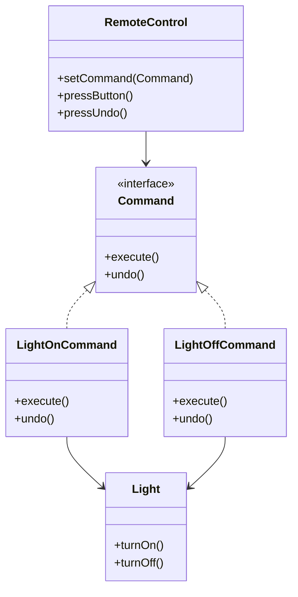

## 6.3 Command Design Pattern

The Command Design Pattern is a behavioral design pattern that transforms requests into standalone objects. This encapsulation allows requests to be parameterized, queued, logged, and even undone. By using the Command pattern, we can decouple the sender of a request from its receiver, thereby enhancing the flexibility and scalability of our applications.

### Intent

The primary intent of the Command Design Pattern is to encapsulate a request as an object. This encapsulation provides several benefits:

- **Parameterization of Requests**: Allows requests to be parameterized with different arguments.
- **Queuing and Logging**: Enables queuing of requests and logging of request history.
- **Undoable Operations**: Facilitates the implementation of undo functionality, which is particularly useful in applications with complex user interactions.

### Implementing Command in Swift

To implement the Command Design Pattern in Swift, we need to define a few key components:

1. **Command Protocol**: A protocol that defines the `execute` method.
2. **Concrete Commands**: Classes that implement the command protocol and encapsulate specific requests.
3. **Invoker**: An entity that holds and executes commands.
4. **Receiver**: The object that performs the actual work when a command is executed.
5. **Undo Functionality**: Mechanism to reverse executed commands.

Let's dive into each component with code examples.

#### Command Protocol

First, we define a protocol that all command objects will conform to. This protocol includes an `execute` method that will be implemented by concrete command classes.

```swift
protocol Command {
    func execute()
    func undo()
}
```

#### Concrete Commands

Concrete command classes implement the `Command` protocol. Each class encapsulates a specific request, delegating the actual work to a receiver.

```swift
class LightOnCommand: Command {
    private let light: Light

    init(light: Light) {
        self.light = light
    }

    func execute() {
        light.turnOn()
    }

    func undo() {
        light.turnOff()
    }
}

class LightOffCommand: Command {
    private let light: Light

    init(light: Light) {
        self.light = light
    }

    func execute() {
        light.turnOff()
    }

    func undo() {
        light.turnOn()
    }
}
```

#### Receiver

The receiver is the object that knows how to perform the work associated with carrying out a request. In our example, the `Light` class acts as a receiver.

```swift
class Light {
    func turnOn() {
        print("The light is on")
    }

    func turnOff() {
        print("The light is off")
    }
}
```

#### Invoker

The invoker is responsible for executing commands. It can store commands and execute them as needed.

```swift
class RemoteControl {
    private var command: Command?

    func setCommand(command: Command) {
        self.command = command
    }

    func pressButton() {
        command?.execute()
    }

    func pressUndo() {
        command?.undo()
    }
}
```

#### Undo Functionality

The undo functionality is implemented by storing executed commands and providing a method to reverse them. In our example, the `undo` method is part of the `Command` protocol and is implemented by each concrete command.

### Use Cases and Examples

The Command Design Pattern is versatile and can be used in various scenarios. Here are some common use cases:

#### UI Actions

In applications with graphical user interfaces, commands can be used to handle menu actions or button clicks. This allows for actions to be queued, logged, or undone.

#### Transactional Systems

In transactional systems, commands can be queued and executed in a specific order, ensuring consistency and reliability.

#### Macro Recording

Commands can be recorded and executed later, enabling macro functionality where a sequence of actions is performed automatically.

### Visualizing the Command Pattern

To better understand the interactions between the components of the Command Pattern, let's visualize the relationships using a class diagram.



### Design Considerations

When implementing the Command Design Pattern, consider the following:

- **Complexity**: While the pattern provides flexibility, it can add complexity to your codebase. Use it when the benefits outweigh the added complexity.
- **Undo Functionality**: Ensure that the undo functionality is implemented correctly, especially in applications where reversing actions is critical.
- **Command History**: Maintain a history of executed commands if you need to support undo or logging.

### Swift Unique Features

Swift offers several features that can enhance the implementation of the Command Design Pattern:

- **Value Types**: Use structs for command objects when immutability is desired.
- **Protocol Extensions**: Extend the `Command` protocol to provide default implementations for common methods.
- **Closures**: Use closures to encapsulate simple commands without creating separate classes.

### Differences and Similarities

The Command Design Pattern is often compared to other behavioral patterns such as the Strategy Pattern. The key difference is that the Command Pattern encapsulates requests as objects, while the Strategy Pattern encapsulates algorithms. Both patterns promote decoupling but serve different purposes.

### Try It Yourself

To deepen your understanding of the Command Design Pattern, try modifying the code examples. Here are some suggestions:

- **Add New Commands**: Implement additional commands for different actions, such as dimming the light or changing its color.
- **Enhance Undo Functionality**: Extend the undo functionality to support multiple levels of undo.
- **Implement a Command Queue**: Create a queue that stores commands and executes them in sequence.

### Conclusion

The Command Design Pattern is a powerful tool for encapsulating requests as objects, providing flexibility and scalability in software design. By decoupling the sender of a request from its receiver, the pattern enables parameterization, queuing, logging, and undo functionality. Swift's unique features, such as protocol extensions and closures, further enhance the implementation of this pattern.

## Quiz Time!



### What is the primary intent of the Command Design Pattern?

- [x] To encapsulate a request as an object
- [ ] To manage object creation
- [ ] To define the skeleton of an algorithm
- [ ] To provide a way to access elements of a collection

> **Explanation:** The Command Design Pattern encapsulates a request as an object, allowing for parameterization, queuing, and undoable operations.

### Which component in the Command Pattern is responsible for executing commands?

- [ ] Receiver
- [ ] Concrete Command
- [x] Invoker
- [ ] Command Protocol

> **Explanation:** The invoker is responsible for executing commands. It holds and triggers the execution of commands.

### What is the role of a receiver in the Command Pattern?

- [ ] To encapsulate a request as an object
- [x] To perform the actual work when a command is executed
- [ ] To define the execute method
- [ ] To queue commands

> **Explanation:** The receiver is the object that performs the actual work when a command is executed.

### How can undo functionality be implemented in the Command Pattern?

- [ ] By queuing commands
- [x] By storing executed commands and reversing them
- [ ] By using protocol extensions
- [ ] By parameterizing requests

> **Explanation:** Undo functionality is implemented by storing executed commands and providing a method to reverse them.

### Which Swift feature can be used to encapsulate simple commands without creating separate classes?

- [ ] Value Types
- [x] Closures
- [ ] Protocol Extensions
- [ ] Generics

> **Explanation:** Closures can be used to encapsulate simple commands without creating separate classes.

### What is a common use case for the Command Pattern in UI applications?

- [x] Handling menu actions or button clicks
- [ ] Managing object creation
- [ ] Defining the skeleton of an algorithm
- [ ] Accessing elements of a collection

> **Explanation:** In UI applications, the Command Pattern is commonly used to handle menu actions or button clicks.

### Which pattern is often compared with the Command Pattern due to its behavioral nature?

- [ ] Singleton Pattern
- [x] Strategy Pattern
- [ ] Factory Pattern
- [ ] Observer Pattern

> **Explanation:** The Command Pattern is often compared with the Strategy Pattern due to its behavioral nature, but they serve different purposes.

### What should be considered when implementing the Command Pattern?

- [x] Complexity and undo functionality
- [ ] Object creation and initialization
- [ ] Algorithm skeleton definition
- [ ] Collection access methods

> **Explanation:** When implementing the Command Pattern, consider the complexity it adds and ensure that undo functionality is correctly implemented.

### True or False: The Command Pattern can be used for macro recording.

- [x] True
- [ ] False

> **Explanation:** True. The Command Pattern can be used for macro recording by recording sequences of commands to be executed later.

### Which Swift feature enhances the implementation of the Command Pattern by providing default method implementations?

- [ ] Closures
- [x] Protocol Extensions
- [ ] Value Types
- [ ] Generics

> **Explanation:** Protocol extensions in Swift enhance the implementation of the Command Pattern by providing default method implementations.


