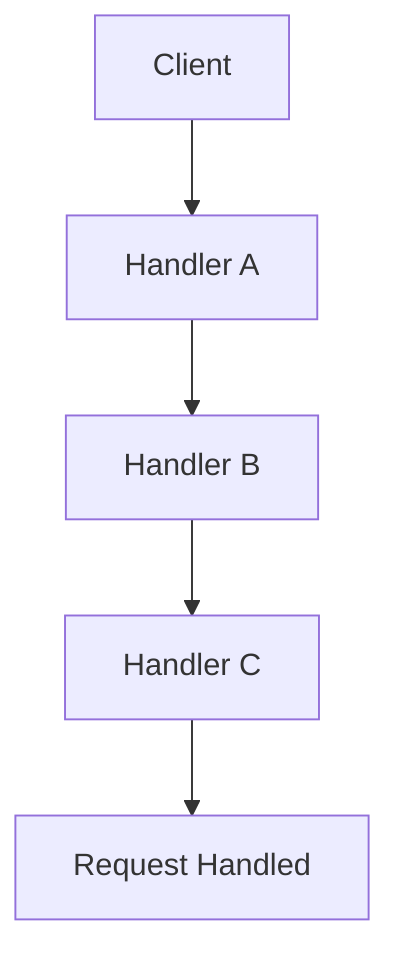

## 6.4 Chain of Responsibility Design Pattern

In the realm of software design patterns, the Chain of Responsibility stands out for its ability to decouple the sender of a request from its receivers. This pattern allows multiple objects the opportunity to handle a request, creating a chain of potential handlers. If one handler cannot process the request, it passes it to the next handler in the chain. This approach is particularly useful in scenarios where multiple handlers might be capable of processing a request, but the exact handler is not known until runtime.

### Intent

The primary intent of the Chain of Responsibility pattern is to avoid coupling the sender of a request to its receiver by allowing more than one object to handle the request. This is achieved by chaining the receiving objects and passing the request along the chain until an object handles it.

### Key Participants

1. **Handler Protocol**: Defines an interface for handling requests and optionally holds a reference to the next handler.
2. **Concrete Handlers**: Implement the handler interface and decide either to process the request or pass it to the next handler.
3. **Client**: Initiates the request to the chain.

### Implementing Chain of Responsibility in Swift

Let's explore how to implement this pattern in Swift, leveraging its unique language features to create a robust and flexible chain of handlers.

#### Handler Protocol

Begin by defining a protocol that all handlers will conform to. This protocol will include a method to handle requests and a reference to the next handler in the chain.

```swift
protocol Handler {
    var next: Handler? { get set }
    func handle(request: String)
}
```

- **`next`**: A reference to the next handler in the chain.
- **`handle(request:)`**: A method that attempts to process the request or passes it to the next handler.

#### Concrete Handlers

Implement concrete classes that conform to the `Handler` protocol. Each class will decide whether to handle the request or pass it along the chain.

```swift
class ConcreteHandlerA: Handler {
    var next: Handler?
    
    func handle(request: String) {
        if request == "A" {
            print("ConcreteHandlerA handled request \\(request)")
        } else {
            next?.handle(request: request)
        }
    }
}

class ConcreteHandlerB: Handler {
    var next: Handler?
    
    func handle(request: String) {
        if request == "B" {
            print("ConcreteHandlerB handled request \\(request)")
        } else {
            next?.handle(request: request)
        }
    }
}
```

- **ConcreteHandlerA**: Handles requests with the identifier "A".
- **ConcreteHandlerB**: Handles requests with the identifier "B".

#### Setting Up the Chain

Link the handlers together to form a chain. The client will initiate the request at the start of the chain.

```swift
let handlerA = ConcreteHandlerA()
let handlerB = ConcreteHandlerB()

handlerA.next = handlerB
```

#### Request Passing

The request moves along the chain until it is handled. If no handler processes the request, it will be ignored or handled by a default handler.

```swift
let requests = ["A", "B", "C"]

for request in requests {
    handlerA.handle(request: request)
}
```

### Use Cases and Examples

The Chain of Responsibility pattern is versatile and applicable in various scenarios. Here are some common use cases:

#### Event Bubbling

In UI frameworks, events often bubble up a view hierarchy. Each view has the opportunity to handle the event, passing it up the chain if not handled.

#### Logging Systems

In logging systems, different log handlers (such as debug, info, error) decide whether to handle a log message. Each handler may pass the message to the next level if it cannot process it.

#### Customer Support

Support requests can be routed through different levels of support staff until resolved. Each level decides whether it can handle the request or pass it to a higher level.

### Diagrams

To visualize the Chain of Responsibility pattern, consider the following diagram, which illustrates the flow of a request through a chain of handlers.



- **Client**: Initiates the request.
- **Handler A, B, C**: Process or pass the request.
- **Request Handled**: The request is processed by one of the handlers.

### Design Considerations

- **Decoupling**: The pattern decouples senders and receivers, allowing for flexible request handling.
- **Responsibility Sharing**: Handlers share the responsibility of processing requests, which can lead to more maintainable code.
- **Performance**: Be cautious of performance issues if the chain becomes too long, as requests may pass through many handlers.

### Swift Unique Features

Swift's protocol-oriented programming and type safety enhance the implementation of the Chain of Responsibility pattern. Protocols allow for flexible handler definitions, while Swift's strong type system ensures that requests are handled safely and predictably.

### Differences and Similarities

The Chain of Responsibility pattern is often compared to the Decorator pattern. While both involve chaining objects, the Decorator pattern focuses on adding behavior to objects, whereas the Chain of Responsibility pattern focuses on passing requests along a chain.

### Try It Yourself

To deepen your understanding, try modifying the code examples:

- **Add a new handler**: Implement a new handler that processes a different type of request.
- **Change the chain order**: Rearrange the chain to see how it affects request handling.
- **Add logging**: Include logging to track the flow of requests through the chain.

### Knowledge Check

Before we conclude, let's reinforce your understanding with a few questions:

- What is the primary intent of the Chain of Responsibility pattern?
- How does the Chain of Responsibility pattern promote decoupling?
- What are some common use cases for this pattern?

### Embrace the Journey

Remember, mastering design patterns is a journey. As you explore and implement these patterns, you'll gain insights into creating flexible, maintainable, and robust applications. Keep experimenting, stay curious, and enjoy the journey!

## Quiz Time!



### What is the primary intent of the Chain of Responsibility pattern?

- [x] To decouple the sender of a request from its receiver by allowing multiple objects to handle the request.
- [ ] To create a single point of failure in request handling.
- [ ] To ensure that all requests are handled by the first object in the chain.
- [ ] To tightly couple the sender and receiver of a request.

> **Explanation:** The Chain of Responsibility pattern aims to decouple the sender from the receiver by passing the request along a chain of potential handlers.

### Which Swift feature enhances the implementation of the Chain of Responsibility pattern?

- [x] Protocol-oriented programming
- [ ] Dynamic typing
- [ ] Manual memory management
- [ ] Singleton pattern

> **Explanation:** Swift's protocol-oriented programming allows for flexible handler definitions, enhancing the implementation of the pattern.

### What is a common use case for the Chain of Responsibility pattern?

- [x] Event bubbling in UI frameworks
- [ ] Singleton instance creation
- [ ] Database connection pooling
- [ ] Memory management

> **Explanation:** Event bubbling, where events pass up a view hierarchy, is a common use case for the Chain of Responsibility pattern.

### How does the Chain of Responsibility pattern handle requests?

- [x] By passing them along a chain of handlers until one handles it
- [ ] By sending them directly to a single handler
- [ ] By discarding them if not handled immediately
- [ ] By processing them in parallel with all handlers

> **Explanation:** Requests are passed along a chain of handlers until one of them handles the request.

### What should you be cautious of when implementing a long chain?

- [x] Performance issues
- [ ] Increased coupling
- [ ] Lack of flexibility
- [ ] Singleton overuse

> **Explanation:** A long chain can lead to performance issues as requests may pass through many handlers.

### In the Chain of Responsibility pattern, what is the role of the client?

- [x] To initiate the request to the chain
- [ ] To handle the request directly
- [ ] To define the handler protocol
- [ ] To terminate the chain

> **Explanation:** The client initiates the request, which is then passed through the chain of handlers.

### What is a key difference between the Chain of Responsibility and Decorator patterns?

- [x] Chain of Responsibility focuses on request handling, while Decorator focuses on adding behavior.
- [ ] Both patterns focus on adding behavior to objects.
- [ ] Chain of Responsibility requires a single handler, while Decorator uses multiple.
- [ ] Both patterns create a single point of failure.

> **Explanation:** The Chain of Responsibility pattern focuses on passing requests, while the Decorator pattern adds behavior to objects.

### How can you experiment with the Chain of Responsibility pattern in Swift?

- [x] By adding new handlers and rearranging the chain
- [ ] By removing all handlers from the chain
- [ ] By implementing the Singleton pattern
- [ ] By using dynamic typing

> **Explanation:** Adding new handlers and rearranging the chain helps in experimenting with the pattern.

### What is a benefit of using the Chain of Responsibility pattern?

- [x] It promotes responsibility sharing among handlers.
- [ ] It ensures a single handler processes all requests.
- [ ] It increases coupling between sender and receiver.
- [ ] It simplifies request handling by using a single handler.

> **Explanation:** The pattern promotes responsibility sharing, making code more maintainable.

### True or False: The Chain of Responsibility pattern always guarantees that a request will be handled.

- [ ] True
- [x] False

> **Explanation:** The pattern does not guarantee that a request will be handled; it depends on the handlers in the chain.




