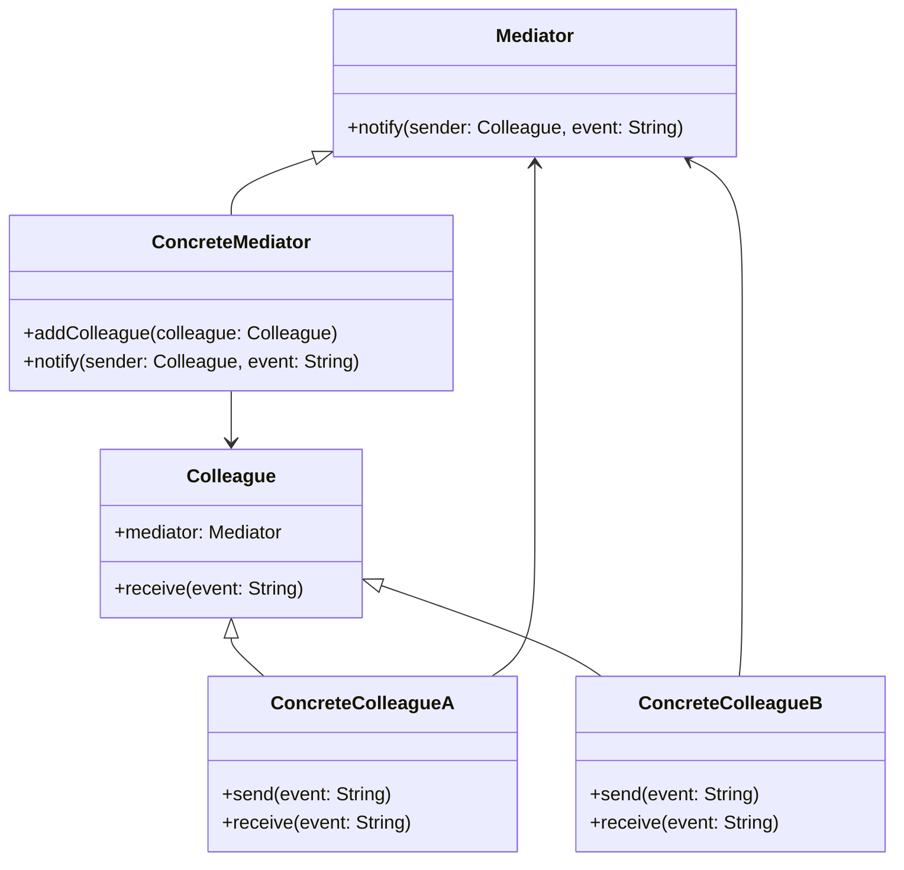

## 6.5 Mediator Design Pattern

In the world of software development, managing complex interactions between objects can often lead to tightly coupled systems, making maintenance and scalability difficult. The **Mediator Design Pattern** offers a solution by encapsulating the interactions within a single mediator object, thereby promoting loose coupling and simplifying communication.

### Intent

The intent of the Mediator Design Pattern is to define an object that encapsulates how a set of objects interact. It promotes loose coupling by ensuring that objects do not refer to each other explicitly, but instead communicate through a mediator.

### Implementing Mediator in Swift

Let's delve into how we can implement the Mediator Design Pattern in Swift, breaking it down into several key components:

#### Mediator Protocol

Start by defining a protocol that declares methods for communication between the mediator and its colleagues.

```swift
protocol Mediator {
    func notify(sender: Colleague, event: String)
}
```

#### Concrete Mediator

Implement a concrete mediator class that coordinates communication between colleagues. This class will manage the interactions and ensure that each component communicates through the mediator.

```swift
class ConcreteMediator: Mediator {
    private var colleagues: [Colleague] = []
    
    func addColleague(colleague: Colleague) {
        colleagues.append(colleague)
    }
    
    func notify(sender: Colleague, event: String) {
        for colleague in colleagues {
            if colleague !== sender {
                colleague.receive(event: event)
            }
        }
    }
}
```

#### Colleague Protocol

Define a protocol for components (colleagues) that interact through the mediator. Each colleague will have a reference to the mediator and will communicate through it.

```swift
protocol Colleague: AnyObject {
    var mediator: Mediator? { get set }
    func receive(event: String)
}
```

#### Concrete Colleagues

Create concrete classes for colleagues that implement the `Colleague` protocol. These classes will use the mediator to communicate with each other.

```swift
class ConcreteColleagueA: Colleague {
    weak var mediator: Mediator?
    
    func send(event: String) {
        print("Colleague A sends event: \\(event)")
        mediator?.notify(sender: self, event: event)
    }
    
    func receive(event: String) {
        print("Colleague A receives event: \\(event)")
    }
}

class ConcreteColleagueB: Colleague {
    weak var mediator: Mediator?
    
    func send(event: String) {
        print("Colleague B sends event: \\(event)")
        mediator?.notify(sender: self, event: event)
    }
    
    func receive(event: String) {
        print("Colleague B receives event: \\(event)")
    }
}
```

#### Decoupling Components

By using a mediator, components only know about the mediator, not about each other. This decoupling allows for more flexible and maintainable code.

### Use Cases and Examples

The Mediator Design Pattern is particularly useful in scenarios where multiple objects need to communicate in a complex system. Here are some common use cases:

#### UI Components

In a dialog box, various controls (buttons, text fields, etc.) interact with each other. Instead of each control having direct references to others, they can communicate through a mediator.

```swift
// Example of a UI Mediator
class DialogMediator: Mediator {
    private var button: Button?
    private var textField: TextField?
    
    func setButton(button: Button) {
        self.button = button
    }
    
    func setTextField(textField: TextField) {
        self.textField = textField
    }
    
    func notify(sender: Colleague, event: String) {
        if sender === button && event == "click" {
            textField?.receive(event: "Button clicked")
        }
    }
}

class Button: Colleague {
    weak var mediator: Mediator?
    
    func click() {
        print("Button clicked")
        mediator?.notify(sender: self, event: "click")
    }
    
    func receive(event: String) {
        // Handle event
    }
}

class TextField: Colleague {
    weak var mediator: Mediator?
    
    func receive(event: String) {
        print("TextField received event: \\(event)")
    }
}

// Usage
let dialogMediator = DialogMediator()
let button = Button()
let textField = TextField()

button.mediator = dialogMediator
textField.mediator = dialogMediator

dialogMediator.setButton(button: button)
dialogMediator.setTextField(textField: textField)

button.click()
```

#### Messaging Systems

In messaging systems, a central hub can manage message exchanges between clients, ensuring that messages are routed correctly without clients needing to know about each other.

#### Air Traffic Control

In an air traffic control system, planes (colleagues) communicate through a control tower (mediator), which coordinates their actions to ensure safety and efficiency.

### Visualizing the Mediator Pattern

To better understand the Mediator Design Pattern, let's visualize the relationships between the mediator and its colleagues.



### Design Considerations

When implementing the Mediator Design Pattern, consider the following:

- **Complexity**: While the mediator simplifies communication, it can become a complex component if it handles too many interactions.
- **Scalability**: Ensure that the mediator can handle an increasing number of colleagues without becoming a bottleneck.
- **Flexibility**: The mediator should be flexible enough to accommodate changes in the system without requiring significant modifications.

### Swift Unique Features

Swift's strong type system and protocol-oriented programming paradigm make it an excellent choice for implementing the Mediator Design Pattern. Use protocols to define the mediator and colleague interfaces, and leverage Swift's weak references to avoid retain cycles.

### Differences and Similarities

The Mediator Design Pattern is often confused with the Observer Pattern. Both patterns facilitate communication between objects, but the mediator centralizes control, while the observer pattern distributes it.

### Try It Yourself

Experiment with the mediator pattern by modifying the code examples. Try adding new colleagues or events, and observe how the mediator manages these interactions. This hands-on approach will deepen your understanding of the pattern.

### Knowledge Check

- How does the Mediator Design Pattern promote loose coupling?
- What are the key components of the Mediator Design Pattern?
- How can you implement a mediator in a UI system?
- What are some potential pitfalls of using the Mediator Design Pattern?

### Embrace the Journey

Remember, mastering design patterns is a journey. As you explore the Mediator Design Pattern, you'll gain insights into managing complex interactions and building more maintainable systems. Keep experimenting, stay curious, and enjoy the journey!

## Quiz Time!



### What is the primary intent of the Mediator Design Pattern?

- [x] To define an object that encapsulates how a set of objects interact.
- [ ] To allow objects to communicate directly with each other.
- [ ] To enforce a strict hierarchy among objects.
- [ ] To eliminate the need for communication between objects.

> **Explanation:** The Mediator Design Pattern encapsulates how a set of objects interact, promoting loose coupling by ensuring objects do not refer to each other explicitly.

### Which component in the Mediator Pattern coordinates communication between colleagues?

- [x] Concrete Mediator
- [ ] Colleague
- [ ] Mediator Protocol
- [ ] Concrete Colleague

> **Explanation:** The Concrete Mediator is responsible for coordinating communication between colleagues.

### How do colleagues interact in the Mediator Pattern?

- [x] Through the mediator
- [ ] Directly with each other
- [ ] Using a shared global variable
- [ ] Via a centralized database

> **Explanation:** Colleagues interact through the mediator, which manages their communication.

### What is a potential drawback of the Mediator Pattern?

- [x] The mediator can become complex if it handles too many interactions.
- [ ] It increases coupling between objects.
- [ ] It requires direct communication between objects.
- [ ] It is not suitable for UI components.

> **Explanation:** The mediator can become a complex component if it handles too many interactions, potentially becoming a bottleneck.

### In which scenario is the Mediator Pattern particularly useful?

- [x] Air Traffic Control
- [ ] Direct messaging between two objects
- [ ] Simple arithmetic operations
- [ ] Static configuration settings

> **Explanation:** The Mediator Pattern is useful in scenarios like Air Traffic Control, where multiple objects need to communicate indirectly through a central mediator.

### What is the role of the Colleague Protocol in the Mediator Pattern?

- [x] To define how components interact through the mediator
- [ ] To implement the mediator's logic
- [ ] To store global state information
- [ ] To manage network connections

> **Explanation:** The Colleague Protocol defines how components (colleagues) interact through the mediator.

### How can the Mediator Pattern improve maintainability?

- [x] By decoupling components and centralizing communication
- [ ] By increasing direct dependencies between objects
- [ ] By enforcing a strict class hierarchy
- [ ] By reducing the number of classes in the system

> **Explanation:** The Mediator Pattern improves maintainability by decoupling components and centralizing communication, making the system more flexible.

### What is a common misconception about the Mediator Pattern?

- [x] It is often confused with the Observer Pattern.
- [ ] It eliminates the need for any communication between objects.
- [ ] It is only applicable to networked systems.
- [ ] It requires global state management.

> **Explanation:** The Mediator Pattern is often confused with the Observer Pattern, but they serve different purposes in managing object interactions.

### What is an advantage of using Swift for implementing the Mediator Pattern?

- [x] Swift's strong type system and protocol-oriented programming
- [ ] Swift's ability to execute code on the server
- [ ] Swift's built-in support for global variables
- [ ] Swift's dynamic typing capabilities

> **Explanation:** Swift's strong type system and protocol-oriented programming paradigm make it an excellent choice for implementing the Mediator Pattern.

### True or False: In the Mediator Pattern, colleagues have direct references to each other.

- [ ] True
- [x] False

> **Explanation:** False. In the Mediator Pattern, colleagues do not have direct references to each other; they communicate through the mediator.




