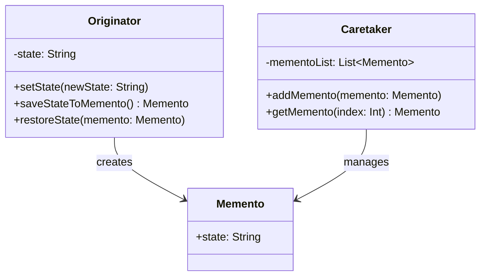

## 6.6 Memento Design Pattern

The Memento Design Pattern is a behavioral design pattern that provides the ability to capture and externalize an object's internal state without violating encapsulation, allowing the object to be restored to this state later. This pattern is particularly useful in scenarios where undo mechanisms, state history, or checkpoints are required, such as in text editors, games, or complex data manipulation applications.

### Intent

The primary intent of the Memento Design Pattern is to:
- Capture an object's internal state at a specific point in time.
- Externalize this state without exposing the object's implementation details.
- Allow the object to be restored to this state at a later time.

### Implementing Memento in Swift

To implement the Memento Design Pattern in Swift, we need to define three main components: the Memento, the Originator, and the Caretaker.

#### Memento Struct/Class

The Memento is a simple data structure that holds the state of the Originator. It should be immutable to prevent accidental modifications after creation.

```swift
// Memento: Holds the state of the Originator
struct Memento {
    let state: String
}
```

#### Originator

The Originator is the object whose state needs to be saved and restored. It creates a Memento containing its current state and can use a Memento to restore its state.

```swift
// Originator: The object whose state needs to be saved/restored
class Originator {
    private var state: String = ""
    
    func setState(_ newState: String) {
        state = newState
        print("Originator: Setting state to \\(state)")
    }
    
    func saveStateToMemento() -> Memento {
        print("Originator: Saving state to Memento.")
        return Memento(state: state)
    }
    
    func restoreState(from memento: Memento) {
        state = memento.state
        print("Originator: State after restoring from Memento: \\(state)")
    }
}
```

#### Caretaker

The Caretaker is responsible for managing the Mementos. It requests the Originator to save and restore states but does not operate on or examine the contents of the Mementos.

```swift
// Caretaker: Manages the Mementos
class Caretaker {
    private var mementoList = [Memento]()
    
    func addMemento(_ memento: Memento) {
        mementoList.append(memento)
    }
    
    func getMemento(at index: Int) -> Memento? {
        guard index < mementoList.count else { return nil }
        return mementoList[index]
    }
}
```

### Use Cases and Examples

#### Undo Mechanisms

The Memento pattern is ideal for implementing undo functionality. By saving the state of an object before a change, you can revert to the previous state if needed.

```swift
let originator = Originator()
let caretaker = Caretaker()

originator.setState("State1")
caretaker.addMemento(originator.saveStateToMemento())

originator.setState("State2")
caretaker.addMemento(originator.saveStateToMemento())

originator.setState("State3")

// Undo to State2
if let memento = caretaker.getMemento(at: 1) {
    originator.restoreState(from: memento)
}

// Undo to State1
if let memento = caretaker.getMemento(at: 0) {
    originator.restoreState(from: memento)
}
```

#### State History

In applications where it's important to keep a history of changes, such as version control systems, the Memento pattern can be used to store snapshots of an object's state at various points in time.

#### Game Development

Games often require saving progress or checkpoints. The Memento pattern can be used to save the state of a game at certain points, allowing players to return to these points later.

### Visualizing the Memento Pattern

To better understand the Memento Design Pattern, let's visualize the interaction between the Originator, Memento, and Caretaker using a class diagram.



### Design Considerations

- **Immutability**: Ensure that Mementos are immutable. Once a Memento is created, it should not be modified to maintain the integrity of the saved state.
- **Memory Usage**: Be mindful of memory usage when storing multiple Mementos, as each one holds a snapshot of the object's state.
- **Encapsulation**: The Memento pattern maintains encapsulation by not exposing the internal state of the Originator to the Caretaker.

### Swift Unique Features

Swift's strong typing and value semantics make it well-suited for implementing the Memento pattern. Use Swift's `struct` for Mementos to leverage immutability and value semantics, ensuring that the state is safely encapsulated.

### Differences and Similarities

The Memento pattern is often compared to the Command pattern, as both can be used to implement undo functionality. However, the Memento pattern focuses on capturing and restoring state, while the Command pattern encapsulates operations.

### Try It Yourself

To deepen your understanding of the Memento Design Pattern, try modifying the code examples to:
- Save additional attributes in the Memento.
- Implement a redo mechanism alongside undo.
- Create a history of states with timestamps.

### References and Links

For further reading on the Memento Design Pattern, consider these resources:
- [Memento Pattern on Wikipedia](https://en.wikipedia.org/wiki/Memento_pattern)
- [Swift.org Documentation](https://swift.org/documentation/)

### Knowledge Check

Before we conclude, let's summarize the key points:
- The Memento Design Pattern allows capturing and restoring an object's state without violating encapsulation.
- It consists of three main components: Memento, Originator, and Caretaker.
- Common use cases include undo mechanisms, state history, and game development.

Remember, mastering design patterns is a journey. Keep experimenting with different scenarios and applications to solidify your understanding.

## Quiz Time!



### What is the primary intent of the Memento Design Pattern?

- [x] To capture and externalize an object's internal state without violating encapsulation.
- [ ] To provide a way to create families of related or dependent objects.
- [ ] To define a family of algorithms and make them interchangeable.
- [ ] To separate the construction of a complex object from its representation.

> **Explanation:** The Memento Design Pattern is intended to capture and externalize an object's state without exposing its implementation details.

### Which component of the Memento pattern is responsible for managing Mementos?

- [ ] Originator
- [ ] Memento
- [x] Caretaker
- [ ] Observer

> **Explanation:** The Caretaker is responsible for managing Mementos, including saving and retrieving them.

### In Swift, which data structure is recommended for implementing a Memento to ensure immutability?

- [ ] Class
- [x] Struct
- [ ] Enum
- [ ] Protocol

> **Explanation:** Using a `struct` in Swift leverages value semantics and immutability, making it ideal for implementing a Memento.

### What is a common use case for the Memento Design Pattern?

- [ ] Implementing a factory method
- [x] Undo mechanisms
- [ ] Creating a bridge between two interfaces
- [ ] Adapting one interface to another

> **Explanation:** A common use case for the Memento Design Pattern is implementing undo mechanisms by saving and restoring object states.

### How does the Memento pattern maintain encapsulation?

- [ ] By exposing the internal state of the Originator
- [x] By not exposing the internal state of the Originator to the Caretaker
- [ ] By using inheritance
- [ ] By allowing direct access to the Memento's state

> **Explanation:** The Memento pattern maintains encapsulation by not exposing the Originator's internal state to the Caretaker.

### What should be considered when storing multiple Mementos?

- [ ] Network latency
- [ ] Code readability
- [x] Memory usage
- [ ] Compilation time

> **Explanation:** When storing multiple Mementos, memory usage should be considered as each Memento holds a snapshot of the object's state.

### Which pattern is often compared to the Memento pattern for implementing undo functionality?

- [x] Command pattern
- [ ] Singleton pattern
- [ ] Factory pattern
- [ ] Observer pattern

> **Explanation:** The Command pattern is often compared to the Memento pattern for implementing undo functionality, though they focus on different aspects.

### In game development, what is a common application of the Memento pattern?

- [ ] Rendering graphics
- [x] Saving game progress or checkpoints
- [ ] Handling user input
- [ ] Networking

> **Explanation:** In game development, the Memento pattern is commonly used for saving game progress or checkpoints.

### True or False: The Memento pattern can be used to implement state history in applications.

- [x] True
- [ ] False

> **Explanation:** True. The Memento pattern can be used to implement state history by storing snapshots of an object's state over time.

### What is the role of the Originator in the Memento pattern?

- [x] To create and restore Mementos
- [ ] To manage Mementos
- [ ] To expose the internal state
- [ ] To observe changes in state

> **Explanation:** The Originator is responsible for creating Mementos to save its state and restoring its state from Mementos.



Remember, this is just the beginning. As you progress, you'll build more complex and interactive applications. Keep experimenting, stay curious, and enjoy the journey!


