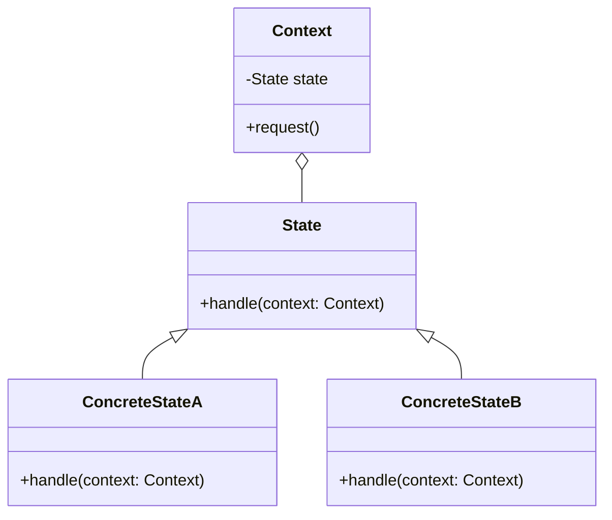

## 6.7 State Design Pattern

The State Design Pattern is a behavioral design pattern that allows an object to alter its behavior when its internal state changes. This pattern is particularly useful in scenarios where an object must change its behavior dynamically as it transitions between different states, making it appear to change its class.

### Intent

The primary intent of the State Design Pattern is to enable an object to change its behavior when its internal state changes, thus making the object appear as if it has changed its class. This is achieved by encapsulating state-specific behavior into separate state objects and delegating behavior to the current state object.

### Implementing State in Swift

In Swift, implementing the State Design Pattern involves several key components:

#### State Protocol

The State Protocol defines a set of methods that encapsulate state-specific behavior. Each state of the object will implement this protocol, providing its own version of the behavior.

```swift
protocol State {
    func handle(context: Context)
}
```

#### Concrete States

Concrete States are classes or structs that conform to the State Protocol. Each concrete state provides its own implementation of the methods defined in the State Protocol.

```swift
class ConcreteStateA: State {
    func handle(context: Context) {
        print("State A handling request.")
        context.state = ConcreteStateB()
    }
}

class ConcreteStateB: State {
    func handle(context: Context) {
        print("State B handling request.")
        context.state = ConcreteStateA()
    }
}
```

#### Context

The Context class holds a reference to a state object and delegates behavior to it. The context is responsible for switching between states based on events or conditions.

```swift
class Context {
    var state: State
    
    init(state: State) {
        self.state = state
    }
    
    func request() {
        state.handle(context: self)
    }
}
```

#### State Transitions

State transitions occur when the context switches between different state objects. This can be triggered by events or conditions within the application.

```swift
let context = Context(state: ConcreteStateA())
context.request() // State A handling request.
context.request() // State B handling request.
```

### Use Cases and Examples

The State Design Pattern is versatile and can be applied to a variety of use cases in software development. Below are some common scenarios where this pattern is particularly effective:

#### UI Components

Consider a UI button that changes its behavior based on whether it is enabled or disabled. The State Design Pattern can be used to encapsulate the behavior of the button in different states.

```swift
protocol ButtonState {
    func press()
}

class EnabledState: ButtonState {
    func press() {
        print("Button pressed.")
    }
}

class DisabledState: ButtonState {
    func press() {
        print("Button is disabled.")
    }
}

class Button {
    var state: ButtonState
    
    init(state: ButtonState) {
        self.state = state
    }
    
    func press() {
        state.press()
    }
}

let enabledButton = Button(state: EnabledState())
enabledButton.press() // Button pressed.

let disabledButton = Button(state: DisabledState())
disabledButton.press() // Button is disabled.
```

#### Authentication Processes

In authentication processes, user sessions may transition between states such as logged-in, expired, or guest. The State Design Pattern can manage these transitions and behaviors.

```swift
protocol SessionState {
    func performAction()
}

class LoggedInState: SessionState {
    func performAction() {
        print("Access granted.")
    }
}

class ExpiredState: SessionState {
    func performAction() {
        print("Session expired. Please log in again.")
    }
}

class GuestState: SessionState {
    func performAction() {
        print("Limited access. Please log in for more features.")
    }
}

class UserSession {
    var state: SessionState
    
    init(state: SessionState) {
        self.state = state
    }
    
    func performAction() {
        state.performAction()
    }
}

let session = UserSession(state: LoggedInState())
session.performAction() // Access granted.

session.state = ExpiredState()
session.performAction() // Session expired. Please log in again.
```

#### Game Characters

In games, characters may change abilities or behaviors based on health or power-ups. The State Design Pattern can manage these dynamic changes effectively.

```swift
protocol CharacterState {
    func action()
}

class NormalState: CharacterState {
    func action() {
        print("Character performs normal action.")
    }
}

class PoweredUpState: CharacterState {
    func action() {
        print("Character performs powered-up action.")
    }
}

class Character {
    var state: CharacterState
    
    init(state: CharacterState) {
        self.state = state
    }
    
    func performAction() {
        state.action()
    }
}

let character = Character(state: NormalState())
character.performAction() // Character performs normal action.

character.state = PoweredUpState()
character.performAction() // Character performs powered-up action.
```

### Visualizing the State Design Pattern

To better understand the State Design Pattern, let's visualize the components and their interactions using a class diagram.



**Diagram Explanation:** The diagram illustrates the relationship between the `State` protocol, `ConcreteStateA` and `ConcreteStateB` classes, and the `Context` class. The `Context` class holds a reference to a `State` object and delegates behavior to it.

### Design Considerations

When implementing the State Design Pattern, consider the following:

- **When to Use**: Use the State Design Pattern when an object must change its behavior dynamically based on its state. This pattern is particularly useful when the behavior of an object depends on its state and it must change behavior at runtime.
- **Flexibility**: The pattern provides flexibility by allowing new states to be added without modifying the context or other states.
- **Complexity**: The pattern can increase complexity by introducing additional classes for each state. Ensure that the benefits of using the pattern outweigh the added complexity.
- **Performance**: Consider the performance implications of frequently switching states, especially in performance-critical applications.

### Swift Unique Features

Swift offers several unique features that can enhance the implementation of the State Design Pattern:

- **Protocols and Protocol Extensions**: Use protocols and protocol extensions to define state-specific behavior and provide default implementations.
- **Value Types**: Consider using structs for state objects if immutability and value semantics are desired.
- **Enums with Associated Values**: Use enums with associated values to represent states and encapsulate state-specific data.

### Differences and Similarities

The State Design Pattern is often compared to the Strategy Design Pattern. While both patterns involve encapsulating behavior, the key difference is that the State Design Pattern involves changing behavior based on the object's state, whereas the Strategy Design Pattern involves selecting a behavior from a set of algorithms.

### Try It Yourself

To deepen your understanding of the State Design Pattern, try modifying the code examples provided:

- Add a new state to the button example that represents a "loading" state.
- Implement a new state for the user session example that represents a "locked" state.
- Create a new state for the game character example that represents an "injured" state.

### Conclusion

The State Design Pattern is a powerful tool for managing dynamic behavior in applications. By encapsulating state-specific behavior into separate state objects, you can create applications that respond to changes in state with ease. Remember, this is just the beginning. As you progress, you'll build more complex and interactive applications. Keep experimenting, stay curious, and enjoy the journey!

## Quiz Time!



### What is the primary intent of the State Design Pattern?

- [x] To allow an object to alter its behavior when its internal state changes.
- [ ] To encapsulate a set of algorithms.
- [ ] To provide a way to create objects.
- [ ] To define a family of algorithms.

> **Explanation:** The primary intent of the State Design Pattern is to allow an object to alter its behavior when its internal state changes.

### Which component of the State Design Pattern holds a reference to a state object?

- [x] Context
- [ ] State
- [ ] Concrete State
- [ ] Protocol

> **Explanation:** The Context class holds a reference to a state object and delegates behavior to it.

### In the State Design Pattern, what does a Concrete State represent?

- [x] A specific state of the object with its own behavior.
- [ ] The interface for state-specific behavior.
- [ ] The context that holds state objects.
- [ ] A method to switch between states.

> **Explanation:** A Concrete State represents a specific state of the object with its own behavior.

### How does the State Design Pattern differ from the Strategy Design Pattern?

- [x] State changes behavior based on the object's state; Strategy selects from a set of algorithms.
- [ ] Strategy changes behavior based on the object's state; State selects from a set of algorithms.
- [ ] Both patterns are identical.
- [ ] Neither pattern involves behavior encapsulation.

> **Explanation:** The State Design Pattern changes behavior based on the object's state, whereas the Strategy Design Pattern selects from a set of algorithms.

### What Swift feature can be used to represent states with associated data?

- [x] Enums with associated values
- [ ] Classes
- [ ] Protocols
- [ ] Closures

> **Explanation:** Enums with associated values can be used to represent states with associated data.

### Which of the following is a use case for the State Design Pattern?

- [x] UI components changing behavior based on state.
- [ ] Sorting a list of items.
- [ ] Creating a singleton object.
- [ ] Managing a collection of objects.

> **Explanation:** UI components changing behavior based on state is a common use case for the State Design Pattern.

### What is a potential drawback of using the State Design Pattern?

- [x] Increased complexity due to additional classes.
- [ ] Lack of flexibility in behavior changes.
- [ ] Difficulty in adding new states.
- [ ] Poor performance in state transitions.

> **Explanation:** The State Design Pattern can increase complexity due to the introduction of additional classes for each state.

### How can Swift's protocol extensions be used in the State Design Pattern?

- [x] To provide default implementations for state-specific behavior.
- [ ] To create concrete state classes.
- [ ] To define the context class.
- [ ] To manage state transitions.

> **Explanation:** Protocol extensions can be used to provide default implementations for state-specific behavior.

### Which of the following is NOT a component of the State Design Pattern?

- [ ] State Protocol
- [ ] Concrete State
- [ ] Context
- [x] Factory

> **Explanation:** The Factory is not a component of the State Design Pattern. The pattern involves the State Protocol, Concrete State, and Context.

### True or False: The State Design Pattern can be used to manage dynamic behavior in applications.

- [x] True
- [ ] False

> **Explanation:** True. The State Design Pattern is used to manage dynamic behavior in applications by encapsulating state-specific behavior into separate state objects.



---
