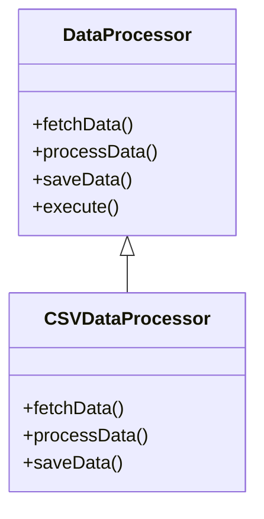

## 6.8 Template Method Design Pattern

The Template Method Design Pattern is a cornerstone in software development, enabling developers to define the skeleton of an algorithm while allowing subclasses to redefine certain steps without altering the algorithm's overall structure. This pattern is particularly useful in scenarios where a general workflow is shared across different implementations, but certain steps need customization.

### Intent

The primary intent of the Template Method Design Pattern is to:

- Define the skeleton of an algorithm in an operation.
- Defer some steps of the algorithm to subclasses.
- Allow subclasses to redefine specific steps without changing the algorithm's structure.

This pattern promotes code reuse and flexibility, making it easier to manage and extend complex algorithms.

### Implementing Template Method in Swift

In Swift, the Template Method pattern can be implemented using abstract classes or protocols to define the algorithm's structure. The key components include:

1. **Abstract Class/Protocol**: Define a class or protocol with methods representing the steps of the algorithm.
2. **Template Method**: Implement the algorithm by calling the abstract or overridable methods.
3. **Subclasses/Extensions**: Provide concrete implementations for the abstract steps.
4. **Final Methods**: Use the `final` keyword to prevent overriding of the template method.

Let's delve into each of these components with examples and explanations.

### Abstract Class/Protocol

In Swift, protocols can be used to define the structure of the algorithm. Here's an example of how we might define a protocol for a data processing pipeline:

```swift
protocol DataProcessor {
    func fetchData()
    func processData()
    func saveData()
    
    // Template Method
    func execute()
}

extension DataProcessor {
    func execute() {
        fetchData()
        processData()
        saveData()
    }
}
```

In this example, `DataProcessor` is a protocol that defines three methods: `fetchData`, `processData`, and `saveData`. The `execute` method acts as the template method, calling each step in sequence.

### Template Method

The template method is implemented within the protocol extension. This method defines the algorithm's skeleton, calling each step in the defined order.

```swift
extension DataProcessor {
    func execute() {
        fetchData()
        processData()
        saveData()
    }
}
```

The `execute` method is marked as `final` to prevent subclasses from altering the algorithm's structure.

### Subclasses/Extensions

Concrete classes or extensions implement the abstract steps defined in the protocol. Here's an example of a subclass that implements the `DataProcessor` protocol:

```swift
class CSVDataProcessor: DataProcessor {
    func fetchData() {
        print("Fetching CSV data...")
    }
    
    func processData() {
        print("Processing CSV data...")
    }
    
    func saveData() {
        print("Saving processed CSV data...")
    }
}
```

The `CSVDataProcessor` class provides specific implementations for each step of the algorithm.

### Final Methods

The `final` keyword is used to prevent subclasses from overriding the template method. This ensures the integrity of the algorithm's structure.

### Use Cases and Examples

The Template Method Design Pattern is versatile and can be applied in various scenarios. Let's explore some common use cases:

#### Data Processing Pipelines

Data processing often involves multiple steps such as fetching, processing, and saving data. The Template Method pattern allows you to define these steps in a general workflow, with specific implementations for different data types.

```swift
class JSONDataProcessor: DataProcessor {
    func fetchData() {
        print("Fetching JSON data...")
    }
    
    func processData() {
        print("Processing JSON data...")
    }
    
    func saveData() {
        print("Saving processed JSON data...")
    }
}
```

In this example, `JSONDataProcessor` implements the `DataProcessor` protocol, providing specific implementations for JSON data.

#### Game AI

In game development, AI routines often follow a general pattern with specific behaviors for different enemy types. The Template Method pattern allows you to define a general AI routine, with specific behaviors defined per enemy type.

```swift
protocol EnemyAI {
    func searchForPlayer()
    func attackPlayer()
    func retreat()
    
    // Template Method
    func executeTurn()
}

extension EnemyAI {
    func executeTurn() {
        searchForPlayer()
        attackPlayer()
        retreat()
    }
}

class ZombieAI: EnemyAI {
    func searchForPlayer() {
        print("Zombie is searching for the player...")
    }
    
    func attackPlayer() {
        print("Zombie is attacking the player...")
    }
    
    func retreat() {
        print("Zombie is retreating...")
    }
}
```

The `ZombieAI` class implements the `EnemyAI` protocol, providing specific behaviors for a zombie enemy.

#### Networking

Networking often involves a series of steps such as sending a request, handling the response, and managing errors. The Template Method pattern allows you to define a request workflow with customizable error handling.

```swift
protocol NetworkRequest {
    func sendRequest()
    func handleResponse()
    func handleError()
    
    // Template Method
    func performRequest()
}

extension NetworkRequest {
    func performRequest() {
        sendRequest()
        handleResponse()
        handleError()
    }
}

class APIRequest: NetworkRequest {
    func sendRequest() {
        print("Sending API request...")
    }
    
    func handleResponse() {
        print("Handling API response...")
    }
    
    func handleError() {
        print("Handling API error...")
    }
}
```

The `APIRequest` class implements the `NetworkRequest` protocol, providing specific implementations for API requests.

### Design Considerations

When using the Template Method Design Pattern, consider the following:

- **When to Use**: Use this pattern when you have an algorithm with a fixed structure but variable steps.
- **Flexibility vs. Complexity**: While the Template Method pattern provides flexibility, it can also increase complexity if overused.
- **Final Methods**: Use the `final` keyword judiciously to maintain the integrity of the algorithm's structure.

### Swift Unique Features

Swift offers unique features that enhance the implementation of the Template Method pattern:

- **Protocols and Extensions**: Swift's protocols and extensions provide a powerful way to define and implement the Template Method pattern.
- **Final Keyword**: Swift's `final` keyword ensures that the template method cannot be overridden, maintaining the integrity of the algorithm's structure.

### Differences and Similarities

The Template Method pattern is often compared with other patterns such as Strategy and State. While all three patterns involve defining a series of steps, the Template Method pattern focuses on defining a fixed algorithm structure with customizable steps, whereas Strategy and State focus on changing the behavior of an object at runtime.

### Try It Yourself

Experiment with the Template Method pattern by modifying the code examples provided. Try creating a new data processor for XML data or a new enemy AI for a different enemy type. Observe how the Template Method pattern allows you to easily extend the functionality without altering the algorithm's structure.

### Visualizing the Template Method Pattern

To better understand the Template Method pattern, let's visualize it using a class diagram:



In this diagram, `DataProcessor` defines the template method `execute`, while `CSVDataProcessor` provides specific implementations for each step.

### Knowledge Check

Before we conclude, let's reinforce our understanding with a few questions:

- What is the primary intent of the Template Method Design Pattern?
- How does Swift's `final` keyword enhance the implementation of the Template Method pattern?
- What are some common use cases for the Template Method pattern?

### Conclusion

The Template Method Design Pattern is a powerful tool for defining algorithm skeletons with customizable steps. By leveraging Swift's protocols and extensions, you can implement this pattern effectively, promoting code reuse and flexibility. Remember, this is just the beginning. As you progress, you'll build more complex and interactive applications. Keep experimenting, stay curious, and enjoy the journey!

## Quiz Time!



### What is the primary intent of the Template Method Design Pattern?

- [x] To define the skeleton of an algorithm and defer some steps to subclasses.
- [ ] To allow objects to change behavior at runtime.
- [ ] To encapsulate a request as an object.
- [ ] To provide a way to access the elements of an aggregate object sequentially.

> **Explanation:** The Template Method Design Pattern defines the skeleton of an algorithm, deferring some steps to subclasses.

### Which Swift feature is used to prevent overriding of the template method?

- [x] final
- [ ] static
- [ ] private
- [ ] override

> **Explanation:** The `final` keyword in Swift is used to prevent a method from being overridden.

### In the Template Method pattern, what role do protocols play in Swift?

- [x] They define the structure of the algorithm.
- [ ] They implement the template method.
- [ ] They prevent method overriding.
- [ ] They provide concrete implementations for steps.

> **Explanation:** Protocols in Swift define the structure of the algorithm, outlining the steps involved.

### Which of the following is a use case for the Template Method pattern?

- [x] Data processing pipelines
- [ ] Singleton object creation
- [ ] Dynamic method dispatch
- [ ] Dependency injection

> **Explanation:** The Template Method pattern is commonly used in data processing pipelines to define a sequence of steps.

### What is the role of the `execute` method in the `DataProcessor` protocol?

- [x] It acts as the template method.
- [ ] It fetches data.
- [ ] It processes data.
- [ ] It saves data.

> **Explanation:** The `execute` method acts as the template method, calling each step in sequence.

### How does the Template Method pattern promote code reuse?

- [x] By defining a general workflow with customizable steps.
- [ ] By creating a single instance of a class.
- [ ] By allowing objects to change behavior at runtime.
- [ ] By encapsulating a request as an object.

> **Explanation:** The Template Method pattern promotes code reuse by defining a general workflow with customizable steps.

### Which keyword is used in Swift to define a method that cannot be overridden?

- [x] final
- [ ] static
- [ ] private
- [ ] override

> **Explanation:** The `final` keyword in Swift is used to define a method that cannot be overridden.

### What is a common use case for the Template Method pattern in game development?

- [x] Defining general AI routines with specific behaviors per enemy type.
- [ ] Creating a single instance of a game object.
- [ ] Changing the behavior of a game object at runtime.
- [ ] Encapsulating a game request as an object.

> **Explanation:** In game development, the Template Method pattern is used to define general AI routines with specific behaviors per enemy type.

### Which of the following is NOT a component of the Template Method pattern?

- [ ] Abstract Class/Protocol
- [ ] Template Method
- [ ] Subclasses/Extensions
- [x] Event Listener

> **Explanation:** Event Listener is not a component of the Template Method pattern.

### True or False: The Template Method pattern allows for the algorithm's structure to be changed by subclasses.

- [ ] True
- [x] False

> **Explanation:** The Template Method pattern defines a fixed algorithm structure, allowing subclasses to redefine certain steps without changing the overall structure.


