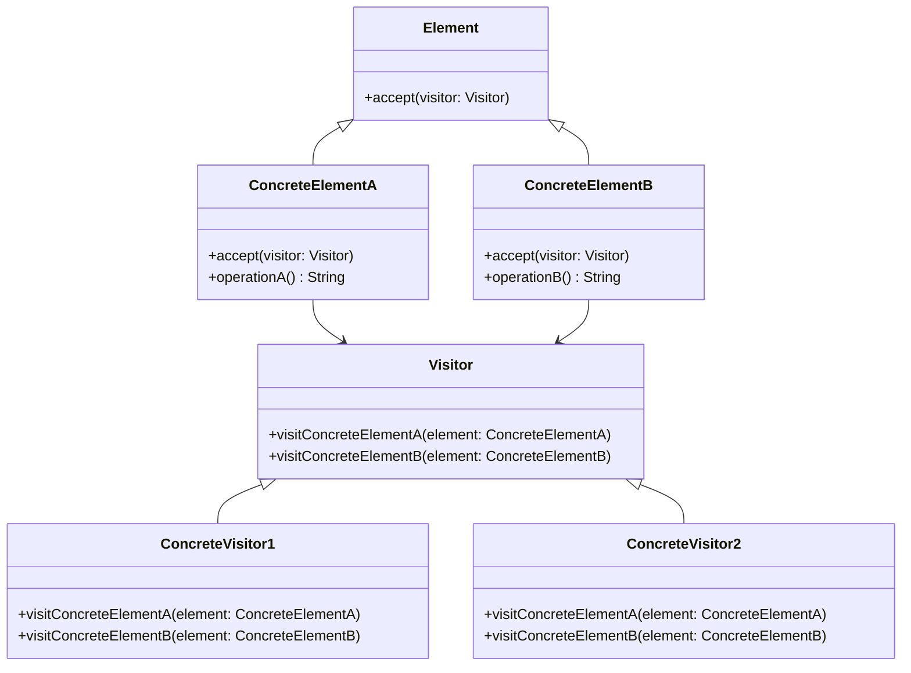

## 6.9 Visitor Design Pattern

The Visitor Design Pattern is a powerful tool in the arsenal of a Swift developer, particularly when dealing with complex object structures. It allows you to add new operations to existing object structures without modifying the structures themselves. This pattern is particularly useful when you need to perform various unrelated operations across a set of objects.

### Intent

The primary intent of the Visitor Design Pattern is to separate algorithms from the objects on which they operate. By doing so, you can add new operations without altering the classes of the elements on which it operates. This separation of concerns promotes flexibility and scalability in your codebase.

### Key Concepts

Before diving into the implementation, let's break down the key components of the Visitor Design Pattern in Swift:

- **Element Protocol**: This protocol defines an `accept` method that takes a visitor as an argument. Concrete elements implement this protocol.
  
- **Visitor Protocol**: This protocol declares a set of visit methods, one for each type of concrete element in the object structure.

- **Concrete Visitors**: These are classes that implement the visitor protocol and define specific operations to be performed on each type of element.

- **Double Dispatch**: This is a technique used to achieve polymorphic behavior by passing the visitor to the element's `accept` method, allowing the visitor to perform the correct operation based on the element's type.

### Implementing Visitor in Swift

Let's walk through a step-by-step implementation of the Visitor Design Pattern in Swift.

#### Step 1: Define the Element Protocol

The `Element` protocol will require an `accept` method that takes a visitor.

```swift
protocol Element {
    func accept(visitor: Visitor)
}
```

#### Step 2: Define the Visitor Protocol

The `Visitor` protocol will declare methods for each type of element. Each method will define the operation to be performed on the corresponding element.

```swift
protocol Visitor {
    func visitConcreteElementA(element: ConcreteElementA)
    func visitConcreteElementB(element: ConcreteElementB)
}
```

#### Step 3: Implement Concrete Elements

Concrete elements will implement the `Element` protocol and the `accept` method.

```swift
class ConcreteElementA: Element {
    func accept(visitor: Visitor) {
        visitor.visitConcreteElementA(element: self)
    }
    
    func operationA() -> String {
        return "ConcreteElementA"
    }
}

class ConcreteElementB: Element {
    func accept(visitor: Visitor) {
        visitor.visitConcreteElementB(element: self)
    }
    
    func operationB() -> String {
        return "ConcreteElementB"
    }
}
```

#### Step 4: Implement Concrete Visitors

Concrete visitors will implement the `Visitor` protocol and define specific operations for each element type.

```swift
class ConcreteVisitor1: Visitor {
    func visitConcreteElementA(element: ConcreteElementA) {
        print("ConcreteVisitor1: \\(element.operationA())")
    }
    
    func visitConcreteElementB(element: ConcreteElementB) {
        print("ConcreteVisitor1: \\(element.operationB())")
    }
}

class ConcreteVisitor2: Visitor {
    func visitConcreteElementA(element: ConcreteElementA) {
        print("ConcreteVisitor2: \\(element.operationA())")
    }
    
    func visitConcreteElementB(element: ConcreteElementB) {
        print("ConcreteVisitor2: \\(element.operationB())")
    }
}
```

#### Step 5: Client Code

The client code will create instances of elements and visitors, and then execute the visitor operations.

```swift
let elements: [Element] = [ConcreteElementA(), ConcreteElementB()]

let visitor1 = ConcreteVisitor1()
let visitor2 = ConcreteVisitor2()

for element in elements {
    element.accept(visitor: visitor1)
    element.accept(visitor: visitor2)
}
```

### Visualizing the Visitor Pattern

To better understand the Visitor Design Pattern, let's visualize it using a class diagram.



### Use Cases and Examples

The Visitor Design Pattern is versatile and can be applied in various scenarios:

- **AST Traversal**: In compilers, the Visitor Pattern is used to traverse abstract syntax trees (AST) and perform operations like code generation or optimization.

- **Serializers**: Transforming object structures into different formats, such as JSON or XML, can be achieved using visitors.

- **Calculations**: Performing operations like totaling or averaging over elements in a collection.

### Design Considerations

When considering the use of the Visitor Design Pattern, keep the following in mind:

- **When to Use**: Use the Visitor Pattern when you have a complex object structure and need to perform various unrelated operations on it. It's particularly useful when these operations are likely to change frequently.

- **Drawbacks**: The pattern can be cumbersome if you frequently add new element types, as this requires updating all visitor implementations.

- **Performance**: Double dispatch can introduce performance overhead, so consider this when performance is a critical concern.

### Swift Unique Features

Swift's protocol-oriented programming paradigm aligns well with the Visitor Design Pattern. By leveraging protocols, you can achieve a clean and flexible implementation. Additionally, Swift's strong type system ensures type safety throughout the pattern's implementation.

### Differences and Similarities

The Visitor Design Pattern is often confused with the Strategy Pattern. While both involve defining a set of operations, the Visitor Pattern focuses on operations across a set of elements, whereas the Strategy Pattern encapsulates an algorithm within a single context.

### Try It Yourself

Now that we've covered the Visitor Design Pattern, try modifying the code examples to add a new element type or visitor. Experiment with different operations and see how the pattern adapts to these changes.

### Knowledge Check

Before we wrap up, let's reinforce what we've learned with a few questions:

1. What is the primary intent of the Visitor Design Pattern?
2. How does the Visitor Pattern achieve double dispatch?
3. What are some common use cases for the Visitor Pattern?
4. What are the key components of the Visitor Pattern in Swift?

## Quiz Time!



### What is the primary intent of the Visitor Design Pattern?

- [x] To separate algorithms from the objects on which they operate.
- [ ] To encapsulate a group of individual factories.
- [ ] To provide a way to access the elements of an aggregate object sequentially.
- [ ] To define a family of algorithms and make them interchangeable.

> **Explanation:** The Visitor Design Pattern's primary intent is to separate algorithms from the objects on which they operate, allowing new operations to be added without altering the object structure.

### How does the Visitor Pattern achieve double dispatch?

- [x] By passing the visitor to the element's accept method.
- [ ] By using a factory method to create visitor instances.
- [ ] By employing a singleton pattern for visitor management.
- [ ] By utilizing a chain of responsibility to delegate operations.

> **Explanation:** Double dispatch is achieved by passing the visitor to the element's accept method, allowing the visitor to perform the correct operation based on the element's type.

### What are some common use cases for the Visitor Pattern?

- [x] AST Traversal, Serializers, Calculations
- [ ] UI Rendering, Database Access, Logging
- [ ] Network Communication, Error Handling, Caching
- [ ] Authentication, Authorization, Encryption

> **Explanation:** Common use cases for the Visitor Pattern include AST Traversal, Serializers, and Calculations, where operations are performed on complex object structures.

### What are the key components of the Visitor Pattern in Swift?

- [x] Element Protocol, Visitor Protocol, Concrete Visitors, Concrete Elements
- [ ] Singleton Class, Factory Method, Abstract Factory, Concrete Products
- [ ] Context, Strategy Interface, Concrete Strategies
- [ ] Subject, Observer Interface, Concrete Observers

> **Explanation:** The key components of the Visitor Pattern in Swift include the Element Protocol, Visitor Protocol, Concrete Visitors, and Concrete Elements.

### Which of the following is a drawback of the Visitor Pattern?

- [x] It can be cumbersome if you frequently add new element types.
- [ ] It requires a global point of access to the elements.
- [ ] It increases the number of subclasses in the system.
- [ ] It limits the flexibility of the object structure.

> **Explanation:** A drawback of the Visitor Pattern is that it can become cumbersome if you frequently add new element types, as this requires updating all visitor implementations.

### What is double dispatch in the context of the Visitor Pattern?

- [x] A technique to achieve polymorphic behavior by passing the visitor to the element's accept method.
- [ ] A method to ensure thread safety in concurrent environments.
- [ ] A pattern to optimize memory usage in large applications.
- [ ] A strategy to manage dependencies between different modules.

> **Explanation:** Double dispatch is a technique used to achieve polymorphic behavior by passing the visitor to the element's accept method, allowing the visitor to perform the correct operation based on the element's type.

### Which Swift feature enhances the implementation of the Visitor Pattern?

- [x] Protocol-oriented programming
- [ ] Automatic Reference Counting (ARC)
- [ ] Optionals and Safe Unwrapping
- [ ] SwiftUI's declarative syntax

> **Explanation:** Swift's protocol-oriented programming paradigm enhances the implementation of the Visitor Pattern by allowing clean and flexible code through protocols.

### How does the Visitor Pattern differ from the Strategy Pattern?

- [x] Visitor focuses on operations across a set of elements, while Strategy encapsulates an algorithm within a single context.
- [ ] Visitor is used for creating families of related objects, while Strategy is used for object creation.
- [ ] Visitor is a creational pattern, while Strategy is a structural pattern.
- [ ] Visitor is used for managing object lifecycles, while Strategy is used for managing object states.

> **Explanation:** The Visitor Pattern focuses on operations across a set of elements, whereas the Strategy Pattern encapsulates an algorithm within a single context.

### What is a common performance consideration when using the Visitor Pattern?

- [x] Double dispatch can introduce performance overhead.
- [ ] It requires excessive memory allocation.
- [ ] It leads to increased network latency.
- [ ] It complicates error handling mechanisms.

> **Explanation:** A common performance consideration when using the Visitor Pattern is that double dispatch can introduce performance overhead.

### True or False: The Visitor Pattern allows you to add new operations without altering the classes of the elements on which it operates.

- [x] True
- [ ] False

> **Explanation:** True. The Visitor Pattern allows you to add new operations without altering the classes of the elements on which it operates, promoting flexibility and scalability.



Remember, mastering the Visitor Design Pattern is just one step in your journey to becoming a proficient Swift developer. Keep experimenting, stay curious, and enjoy the process of learning and applying design patterns in your projects!


