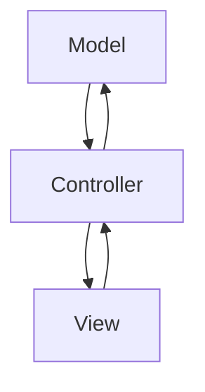

## 7.1 MVC (Model-View-Controller) in iOS Development

The Model-View-Controller (MVC) design pattern is a foundational architectural pattern in iOS development. It provides a systematic way to separate concerns in your application, making your code more organized and maintainable. In this section, we'll explore the MVC pattern in depth, focusing on its implementation in Swift for iOS development.

### Intent

The primary intent of the MVC pattern is to separate an application into three interconnected components: Model, View, and Controller. This separation helps in organizing code, managing complexity, and separating responsibilities, which leads to more scalable and maintainable applications.

### Implementing MVC in Swift

Let's break down each component of the MVC pattern and see how they fit together in an iOS application.

#### Model

The Model represents the data and business logic of your application. It is responsible for managing the data, performing operations on it, and notifying the controller of any changes. The Model should be independent of the user interface, allowing it to be reused across different views or even applications.

```swift
import Foundation

// Define a simple data model
class User {
    var name: String
    var age: Int
    
    init(name: String, age: Int) {
        self.name = name
        self.age = age
    }
}

// Example of business logic
class UserManager {
    private var users: [User] = []
    
    func addUser(_ user: User) {
        users.append(user)
    }
    
    func getUser(at index: Int) -> User? {
        guard index < users.count else { return nil }
        return users[index]
    }
}
```

In this example, the `User` class represents a data model, while `UserManager` encapsulates the business logic for managing users.

#### View

The View is responsible for presenting the data to the user and capturing user input. In iOS development, views are typically represented by `UIView` or its subclasses. The View should be passive, meaning it should not contain any business logic or data manipulation code.

```swift
import UIKit

// Define a custom view
class UserView: UIView {
    private let nameLabel = UILabel()
    private let ageLabel = UILabel()
    
    override init(frame: CGRect) {
        super.init(frame: frame)
        setupView()
    }
    
    required init?(coder: NSCoder) {
        super.init(coder: coder)
        setupView()
    }
    
    private func setupView() {
        addSubview(nameLabel)
        addSubview(ageLabel)
        // Layout code here
    }
    
    func updateView(name: String, age: Int) {
        nameLabel.text = "Name: \\(name)"
        ageLabel.text = "Age: \\(age)"
    }
}
```

Here, `UserView` is a custom view that displays a user's name and age. It provides a method `updateView` to update the UI with new data.

#### Controller

The Controller acts as an intermediary between the Model and the View. It handles user input, updates the Model, and refreshes the View. In iOS, controllers are often represented by `UIViewController` subclasses.

```swift
import UIKit

class UserController: UIViewController {
    private let userManager = UserManager()
    private let userView = UserView()
    
    override func viewDidLoad() {
        super.viewDidLoad()
        view.addSubview(userView)
        // Layout code here
        
        // Simulate adding a user and updating the view
        let user = User(name: "Alice", age: 30)
        userManager.addUser(user)
        if let firstUser = userManager.getUser(at: 0) {
            userView.updateView(name: firstUser.name, age: firstUser.age)
        }
    }
}
```

In this example, `UserController` manages the interaction between the `UserManager` and `UserView`. It updates the view with data from the model and responds to user actions.

### Communication Flow

Understanding the communication flow in MVC is crucial for implementing the pattern effectively:

- **Controller to View**: The controller updates the view with data from the model.
- **View to Controller**: The view notifies the controller of user actions, such as button taps or text input.
- **Controller to Model**: The controller manipulates the model based on user input or other events.
- **Model to Controller**: The model notifies the controller of any changes, often using delegation or notification patterns.

### Use Cases and Examples

#### Standard iOS Applications

MVC is suitable for simple to moderately complex applications. It is the default pattern used in many iOS projects due to its straightforward structure and integration with UIKit.

#### Rapid Development

Using Storyboards and Interface Builder, you can quickly set up the View component, allowing for rapid prototyping and development.

#### UIKit-Centric Apps

MVC is particularly effective when using UIKit components directly. It leverages the natural division of responsibilities provided by `UIView` and `UIViewController`.

### Visualizing MVC in iOS

To better understand the MVC pattern, let's visualize the communication flow between its components using a diagram.



**Diagram Description**: This diagram illustrates the communication flow in the MVC pattern. The Controller acts as the mediator between the Model and the View, updating the View with data from the Model and responding to user actions from the View.

### Design Considerations

While MVC is a powerful pattern, it's essential to be aware of some design considerations:

- **View-Controller Coupling**: In traditional MVC implementations, the View and Controller are often tightly coupled, which can lead to challenges in testing and reusability.
- **Massive View Controller**: A common anti-pattern in MVC is the "Massive View Controller," where the controller becomes bloated with logic. This can be mitigated by delegating responsibilities to other classes or using other patterns like MVVM or VIPER.
- **Testing**: Since the Controller often contains business logic, it can be challenging to test without a proper separation of concerns.

### Swift Unique Features

Swift offers several features that can enhance the MVC pattern:

- **Protocol-Oriented Programming**: Use protocols to define interfaces for your models and views, promoting loose coupling and testability.
- **Extensions**: Leverage extensions to add functionality to your View and Controller without subclassing.
- **Generics**: Use generics to create reusable components that work with any data type.

```swift
protocol UpdatableView {
    func updateView<T>(with data: T)
}

extension UserView: UpdatableView {
    func updateView<T>(with data: T) {
        if let user = data as? User {
            nameLabel.text = "Name: \\(user.name)"
            ageLabel.text = "Age: \\(user.age)"
        }
    }
}
```

### Differences and Similarities

MVC is often compared to other architectural patterns like MVVM (Model-View-ViewModel) and VIPER (View-Interactor-Presenter-Entity-Router). While all these patterns aim to separate concerns, they differ in how they structure the application and handle communication:

- **MVC**: Simple and straightforward, but can lead to bloated controllers.
- **MVVM**: Introduces a ViewModel to handle presentation logic, reducing the controller's responsibilities.
- **VIPER**: Highly modular, with each component having a specific role, making it suitable for large and complex applications.

### Try It Yourself

To get hands-on experience with MVC, try modifying the code examples provided:

1. **Add a New Property**: Extend the `User` model to include an email address. Update the `UserView` to display this new property.
2. **Handle User Input**: Add a text field and button to the `UserView` to allow users to input and save a new user's name and age.
3. **Implement Notifications**: Use `NotificationCenter` to notify the `UserController` of changes in the `UserManager`.

### Knowledge Check

Before moving on, let's summarize the key points:

- MVC separates an application into Model, View, and Controller components.
- The Model handles data and business logic, the View presents data, and the Controller manages interactions.
- MVC is suitable for simple to moderately complex iOS applications.
- Be mindful of the "Massive View Controller" anti-pattern and consider using other patterns for complex applications.

### Embrace the Journey

Remember, mastering MVC is just the beginning. As you progress, you'll encounter more complex patterns like MVVM and VIPER. Keep experimenting, stay curious, and enjoy the journey of building robust and scalable iOS applications!

## Quiz Time!



### What is the primary intent of the MVC pattern?

- [x] To separate an application into Model, View, and Controller components
- [ ] To integrate business logic into the View
- [ ] To simplify data storage
- [ ] To eliminate the need for user input handling

> **Explanation:** The primary intent of the MVC pattern is to separate an application into Model, View, and Controller components to organize code and separate responsibilities.

### In MVC, which component is responsible for managing data and business logic?

- [x] Model
- [ ] View
- [ ] Controller
- [ ] Router

> **Explanation:** The Model component is responsible for managing data and business logic in the MVC pattern.

### How does the Controller communicate with the View in MVC?

- [x] The Controller updates the View with data from the Model
- [ ] The View updates the Controller with data
- [ ] The Controller directly manipulates the Model
- [ ] The Model updates the Controller with user input

> **Explanation:** In MVC, the Controller updates the View with data from the Model to reflect changes.

### What is a common anti-pattern associated with MVC?

- [x] Massive View Controller
- [ ] Singleton Overuse
- [ ] God Object
- [ ] Spaghetti Code

> **Explanation:** The "Massive View Controller" is a common anti-pattern in MVC, where the controller becomes bloated with logic.

### Which Swift feature can enhance the MVC pattern by promoting loose coupling?

- [x] Protocol-Oriented Programming
- [ ] Singleton Pattern
- [ ] Inheritance
- [ ] Global Variables

> **Explanation:** Protocol-Oriented Programming in Swift can promote loose coupling and enhance the MVC pattern.

### What is the role of the View in MVC?

- [x] To present data to the user and capture user input
- [ ] To manage data and business logic
- [ ] To handle user input and update the Model
- [ ] To directly manipulate the Model

> **Explanation:** The View in MVC is responsible for presenting data to the user and capturing user input.

### Which pattern introduces a ViewModel to handle presentation logic?

- [x] MVVM
- [ ] MVC
- [ ] VIPER
- [ ] Singleton

> **Explanation:** MVVM introduces a ViewModel to handle presentation logic, reducing the controller's responsibilities.

### What is a benefit of using MVC in iOS development?

- [x] It provides a systematic way to separate concerns
- [ ] It eliminates the need for user input handling
- [ ] It simplifies data storage
- [ ] It allows for direct manipulation of the Model by the View

> **Explanation:** MVC provides a systematic way to separate concerns, organizing code and managing complexity.

### Which component in MVC should be independent of the user interface?

- [x] Model
- [ ] View
- [ ] Controller
- [ ] Router

> **Explanation:** The Model should be independent of the user interface, allowing it to be reused across different views.

### True or False: In MVC, the View should contain business logic.

- [ ] True
- [x] False

> **Explanation:** False. In MVC, the View should be passive and not contain any business logic or data manipulation code.




