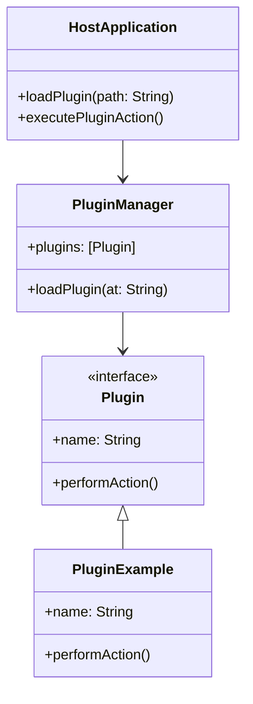

## 7.10 Plugin Architecture

In modern software development, flexibility and scalability are paramount. The Plugin Architecture is a powerful design pattern that allows developers to extend an application's capabilities by adding external modules, or plugins, without altering the core functionality. This approach is particularly beneficial in Swift, where applications often need to adapt to diverse user needs and rapidly changing environments.

### Intent

The primary intent of the Plugin Architecture is to enable the extension of an application's features dynamically. This is achieved by loading external modules at runtime, which can introduce new functionalities or modify existing ones. This architecture is particularly useful in scenarios where applications need to be customizable or where new features must be integrated seamlessly without redeploying the entire application.

### Implementing Plugin Architecture in Swift

Implementing a Plugin Architecture in Swift involves several key components and considerations:

#### Plugin Protocols

The first step in creating a plugin system is to define a set of protocols that plugins must conform to. These protocols act as contracts, ensuring that all plugins provide a consistent interface for interaction with the host application.

```swift
protocol Plugin {
    var name: String { get }
    func performAction()
}
```

In this example, the `Plugin` protocol requires each plugin to have a `name` property and a `performAction` method. This ensures that the host application can interact with any plugin in a consistent manner.

#### Dynamic Loading

Dynamic loading is the process of loading plugins at runtime. In Swift, this can be achieved using dynamic libraries. However, this approach requires careful consideration, especially on iOS, due to platform restrictions.

```swift
import Foundation

class PluginManager {
    private var plugins: [Plugin] = []
    
    func loadPlugin(at path: String) {
        guard let bundle = Bundle(path: path) else { return }
        bundle.load()
        
        if let principalClass = bundle.principalClass as? Plugin.Type {
            let plugin = principalClass.init()
            plugins.append(plugin)
        }
    }
}
```

In this code snippet, the `PluginManager` class is responsible for loading plugins from a specified path. It uses the `Bundle` class to dynamically load the plugin, ensuring that the plugin conforms to the `Plugin` protocol.

#### Communication

Once plugins are loaded, they need to communicate with the host application. This can be achieved using messaging or event systems, which allow plugins to send and receive information without tightly coupling them to the host application.

```swift
protocol PluginCommunication {
    func sendMessage(_ message: String)
    func receiveMessage() -> String
}

class PluginExample: Plugin, PluginCommunication {
    var name: String = "ExamplePlugin"
    
    func performAction() {
        print("Performing action in \\(name)")
    }
    
    func sendMessage(_ message: String) {
        print("Sending message: \\(message)")
    }
    
    func receiveMessage() -> String {
        return "Received message"
    }
}
```

Here, the `PluginExample` class implements both the `Plugin` and `PluginCommunication` protocols, allowing it to perform actions and communicate with the host application.

#### Security and Sandbox

Security is a critical consideration when implementing a Plugin Architecture. Plugins should operate within a sandboxed environment to prevent them from compromising the host application. This involves setting strict permissions and ensuring that plugins cannot access sensitive data or perform unauthorized actions.

### Use Cases and Examples

The Plugin Architecture is widely used across various domains. Here are a few examples:

#### IDE Extensions

Integrated Development Environments (IDEs) often use plugins to add new functionalities, such as language support, code analysis tools, or custom themes. This allows developers to tailor the IDE to their specific needs.

#### Media Players

Media players can use plugins to support new formats or add features like visualizations and effects. This enables users to enhance their media experience without changing the core player.

#### Enterprise Applications

In enterprise applications, the Plugin Architecture allows for the customization of features based on client needs. This can include adding new reporting tools, integrating with third-party services, or modifying user interfaces.

### Visualizing Plugin Architecture

To better understand the Plugin Architecture, let's visualize its components and interactions.



**Diagram Description:** This class diagram illustrates the relationship between the `HostApplication`, `PluginManager`, and `Plugin` classes. The `PluginExample` class implements the `Plugin` interface, demonstrating how plugins are structured within the architecture.

### Design Considerations

When implementing a Plugin Architecture in Swift, consider the following:

- **Compatibility**: Ensure that plugins are compatible with the host application's version and dependencies.
- **Performance**: Loading and executing plugins should not degrade the application's performance.
- **Security**: Implement robust security measures to prevent malicious plugins from compromising the application.
- **Testing**: Thoroughly test plugins to ensure they function correctly and do not introduce bugs.

### Swift Unique Features

Swift offers several unique features that can enhance the Plugin Architecture:

- **Protocols and Extensions**: Use Swift's powerful protocol and extension system to define flexible and reusable plugin interfaces.
- **Type Safety**: Leverage Swift's type safety to ensure that plugins conform to expected interfaces and behaviors.
- **Concurrency**: Utilize Swift's concurrency features, such as async/await, to manage plugin execution efficiently.

### Differences and Similarities

The Plugin Architecture shares similarities with other design patterns, such as the Strategy and Observer patterns. However, it is distinct in its focus on dynamically extending application capabilities through external modules. Unlike the Strategy pattern, which involves selecting algorithms at runtime, the Plugin Architecture involves loading and integrating separate modules. Similarly, while the Observer pattern focuses on event-driven communication, the Plugin Architecture encompasses a broader scope of functionality extension.

### Try It Yourself

To experiment with the Plugin Architecture, try modifying the `Plugin` protocol to include additional methods or properties. Implement new plugins that extend the application's capabilities, and test how they interact with the host application. Consider implementing a simple messaging system to facilitate communication between plugins and the host.

### References and Links

For further reading on Plugin Architecture and related concepts, consider the following resources:

- [Apple Developer Documentation: Bundles and Packages](https://developer.apple.com/documentation/foundation/bundle)
- [Swift.org: Protocols](https://swift.org/documentation/#protocols)
- [Medium: Plugin Architecture in iOS](https://medium.com/@developer/plugin-architecture-in-ios-123456)

### Knowledge Check

- What is the primary intent of the Plugin Architecture?
- How does dynamic loading work in Swift?
- What are the key considerations for security in a Plugin Architecture?
- How can plugins communicate with the host application?
- What are some common use cases for the Plugin Architecture?

### Embrace the Journey

Remember, mastering the Plugin Architecture is an ongoing journey. As you explore and implement this pattern, you'll discover new ways to enhance your applications' flexibility and scalability. Keep experimenting, stay curious, and enjoy the process of creating dynamic and adaptable software solutions.

## Quiz Time!



### What is the primary intent of the Plugin Architecture?

- [x] To extend an application's capabilities without modifying its core functionalities
- [ ] To improve the performance of an application
- [ ] To simplify the application's codebase
- [ ] To enforce stricter security measures

> **Explanation:** The primary intent of the Plugin Architecture is to allow the extension of an application's capabilities without altering its core functionalities.

### Which of the following is a key component of implementing Plugin Architecture in Swift?

- [x] Plugin Protocols
- [ ] Singleton Pattern
- [ ] Factory Method
- [ ] Composite Pattern

> **Explanation:** Plugin Protocols are essential in defining the interfaces that plugins must conform to, ensuring consistent interaction with the host application.

### What is dynamic loading in the context of Plugin Architecture?

- [x] Loading plugins at runtime
- [ ] Compiling plugins into the application
- [ ] Statically linking plugins
- [ ] Using plugins only during development

> **Explanation:** Dynamic loading refers to the process of loading plugins at runtime, allowing for flexible extension of application capabilities.

### How can plugins communicate with the host application?

- [x] Using messaging or event systems
- [ ] Directly modifying the application's code
- [ ] Through global variables
- [ ] By using static methods

> **Explanation:** Messaging or event systems facilitate communication between plugins and the host application without tight coupling.

### What is a common use case for Plugin Architecture?

- [x] IDE Extensions
- [ ] Implementing a Singleton
- [ ] Creating a new programming language
- [ ] Designing a database schema

> **Explanation:** IDE Extensions are a common use case for Plugin Architecture, allowing developers to add new functionalities to development tools.

### Which Swift feature enhances the Plugin Architecture?

- [x] Protocols and Extensions
- [ ] Global Variables
- [ ] Static Methods
- [ ] Singleton Pattern

> **Explanation:** Swift's Protocols and Extensions provide a flexible and reusable system for defining plugin interfaces.

### What is a critical security consideration in Plugin Architecture?

- [x] Ensuring plugins cannot compromise the host application
- [ ] Using only open-source plugins
- [ ] Allowing plugins to access all application data
- [ ] Disabling all security measures for plugins

> **Explanation:** Ensuring that plugins cannot compromise the host application is crucial for maintaining security in a Plugin Architecture.

### What is a difference between Plugin Architecture and Strategy Pattern?

- [x] Plugin Architecture involves loading external modules
- [ ] Strategy Pattern focuses on event-driven communication
- [ ] Plugin Architecture is used for data storage
- [ ] Strategy Pattern is used for UI design

> **Explanation:** Plugin Architecture involves loading external modules to extend application capabilities, whereas the Strategy Pattern involves selecting algorithms at runtime.

### What is a benefit of using Swift's type safety in Plugin Architecture?

- [x] Ensuring plugins conform to expected interfaces
- [ ] Allowing plugins to modify core application code
- [ ] Simplifying the application's codebase
- [ ] Reducing the need for testing

> **Explanation:** Swift's type safety ensures that plugins conform to expected interfaces and behaviors, enhancing reliability.

### True or False: Plugins should operate within a sandboxed environment to ensure security.

- [x] True
- [ ] False

> **Explanation:** Operating plugins within a sandboxed environment is essential to prevent them from compromising the host application.




