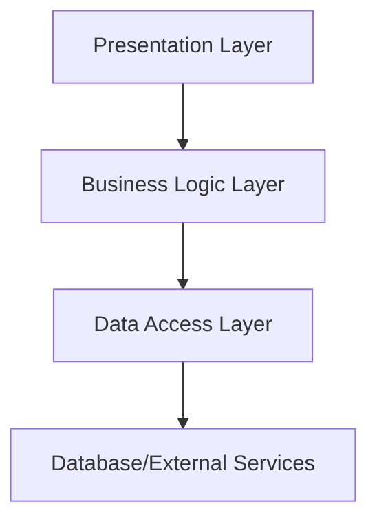

## 7.11 Layered Architecture

In the realm of software development, creating applications that are both robust and maintainable is a constant challenge. One architectural pattern that aids in achieving these goals is the **Layered Architecture**. This pattern involves dividing an application into distinct layers, each with specific responsibilities, and defining clear communication protocols between them. By doing so, developers can ensure a clean separation of concerns, making the application easier to manage and evolve over time.

### Intent

The primary intent of the Layered Architecture is to separate concerns within an application by organizing it into layers, each responsible for a specific aspect of the functionality. This separation allows for more manageable codebases, easier testing, and the ability to assign different teams to work on different layers independently.

### Implementing Layered Architecture in Swift

Implementing a Layered Architecture in Swift involves defining several key layers, each with a distinct role. These layers typically include:

#### Presentation Layer

The Presentation Layer is responsible for the user interface and user interaction logic. In an iOS application, this layer would encompass all the views, view controllers, and UI elements that the user interacts with.

```swift
import UIKit

class UserViewController: UIViewController {
    var viewModel: UserViewModel!

    override func viewDidLoad() {
        super.viewDidLoad()
        setupUI()
        viewModel.fetchUserData()
    }

    private func setupUI() {
        // Set up the user interface
    }

    func updateUI(with user: User) {
        // Update the UI with user data
    }
}
```

#### Business Logic Layer

The Business Logic Layer handles operations, calculations, and decision-making processes. This layer is where the core functionality of the application resides, processing data and executing business rules.

```swift
class UserViewModel {
    var userService: UserService

    init(userService: UserService) {
        self.userService = userService
    }

    func fetchUserData() {
        userService.getUser { user in
            // Process user data and update the presentation layer
        }
    }
}
```

#### Data Access Layer

The Data Access Layer is responsible for interacting with databases or other data sources. It encapsulates the logic for data retrieval and storage, ensuring that the rest of the application remains agnostic to the specifics of data management.

```swift
class UserService {
    func getUser(completion: @escaping (User) -> Void) {
        // Fetch user data from a database or network
    }
}
```

#### Cross-Layer Communication

Communication between layers should be well-defined and limited to specific interfaces or protocols. This ensures that each layer remains independent and can be modified without affecting others.

```swift
protocol UserServiceProtocol {
    func getUser(completion: @escaping (User) -> Void)
}

class UserService: UserServiceProtocol {
    func getUser(completion: @escaping (User) -> Void) {
        // Implementation
    }
}
```

#### Separation of Concerns

Each layer in a layered architecture should only know about the layer directly below or above it. This separation of concerns makes it easier to isolate changes to a specific layer without impacting the entire system.

### Use Cases and Examples

Layered Architecture is particularly useful in scenarios such as:

- **Enterprise Systems**: Applications that handle complex operations and data management can benefit from the clear separation of responsibilities.
- **Maintainability**: By isolating changes to specific layers, developers can more easily update and maintain the application over time.
- **Team Division**: Different teams can manage different layers, allowing for parallel development and specialization.

### Visualizing Layered Architecture

To better understand how these layers interact, let's visualize the Layered Architecture using a diagram:



**Diagram Description**: This diagram illustrates the communication flow in a Layered Architecture. The Presentation Layer interacts with the Business Logic Layer, which in turn communicates with the Data Access Layer. The Data Access Layer interfaces with databases or external services.

### Swift Unique Features

Swift offers several unique features that enhance the implementation of a Layered Architecture:

- **Protocols and Protocol Extensions**: Swift's protocol-oriented programming allows for defining clear interfaces between layers, promoting loose coupling and flexibility.
- **Value Types**: Using structs for data models in the Data Access Layer can help ensure immutability and thread safety.
- **Error Handling**: Swift's robust error handling mechanisms enable graceful error propagation between layers.

### Design Considerations

When implementing a Layered Architecture, consider the following:

- **Layer Granularity**: Determine the appropriate level of granularity for each layer based on the application's complexity and requirements.
- **Performance**: Be mindful of potential performance overhead due to layer separation and ensure efficient communication between layers.
- **Testing**: Design layers with testability in mind, using dependency injection and mock objects to facilitate unit testing.

### Differences and Similarities

Layered Architecture is often compared to other architectural patterns such as MVC (Model-View-Controller) and MVVM (Model-View-ViewModel). While all these patterns aim to separate concerns, Layered Architecture is more focused on dividing the application into horizontal layers, whereas MVC and MVVM emphasize the separation of UI and business logic.

### Try It Yourself

To gain a deeper understanding of Layered Architecture, try modifying the code examples provided. For instance, experiment with adding a new layer for caching data or introduce a new protocol to handle error logging across layers.

### References and Links

For further reading on Layered Architecture and its applications, consider exploring the following resources:

- [Martin Fowler's Patterns of Enterprise Application Architecture](https://martinfowler.com/books/eaa.html)
- [Swift.org Documentation](https://swift.org/documentation/)

### Knowledge Check

To reinforce your understanding of Layered Architecture, consider the following questions:

- What are the benefits of separating an application into layers?
- How does Swift's protocol-oriented programming enhance Layered Architecture?
- What are some potential challenges when implementing a Layered Architecture?

### Embrace the Journey

Remember, mastering architectural patterns like Layered Architecture is a journey. As you continue to build and refine your Swift applications, keep experimenting, stay curious, and enjoy the process of creating robust and maintainable software.

## Quiz Time!



### What is the primary intent of Layered Architecture?

- [x] To separate concerns within an application by organizing it into layers.
- [ ] To enhance the user interface of an application.
- [ ] To reduce the number of lines of code.
- [ ] To increase the complexity of the application.

> **Explanation:** The primary intent of Layered Architecture is to separate concerns within an application by organizing it into layers, each responsible for a specific aspect of the functionality.

### Which layer is responsible for user interaction logic in a Layered Architecture?

- [x] Presentation Layer
- [ ] Business Logic Layer
- [ ] Data Access Layer
- [ ] Network Layer

> **Explanation:** The Presentation Layer is responsible for the user interface and user interaction logic.

### What is the role of the Business Logic Layer?

- [x] Handling operations, calculations, and decision-making processes.
- [ ] Interacting with databases or data sources.
- [ ] Managing user interface elements.
- [ ] Establishing network connections.

> **Explanation:** The Business Logic Layer handles operations, calculations, and decision-making processes.

### How should communication between layers be defined?

- [x] Using interfaces or protocols.
- [ ] Using global variables.
- [ ] Through direct method calls.
- [ ] Using singleton patterns.

> **Explanation:** Communication between layers should be well-defined and limited to specific interfaces or protocols to ensure independence.

### What is a key benefit of the Layered Architecture pattern?

- [x] Improved maintainability and separation of concerns.
- [ ] Increased application complexity.
- [ ] Reduced performance.
- [ ] Enhanced user interface design.

> **Explanation:** A key benefit of the Layered Architecture pattern is improved maintainability and separation of concerns.

### Which Swift feature aids in defining clear interfaces between layers?

- [x] Protocols and Protocol Extensions
- [ ] Closures
- [ ] Optionals
- [ ] Enums

> **Explanation:** Swift's protocol-oriented programming allows for defining clear interfaces between layers, promoting loose coupling and flexibility.

### What should each layer in a Layered Architecture know about?

- [x] Only the layer directly below or above it.
- [ ] All other layers.
- [ ] The entire application.
- [ ] Only the Presentation Layer.

> **Explanation:** Each layer should only know about the layer directly below or above it to maintain separation of concerns.

### What is a potential challenge of implementing Layered Architecture?

- [x] Performance overhead due to layer separation.
- [ ] Increased coupling between components.
- [ ] Difficulty in testing individual layers.
- [ ] Lack of separation of concerns.

> **Explanation:** A potential challenge is the performance overhead due to layer separation and ensuring efficient communication between layers.

### What is a common use case for Layered Architecture?

- [x] Enterprise systems handling complex operations and data management.
- [ ] Simple applications with minimal functionality.
- [ ] Applications with no user interface.
- [ ] Games with real-time rendering.

> **Explanation:** Layered Architecture is particularly useful for enterprise systems handling complex operations and data management.

### True or False: Layered Architecture is focused on dividing the application into horizontal layers.

- [x] True
- [ ] False

> **Explanation:** True. Layered Architecture is focused on dividing the application into horizontal layers, each with specific responsibilities.


