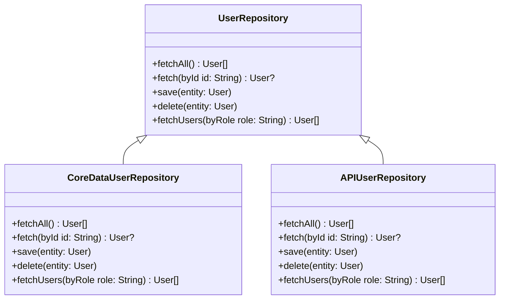

## 7.12 Repository Pattern for Data Access

In the realm of software design, the Repository Pattern serves as a mediator between the domain and data mapping layers, acting as a central hub for data access logic. This pattern is particularly useful in Swift development for iOS, macOS, and server-side applications, where data sources can range from local databases like Core Data and Realm to remote APIs. By implementing the Repository Pattern, we can achieve a clean separation of concerns, making our codebase more maintainable and testable.

### Intent

The primary intent of the Repository Pattern is to provide a consistent way to access data sources while centralizing business logic for data retrieval and storage. This approach abstracts the complexities of data access, allowing developers to focus on the business logic without worrying about the specifics of data storage.

### Implementing Repository in Swift

Implementing the Repository Pattern in Swift involves several key components: defining repository protocols, creating concrete repositories, and ensuring abstraction for clients. Let's explore each of these components in detail.

#### Repository Protocols

The first step in implementing the Repository Pattern is to define protocols that outline the data operations required by the application. These protocols serve as interfaces that specify the methods for data retrieval and storage without dictating how these operations are performed.

```swift
// Define a protocol for a generic repository
protocol Repository {
    associatedtype Entity
    func fetchAll() -> [Entity]
    func fetch(byId id: String) -> Entity?
    func save(entity: Entity)
    func delete(entity: Entity)
}

// Example of a specific repository protocol for User data
protocol UserRepository: Repository where Entity == User {
    func fetchUsers(byRole role: String) -> [User]
}
```

In the above code, the `Repository` protocol uses an associated type `Entity` to represent the type of data it handles. The `UserRepository` protocol extends `Repository` with a specific `Entity` type, `User`, and adds a method to fetch users by role.

#### Concrete Repositories

Concrete repositories implement the data access logic for specific data sources. These implementations can vary depending on whether the data source is a local database, a network API, or another storage mechanism.

```swift
// Concrete implementation of UserRepository using Core Data
class CoreDataUserRepository: UserRepository {
    func fetchAll() -> [User] {
        // Core Data fetch logic
    }

    func fetch(byId id: String) -> User? {
        // Core Data fetch by ID logic
    }

    func save(entity: User) {
        // Core Data save logic
    }

    func delete(entity: User) {
        // Core Data delete logic
    }

    func fetchUsers(byRole role: String) -> [User] {
        // Core Data fetch users by role logic
    }
}
```

In this example, `CoreDataUserRepository` provides a concrete implementation of the `UserRepository` protocol using Core Data. Each method contains the specific logic required to interact with the Core Data framework.

#### Abstraction

One of the key benefits of the Repository Pattern is abstraction. Clients interact with the repository interface, remaining unaware of the underlying data source. This abstraction allows developers to swap data sources without altering the business logic.

```swift
// Client code using the UserRepository
class UserService {
    private let userRepository: UserRepository

    init(userRepository: UserRepository) {
        self.userRepository = userRepository
    }

    func getAllUsers() -> [User] {
        return userRepository.fetchAll()
    }

    func getUser(byId id: String) -> User? {
        return userRepository.fetch(byId: id)
    }
}
```

In the `UserService` class, we inject a `UserRepository` into the initializer, allowing the service to operate on any repository that conforms to the `UserRepository` protocol. This design enables flexibility and testability.

#### Unit of Work Pattern

The Repository Pattern can be combined with the Unit of Work Pattern to manage transactions and ensure data consistency. The Unit of Work Pattern tracks changes to objects during a transaction and ensures that all changes are committed as a single unit.

```swift
// Define a Unit of Work protocol
protocol UnitOfWork {
    func commit()
    func rollback()
}

// Example implementation of a Unit of Work with Core Data
class CoreDataUnitOfWork: UnitOfWork {
    private let context: NSManagedObjectContext

    init(context: NSManagedObjectContext) {
        self.context = context
    }

    func commit() {
        do {
            try context.save()
        } catch {
            context.rollback()
        }
    }

    func rollback() {
        context.rollback()
    }
}
```

In this example, `CoreDataUnitOfWork` manages transactions for a Core Data context, providing methods to commit or rollback changes.

### Use Cases and Examples

The Repository Pattern is versatile and can be applied in various scenarios. Let's explore some common use cases and examples.

#### Testing

Mock repositories can be used for unit testing, allowing developers to test business logic without relying on actual data sources.

```swift
// Mock implementation of UserRepository for testing
class MockUserRepository: UserRepository {
    private var users: [User] = []

    func fetchAll() -> [User] {
        return users
    }

    func fetch(byId id: String) -> User? {
        return users.first { $0.id == id }
    }

    func save(entity: User) {
        users.append(entity)
    }

    func delete(entity: User) {
        users.removeAll { $0.id == entity.id }
    }

    func fetchUsers(byRole role: String) -> [User] {
        return users.filter { $0.role == role }
    }
}
```

By using `MockUserRepository`, we can test the `UserService` class without needing a real database, ensuring that our tests are fast and reliable.

#### Swap Data Sources

The Repository Pattern allows developers to change data sources without altering business logic. For example, switching from local storage to a remote API can be achieved by implementing a new repository that conforms to the existing protocol.

```swift
// Concrete implementation of UserRepository using a network API
class APIUserRepository: UserRepository {
    func fetchAll() -> [User] {
        // Network fetch logic
    }

    func fetch(byId id: String) -> User? {
        // Network fetch by ID logic
    }

    func save(entity: User) {
        // Network save logic
    }

    func delete(entity: User) {
        // Network delete logic
    }

    func fetchUsers(byRole role: String) -> [User] {
        // Network fetch users by role logic
    }
}
```

With `APIUserRepository`, we can seamlessly switch to a network-based data source by injecting this repository into the `UserService`.

#### Maintainability

Centralizing data access logic in repositories enhances maintainability by reducing code duplication and isolating data-related changes. This approach simplifies updates and modifications to the data access layer.

### Swift Unique Features

Swift offers several unique features that enhance the implementation of the Repository Pattern. Let's highlight some of these features.

#### Protocol Extensions

Swift's protocol extensions allow us to provide default implementations for protocol methods, reducing boilerplate code.

```swift
extension UserRepository {
    func fetchUsers(byRole role: String) -> [User] {
        return fetchAll().filter { $0.role == role }
    }
}
```

In this example, we provide a default implementation for `fetchUsers(byRole:)`, allowing concrete repositories to inherit this functionality.

#### Generics

Swift's generics enable us to create flexible and reusable repository interfaces.

```swift
protocol GenericRepository {
    associatedtype Entity
    func fetchAll() -> [Entity]
    func fetch(byId id: String) -> Entity?
    func save(entity: Entity)
    func delete(entity: Entity)
}
```

By using generics, we can create a single repository interface that works with any data type.

### Design Considerations

When implementing the Repository Pattern, consider the following design considerations:

- **Complexity**: Ensure that the pattern is not overused for simple applications where direct data access might suffice.
- **Transaction Management**: Consider combining with the Unit of Work Pattern for managing transactions.
- **Performance**: Be mindful of performance implications when abstracting data access, especially with network operations.

### Differences and Similarities

The Repository Pattern is often compared to the Data Access Object (DAO) pattern. While both patterns abstract data access, the Repository Pattern is more focused on the domain model and business logic, whereas DAO is more concerned with the persistence layer.

### Visualizing the Repository Pattern

To better understand the Repository Pattern, let's visualize the flow of data access using a class diagram.



This diagram illustrates how `CoreDataUserRepository` and `APIUserRepository` both implement the `UserRepository` interface, allowing for interchangeable data access strategies.

### Try It Yourself

To deepen your understanding of the Repository Pattern, try modifying the code examples provided:

- Implement a new repository using a different data source, such as Realm or Firebase.
- Add additional methods to the `UserRepository` protocol and implement them in concrete repositories.
- Experiment with protocol extensions to provide default implementations for common methods.

### Knowledge Check

Before we conclude, let's reinforce what we've learned with some key takeaways:

- The Repository Pattern centralizes data access logic, enhancing maintainability and testability.
- Swift's protocol-oriented programming and generics make implementing the Repository Pattern efficient and flexible.
- Combining the Repository Pattern with the Unit of Work Pattern can help manage transactions and ensure data consistency.

Remember, mastering design patterns is a journey. As you continue to explore and implement these patterns, you'll gain deeper insights into building robust and scalable Swift applications. Keep experimenting, stay curious, and enjoy the journey!

## Quiz Time!



### What is the primary intent of the Repository Pattern?

- [x] To provide a consistent way to access data sources and centralize business logic for data retrieval and storage.
- [ ] To create a direct connection between the UI and the database.
- [ ] To simplify the user interface design.
- [ ] To enhance the performance of database operations.

> **Explanation:** The Repository Pattern aims to centralize data access logic and provide a consistent interface for data retrieval and storage, abstracting the complexities of the underlying data sources.

### Which Swift feature allows for default implementations of protocol methods?

- [x] Protocol Extensions
- [ ] Generics
- [ ] Closures
- [ ] Enumerations

> **Explanation:** Protocol extensions in Swift allow developers to provide default implementations for protocol methods, reducing boilerplate code.

### How does the Repository Pattern enhance testability?

- [x] By allowing the use of mock repositories for unit testing.
- [ ] By making the UI more responsive.
- [ ] By increasing the speed of database queries.
- [ ] By reducing the size of the codebase.

> **Explanation:** The Repository Pattern enhances testability by allowing developers to use mock repositories, which enable testing of business logic without relying on actual data sources.

### What is a key benefit of using generics in the Repository Pattern?

- [x] Flexibility and reusability of repository interfaces for different data types.
- [ ] Faster execution of database queries.
- [ ] Simplified user interface design.
- [ ] Enhanced security of data access.

> **Explanation:** Generics in Swift enable flexible and reusable repository interfaces that can work with any data type, making the pattern more adaptable.

### Which pattern is often combined with the Repository Pattern to manage transactions?

- [x] Unit of Work Pattern
- [ ] Singleton Pattern
- [ ] Observer Pattern
- [ ] Adapter Pattern

> **Explanation:** The Unit of Work Pattern is often combined with the Repository Pattern to manage transactions and ensure data consistency.

### What is the role of concrete repositories in the Repository Pattern?

- [x] To implement data access logic for specific data sources.
- [ ] To define the user interface layout.
- [ ] To manage application state.
- [ ] To handle user input events.

> **Explanation:** Concrete repositories implement the data access logic for specific data sources, such as databases or network APIs.

### How does the Repository Pattern aid in swapping data sources?

- [x] By abstracting the data access logic, allowing for interchangeable repositories.
- [ ] By directly connecting the UI to the new data source.
- [ ] By simplifying the database schema.
- [ ] By reducing the number of database queries.

> **Explanation:** The Repository Pattern abstracts data access logic, enabling developers to swap data sources by implementing new repositories that conform to the existing protocol.

### What is a potential design consideration when using the Repository Pattern?

- [x] Ensuring the pattern is not overused for simple applications.
- [ ] Simplifying the user interface design.
- [ ] Increasing the speed of database queries.
- [ ] Reducing the size of the codebase.

> **Explanation:** When using the Repository Pattern, it's important to consider whether it's appropriate for the application's complexity, as it may be unnecessary for simple applications.

### True or False: The Repository Pattern is primarily concerned with the persistence layer.

- [ ] True
- [x] False

> **Explanation:** The Repository Pattern is more focused on the domain model and business logic, whereas the Data Access Object (DAO) pattern is primarily concerned with the persistence layer.

### What is a key advantage of centralizing data access logic in repositories?

- [x] Enhanced maintainability by reducing code duplication.
- [ ] Faster execution of user interface updates.
- [ ] Increased security of network communications.
- [ ] Simplified user interface design.

> **Explanation:** Centralizing data access logic in repositories enhances maintainability by reducing code duplication and isolating data-related changes.




