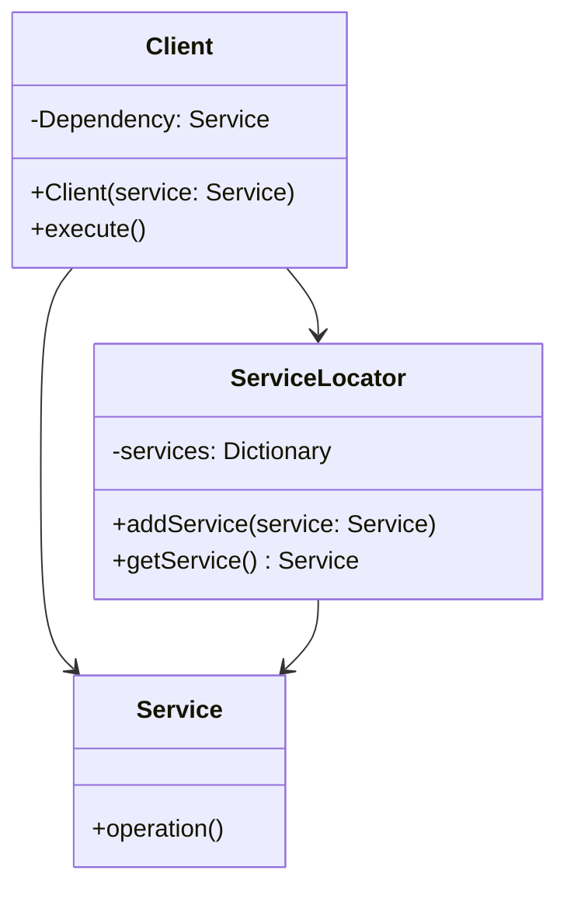

## 7.13 Dependency Injection and Service Locators

In the realm of software architecture, **Dependency Injection (DI)** and **Service Locator** patterns play pivotal roles in managing dependencies and reducing coupling between components. Understanding these patterns is crucial for building scalable, maintainable, and testable applications in Swift. Let's delve into these patterns and explore their implementations, benefits, and potential pitfalls.

### Intent

The primary intent of Dependency Injection and Service Locators is to reduce coupling by managing dependencies externally rather than having components instantiate them directly. This approach promotes flexibility and modularity, making it easier to swap out implementations and enhance testability.

### Implementing Dependency Injection in Swift

Dependency Injection is a technique where an object receives its dependencies from an external source rather than creating them internally. Swift offers several methods to implement DI, each with its own advantages and use cases.

#### Constructor Injection

Constructor Injection involves providing dependencies through an object's initializer. This method ensures that the dependencies are available when the object is created, promoting immutability and ensuring that the object is fully initialized.

```swift
class NetworkService {
    func fetchData() {
        // Network fetching logic
    }
}

class DataManager {
    private let networkService: NetworkService

    init(networkService: NetworkService) {
        self.networkService = networkService
    }

    func loadData() {
        networkService.fetchData()
    }
}

// Usage
let networkService = NetworkService()
let dataManager = DataManager(networkService: networkService)
dataManager.loadData()
```

**Key Points:**
- Ensures dependencies are available at initialization.
- Promotes immutability and thread safety.
- May require changes to initializers when adding new dependencies.

#### Property Injection

Property Injection involves setting dependencies via properties after the object has been initialized. This method is useful when dependencies are optional or when they need to be set after some initial configuration.

```swift
class Logger {
    func log(message: String) {
        print(message)
    }
}

class UserService {
    var logger: Logger?

    func performAction() {
        logger?.log(message: "Action performed")
    }
}

// Usage
let userService = UserService()
let logger = Logger()
userService.logger = logger
userService.performAction()
```

**Key Points:**
- Allows setting dependencies after initialization.
- Useful for optional dependencies.
- Requires careful handling to avoid uninitialized dependencies.

#### Method Injection

Method Injection involves passing dependencies as parameters to methods. This approach is suitable for temporary dependencies that are only needed during the execution of a method.

```swift
class AnalyticsService {
    func trackEvent(event: String) {
        // Event tracking logic
    }
}

class EventManager {
    func triggerEvent(analyticsService: AnalyticsService) {
        analyticsService.trackEvent(event: "UserLoggedIn")
    }
}

// Usage
let analyticsService = AnalyticsService()
let eventManager = EventManager()
eventManager.triggerEvent(analyticsService: analyticsService)
```

**Key Points:**
- Suitable for temporary or infrequently used dependencies.
- Keeps method signatures explicit.
- Can lead to cluttered method signatures with multiple dependencies.

#### Frameworks and Custom Containers

In complex applications, managing dependencies manually can become cumbersome. Dependency Injection frameworks or custom containers can help automate this process by providing a centralized way to manage object lifecycles and dependencies.

Popular DI frameworks for Swift include **Swinject** and **Needle**. These frameworks offer features like automatic dependency resolution, scopes, and lifecycle management.

**Example with Swinject:**

```swift
import Swinject

let container = Container()

container.register(NetworkService.self) { _ in NetworkService() }
container.register(DataManager.self) { r in
    DataManager(networkService: r.resolve(NetworkService.self)!)
}

let dataManager = container.resolve(DataManager.self)!
dataManager.loadData()
```

**Key Points:**
- Automates dependency management.
- Supports scopes and lifecycle management.
- May introduce additional complexity and learning curve.

### Service Locator Pattern

The Service Locator pattern provides a centralized registry for objects and services, allowing components to access them without direct injection. While this pattern can simplify access to services, it has been criticized for hiding dependencies and making testing harder.

#### Implementation

A Service Locator typically involves a singleton or static class that holds references to services and provides methods to retrieve them.

```swift
class ServiceLocator {
    static let shared = ServiceLocator()

    private var services: [String: Any] = [:]

    func addService<T>(_ service: T) {
        let key = String(describing: T.self)
        services[key] = service
    }

    func getService<T>() -> T? {
        let key = String(describing: T.self)
        return services[key] as? T
    }
}

// Usage
let networkService = NetworkService()
ServiceLocator.shared.addService(networkService)

if let retrievedService: NetworkService = ServiceLocator.shared.getService() {
    retrievedService.fetchData()
}
```

**Key Points:**
- Provides centralized access to services.
- Can lead to hidden dependencies and tight coupling.
- Makes unit testing more challenging.

### Use Cases and Examples

#### Testability

Dependency Injection enhances testability by allowing dependencies to be easily swapped with mocks or stubs during testing. This flexibility enables isolated testing of components without relying on real implementations.

```swift
class MockNetworkService: NetworkService {
    override func fetchData() {
        // Mock fetching logic
    }
}

// Usage in tests
let mockService = MockNetworkService()
let dataManager = DataManager(networkService: mockService)
dataManager.loadData()
```

#### Flexibility

DI allows for changing implementations without modifying dependent code. This flexibility is particularly useful in scenarios where different implementations are required for testing, development, and production environments.

#### Modular Design

By decoupling components, Dependency Injection promotes modular design. This decoupling makes it easier to maintain and extend applications, as changes to one component do not directly affect others.

### Design Considerations

When implementing Dependency Injection or Service Locators, consider the following:

- **Complexity**: While DI frameworks can simplify dependency management, they may introduce additional complexity.
- **Performance**: Ensure that dependency resolution does not become a performance bottleneck, especially in performance-sensitive applications.
- **Consistency**: Choose a consistent approach to DI across your application to avoid confusion and maintainability issues.

### Swift Unique Features

Swift's strong type system and protocol-oriented programming features complement Dependency Injection by allowing for type-safe and flexible dependency management. Use protocols to define dependencies and leverage Swift's generics and associated types for more robust implementations.

### Differences and Similarities

While Dependency Injection and Service Locators both aim to manage dependencies, they differ in their approach:

- **Dependency Injection**: Dependencies are provided externally, promoting explicit and clear dependency management.
- **Service Locator**: Dependencies are accessed through a centralized registry, which can lead to hidden dependencies.

### Visualizing Dependency Injection and Service Locators

Let's visualize the interaction between components when using Dependency Injection and Service Locators.



**Diagram Description:** This diagram illustrates the relationship between a `Client`, `Service`, and `ServiceLocator`. The `Client` can access the `Service` directly through Dependency Injection or via the `ServiceLocator`.

### Try It Yourself

Experiment with the code examples provided. Try modifying the dependencies, such as swapping out real implementations with mock objects, or implementing your own DI container. This hands-on practice will solidify your understanding of these patterns.

### References and Links

- [Swift.org Documentation](https://swift.org/documentation/)
- [Swinject GitHub Repository](https://github.com/Swinject/Swinject)
- [Understanding Dependency Injection](https://www.raywenderlich.com/1000705-dependency-injection-tutorial-for-ios-getting-started)

### Knowledge Check

- How does Dependency Injection enhance testability?
- What are the advantages and disadvantages of using a Service Locator?
- How can Swift's protocol-oriented programming aid in implementing Dependency Injection?

### Embrace the Journey

Remember, mastering Dependency Injection and Service Locators is a journey. As you progress, you'll develop more robust and maintainable applications. Keep experimenting, stay curious, and enjoy the process!

---

## Quiz Time!



### What is the primary intent of Dependency Injection?

- [x] To reduce coupling by injecting dependencies rather than having components instantiate them directly.
- [ ] To increase the complexity of the codebase.
- [ ] To make components independent of each other.
- [ ] To centralize all dependencies in a single location.

> **Explanation:** Dependency Injection aims to reduce coupling by providing dependencies externally, promoting flexibility and testability.

### Which of the following is NOT a method of Dependency Injection?

- [ ] Constructor Injection
- [ ] Property Injection
- [ ] Method Injection
- [x] Interface Injection

> **Explanation:** Interface Injection is not a recognized method of Dependency Injection in Swift. The primary methods are Constructor, Property, and Method Injection.

### What is a potential drawback of using the Service Locator pattern?

- [x] It can hide dependencies and make testing harder.
- [ ] It promotes explicit dependency management.
- [ ] It simplifies the codebase.
- [ ] It enhances testability.

> **Explanation:** The Service Locator pattern can lead to hidden dependencies, making it difficult to test components in isolation.

### How does Constructor Injection promote immutability?

- [x] By ensuring dependencies are available at initialization and cannot be changed later.
- [ ] By allowing dependencies to be set at any time.
- [ ] By using protocols for dependency management.
- [ ] By centralizing dependency management.

> **Explanation:** Constructor Injection provides dependencies at initialization, ensuring they remain unchanged, thus promoting immutability.

### Which DI framework is popular for Swift?

- [x] Swinject
- [ ] Dagger
- [ ] Spring
- [ ] Guice

> **Explanation:** Swinject is a popular Dependency Injection framework for Swift, offering features like automatic dependency resolution.

### What is a key benefit of Dependency Injection?

- [x] Enhances testability by allowing easy swapping of dependencies.
- [ ] Increases code coupling.
- [ ] Makes it harder to change implementations.
- [ ] Reduces code readability.

> **Explanation:** Dependency Injection enhances testability by allowing dependencies to be easily swapped with mocks or stubs.

### How does Swift's protocol-oriented programming aid Dependency Injection?

- [x] By allowing for type-safe and flexible dependency management.
- [ ] By enforcing strict class hierarchies.
- [ ] By eliminating the need for dependencies.
- [ ] By making all dependencies optional.

> **Explanation:** Swift's protocol-oriented programming allows for type-safe and flexible dependency management, enhancing DI implementations.

### What is a common criticism of the Service Locator pattern?

- [x] It can lead to hidden dependencies and tight coupling.
- [ ] It promotes explicit dependency management.
- [ ] It enhances testability.
- [ ] It simplifies dependency management.

> **Explanation:** The Service Locator pattern can lead to hidden dependencies, making it difficult to understand and test the codebase.

### True or False: Dependency Injection and Service Locators serve the same purpose.

- [x] False
- [ ] True

> **Explanation:** While both manage dependencies, Dependency Injection provides them externally, whereas Service Locators use a centralized registry.

### How can Dependency Injection promote modular design?

- [x] By decoupling components, making it easier to maintain and extend applications.
- [ ] By centralizing all dependencies in a single location.
- [ ] By making components dependent on each other.
- [ ] By enforcing strict class hierarchies.

> **Explanation:** Dependency Injection promotes modular design by decoupling components, allowing for easier maintenance and extension.




