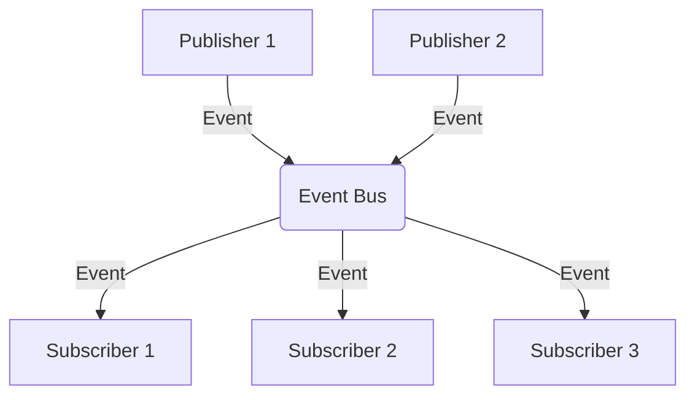

## 7.14 Event-Driven Architecture

In the rapidly evolving landscape of software development, building applications that are both scalable and maintainable is paramount. Event-Driven Architecture (EDA) is a powerful paradigm that facilitates this by promoting decoupling and scalability through the use of events or messages for communication between components. In this section, we will explore how to implement EDA in Swift, leveraging its unique features and frameworks to build robust iOS and macOS applications.

### Intent

The primary intent of Event-Driven Architecture is to create systems where components communicate through events, allowing them to operate independently. This architecture is particularly beneficial for building real-time applications and scalable systems, as it enables asynchronous communication and loose coupling between components.

### Implementing Event-Driven Architecture in Swift

#### Publish-Subscribe Systems

In a publish-subscribe system, components can publish events without knowing who will consume them, and other components can subscribe to these events to perform actions. This decouples the sender and receiver, allowing for more flexible and maintainable code.

**Example Code:**

```swift
import Foundation

// Define a protocol for events
protocol Event {}

// Define a specific event
struct UserLoggedInEvent: Event {
    let userId: String
}

// Event Bus to manage subscriptions and publishing
class EventBus {
    private var subscribers: [String: [(Event) -> Void]] = [:]

    // Subscribe to an event
    func subscribe<T: Event>(eventType: T.Type, handler: @escaping (T) -> Void) {
        let key = String(describing: eventType)
        if subscribers[key] == nil {
            subscribers[key] = []
        }
        subscribers[key]?.append { event in
            if let event = event as? T {
                handler(event)
            }
        }
    }

    // Publish an event
    func publish(event: Event) {
        let key = String(describing: type(of: event))
        subscribers[key]?.forEach { handler in
            handler(event)
        }
    }
}

// Usage
let eventBus = EventBus()

// Subscribe to UserLoggedInEvent
eventBus.subscribe(eventType: UserLoggedInEvent.self) { event in
    print("User logged in with ID: \\(event.userId)")
}

// Publish a UserLoggedInEvent
eventBus.publish(event: UserLoggedInEvent(userId: "12345"))
```

In this example, we define a simple event bus that allows components to subscribe to and publish events. The `EventBus` class manages subscribers and invokes the appropriate handlers when an event is published.

#### Event Bus or Message Brokers

An event bus or message broker acts as a centralized system to manage the flow of events. This can be particularly useful in larger systems where events need to be routed between multiple components or microservices.

**Diagram: Centralized Event Bus Architecture**



In this diagram, multiple publishers send events to a centralized event bus, which then routes these events to the appropriate subscribers.

#### Asynchronous Communication

One of the key benefits of EDA is its support for asynchronous communication. This allows applications to remain responsive even when performing complex operations, as events can be handled in the background.

**Example Code:**

```swift
import Foundation

// Simulate an asynchronous event handler
func handleEventAsync(event: Event, completion: @escaping () -> Void) {
    DispatchQueue.global().async {
        // Simulate a time-consuming task
        sleep(2)
        print("Handled event: \\(event)")
        completion()
    }
}

// Usage
handleEventAsync(event: UserLoggedInEvent(userId: "12345")) {
    print("Event handling completed")
}
```

In this example, we use a global dispatch queue to handle events asynchronously, allowing the main thread to remain responsive.

#### Combine Framework

Swift's Combine framework is a powerful tool for implementing reactive programming patterns, making it an excellent choice for building event-driven systems. Combine allows you to work with asynchronous data streams and handle events in a declarative manner.

**Example Code:**

```swift
import Combine

// Define a publisher for UserLoggedInEvent
let userLoggedInPublisher = PassthroughSubject<UserLoggedInEvent, Never>()

// Subscribe to the publisher
let subscription = userLoggedInPublisher.sink { event in
    print("User logged in with ID: \\(event.userId)")
}

// Publish an event
userLoggedInPublisher.send(UserLoggedInEvent(userId: "12345"))
```

In this example, we use a `PassthroughSubject` to create a publisher for `UserLoggedInEvent`. Subscribers can listen to this publisher and react to events as they occur.

### Use Cases and Examples

#### Real-Time Applications

Event-Driven Architecture is ideal for real-time applications such as chat apps and live feeds. By using events to communicate between components, these applications can handle high volumes of data and user interactions efficiently.

#### Scalable Systems

In scalable systems, EDA allows you to distribute workloads across multiple components or microservices. This decoupling of components enables horizontal scaling, where additional resources can be added to handle increased demand.

#### Loose Coupling

By promoting loose coupling, EDA improves the maintainability and flexibility of applications. Components can be developed, tested, and deployed independently, reducing the risk of changes in one part of the system affecting others.

### Design Considerations

When implementing Event-Driven Architecture, consider the following:

- **Event Granularity**: Define the level of detail for events. Too granular events can lead to excessive communication overhead, while too coarse events may not provide enough information.
- **Error Handling**: Implement robust error handling mechanisms to manage failures in event processing.
- **Performance**: Monitor the performance of the event bus or message broker, as it can become a bottleneck in high-load scenarios.
- **Event Ordering**: Ensure that events are processed in the correct order, especially in systems where the sequence of operations is critical.

### Swift Unique Features

Swift's strong type system and modern concurrency model make it well-suited for building event-driven systems. The use of protocols and generics allows for flexible and reusable code, while Swift's support for asynchronous programming simplifies the handling of events.

### Differences and Similarities

Event-Driven Architecture is often compared with other architectural patterns, such as Microservices and Service-Oriented Architecture (SOA). While all these patterns promote decoupling, EDA focuses specifically on using events for communication, making it more suitable for real-time and reactive applications.

## Try It Yourself

To deepen your understanding of Event-Driven Architecture in Swift, try modifying the code examples provided:

- Experiment with different types of events and subscribers.
- Implement additional features in the event bus, such as event filtering or logging.
- Use Combine to create more complex event streams and transformations.

## Quiz Time!



### What is the primary intent of Event-Driven Architecture?

- [x] To create systems where components communicate through events, promoting decoupling and scalability.
- [ ] To centralize all application logic in a single component.
- [ ] To ensure synchronous communication between components.
- [ ] To replace all existing architectures with a new standard.

> **Explanation:** Event-Driven Architecture focuses on using events for communication, allowing components to operate independently and improve scalability.

### Which Swift framework is particularly useful for implementing reactive patterns in Event-Driven Architecture?

- [ ] UIKit
- [x] Combine
- [ ] CoreData
- [ ] SwiftUI

> **Explanation:** The Combine framework is designed for handling asynchronous data streams and is well-suited for reactive programming patterns.

### What is a key benefit of asynchronous communication in Event-Driven Architecture?

- [x] It improves application responsiveness by handling events in the background.
- [ ] It ensures all events are processed in real-time.
- [ ] It reduces the need for event logging.
- [ ] It simplifies error handling in synchronous systems.

> **Explanation:** Asynchronous communication allows events to be processed without blocking the main thread, enhancing responsiveness.

### In a publish-subscribe system, what is the role of the publisher?

- [x] To send events to which subscribers can respond.
- [ ] To manage the event bus and route messages.
- [ ] To store events for future processing.
- [ ] To ensure events are processed in order.

> **Explanation:** Publishers send events that subscribers can listen to and react upon, facilitating decoupled communication.

### What should be considered when defining event granularity in Event-Driven Architecture?

- [x] The balance between communication overhead and information detail.
- [ ] Ensuring all events are as detailed as possible.
- [ ] Minimizing the number of events to reduce complexity.
- [ ] Using a single event type for all communications.

> **Explanation:** Event granularity should strike a balance between providing enough information and avoiding excessive communication overhead.

### Which of the following is a use case for Event-Driven Architecture?

- [x] Real-time applications like chat apps and live feeds.
- [ ] Centralized data processing systems.
- [ ] Batch processing systems.
- [ ] Monolithic applications.

> **Explanation:** Real-time applications benefit from the asynchronous and decoupled nature of Event-Driven Architecture.

### How does Event-Driven Architecture improve scalability?

- [x] By distributing workloads across components or microservices.
- [ ] By consolidating all processing into a single component.
- [ ] By reducing the number of events processed.
- [ ] By enforcing synchronous communication.

> **Explanation:** EDA allows workloads to be distributed, enabling horizontal scaling and handling increased demand.

### What is a potential drawback of using a centralized event bus?

- [x] It can become a bottleneck in high-load scenarios.
- [ ] It simplifies event routing and management.
- [ ] It ensures all events are processed in real-time.
- [ ] It reduces the need for error handling.

> **Explanation:** A centralized event bus may become a performance bottleneck if not properly managed.

### What is the role of the subscriber in a publish-subscribe system?

- [x] To listen for and respond to events published by others.
- [ ] To send events to the event bus.
- [ ] To manage the flow of events between components.
- [ ] To ensure events are stored for future reference.

> **Explanation:** Subscribers react to events they are interested in, allowing for decoupled and flexible communication.

### True or False: Event-Driven Architecture is only suitable for real-time applications.

- [ ] True
- [x] False

> **Explanation:** While EDA is ideal for real-time applications, it is also beneficial for scalable systems and any scenario where decoupling and asynchronous communication are advantageous.



Remember, mastering Event-Driven Architecture in Swift is a journey. As you continue to explore and experiment, you'll discover new ways to leverage this powerful paradigm to build more responsive, scalable, and maintainable applications. Keep experimenting, stay curious, and enjoy the journey!


