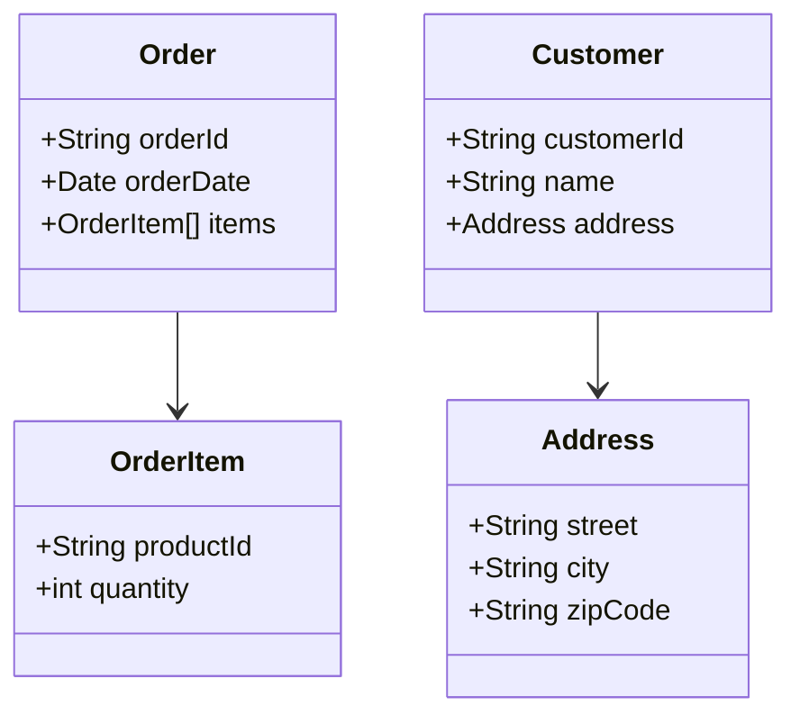

## 7.15 Domain-Driven Design (DDD) in Swift

Domain-Driven Design (DDD) is a strategic approach to software development that emphasizes collaboration with domain experts to model complex business logic effectively. In this section, we'll explore how to implement DDD in Swift, focusing on its core components and providing practical examples to illustrate each concept.

### Intent

The primary intent of Domain-Driven Design is to focus on the core domain and domain logic to create complex applications by collaborating closely with domain experts. This collaboration ensures that the software accurately reflects the real-world processes it aims to model.

### Implementing DDD in Swift

Implementing DDD in Swift involves several key components, each of which plays a crucial role in creating a robust domain model. Let's delve into these components and understand how they contribute to the overall architecture.

#### Ubiquitous Language

**Definition**: Ubiquitous Language is a common language shared by developers and domain experts, ensuring clear communication and understanding throughout the project.

**Implementation**: In Swift, use domain-specific terms consistently across your codebase. This includes naming conventions for classes, methods, and variables that reflect the domain language.

```swift
// Example of Ubiquitous Language in Swift
class Order {
    var orderId: String
    var orderDate: Date
    var items: [OrderItem]

    init(orderId: String, orderDate: Date, items: [OrderItem]) {
        self.orderId = orderId
        self.orderDate = orderDate
        self.items = items
    }
}

class OrderItem {
    var productId: String
    var quantity: Int

    init(productId: String, quantity: Int) {
        self.productId = productId
        self.quantity = quantity
    }
}
```

In this example, terms like `Order`, `OrderItem`, `orderId`, and `orderDate` are used consistently to reflect the domain language.

#### Entities and Value Objects

**Entities**: Objects with a distinct identity that persists over time. They are mutable and can change state.

**Value Objects**: Immutable objects that are defined by their attributes rather than a unique identity.

**Implementation in Swift**:

```swift
// Entity Example
class Customer {
    let customerId: String
    var name: String
    var address: Address

    init(customerId: String, name: String, address: Address) {
        self.customerId = customerId
        self.name = name
        self.address = address
    }
}

// Value Object Example
struct Address {
    let street: String
    let city: String
    let zipCode: String
}
```

In this example, `Customer` is an entity with a unique `customerId`, while `Address` is a value object that is immutable.

#### Aggregates

**Definition**: Aggregates are groups of related entities and value objects that are treated as a single unit for data changes. The root entity, known as the Aggregate Root, ensures consistency within the aggregate.

**Implementation in Swift**:

```swift
// Aggregate Example
class ShoppingCart {
    let cartId: String
    private(set) var items: [CartItem]

    init(cartId: String) {
        self.cartId = cartId
        self.items = []
    }

    func addItem(_ item: CartItem) {
        items.append(item)
    }
}

class CartItem {
    let productId: String
    let quantity: Int

    init(productId: String, quantity: Int) {
        self.productId = productId
        self.quantity = quantity
    }
}
```

Here, `ShoppingCart` acts as the Aggregate Root, managing the consistency of `CartItem` entities.

#### Repositories and Factories

**Repositories**: Handle data persistence and retrieval, abstracting the data access layer.

**Factories**: Responsible for creating complex objects, encapsulating the creation logic.

**Implementation in Swift**:

```swift
// Repository Example
protocol CustomerRepository {
    func find(by id: String) -> Customer?
    func save(_ customer: Customer)
}

// Factory Example
class OrderFactory {
    static func createOrder(orderId: String, items: [OrderItem]) -> Order {
        return Order(orderId: orderId, orderDate: Date(), items: items)
    }
}
```

Repositories and factories help manage object creation and persistence, keeping the domain logic clean and focused.

#### Bounded Contexts

**Definition**: Bounded Contexts define the boundaries within which a particular model is applicable, helping manage complexity by dividing the model into different contexts.

**Implementation in Swift**:

```swift
// Bounded Context Example
// Context: Sales
class SalesOrder {
    // Sales-specific order logic
}

// Context: Inventory
class InventoryOrder {
    // Inventory-specific order logic
}
```

In this example, `SalesOrder` and `InventoryOrder` represent different bounded contexts, each with its own logic and model.

### Use Cases and Examples

Domain-Driven Design is particularly useful in scenarios where complex business logic is involved, continuous collaboration with domain experts is necessary, and systems are expected to evolve over time.

#### Complex Business Logic

For applications with intricate domain rules, DDD provides a structured approach to modeling and implementing these rules effectively.

#### Continuous Collaboration

In projects where domain experts are closely involved, DDD facilitates effective communication and collaboration, ensuring that the software aligns with business needs.

#### Long-Term Projects

For systems expected to evolve over time, DDD offers a flexible architecture that can accommodate changes and growth.

### Try It Yourself

To get hands-on experience with DDD in Swift, try modifying the code examples provided. Experiment with creating new entities, value objects, and aggregates. Consider how you might implement repositories and factories for your domain model. This practice will help solidify your understanding of DDD concepts.

### Visualizing Domain-Driven Design

To better understand the relationships between the components of DDD, let's visualize the architecture using a class diagram.



This diagram illustrates the relationships between entities and value objects in a domain model.

### Key Takeaways

- **Ubiquitous Language**: Ensure consistent communication by using a common language across the project.
- **Entities and Value Objects**: Model domain concepts with entities (mutable, identity) and value objects (immutable).
- **Aggregates**: Group related entities and value objects to maintain consistency.
- **Repositories and Factories**: Manage data persistence and object creation.
- **Bounded Contexts**: Divide the model into different contexts to manage complexity.

### References and Further Reading

- [Domain-Driven Design: Tackling Complexity in the Heart of Software](https://www.amazon.com/Domain-Driven-Design-Tackling-Complexity-Software/dp/0321125215) by Eric Evans
- [Implementing Domain-Driven Design](https://www.amazon.com/Implementing-Domain-Driven-Design-Vaughn-Vernon/dp/0321834577) by Vaughn Vernon
- [Swift.org](https://swift.org) - Official Swift Programming Language Website

### Quiz Time!



### What is the primary purpose of Domain-Driven Design?

- [x] To focus on the core domain and domain logic
- [ ] To optimize performance
- [ ] To minimize code duplication
- [ ] To enhance user interface design

> **Explanation:** Domain-Driven Design emphasizes focusing on the core domain and domain logic to effectively model complex business processes.

### Which of the following is an example of a value object in Swift?

- [ ] Customer
- [x] Address
- [ ] Order
- [ ] ShoppingCart

> **Explanation:** An Address is a value object, defined by its attributes and immutable nature.

### What is the role of a Repository in DDD?

- [ ] To create complex objects
- [ ] To manage user interfaces
- [x] To handle data persistence and retrieval
- [ ] To define business rules

> **Explanation:** A Repository abstracts the data access layer, handling data persistence and retrieval.

### What is a Bounded Context in DDD?

- [ ] A group of related entities
- [x] A boundary within which a particular model is applicable
- [ ] A method of optimizing performance
- [ ] A technique for user interface design

> **Explanation:** Bounded Contexts define boundaries within which a specific model is applicable, helping manage complexity.

### How does DDD facilitate collaboration with domain experts?

- [x] By using a Ubiquitous Language
- [ ] By optimizing code performance
- [ ] By minimizing code duplication
- [ ] By enhancing user interface design

> **Explanation:** DDD uses a Ubiquitous Language to ensure consistent communication and understanding between developers and domain experts.

### What is an Aggregate Root in DDD?

- [ ] A value object
- [x] The root entity that ensures consistency within an aggregate
- [ ] A repository
- [ ] A factory

> **Explanation:** The Aggregate Root is the root entity that ensures consistency within an aggregate.

### Which of the following is a key component of DDD?

- [x] Entities
- [ ] User interfaces
- [ ] Performance optimization
- [ ] Code duplication

> **Explanation:** Entities are a key component of DDD, representing objects with a distinct identity.

### What is the purpose of a Factory in DDD?

- [x] To encapsulate the creation logic for complex objects
- [ ] To manage data persistence
- [ ] To define business rules
- [ ] To enhance user interface design

> **Explanation:** A Factory is responsible for creating complex objects, encapsulating the creation logic.

### Which of the following best describes Ubiquitous Language?

- [x] A common language shared by developers and domain experts
- [ ] A method of optimizing performance
- [ ] A technique for user interface design
- [ ] A way to minimize code duplication

> **Explanation:** Ubiquitous Language is a common language shared by developers and domain experts to ensure clear communication.

### True or False: Domain-Driven Design is only applicable to small projects.

- [ ] True
- [x] False

> **Explanation:** Domain-Driven Design is particularly useful for complex and long-term projects, not just small ones.



Remember, mastering Domain-Driven Design in Swift is a journey. As you continue to explore and apply these concepts, you'll build more robust and maintainable applications. Stay curious and keep experimenting!
