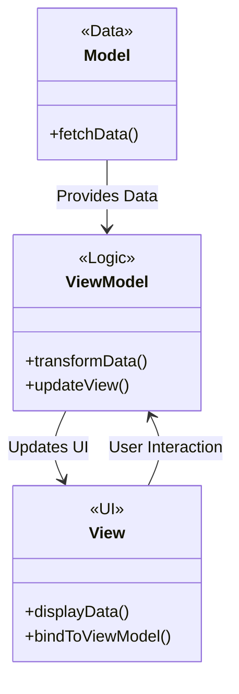

## 7.2 MVVM (Model-View-ViewModel) with SwiftUI

The Model-View-ViewModel (MVVM) pattern is a powerful architectural pattern that facilitates a clear separation of concerns in application development. It is particularly well-suited for SwiftUI, Apple's declarative UI framework. In this section, we'll delve into the intricacies of MVVM, demonstrate how to implement it in SwiftUI, and explore its benefits and use cases.

### Intent of MVVM

The primary intent of the MVVM pattern is to separate the development of the graphical user interface (UI) from the business logic or back-end logic. This separation enhances code maintainability, testability, and scalability.

### Implementing MVVM in Swift

In the MVVM pattern, the application is divided into three main components: Model, ViewModel, and View. Each component has a distinct role:

- **Model**: Represents the data and business logic of the application. It is responsible for retrieving data and processing it according to business rules.
- **ViewModel**: Acts as an intermediary between the View and the Model. It handles presentation logic and transforms data from the Model into a format that the View can display.
- **View**: Declares the user interface and binds to the ViewModel. It is responsible for rendering the UI and reacting to user interactions.

#### Model

The Model in MVVM is a representation of the application's data and business logic. It should be independent of the UI and focus solely on data management and manipulation.

```swift
struct User {
    let id: Int
    let name: String
    let email: String
}

class UserService {
    func fetchUser(completion: @escaping (User) -> Void) {
        // Simulate network request
        DispatchQueue.global().asyncAfter(deadline: .now() + 2) {
            let user = User(id: 1, name: "John Doe", email: "john.doe@example.com")
            completion(user)
        }
    }
}
```

#### ViewModel

The ViewModel serves as a bridge between the Model and the View. It exposes data and actions to the View and handles any necessary transformations.

```swift
import Combine

class UserViewModel: ObservableObject {
    @Published var userName: String = ""
    @Published var userEmail: String = ""

    private var userService: UserService
    private var cancellables = Set<AnyCancellable>()

    init(userService: UserService) {
        self.userService = userService
    }

    func fetchUser() {
        userService.fetchUser { [weak self] user in
            DispatchQueue.main.async {
                self?.userName = user.name
                self?.userEmail = user.email
            }
        }
    }
}
```

#### View

The View in MVVM is responsible for displaying the UI and binding to the ViewModel. SwiftUI's declarative syntax makes it easy to bind the View to the ViewModel using property wrappers.

```swift
import SwiftUI

struct UserView: View {
    @StateObject private var viewModel = UserViewModel(userService: UserService())

    var body: some View {
        VStack {
            Text("User Information")
                .font(.largeTitle)
                .padding()

            Text("Name: \\(viewModel.userName)")
            Text("Email: \\(viewModel.userEmail)")

            Button(action: {
                viewModel.fetchUser()
            }) {
                Text("Fetch User")
            }
            .padding()
        }
        .onAppear {
            viewModel.fetchUser()
        }
    }
}
```

### Data Binding in SwiftUI

SwiftUI uses property wrappers to facilitate data binding, enabling reactive updates to the UI:

- **@State**: Used for local state management within a view.
- **@Binding**: Creates a two-way binding between a parent and child view.
- **@ObservedObject**: Observes changes in an external object that conforms to the `ObservableObject` protocol.
- **@EnvironmentObject**: Shares an object across multiple views in the view hierarchy.

### Use Cases and Examples

#### SwiftUI Applications

MVVM is particularly effective in SwiftUI applications due to its declarative nature. SwiftUI's data binding capabilities simplify the implementation of MVVM, allowing for clean and concise code.

#### Improved Testability

By separating the ViewModel from the View, MVVM enhances testability. The ViewModel can be tested independently of the UI, ensuring that business logic is correct without relying on UI tests.

#### Reactive Interfaces

SwiftUI's reactive nature allows views to automatically update when data changes. This is achieved through data binding, which connects the ViewModel to the View, ensuring that the UI reflects the current state of the application.

### Visualizing MVVM with SwiftUI

Below is a diagram illustrating the relationship between the Model, ViewModel, and View in an MVVM architecture with SwiftUI:



### Design Considerations

When implementing MVVM in SwiftUI, consider the following:

- **Data Binding**: Leverage SwiftUI's property wrappers to create reactive interfaces.
- **Separation of Concerns**: Ensure that the ViewModel handles all presentation logic, keeping the View focused on UI rendering.
- **Testability**: Design ViewModels to be easily testable, independent of the View.
- **Scalability**: MVVM can be scaled to accommodate complex applications by organizing code into manageable components.

### Swift Unique Features

SwiftUI's declarative syntax and property wrappers are unique features that enhance the implementation of MVVM. The use of Combine for reactive programming is another powerful tool that complements MVVM, enabling seamless data flow between the Model, ViewModel, and View.

### Differences and Similarities with Other Patterns

While MVVM shares similarities with the Model-View-Controller (MVC) pattern, it provides a more structured approach to separating concerns. Unlike MVC, where the Controller often becomes a catch-all for logic, MVVM clearly delineates responsibilities, reducing the risk of creating "Massive View Controllers."

### Try It Yourself

To deepen your understanding of MVVM with SwiftUI, try modifying the code examples provided:

- **Experiment with Data Binding**: Add additional properties to the `UserViewModel` and bind them to the `UserView`.
- **Create a New Feature**: Implement a new feature in the `UserViewModel` and update the `UserView` to display it.
- **Test the ViewModel**: Write unit tests for the `UserViewModel` to ensure that it correctly transforms and updates data.

### Knowledge Check

- **What is the primary role of the ViewModel in MVVM?**
- **How does SwiftUI facilitate data binding?**
- **What are the benefits of using MVVM in SwiftUI applications?**

### Embrace the Journey

Remember, mastering MVVM with SwiftUI is just the beginning. As you continue to explore and experiment, you'll discover new ways to leverage this powerful pattern to build robust and scalable applications. Keep pushing the boundaries of what's possible with SwiftUI, and enjoy the journey!

## Quiz Time!



### What is the primary intent of the MVVM pattern?

- [x] To separate the development of the UI from the business logic.
- [ ] To combine the UI and business logic into a single component.
- [ ] To replace the MVC pattern entirely.
- [ ] To simplify data storage in applications.

> **Explanation:** The primary intent of MVVM is to separate the UI development from the business logic, enhancing maintainability and testability.

### Which component in MVVM handles presentation logic?

- [ ] Model
- [x] ViewModel
- [ ] View
- [ ] Controller

> **Explanation:** The ViewModel handles presentation logic and acts as an intermediary between the Model and the View.

### What property wrapper is used for local state management within a view in SwiftUI?

- [x] @State
- [ ] @Binding
- [ ] @ObservedObject
- [ ] @EnvironmentObject

> **Explanation:** The `@State` property wrapper is used for managing local state within a SwiftUI view.

### How does SwiftUI facilitate reactive updates to the UI?

- [x] Through data binding using property wrappers.
- [ ] By directly modifying the Model.
- [ ] By using view controllers.
- [ ] Through manual updates in the View.

> **Explanation:** SwiftUI uses property wrappers like `@State`, `@Binding`, and `@ObservedObject` to facilitate reactive updates to the UI.

### What is a key benefit of using MVVM in SwiftUI applications?

- [x] Improved testability
- [ ] Increased complexity
- [ ] Reduced performance
- [ ] Simplified networking

> **Explanation:** MVVM improves testability by allowing the ViewModel to be tested independently of the UI.

### Which SwiftUI property wrapper allows sharing an object across multiple views?

- [ ] @State
- [ ] @Binding
- [ ] @ObservedObject
- [x] @EnvironmentObject

> **Explanation:** The `@EnvironmentObject` property wrapper allows sharing an object across multiple views in SwiftUI.

### What is the role of the Model in MVVM?

- [x] To represent data and business logic.
- [ ] To handle user interactions.
- [ ] To update the UI.
- [ ] To bind data to the View.

> **Explanation:** The Model represents the application's data and business logic, independent of the UI.

### How can MVVM enhance code maintainability?

- [x] By separating concerns and organizing code into distinct components.
- [ ] By merging all logic into a single component.
- [ ] By using more complex data structures.
- [ ] By reducing the number of files in a project.

> **Explanation:** MVVM enhances maintainability by separating concerns and organizing code into distinct components: Model, ViewModel, and View.

### Which component in MVVM is responsible for rendering the UI?

- [ ] Model
- [ ] ViewModel
- [x] View
- [ ] Controller

> **Explanation:** The View is responsible for rendering the UI and binding to the ViewModel in MVVM.

### True or False: MVVM is a replacement for MVC.

- [ ] True
- [x] False

> **Explanation:** MVVM is not a replacement for MVC but an alternative architectural pattern that provides a different approach to separating concerns in application development.




