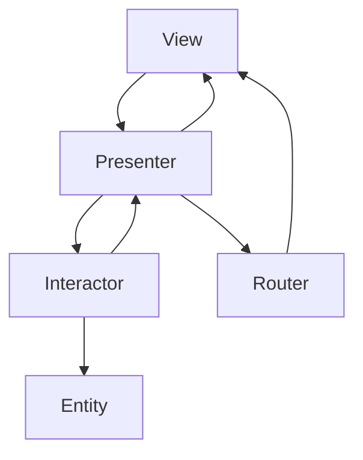

## 7.3 VIPER Architecture for Modular Apps

As we delve into the realm of architectural patterns in Swift, the VIPER architecture stands out as a robust solution for developing modular apps. VIPER, an acronym for View, Interactor, Presenter, Entity, and Router, introduces a strict separation of concerns by splitting the app's logic into these five distinct roles. This separation not only enhances modularity but also promotes scalability and testability, making it a preferred choice for large-scale applications with complex business logic.

### Intent

The primary intent of the VIPER architecture is to organize code in a way that each component has a clear responsibility, thereby reducing dependencies and enhancing the maintainability of the codebase. By adhering to the Single Responsibility Principle, VIPER ensures that each component is focused on a specific aspect of the application.

### Implementing VIPER in Swift

Let's explore each component of the VIPER architecture and how they interact within a Swift application.

#### View

The View component is responsible for displaying the data it receives from the Presenter. It does not contain any business logic. Instead, it focuses solely on the presentation and user interaction.

```swift
import UIKit

protocol UserViewProtocol: AnyObject {
    func displayUserData(_ user: User)
}

class UserViewController: UIViewController, UserViewProtocol {
    var presenter: UserPresenterProtocol?

    override func viewDidLoad() {
        super.viewDidLoad()
        presenter?.viewDidLoad()
    }

    func displayUserData(_ user: User) {
        // Update UI with user data
    }
}
```

#### Interactor

The Interactor contains the business logic of the application. It handles data manipulation and communicates with the Entity to fetch or store data.

```swift
protocol UserInteractorProtocol: AnyObject {
    func fetchUser()
}

class UserInteractor: UserInteractorProtocol {
    var presenter: UserPresenterProtocol?
    var userService: UserServiceProtocol?

    func fetchUser() {
        userService?.getUser { [weak self] user in
            self?.presenter?.didFetchUser(user)
        }
    }
}
```

#### Presenter

The Presenter acts as a mediator between the View and the Interactor. It handles UI events and updates the View with data from the Interactor.

```swift
protocol UserPresenterProtocol: AnyObject {
    func viewDidLoad()
    func didFetchUser(_ user: User)
}

class UserPresenter: UserPresenterProtocol {
    weak var view: UserViewProtocol?
    var interactor: UserInteractorProtocol?
    var router: UserRouterProtocol?

    func viewDidLoad() {
        interactor?.fetchUser()
    }

    func didFetchUser(_ user: User) {
        view?.displayUserData(user)
    }
}
```

#### Entity

Entities are simple data objects that represent the model in the VIPER architecture. They are typically used to transfer data between the Interactor and other components.

```swift
struct User {
    let id: Int
    let name: String
    let email: String
}
```

#### Router

The Router handles navigation and routing between modules. It is responsible for creating the module and transitioning between views.

```swift
protocol UserRouterProtocol: AnyObject {
    static func createModule() -> UIViewController
}

class UserRouter: UserRouterProtocol {
    static func createModule() -> UIViewController {
        let view = UserViewController()
        let presenter: UserPresenterProtocol & UserInteractorOutputProtocol = UserPresenter()
        let interactor: UserInteractorProtocol = UserInteractor()
        let router: UserRouterProtocol = UserRouter()

        view.presenter = presenter
        presenter.view = view
        presenter.router = router
        presenter.interactor = interactor
        interactor.presenter = presenter

        return view
    }
}
```

### Module Isolation

One of the key advantages of VIPER is module isolation. Each feature is encapsulated within its own module, promoting modularity and reusability. This isolation allows developers to work on different features independently, reducing the risk of conflicts and making it easier to manage large codebases.

### Use Cases and Examples

#### Large-Scale Applications

VIPER is particularly well-suited for large-scale applications where maintainability and scalability are critical. By dividing the application into smaller, manageable modules, VIPER makes it easier to add new features and refactor existing ones without affecting the entire codebase.

#### Complex Business Logic

Applications with intricate workflows and complex business logic benefit from VIPER's clear separation of concerns. The Interactor can handle complex data processing, while the Presenter ensures that the View is updated with the correct information.

#### High Test Coverage Needs

VIPER facilitates unit testing due to its clear separation of components. Each component can be tested independently, allowing for high test coverage and ensuring that the application behaves as expected.

### Swift Unique Features

Swift's type safety and protocol-oriented programming make it an excellent choice for implementing VIPER. Protocols define the interactions between components, ensuring that each component adheres to a specific contract. Swift's extensions and generics further enhance the flexibility and reusability of VIPER components.

### Differences and Similarities

VIPER is often compared to other architectural patterns like MVC (Model-View-Controller) and MVVM (Model-View-ViewModel). While MVC and MVVM focus on separating the model from the view, VIPER takes this a step further by introducing additional layers for business logic and navigation. This additional separation makes VIPER more suitable for complex applications with a high degree of modularity.

### Design Considerations

When implementing VIPER, it's important to ensure that each component is focused on its specific responsibility. Avoid placing business logic in the View or Presenter, as this can lead to tightly coupled components and reduced testability. Instead, leverage the Interactor for all data-related operations and use the Router to handle navigation.

### Visualizing VIPER Architecture

To better understand the flow of data and responsibilities within VIPER, let's visualize the architecture using a Mermaid.js diagram:



**Description**: This diagram illustrates the flow of data and responsibilities within the VIPER architecture. The View communicates with the Presenter, which interacts with the Interactor for business logic. The Interactor accesses the Entity for data manipulation. The Router handles navigation, and the Presenter updates the View with data.

### Try It Yourself

To get hands-on experience with VIPER, try modifying the code examples provided. Experiment with adding new features or refactoring existing ones. Consider creating a new module for a different feature and see how VIPER's modularity facilitates this process.

### Knowledge Check

- How does VIPER enhance modularity in app development?
- What role does the Interactor play in the VIPER architecture?
- How does the Router contribute to the separation of concerns in VIPER?
- Why is VIPER particularly suited for large-scale applications?

### Embrace the Journey

Remember, mastering VIPER is a journey. As you continue to explore and implement this architecture, you'll discover its strengths and potential challenges. Stay curious, experiment with different implementations, and enjoy the process of building robust, modular applications.

## Quiz Time!



### What is the primary intent of the VIPER architecture?

- [x] To introduce a strict separation of concerns by splitting the app's logic into five distinct roles.
- [ ] To simplify the user interface design.
- [ ] To enhance the graphical performance of the app.
- [ ] To reduce the number of lines of code.

> **Explanation:** VIPER aims to enhance modularity and maintainability by dividing the app's logic into distinct roles: View, Interactor, Presenter, Entity, and Router.

### Which component in VIPER is responsible for handling business logic?

- [ ] View
- [x] Interactor
- [ ] Presenter
- [ ] Router

> **Explanation:** The Interactor handles the business logic and communicates with entities (models).

### What is the role of the Router in VIPER?

- [ ] To display data to the user.
- [x] To handle navigation and routing between modules.
- [ ] To process business logic.
- [ ] To manage data storage.

> **Explanation:** The Router is responsible for navigation and routing between different modules in the app.

### How does VIPER facilitate unit testing?

- [x] By providing a clear separation of components, allowing each to be tested independently.
- [ ] By reducing the number of components in the app.
- [ ] By integrating testing libraries directly into the architecture.
- [ ] By simplifying the user interface.

> **Explanation:** VIPER's separation of concerns allows each component to be tested independently, enhancing test coverage.

### Which Swift feature enhances the flexibility of VIPER components?

- [ ] Closures
- [x] Protocols
- [ ] Optionals
- [ ] Tuples

> **Explanation:** Protocols define the interactions between components, ensuring each adheres to a specific contract, enhancing flexibility.

### What is a key advantage of module isolation in VIPER?

- [x] It promotes modularity and reusability, allowing independent development of features.
- [ ] It reduces the app's memory usage.
- [ ] It simplifies the graphical user interface.
- [ ] It increases the app's execution speed.

> **Explanation:** Module isolation allows developers to work on different features independently, promoting modularity and reusability.

### In VIPER, what is the role of the Presenter?

- [x] To act as a mediator between the View and the Interactor, handling UI events.
- [ ] To manage data storage and retrieval.
- [ ] To handle navigation and routing.
- [ ] To display data directly to the user.

> **Explanation:** The Presenter mediates between the View and the Interactor, handling UI events and updating the View.

### How does VIPER compare to MVC and MVVM?

- [x] VIPER introduces additional layers for business logic and navigation, enhancing modularity.
- [ ] VIPER combines the View and Model into a single component.
- [ ] VIPER eliminates the need for a Presenter.
- [ ] VIPER focuses solely on the user interface.

> **Explanation:** VIPER's additional layers for business logic and navigation make it more suitable for complex applications with high modularity.

### What is the role of the Entity in VIPER?

- [x] To represent the data model, typically as simple data objects.
- [ ] To handle user interactions.
- [ ] To manage navigation and routing.
- [ ] To process business logic.

> **Explanation:** Entities are simple data objects that represent the model in the VIPER architecture.

### True or False: The View in VIPER contains business logic.

- [ ] True
- [x] False

> **Explanation:** The View in VIPER does not contain business logic; it focuses solely on presentation and user interaction.



