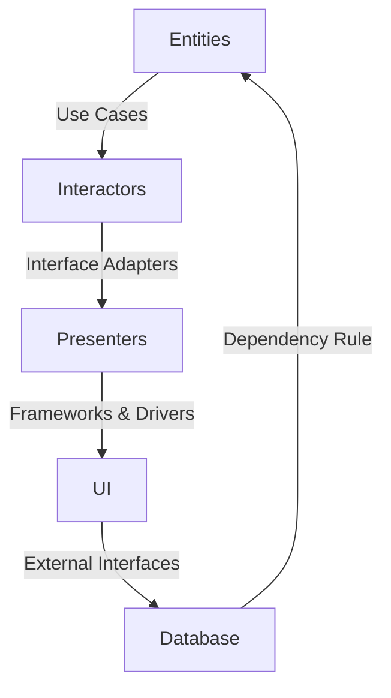

## 7.4 Clean Architecture and SOLID Principles

In the realm of software development, creating robust, scalable, and maintainable applications is a constant challenge. Clean Architecture, coupled with SOLID principles, provides a framework that addresses these challenges by emphasizing separation of concerns, testability, and flexibility. This section will guide you through understanding and implementing Clean Architecture and SOLID principles in Swift.

### Intent

The primary intent of Clean Architecture is to build systems with layers that are independent of frameworks, UI, databases, or any external agency. It focuses on a use-case-driven approach and adherence to SOLID principles, ensuring that each layer of the application has a clear responsibility and is easily testable.

### Implementing Clean Architecture in Swift

Clean Architecture divides the application into several layers, each with distinct responsibilities. Let's explore these layers and how they can be implemented in Swift.

#### Entities

Entities represent the core business rules of the application. They are the most stable layer and are independent of any external changes. In Swift, entities are typically represented using structs or classes.

```swift
// Entity: User
struct User {
    var id: UUID
    var name: String
    var email: String
}
```

#### Use Cases (Interactors)

Use Cases, or Interactors, contain the application-specific business rules. They orchestrate the flow of data to and from the entities and direct them to the appropriate interface adapters.

```swift
// Use Case: UserInteractor
protocol UserUseCase {
    func fetchUser(byId id: UUID) -> User?
}

class UserInteractor: UserUseCase {
    private let userRepository: UserRepository

    init(userRepository: UserRepository) {
        self.userRepository = userRepository
    }

    func fetchUser(byId id: UUID) -> User? {
        return userRepository.getUser(byId: id)
    }
}
```

#### Interface Adapters

Interface Adapters convert data from the use cases and entities to formats the user interface can understand. They are responsible for translating between the domain and the external world.

```swift
// Interface Adapter: UserPresenter
class UserPresenter {
    func present(user: User) -> UserViewModel {
        return UserViewModel(id: user.id.uuidString, name: user.name, email: user.email)
    }
}

// ViewModel for UI
struct UserViewModel {
    var id: String
    var name: String
    var email: String
}
```

#### Frameworks and Drivers

This layer includes the UI, database, and external interfaces. It is the outermost layer and should depend on the inner layers, not the other way around.

```swift
// Frameworks and Drivers: UserViewController
class UserViewController: UIViewController {
    private let userInteractor: UserUseCase
    private let userPresenter: UserPresenter

    init(userInteractor: UserUseCase, userPresenter: UserPresenter) {
        self.userInteractor = userInteractor
        self.userPresenter = userPresenter
        super.init(nibName: nil, bundle: nil)
    }

    override func viewDidLoad() {
        super.viewDidLoad()
        if let user = userInteractor.fetchUser(byId: UUID()) {
            let userViewModel = userPresenter.present(user: user)
            // Update UI with userViewModel
        }
    }
}
```

#### Dependency Rule

The Dependency Rule dictates that source code dependencies can only point inward. This means that the inner layers should not depend on the outer layers. In Swift, this can be achieved using protocols and dependency injection.

### Use Cases and Examples

Clean Architecture is particularly useful in the following scenarios:

- **Enterprise Applications**: Complex applications requiring robustness and scalability benefit from the clear separation of concerns provided by Clean Architecture.
- **Long-Term Projects**: Projects anticipated to have many iterations and need for scalability can maintain flexibility and adaptability by adhering to Clean Architecture.
- **Maintaining Independence**: Applications that need to stay independent of external frameworks or platforms can achieve this through the use of Clean Architecture.

### SOLID Principles in Swift

The SOLID principles are a set of five design principles that help developers design software that is easy to maintain and extend. Let's explore each principle and how it applies to Swift development.

#### Single Responsibility Principle (SRP)

A class should have only one reason to change, meaning it should have only one job or responsibility.

```swift
// SRP: Separate responsibilities into different classes
class UserManager {
    func createUser(name: String, email: String) -> User {
        // Logic to create a user
    }
}

class UserValidator {
    func validateEmail(_ email: String) -> Bool {
        // Logic to validate email
    }
}
```

#### Open/Closed Principle (OCP)

Software entities should be open for extension but closed for modification. This can be achieved using protocols and extensions in Swift.

```swift
// OCP: Use protocols to allow extension
protocol Shape {
    func area() -> Double
}

class Circle: Shape {
    var radius: Double

    init(radius: Double) {
        self.radius = radius
    }

    func area() -> Double {
        return Double.pi * radius * radius
    }
}

class Rectangle: Shape {
    var width: Double
    var height: Double

    init(width: Double, height: Double) {
        self.width = width
        self.height = height
    }

    func area() -> Double {
        return width * height
    }
}
```

#### Liskov Substitution Principle (LSP)

Objects of a superclass should be replaceable with objects of a subclass without affecting the correctness of the program.

```swift
// LSP: Ensure subclasses can be substituted for their base classes
class Bird {
    func fly() {
        print("Flying")
    }
}

class Sparrow: Bird {
    override func fly() {
        print("Sparrow flying")
    }
}

func letBirdFly(bird: Bird) {
    bird.fly()
}

letBirdFly(bird: Sparrow())  // Works correctly
```

#### Interface Segregation Principle (ISP)

Clients should not be forced to depend on interfaces they do not use. This can be achieved by splitting large interfaces into smaller, more specific ones.

```swift
// ISP: Split interfaces into smaller ones
protocol Printer {
    func printDocument()
}

protocol Scanner {
    func scanDocument()
}

class AllInOnePrinter: Printer, Scanner {
    func printDocument() {
        // Print logic
    }

    func scanDocument() {
        // Scan logic
    }
}
```

#### Dependency Inversion Principle (DIP)

High-level modules should not depend on low-level modules. Both should depend on abstractions.

```swift
// DIP: Use protocols to invert dependencies
protocol Database {
    func saveUser(user: User)
}

class MySQLDatabase: Database {
    func saveUser(user: User) {
        // Save user to MySQL
    }
}

class UserService {
    private let database: Database

    init(database: Database) {
        self.database = database
    }

    func saveUser(user: User) {
        database.saveUser(user: user)
    }
}
```

### Visualizing Clean Architecture

To better understand the structure of Clean Architecture, let's visualize it using a Mermaid.js diagram.



**Diagram Description**: This diagram illustrates the flow of data and dependencies in Clean Architecture. The Entities layer is at the core, surrounded by Use Cases, Interface Adapters, and Frameworks & Drivers. The Dependency Rule ensures that dependencies point inward.

### References and Links

- [Clean Architecture: A Craftsman's Guide to Software Structure and Design by Robert C. Martin](https://www.oreilly.com/library/view/clean-architecture-a/9780134494272/)
- [SOLID Principles in Swift](https://www.raywenderlich.com/21231757-solid-principles-in-swift)
- [Swift Documentation](https://developer.apple.com/documentation/swift)

### Knowledge Check

Let's reinforce your understanding with a few questions and exercises:

1. **What is the primary intent of Clean Architecture?**
2. **How does the Dependency Rule affect the structure of an application?**
3. **Provide an example of how the Single Responsibility Principle can be applied in Swift.**
4. **Why is the Open/Closed Principle important in software design?**
5. **Create a simple Swift class that adheres to the Liskov Substitution Principle.**

### Embrace the Journey

Remember, mastering Clean Architecture and SOLID principles is a journey. As you progress, you'll build more robust and scalable applications. Keep experimenting, stay curious, and enjoy the process!

## Quiz Time!



### What is the primary intent of Clean Architecture?

- [x] To build systems with layers that are independent of external frameworks.
- [ ] To focus solely on user interface design.
- [ ] To eliminate the need for testing.
- [ ] To ensure all code is written in a single file.

> **Explanation:** Clean Architecture aims to build systems with independent layers, focusing on use-case-driven development.

### Which layer in Clean Architecture is responsible for application-specific business rules?

- [ ] Entities
- [x] Use Cases (Interactors)
- [ ] Interface Adapters
- [ ] Frameworks and Drivers

> **Explanation:** Use Cases, or Interactors, contain the application-specific business rules.

### What principle states that a class should have only one reason to change?

- [x] Single Responsibility Principle
- [ ] Open/Closed Principle
- [ ] Liskov Substitution Principle
- [ ] Dependency Inversion Principle

> **Explanation:** The Single Responsibility Principle states that a class should have only one job or responsibility.

### Which SOLID principle emphasizes that software entities should be open for extension but closed for modification?

- [ ] Single Responsibility Principle
- [x] Open/Closed Principle
- [ ] Interface Segregation Principle
- [ ] Dependency Inversion Principle

> **Explanation:** The Open/Closed Principle states that software entities should be open for extension but closed for modification.

### How can the Dependency Inversion Principle be achieved in Swift?

- [ ] By hardcoding dependencies
- [x] By using protocols to invert dependencies
- [ ] By avoiding the use of classes
- [ ] By writing all code in a single function

> **Explanation:** The Dependency Inversion Principle can be achieved by using protocols to invert dependencies, allowing high-level modules to depend on abstractions.

### What does the Dependency Rule dictate in Clean Architecture?

- [ ] Dependencies can point outward.
- [x] Dependencies can only point inward.
- [ ] Dependencies should be avoided.
- [ ] Dependencies are irrelevant.

> **Explanation:** The Dependency Rule dictates that source code dependencies can only point inward.

### Which principle suggests that clients should not be forced to depend on interfaces they do not use?

- [ ] Single Responsibility Principle
- [ ] Open/Closed Principle
- [x] Interface Segregation Principle
- [ ] Liskov Substitution Principle

> **Explanation:** The Interface Segregation Principle suggests splitting large interfaces into smaller, more specific ones.

### What is a key benefit of adhering to SOLID principles?

- [x] Improved maintainability and extensibility
- [ ] Reduced code readability
- [ ] Increased complexity
- [ ] Elimination of all bugs

> **Explanation:** SOLID principles help improve maintainability and extensibility of software.

### True or False: Clean Architecture requires the use of a specific programming language.

- [ ] True
- [x] False

> **Explanation:** Clean Architecture is a design philosophy that can be implemented in any programming language.

### Which of the following is a common use case for Clean Architecture?

- [x] Enterprise applications requiring robustness
- [ ] Small scripts with no business logic
- [ ] Single-page websites
- [ ] Static HTML pages

> **Explanation:** Clean Architecture is particularly useful for enterprise applications that require robustness and scalability.


