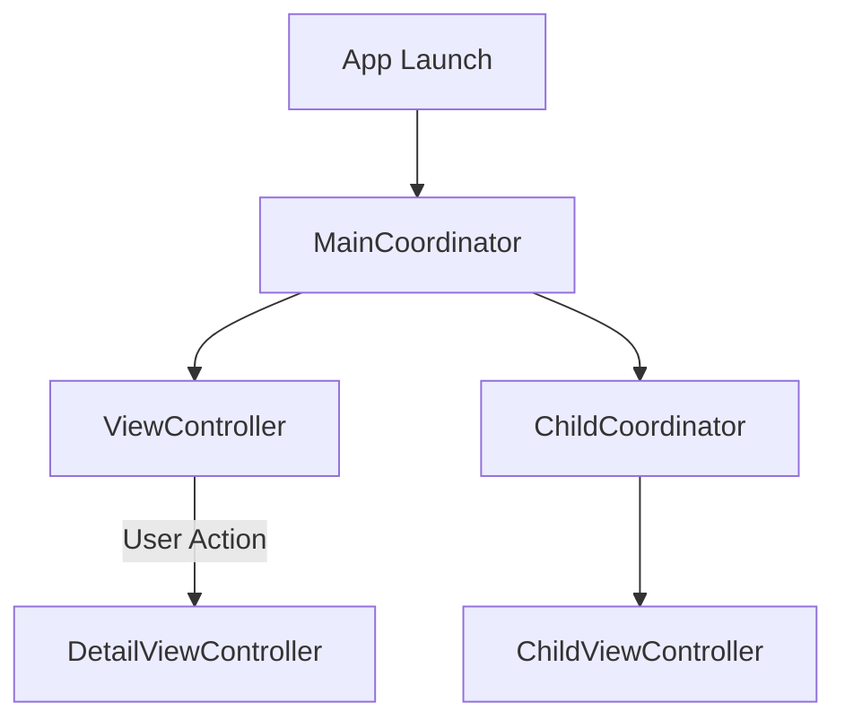

## 7.5 Coordinator Pattern for Navigation Management

Navigating the complex landscape of iOS app development often involves managing intricate navigation flows. The Coordinator Pattern emerges as a robust solution, offering a way to decouple navigation logic from view controllers, thus enhancing modularity and reusability. Let's delve into this architectural pattern, exploring its intent, implementation, and practical applications in Swift.

### Intent

The primary intent of the Coordinator Pattern is to decouple view controllers by extracting navigation logic and transitions into separate coordinator objects. This separation of concerns allows view controllers to focus solely on their UI responsibilities, while coordinators handle the navigation flow and lifecycle of the app's view hierarchy.

### Implementing Coordinator in Swift

To implement the Coordinator Pattern effectively, we need to establish a structured approach involving protocols, coordinators, child coordinators, and communication strategies.

#### Coordinator Protocol

Begin by defining a `Coordinator` protocol. This protocol outlines the essential methods that any coordinator should implement, such as starting the navigation flow.

```swift
protocol Coordinator {
    var childCoordinators: [Coordinator] { get set }
    func start()
}
```

- **`childCoordinators`**: An array to manage any child coordinators, allowing for the delegation of sub-flows.
- **`start()`**: A method to kick off the coordinator's navigation flow.

#### Coordinators

A `Coordinator` is responsible for managing the navigation flow and instantiating view controllers. It acts as the glue between different parts of the app, ensuring a seamless transition between views.

```swift
class MainCoordinator: Coordinator {
    var childCoordinators = [Coordinator]()
    var navigationController: UINavigationController

    init(navigationController: UINavigationController) {
        self.navigationController = navigationController
    }

    func start() {
        let viewController = ViewController()
        viewController.coordinator = self
        navigationController.pushViewController(viewController, animated: true)
    }

    func navigateToDetail() {
        let detailViewController = DetailViewController()
        detailViewController.coordinator = self
        navigationController.pushViewController(detailViewController, animated: true)
    }
}
```

- **`navigationController`**: Manages the navigation stack.
- **`navigateToDetail()`**: Demonstrates how coordinators can manage transitions.

#### Child Coordinators

Child coordinators handle sub-flows within the app, promoting a modular design. They can be instantiated by parent coordinators to manage specific sections of the app.

```swift
class ChildCoordinator: Coordinator {
    var childCoordinators = [Coordinator]()
    var navigationController: UINavigationController

    init(navigationController: UINavigationController) {
        self.navigationController = navigationController
    }

    func start() {
        let childViewController = ChildViewController()
        childViewController.coordinator = self
        navigationController.pushViewController(childViewController, animated: true)
    }
}
```

#### Communication

Communication between view controllers and coordinators can be achieved using delegation or closures. This ensures that view controllers can notify coordinators of events without being tightly coupled to them.

```swift
class ViewController: UIViewController {
    weak var coordinator: MainCoordinator?

    override func viewDidLoad() {
        super.viewDidLoad()
        // Setup UI and actions
    }

    @objc func buttonTapped() {
        coordinator?.navigateToDetail()
    }
}
```

- **Delegation**: The view controller holds a weak reference to its coordinator, allowing it to notify the coordinator of user interactions.

### Use Cases and Examples

The Coordinator Pattern is particularly beneficial in the following scenarios:

#### Complex Navigation Flows

For apps with deep or dynamic navigation hierarchies, coordinators simplify navigation management by centralizing logic and reducing the complexity within view controllers.

#### Modular Design

By keeping view controllers focused on UI concerns, coordinators promote a modular design. This separation of concerns facilitates testing and maintenance.

#### Reusable Flows

Coordinators enable the reuse of navigation logic across different parts of the app, enhancing consistency and reducing code duplication.

### Visualizing the Coordinator Pattern

To better understand the Coordinator Pattern, let's visualize its structure and flow:



- **MainCoordinator**: Manages the primary navigation flow.
- **ChildCoordinator**: Handles sub-flows, such as onboarding or settings.
- **ViewController and DetailViewController**: Represent the UI components managed by the coordinators.

### Swift Unique Features

Swift offers several unique features that enhance the implementation of the Coordinator Pattern:

- **Protocol-Oriented Programming (POP)**: Leverage Swift's protocol-oriented approach to define flexible and reusable coordinator protocols.
- **Value Types**: Use structs for lightweight coordinators when appropriate, taking advantage of Swift's value type semantics.
- **Closures**: Utilize closures for communication between view controllers and coordinators, providing a concise and expressive way to handle callbacks.

### Design Considerations

When implementing the Coordinator Pattern, consider the following:

- **Complexity**: While coordinators simplify navigation logic, they can introduce additional complexity if not managed properly. Ensure a clear hierarchy and communication strategy.
- **Memory Management**: Use weak references to prevent retain cycles between view controllers and coordinators.
- **Testing**: Coordinators facilitate testing by isolating navigation logic, but ensure thorough testing of both coordinators and view controllers.

### Differences and Similarities

The Coordinator Pattern is often compared to the MVVM (Model-View-ViewModel) pattern. While both aim to decouple components, coordinators focus on navigation, whereas MVVM emphasizes data binding and UI logic separation.

### Try It Yourself

To reinforce your understanding, try implementing a simple app using the Coordinator Pattern. Start with a basic navigation flow and gradually introduce child coordinators for sub-flows. Experiment with different communication strategies, such as delegation and closures, to see how they affect the flow and maintainability of your app.

### References and Links

- [Apple Developer Documentation](https://developer.apple.com/documentation/)
- [Ray Wenderlich's Guide to Coordinators](https://www.raywenderlich.com/)
- [Swift by Sundell - Coordinators](https://www.swiftbysundell.com/)

## Quiz Time!



### What is the primary intent of the Coordinator Pattern?

- [x] To decouple view controllers by extracting navigation logic into separate coordinator objects.
- [ ] To manage data persistence in Swift applications.
- [ ] To handle asynchronous operations in Swift.
- [ ] To optimize app performance.

> **Explanation:** The Coordinator Pattern aims to separate navigation logic from view controllers, allowing them to focus on UI concerns.

### Which method is essential in the Coordinator protocol?

- [x] start()
- [ ] stop()
- [ ] reset()
- [ ] initialize()

> **Explanation:** The `start()` method is crucial for initiating the navigation flow managed by a coordinator.

### How do coordinators communicate with view controllers?

- [x] Using delegation or closures.
- [ ] Through direct method calls.
- [ ] By modifying global variables.
- [ ] Using notifications.

> **Explanation:** Delegation and closures are preferred for communication to maintain loose coupling.

### What is a key benefit of using child coordinators?

- [x] They handle sub-flows within the app, promoting modular design.
- [ ] They increase the app's memory usage.
- [ ] They simplify the app's data model.
- [ ] They eliminate the need for view controllers.

> **Explanation:** Child coordinators manage specific sections of the app, enhancing modularity and reusability.

### Which Swift feature enhances the implementation of the Coordinator Pattern?

- [x] Protocol-Oriented Programming (POP)
- [ ] Automatic Reference Counting (ARC)
- [ ] SwiftUI
- [ ] Core Data

> **Explanation:** Protocol-Oriented Programming allows for flexible and reusable coordinator protocols.

### What should be used to prevent retain cycles between view controllers and coordinators?

- [x] Weak references
- [ ] Strong references
- [ ] Unowned references
- [ ] Global variables

> **Explanation:** Weak references prevent retain cycles, ensuring proper memory management.

### What is a potential drawback of the Coordinator Pattern?

- [x] It can introduce additional complexity if not managed properly.
- [ ] It makes view controllers more complex.
- [ ] It reduces the app's performance.
- [ ] It complicates data binding.

> **Explanation:** While coordinators simplify navigation logic, they can add complexity if not structured correctly.

### How does the Coordinator Pattern compare to MVVM?

- [x] Coordinators focus on navigation, while MVVM emphasizes data binding and UI logic separation.
- [ ] Both patterns focus on data persistence.
- [ ] MVVM is used for navigation, while coordinators handle UI logic.
- [ ] They are identical in purpose and implementation.

> **Explanation:** Coordinators manage navigation, whereas MVVM separates data and UI logic.

### What is the role of the `navigateToDetail()` method in a coordinator?

- [x] It manages transitions to the DetailViewController.
- [ ] It initializes the coordinator.
- [ ] It handles data persistence.
- [ ] It stops the coordinator.

> **Explanation:** The `navigateToDetail()` method demonstrates how coordinators manage view transitions.

### True or False: The Coordinator Pattern is only suitable for small apps.

- [ ] True
- [x] False

> **Explanation:** The Coordinator Pattern is beneficial for apps of all sizes, especially those with complex navigation flows.



Remember, mastering the Coordinator Pattern is a journey. As you continue to explore and implement this pattern, you'll find it becomes an invaluable tool in your Swift development toolkit. Keep experimenting, stay curious, and enjoy the process of building robust, maintainable applications!
