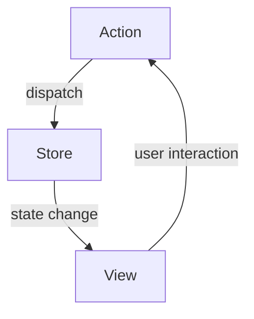

## 7.6 Flux and Redux Patterns in Swift

Managing the state of an application can be one of the most challenging aspects of software development, especially as applications grow in complexity. The Flux and Redux patterns offer a robust solution to this problem by providing a predictable state management system through unidirectional data flow. In this section, we will delve into the intricacies of implementing Flux and Redux in Swift, explore their core components, and provide practical examples to illustrate their application.

### Intent

The primary intent of the Flux and Redux patterns is to manage the state of an application in a predictable and consistent manner. By enforcing a unidirectional data flow and centralizing state management, these patterns help developers maintain a single source of truth, making applications easier to debug and reason about.

### Implementing Flux/Redux in Swift

To implement Flux and Redux patterns in Swift, we need to understand their core components: Store, Actions, Reducers, Middleware, and the concept of Unidirectional Flow.

#### Store

The Store is the heart of the Flux/Redux architecture. It holds the entire application state and provides methods to access the state and dispatch actions.

```swift
import Foundation

// Define the AppState
struct AppState {
    var counter: Int
}

// Define the Store
class Store {
    private var state: AppState
    private let reducer: (AppState, Action) -> AppState
    
    init(initialState: AppState, reducer: @escaping (AppState, Action) -> AppState) {
        self.state = initialState
        self.reducer = reducer
    }
    
    func getState() -> AppState {
        return state
    }
    
    func dispatch(action: Action) {
        state = reducer(state, action)
    }
}
```

**Key Points:**
- The `Store` holds the application state and is the single source of truth.
- It uses a `reducer` to update the state based on dispatched actions.

#### Actions

Actions are plain objects that represent an intention to change the state. They are dispatched to the store to trigger state changes.

```swift
// Define Action Protocol
protocol Action {}

// Define Increment Action
struct IncrementAction: Action {}

// Define Decrement Action
struct DecrementAction: Action {}
```

**Key Points:**
- Actions are simple data structures that convey what happened.
- They are the only way to trigger a state change.

#### Reducers

Reducers are pure functions that take the previous state and an action, and return the next state. They specify how the state changes in response to actions.

```swift
// Define Reducer
func counterReducer(state: AppState, action: Action) -> AppState {
    var state = state
    switch action {
    case is IncrementAction:
        state.counter += 1
    case is DecrementAction:
        state.counter -= 1
    default:
        break
    }
    return state
}
```

**Key Points:**
- Reducers are pure functions and must not have side effects.
- They determine how the state is updated in response to actions.

#### Middleware

Middleware provides a way to extend the store's capabilities by handling asynchronous actions and side effects. They sit between the dispatching of an action and the moment it reaches the reducer.

```swift
// Define Middleware
typealias Middleware = (AppState, Action, @escaping (Action) -> Void) -> Void

// Example Middleware for Logging
let loggingMiddleware: Middleware = { state, action, next in
    print("Action: \\(action)")
    next(action)
}
```

**Key Points:**
- Middleware can intercept dispatched actions and perform tasks such as logging, analytics, or asynchronous operations.
- They enhance the store without modifying the reducer logic.

#### Unidirectional Flow

The unidirectional data flow is a core principle of Flux and Redux. It ensures that data flows in a single direction, making the application more predictable and easier to debug.



**Diagram Description:** The above diagram illustrates the unidirectional data flow in Flux/Redux. Actions are dispatched to the store, which updates the state. The view then reflects the updated state, and user interactions trigger new actions.

### Use Cases and Examples

Flux and Redux patterns are particularly beneficial in state-heavy applications where maintaining state consistency is critical. They provide predictable state management and facilitate debugging with tools like time-travel debugging and action logging.

#### Example: Counter Application

Let's build a simple counter application using the Redux pattern in Swift.

```swift
import SwiftUI

// Define the AppState
struct AppState {
    var counter: Int = 0
}

// Define Actions
protocol Action {}
struct IncrementAction: Action {}
struct DecrementAction: Action {}

// Define Reducer
func counterReducer(state: AppState, action: Action) -> AppState {
    var state = state
    switch action {
    case is IncrementAction:
        state.counter += 1
    case is DecrementAction:
        state.counter -= 1
    default:
        break
    }
    return state
}

// Define Store
class Store: ObservableObject {
    @Published private(set) var state: AppState
    private let reducer: (AppState, Action) -> AppState
    
    init(initialState: AppState, reducer: @escaping (AppState, Action) -> AppState) {
        self.state = initialState
        self.reducer = reducer
    }
    
    func dispatch(action: Action) {
        state = reducer(state, action)
    }
}

// SwiftUI View
struct CounterView: View {
    @ObservedObject var store: Store
    
    var body: some View {
        VStack {
            Text("Counter: \\(store.state.counter)")
            HStack {
                Button("Increment") {
                    store.dispatch(action: IncrementAction())
                }
                Button("Decrement") {
                    store.dispatch(action: DecrementAction())
                }
            }
        }
    }
}

// Main App
@main
struct CounterApp: App {
    var body: some Scene {
        WindowGroup {
            CounterView(store: Store(initialState: AppState(), reducer: counterReducer))
        }
    }
}
```

**Try It Yourself:** Modify the counter application to add a reset button that resets the counter to zero. Implement a `ResetAction` and update the reducer accordingly.

### Design Considerations

When implementing Flux and Redux patterns in Swift, consider the following:

- **Complexity**: While these patterns provide a structured way to manage state, they can introduce complexity, especially in smaller applications.
- **Performance**: Ensure that the state updates are efficient to prevent performance bottlenecks.
- **Testing**: The separation of concerns makes it easier to test individual components like reducers and middleware.

### Swift Unique Features

Swift's type system and protocol-oriented programming features enhance the implementation of Flux and Redux patterns. Use Swift's `enum` for defining actions and leverage `Combine` for reactive state management.

**Example with Combine:**

```swift
import Combine

class Store: ObservableObject {
    @Published private(set) var state: AppState
    private let reducer: (AppState, Action) -> AppState
    private var cancellables = Set<AnyCancellable>()
    
    init(initialState: AppState, reducer: @escaping (AppState, Action) -> AppState) {
        self.state = initialState
        self.reducer = reducer
    }
    
    func dispatch(action: Action) {
        state = reducer(state, action)
    }
    
    func bind(to publisher: AnyPublisher<Action, Never>) {
        publisher
            .sink { [weak self] action in
                self?.dispatch(action: action)
            }
            .store(in: &cancellables)
    }
}
```

### Differences and Similarities

Flux and Redux are often confused due to their similarities, but they have distinct differences:

- **Flux**: Originated by Facebook, it allows multiple stores and is more flexible in terms of architecture.
- **Redux**: A strict implementation of Flux with a single store and pure reducers, emphasizing immutability and functional programming principles.

### Conclusion

The Flux and Redux patterns provide a powerful framework for managing application state in Swift. By enforcing a unidirectional data flow and centralizing state management, they help developers build scalable and maintainable applications. As you explore these patterns, remember to leverage Swift's unique features to enhance your implementation.

## Quiz Time!



### What is the primary intent of the Flux and Redux patterns?

- [x] To manage the state of an application in a predictable and consistent manner.
- [ ] To allow multiple sources of truth in an application.
- [ ] To enable bidirectional data flow in applications.
- [ ] To replace the need for any state management.

> **Explanation:** The primary intent of Flux and Redux is to manage application state predictably through unidirectional data flow and centralized state management.

### In the context of Redux, what is the role of a reducer?

- [x] To take the previous state and an action, and return the next state.
- [ ] To dispatch actions to the store.
- [ ] To hold the entire application state.
- [ ] To perform side effects and asynchronous operations.

> **Explanation:** Reducers are pure functions that determine how the state changes in response to actions.

### What is a key characteristic of middleware in Redux?

- [x] It can intercept dispatched actions and perform tasks such as logging or asynchronous operations.
- [ ] It holds the entire application state.
- [ ] It is responsible for rendering the UI.
- [ ] It defines the structure of actions.

> **Explanation:** Middleware sits between the dispatching of an action and the moment it reaches the reducer, allowing for tasks like logging or handling asynchronous operations.

### Which of the following best describes unidirectional data flow in Flux/Redux?

- [x] Data flows in a single direction from actions to store to view.
- [ ] Data flows back and forth between the view and the store.
- [ ] Data is bidirectional between components.
- [ ] Data flows from the view to the store and back to the view.

> **Explanation:** Unidirectional data flow ensures that data flows in one direction, making the application more predictable and easier to debug.

### What is the main difference between Flux and Redux?

- [x] Flux allows multiple stores, while Redux uses a single store with pure reducers.
- [ ] Redux allows multiple stores, while Flux uses a single store with pure reducers.
- [ ] Flux and Redux are identical in their implementation.
- [ ] Flux is a strict implementation of Redux.

> **Explanation:** Flux allows for multiple stores and is more flexible, whereas Redux uses a single store and emphasizes immutability and functional programming.

### In a Redux pattern, what is the only way to trigger a state change?

- [x] By dispatching an action.
- [ ] By directly modifying the state.
- [ ] By calling a reducer.
- [ ] By updating the store directly.

> **Explanation:** Actions are the only way to trigger a state change in Redux, ensuring a predictable flow of data.

### How can Swift's Combine framework enhance Redux implementations?

- [x] By providing reactive state management and handling asynchronous actions.
- [ ] By replacing the need for reducers.
- [ ] By allowing multiple stores in the application.
- [ ] By eliminating the need for actions.

> **Explanation:** Combine can be used to create reactive state management systems, enhancing Redux implementations with asynchronous capabilities.

### Which component of Redux is responsible for holding the entire application state?

- [x] Store
- [ ] Reducer
- [ ] Middleware
- [ ] Action

> **Explanation:** The Store is responsible for holding the entire application state and is the single source of truth.

### What is a common use case for Flux and Redux patterns?

- [x] State-heavy applications where maintaining state consistency is critical.
- [ ] Applications with minimal state requirements.
- [ ] Small, simple applications with few components.
- [ ] Stateless applications.

> **Explanation:** Flux and Redux are particularly beneficial in applications where state consistency and predictability are critical.

### True or False: Middleware in Redux can perform asynchronous operations.

- [x] True
- [ ] False

> **Explanation:** Middleware can intercept actions and perform asynchronous operations, enhancing the capabilities of the Redux store.



Remember, mastering Flux and Redux patterns in Swift is a journey. As you continue to explore and implement these patterns, you'll gain deeper insights into managing complex application states effectively. Keep experimenting, stay curious, and enjoy the journey of building robust Swift applications!


