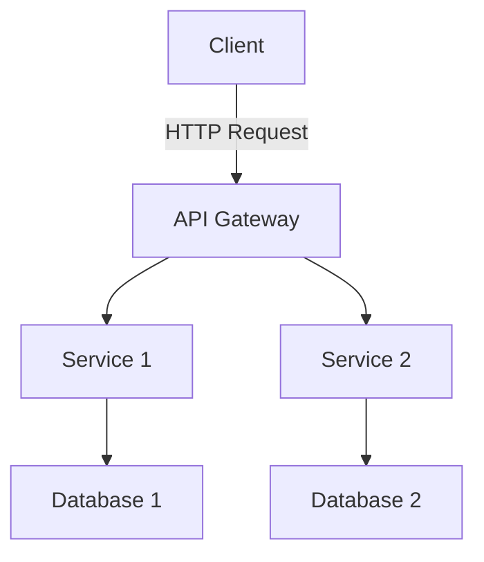

## 7.7 Microservices and Server-Side Swift

### Intent
Architect applications as a collection of loosely coupled services that can be developed, deployed, and scaled independently.

---

### Introduction to Microservices Architecture

Microservices architecture is a design pattern where applications are structured as a collection of loosely coupled services. Each service is self-contained, focusing on a specific business capability. This approach contrasts with traditional monolithic architectures, where all components are tightly interwoven, making scaling and maintenance more challenging.

In the context of Swift, microservices can be leveraged to build scalable, robust server-side applications. With Swift's performance and safety features, it is becoming a viable option for server-side development, especially with the advent of frameworks like Vapor and Kitura.

### Implementing Microservices in Swift

#### Using Frameworks

**Vapor and Kitura** are two prominent server-side Swift frameworks that facilitate microservices development. These frameworks provide tools and libraries to build RESTful APIs, manage routing, and handle requests efficiently.

- **Vapor**: Known for its simplicity and performance, Vapor is a popular choice for Swift developers. It offers a rich ecosystem of packages for tasks like authentication, database interaction, and more.

- **Kitura**: Developed by IBM, Kitura is another robust framework that supports Swift on the server. It integrates well with IBM Cloud services and provides features like web sockets, JSON parsing, and more.

#### Service Decomposition

Service decomposition is the process of breaking down an application into smaller, manageable services. This involves identifying the core functionalities of the application and encapsulating them into independent services.

- **Identify Boundaries**: Determine the boundaries of each service based on business capabilities. Services should be cohesive and loosely coupled.

- **Define Interfaces**: Clearly define the interfaces for each service. This includes RESTful APIs or message queues for inter-service communication.

- **Data Management**: Each service should manage its own data, ensuring data consistency and integrity.

#### Communication

Communication between microservices can be achieved through various methods:

- **RESTful APIs**: Use HTTP protocols to enable synchronous communication between services. This is a common approach due to its simplicity and widespread adoption.

- **Message Queues**: For asynchronous communication, message queues like RabbitMQ or Kafka can be used. This decouples services and enhances scalability.

- **GraphQL**: An alternative to REST, GraphQL allows clients to request only the data they need, reducing over-fetching and under-fetching issues.

#### Deployment

Deploying microservices involves packaging services into containers for consistency across environments. Docker is a popular tool for containerization, allowing services to be deployed and scaled independently.

- **Containerization with Docker**: Package each service into a Docker container. This ensures that services run consistently across different environments.

- **Orchestration with Kubernetes**: Use Kubernetes to manage and scale containers. It provides features like load balancing, service discovery, and automated deployments.

- **Continuous Integration/Continuous Deployment (CI/CD)**: Implement CI/CD pipelines to automate the build, test, and deployment processes. This reduces the time to market and enhances reliability.

### Use Cases and Examples

#### Scalable Backends

Microservices are ideal for building scalable backends. They allow services to be scaled independently based on demand, optimizing resource utilization.

```swift
import Vapor

// Define a simple Vapor service
func routes(_ app: Application) throws {
    app.get("hello") { req in
        return "Hello, world!"
    }
}

let app = try Application(.detect())
try configure(app)
try app.run()
```

In this example, a simple Vapor service is defined that responds with "Hello, world!" to HTTP GET requests. This service can be scaled independently to handle increased traffic.

#### Independent Deployments

Microservices enable independent deployments, allowing services to be updated without affecting others. This is crucial for maintaining uptime and reducing deployment risks.

```swift
// Example of a microservice that handles user authentication
app.post("login") { req -> String in
    let user = try req.content.decode(User.self)
    // Authenticate user
    return "User authenticated"
}
```

Here, a microservice handles user authentication. It can be updated or scaled without impacting other services, such as those handling product listings or order processing.

#### Cross-Team Development

Microservices facilitate cross-team development by allowing teams to own different services. This promotes autonomy and accelerates development.

```swift
// Team A's service
app.get("products") { req -> [Product] in
    // Return a list of products
}

// Team B's service
app.get("orders") { req -> [Order] in
    // Return a list of orders
}
```

In this scenario, Team A manages the product service, while Team B handles the order service. Each team can work independently, enhancing productivity and reducing bottlenecks.

### Visualizing Microservices Architecture

Visualizing the architecture of a microservices-based system helps in understanding the interactions and dependencies between services.



In this diagram, the client interacts with the API Gateway, which routes requests to different services. Each service manages its own database, ensuring data encapsulation.

### Design Considerations

When implementing microservices, consider the following:

- **Service Granularity**: Determine the right level of granularity for services. Too fine-grained services can lead to complexity, while too coarse-grained services may hinder scalability.

- **Data Consistency**: Implement strategies for maintaining data consistency across services. This may involve eventual consistency models or distributed transactions.

- **Monitoring and Logging**: Use tools to monitor and log service interactions. This aids in debugging and performance optimization.

- **Security**: Implement security measures to protect inter-service communication and data. This includes using HTTPS, authentication, and authorization mechanisms.

### Swift Unique Features

Swift offers several unique features that make it suitable for server-side development:

- **Type Safety**: Swift's strong type system reduces runtime errors and enhances code reliability.

- **Performance**: Swift's performance is comparable to C-based languages, making it suitable for high-performance applications.

- **Concurrency**: Swift's concurrency model, including async/await, simplifies handling asynchronous operations.

```swift
// Example of using async/await in Swift
func fetchData() async throws -> Data {
    let url = URL(string: "https://api.example.com/data")!
    let (data, _) = try await URLSession.shared.data(from: url)
    return data
}
```

This code snippet demonstrates fetching data asynchronously using Swift's async/await syntax, enhancing readability and maintainability.

### Differences and Similarities

Microservices are often compared to Service-Oriented Architecture (SOA). While both involve building applications as a collection of services, microservices emphasize smaller, independently deployable units and often use lightweight communication protocols like HTTP/REST.

### Knowledge Check

- What are the benefits of using microservices architecture in Swift?
- How do frameworks like Vapor and Kitura facilitate server-side Swift development?
- What are the key considerations when deploying microservices?

### Try It Yourself

Experiment with building a simple microservice using Vapor. Extend the "Hello, world!" example to include additional routes and functionalities. Try deploying the service using Docker and observe how it behaves in different environments.

---

## Quiz Time!



### What is the primary benefit of using microservices architecture?

- [x] Independent scalability and deployment of services
- [ ] Simplified monolithic codebase
- [ ] Reduced need for testing
- [ ] Elimination of network communication

> **Explanation:** Microservices architecture allows services to be independently scaled and deployed, enhancing flexibility and resource utilization.

### Which Swift framework is known for its simplicity and performance in server-side development?

- [x] Vapor
- [ ] Kitura
- [ ] Django
- [ ] Express

> **Explanation:** Vapor is a popular Swift framework known for its simplicity and performance, making it suitable for server-side development.

### What is a common method for inter-service communication in microservices?

- [x] RESTful APIs
- [ ] Direct function calls
- [ ] Shared memory
- [ ] Local files

> **Explanation:** RESTful APIs are commonly used for inter-service communication in microservices due to their simplicity and widespread adoption.

### Which tool is commonly used for containerizing microservices?

- [x] Docker
- [ ] Git
- [ ] Jenkins
- [ ] Ansible

> **Explanation:** Docker is a popular tool for containerizing microservices, ensuring consistency across different environments.

### What is the role of an API Gateway in a microservices architecture?

- [x] Routes requests to appropriate services
- [ ] Stores data for services
- [ ] Compiles code for deployment
- [ ] Monitors network traffic

> **Explanation:** An API Gateway routes client requests to the appropriate services, acting as a single entry point in a microservices architecture.

### Which of the following is a benefit of using message queues in microservices?

- [x] Asynchronous communication
- [ ] Synchronous data processing
- [ ] Direct database access
- [ ] Reduced network latency

> **Explanation:** Message queues enable asynchronous communication between services, decoupling them and enhancing scalability.

### What is a key consideration when determining service granularity in microservices?

- [x] Balance between complexity and scalability
- [ ] Maximizing the number of services
- [ ] Minimizing network communication
- [ ] Ensuring all services are identical

> **Explanation:** Balancing complexity and scalability is crucial when determining service granularity to avoid overly complex systems or scalability issues.

### Which Swift feature enhances code reliability in server-side development?

- [x] Type safety
- [ ] Dynamic typing
- [ ] Manual memory management
- [ ] Weak typing

> **Explanation:** Swift's type safety enhances code reliability by reducing runtime errors.

### How does Swift's concurrency model benefit server-side development?

- [x] Simplifies handling of asynchronous operations
- [ ] Increases code verbosity
- [ ] Requires manual thread management
- [ ] Limits parallel processing

> **Explanation:** Swift's concurrency model, including async/await, simplifies handling asynchronous operations, improving code readability and maintainability.

### True or False: Microservices architecture eliminates the need for network communication.

- [ ] True
- [x] False

> **Explanation:** Microservices architecture relies on network communication for inter-service interactions, often using protocols like HTTP/REST.



Remember, mastering microservices in Swift is a journey. As you continue to explore and experiment, you'll gain deeper insights into building scalable, maintainable systems. Keep pushing the boundaries of what's possible with Swift and server-side development!
