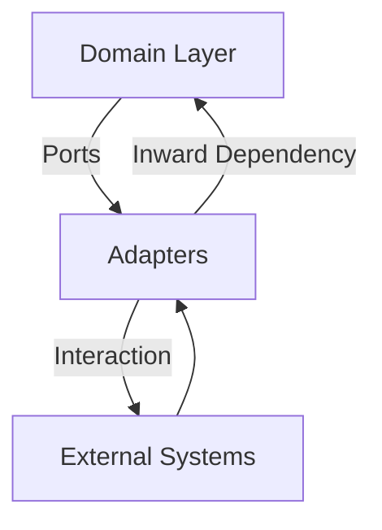

## 7.8 Hexagonal Architecture in Swift

Hexagonal Architecture, also known as the Ports and Adapters pattern, is a software design pattern that aims to isolate the core business logic from external factors like databases, user interfaces, or messaging systems. This architecture promotes a loosely coupled application, making it easier to maintain, test, and adapt to changes.

### Intent

The primary intent of Hexagonal Architecture is to create a system where the core business logic is isolated from external dependencies. This isolation ensures that the core logic remains unaffected by changes in technology or infrastructure, allowing for greater flexibility and scalability.

### Implementing Hexagonal Architecture in Swift

Let's delve into how we can implement Hexagonal Architecture in Swift, covering the key components and their roles.

#### Domain Layer

The Domain Layer is the heart of Hexagonal Architecture. It contains the core business logic and rules that define the application's behavior. This layer should be independent of any external systems or frameworks, focusing solely on the business logic.

```swift
// Domain Model
struct User {
    let id: UUID
    let name: String
    let email: String
}

// Domain Service
protocol UserService {
    func registerUser(name: String, email: String) -> User
}

class DefaultUserService: UserService {
    func registerUser(name: String, email: String) -> User {
        // Core business logic for user registration
        return User(id: UUID(), name: name, email: email)
    }
}
```

In this example, the `User` struct and `UserService` protocol represent the domain model and service, encapsulating the core business logic for user registration.

#### Ports and Adapters

Ports are interfaces that define how the core logic interacts with the outside world, while Adapters are implementations of these interfaces that connect the core logic to external systems.

```swift
// Port
protocol UserRepository {
    func save(user: User)
    func findUser(byEmail email: String) -> User?
}

// Adapter
class InMemoryUserRepository: UserRepository {
    private var users: [String: User] = [:]

    func save(user: User) {
        users[user.email] = user
    }

    func findUser(byEmail email: String) -> User? {
        return users[email]
    }
}
```

Here, `UserRepository` acts as a port, and `InMemoryUserRepository` is an adapter that implements this port, allowing the core logic to interact with an in-memory data store.

#### Inward Dependencies

One of the key principles of Hexagonal Architecture is that dependencies should point inward. This means that external layers depend on the inner domain, not vice versa. This ensures that the core business logic remains unaffected by changes in external systems.

```swift
class UserRegistration {
    private let userService: UserService
    private let userRepository: UserRepository

    init(userService: UserService, userRepository: UserRepository) {
        self.userService = userService
        self.userRepository = userRepository
    }

    func register(name: String, email: String) {
        let user = userService.registerUser(name: name, email: email)
        userRepository.save(user: user)
    }
}
```

In this example, `UserRegistration` depends on the `UserService` and `UserRepository` interfaces, ensuring that the core logic can be tested independently of the actual implementations.

#### Testing

Hexagonal Architecture makes it easier to test the core logic without external dependencies. By mocking the ports, we can test the core business logic in isolation.

```swift
// Mock Repository for Testing
class MockUserRepository: UserRepository {
    private var users: [String: User] = [:]

    func save(user: User) {
        users[user.email] = user
    }

    func findUser(byEmail email: String) -> User? {
        return users[email]
    }
}

// Unit Test
func testUserRegistration() {
    let userService = DefaultUserService()
    let userRepository = MockUserRepository()
    let registration = UserRegistration(userService: userService, userRepository: userRepository)

    registration.register(name: "John Doe", email: "john.doe@example.com")

    assert(userRepository.findUser(byEmail: "john.doe@example.com") != nil)
}
```

By using a `MockUserRepository`, we can test the `UserRegistration` logic without relying on a real data store.

### Use Cases and Examples

Hexagonal Architecture is particularly useful in scenarios where the application needs to be flexible and adaptable to changes. Let's explore some use cases and examples.

#### Test-Driven Development

Hexagonal Architecture simplifies testing of core logic by isolating it from external dependencies. This isolation allows developers to focus on writing tests for the business logic without worrying about the complexities of external systems.

#### Changing Technologies

With Hexagonal Architecture, you can swap out databases or UIs without affecting the core logic. For example, you can replace an in-memory data store with a SQL database by implementing a new adapter for the `UserRepository` port.

```swift
// SQL Adapter
class SQLUserRepository: UserRepository {
    func save(user: User) {
        // Save user to SQL database
    }

    func findUser(byEmail email: String) -> User? {
        // Find user in SQL database
        return nil
    }
}
```

By implementing `SQLUserRepository`, you can switch from an in-memory store to a SQL database without changing the core logic.

#### Plugin Systems

Hexagonal Architecture supports plugin systems by allowing new adapters to be added without modifying the core logic. This makes it easy to extend the application with new features or integrations.

### Visualizing Hexagonal Architecture in Swift

To better understand Hexagonal Architecture, let's visualize it using a diagram.



**Diagram Description**: The diagram illustrates the Hexagonal Architecture with the Domain Layer at the center, surrounded by Ports and Adapters. External systems interact with the Adapters, which in turn depend on the Domain Layer.

### Design Considerations

When implementing Hexagonal Architecture in Swift, consider the following:

- **Decoupling**: Ensure that the core logic is decoupled from external systems by using interfaces (ports).
- **Testing**: Focus on testing the core logic in isolation to ensure its correctness.
- **Flexibility**: Design the architecture to allow easy swapping of technologies by implementing new adapters.

### Swift Unique Features

Swift offers several features that complement Hexagonal Architecture, such as:

- **Protocols**: Use protocols to define ports, allowing for flexible and interchangeable implementations.
- **Structs and Enums**: Leverage value types to model domain entities, ensuring immutability and thread safety.
- **Extensions**: Use extensions to add functionality to domain models without modifying the original code.

### Differences and Similarities

Hexagonal Architecture is often compared to other architectural patterns like Clean Architecture and Onion Architecture. While they share similarities in isolating core logic, Hexagonal Architecture emphasizes the use of ports and adapters to achieve this isolation.

### Try It Yourself

To solidify your understanding of Hexagonal Architecture in Swift, try modifying the code examples:

- Implement a new adapter for the `UserRepository` port using a different storage mechanism, such as a file-based store.
- Write unit tests for the `UserService` to ensure the correctness of the user registration logic.
- Experiment with adding new features to the core logic without affecting the existing adapters.

### Knowledge Check

- What is the primary intent of Hexagonal Architecture?
- How do ports and adapters facilitate flexibility in Hexagonal Architecture?
- Why is it important to have inward dependencies in Hexagonal Architecture?
- How does Hexagonal Architecture simplify testing?

### Embrace the Journey

Remember, mastering Hexagonal Architecture is just the beginning. As you progress, you'll build more scalable and maintainable applications. Keep experimenting, stay curious, and enjoy the journey!

## Quiz Time!



### What is the primary intent of Hexagonal Architecture?

- [x] Isolate the core business logic from external dependencies
- [ ] Improve the user interface design
- [ ] Enhance database performance
- [ ] Simplify network communication

> **Explanation:** The primary intent of Hexagonal Architecture is to isolate the core business logic from external dependencies, promoting a loosely coupled application.

### What role do ports play in Hexagonal Architecture?

- [x] Define interfaces for interacting with the core logic
- [ ] Store data persistently
- [ ] Handle user input
- [ ] Manage network connections

> **Explanation:** Ports define interfaces for interacting with the core logic, allowing for flexible and interchangeable implementations.

### How do adapters function in Hexagonal Architecture?

- [x] Implement ports to connect core logic with external systems
- [ ] Provide user interface components
- [ ] Enhance security protocols
- [ ] Manage application state

> **Explanation:** Adapters implement ports to connect core logic with external systems, facilitating communication between them.

### What is a key benefit of inward dependencies?

- [x] Ensures core logic remains unaffected by external changes
- [ ] Improves application startup time
- [ ] Enhances graphical rendering
- [ ] Simplifies database queries

> **Explanation:** Inward dependencies ensure that the core logic remains unaffected by changes in external systems, maintaining its integrity.

### Which Swift feature is particularly useful for defining ports?

- [x] Protocols
- [ ] Classes
- [ ] Enums
- [ ] Extensions

> **Explanation:** Protocols are particularly useful for defining ports, as they allow for flexible and interchangeable implementations.

### How does Hexagonal Architecture simplify testing?

- [x] By isolating core logic from external dependencies
- [ ] By reducing code complexity
- [ ] By enhancing graphical user interfaces
- [ ] By optimizing network traffic

> **Explanation:** Hexagonal Architecture simplifies testing by isolating core logic from external dependencies, allowing for focused and independent testing.

### What is a common use case for Hexagonal Architecture?

- [x] Changing technologies without affecting core logic
- [ ] Enhancing visual design of applications
- [ ] Improving database indexing
- [ ] Simplifying user authentication

> **Explanation:** A common use case for Hexagonal Architecture is changing technologies, such as databases or UIs, without affecting the core logic.

### How do plugins fit into Hexagonal Architecture?

- [x] By allowing new adapters to be added without modifying core logic
- [ ] By enhancing user interface components
- [ ] By optimizing memory usage
- [ ] By managing network protocols

> **Explanation:** Plugins fit into Hexagonal Architecture by allowing new adapters to be added without modifying the core logic, facilitating extensibility.

### What is a similarity between Hexagonal Architecture and Clean Architecture?

- [x] Both isolate core logic from external dependencies
- [ ] Both focus on user interface design
- [ ] Both enhance network performance
- [ ] Both simplify database management

> **Explanation:** Both Hexagonal Architecture and Clean Architecture isolate core logic from external dependencies, promoting maintainability and flexibility.

### True or False: Hexagonal Architecture is also known as the Ports and Adapters pattern.

- [x] True
- [ ] False

> **Explanation:** True. Hexagonal Architecture is also known as the Ports and Adapters pattern, emphasizing the use of interfaces and implementations to isolate core logic.


