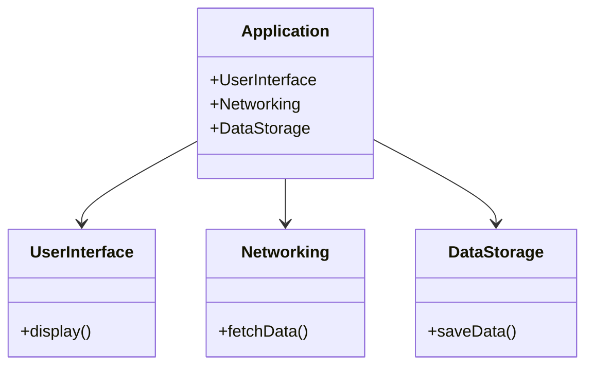

## 7.9 Modular Architecture and Reusable Components

In the ever-evolving world of software development, creating scalable, maintainable, and efficient applications is paramount. Modular architecture in Swift serves as a powerful approach to achieve these goals, allowing developers to organize codebases into discrete, reusable components. This section delves into the principles of modular architecture, its implementation in Swift, and the benefits it offers.

### Intent

The primary intent of modular architecture is to organize a codebase into separate modules or libraries that can be developed and maintained independently. This approach not only enhances code reusability but also improves collaboration among large teams and reduces build times.

### Implementing Modular Architecture in Swift

#### Frameworks and Libraries

Frameworks and libraries are foundational elements of modular architecture. They encapsulate functionality into reusable units with well-defined interfaces, promoting code reuse across different projects.

- **Creating a Framework**: In Xcode, create a new project and select "Framework" as the template. This allows you to define public interfaces while keeping internal details hidden.
  
- **Defining Interfaces**: Use protocols and public classes to define the interfaces of your framework. This ensures that only the necessary parts of your code are exposed to the outside world.

- **Encapsulation**: Use Swift's access control mechanisms (`public`, `internal`, `private`) to encapsulate your code effectively. This limits the visibility of internal components and reduces the risk of unintended interactions.

```swift
// Example of a simple framework interface
public protocol DataService {
    func fetchData() -> [String]
}

public class NetworkDataService: DataService {
    public init() {}
    
    public func fetchData() -> [String] {
        // Fetch data from network
        return ["Data1", "Data2", "Data3"]
    }
}
```

#### Swift Packages

Swift Package Manager (SPM) is a tool for managing the distribution of Swift code. It simplifies the process of adding dependencies and organizing code into packages.

- **Creating a Swift Package**: Use the `swift package init` command to create a new package. This generates a basic structure with a `Package.swift` file for defining dependencies and targets.

- **Defining Dependencies**: In the `Package.swift` file, specify your package's dependencies and targets. This promotes clear dependency management and modularization.

```swift
// Example of a Package.swift file
// swift-tools-version:5.5
import PackageDescription

let package = Package(
    name: "MyLibrary",
    products: [
        .library(name: "MyLibrary", targets: ["MyLibrary"]),
    ],
    dependencies: [
        // Define dependencies here
    ],
    targets: [
        .target(name: "MyLibrary", dependencies: []),
        .testTarget(name: "MyLibraryTests", dependencies: ["MyLibrary"]),
    ]
)
```

#### Encapsulation

Encapsulation is a core principle of modular architecture. By limiting the visibility of internal components, you can prevent unwanted dependencies and interactions.

- **Access Control**: Use Swift's access control keywords (`public`, `internal`, `fileprivate`, `private`) to define the visibility of your classes, methods, and properties.

- **Internal Components**: Keep internal components hidden from other modules by using `internal` or `private` access levels. This ensures that only the necessary parts of your code are exposed.

#### Dependency Management

Clear dependency management is crucial for modular architecture. Define dependencies between modules to ensure that each module functions independently.

- **Dependency Injection**: Use dependency injection to provide modules with their dependencies. This promotes loose coupling and enhances testability.

- **Decoupling**: Avoid tight coupling between modules by using protocols and interfaces. This allows you to swap implementations without affecting the rest of the codebase.

### Use Cases and Examples

#### Large Teams

In large development teams, modular architecture allows different teams to work on separate modules simultaneously. This parallel development reduces bottlenecks and accelerates the development process.

- **Example**: In a large e-commerce application, one team can work on the payment module while another team focuses on the product catalog. Each module can be developed, tested, and deployed independently.

#### Code Reusability

Modular architecture promotes code reusability by allowing common functionality to be shared across multiple projects. This reduces duplication and enhances maintainability.

- **Example**: A logging framework can be developed as a separate module and reused across different applications. This ensures consistent logging behavior and reduces the need for redundant code.

#### Faster Build Times

By modularizing your codebase, you can modify one module without recompiling the entire application. This leads to faster build times and more efficient development cycles.

- **Example**: In a modularized project, changes to the user interface module do not require recompiling the networking module, resulting in quicker iteration times.

### Visualizing Modular Architecture

To better understand modular architecture, let's visualize the relationships between modules using a class diagram.



**Diagram Description**: This class diagram illustrates a simple modular architecture where the `Application` class depends on three modules: `UserInterface`, `Networking`, and `DataStorage`. Each module encapsulates specific functionality, promoting separation of concerns and modularity.

### Swift Unique Features

Swift offers several unique features that enhance modular architecture:

- **Protocol-Oriented Programming**: Swift's emphasis on protocols allows for flexible and reusable interfaces. Use protocols to define module interfaces and promote loose coupling.

- **Value Types**: Swift's value types, such as structs and enums, can be used to create lightweight, reusable components that are easy to test and maintain.

- **Generics**: Use generics to create flexible and reusable components that can work with different data types.

```swift
// Example of a generic reusable component
struct Container<T> {
    private var items: [T] = []
    
    mutating func addItem(_ item: T) {
        items.append(item)
    }
    
    func getItems() -> [T] {
        return items
    }
}
```

### Design Considerations

When implementing modular architecture, consider the following:

- **Balance**: Strive for a balance between modularity and complexity. Over-modularization can lead to unnecessary complexity and increased maintenance overhead.

- **Cohesion**: Ensure that each module has a single responsibility and high cohesion. This promotes maintainability and reduces the risk of unintended interactions.

- **Scalability**: Design your modules with scalability in mind. Consider future growth and potential changes to ensure that your architecture can adapt to evolving requirements.

### Try It Yourself

To reinforce your understanding of modular architecture, try the following exercises:

1. **Create a Swift Package**: Use Swift Package Manager to create a simple package with a reusable component. Define a protocol and its implementation, and test the package in a separate project.

2. **Modularize an Existing Project**: Take an existing project and identify areas that can be modularized. Create separate frameworks or packages for these components and refactor the codebase accordingly.

3. **Experiment with Access Control**: Modify the access levels of classes, methods, and properties in a project to see how encapsulation affects modularity and code organization.

### Knowledge Check

- What are the benefits of using modular architecture in Swift?
- How does Swift's access control enhance encapsulation in modular architecture?
- What role do protocols play in modular architecture?
- How can modular architecture improve build times and development efficiency?

### Embrace the Journey

Remember, mastering modular architecture is a journey. As you explore and implement these concepts, you'll gain valuable insights into building scalable and maintainable applications. Keep experimenting, stay curious, and enjoy the process of creating robust software solutions.

## Quiz Time!



### What is the primary intent of modular architecture?

- [x] To organize a codebase into separate modules that can be developed independently.
- [ ] To increase the complexity of the codebase.
- [ ] To reduce the number of developers needed for a project.
- [ ] To eliminate the need for testing.

> **Explanation:** Modular architecture aims to organize a codebase into separate modules or libraries that can be developed and maintained independently.

### How does Swift's access control contribute to modular architecture?

- [x] By limiting the visibility of internal components.
- [ ] By making all components public.
- [ ] By removing the need for encapsulation.
- [ ] By increasing code complexity.

> **Explanation:** Swift's access control mechanisms help encapsulate code, limiting the visibility of internal components and reducing unintended interactions.

### Which tool is used for managing Swift dependencies and organizing code into packages?

- [x] Swift Package Manager
- [ ] CocoaPods
- [ ] Carthage
- [ ] Xcode

> **Explanation:** Swift Package Manager is a tool for managing the distribution of Swift code and organizing it into packages.

### What is a key benefit of modular architecture for large teams?

- [x] Different teams can work on different modules simultaneously.
- [ ] It reduces the need for communication between teams.
- [ ] It allows one team to control the entire codebase.
- [ ] It eliminates the need for project management.

> **Explanation:** Modular architecture allows different teams to work on separate modules simultaneously, reducing bottlenecks and accelerating development.

### How does modular architecture affect build times?

- [x] It can reduce build times by allowing modifications to one module without recompiling the entire app.
- [ ] It increases build times by adding more modules.
- [ ] It has no effect on build times.
- [ ] It requires the entire app to be recompiled for any change.

> **Explanation:** By modularizing the codebase, you can modify one module without recompiling the entire application, leading to faster build times.

### What is a common pitfall of over-modularization?

- [x] Increased complexity and maintenance overhead.
- [ ] Reduced code reuse.
- [ ] Slower build times.
- [ ] Decreased team collaboration.

> **Explanation:** Over-modularization can lead to unnecessary complexity and increased maintenance overhead.

### Which Swift feature allows for flexible and reusable interfaces in modular architecture?

- [x] Protocols
- [ ] Classes
- [ ] Enums
- [ ] Closures

> **Explanation:** Swift's emphasis on protocols allows for flexible and reusable interfaces, promoting loose coupling.

### What is a key consideration when designing modules for scalability?

- [x] Consider future growth and potential changes.
- [ ] Focus only on current requirements.
- [ ] Avoid using protocols.
- [ ] Make all components public.

> **Explanation:** Design modules with scalability in mind by considering future growth and potential changes to ensure adaptability.

### Which of the following is NOT a benefit of modular architecture?

- [ ] Code reusability
- [ ] Faster build times
- [x] Increased code duplication
- [ ] Improved collaboration among teams

> **Explanation:** Modular architecture reduces code duplication by promoting code reusability and improved collaboration.

### True or False: Modular architecture eliminates the need for testing.

- [ ] True
- [x] False

> **Explanation:** Modular architecture does not eliminate the need for testing; it enhances testability by promoting loose coupling and clear interfaces.


