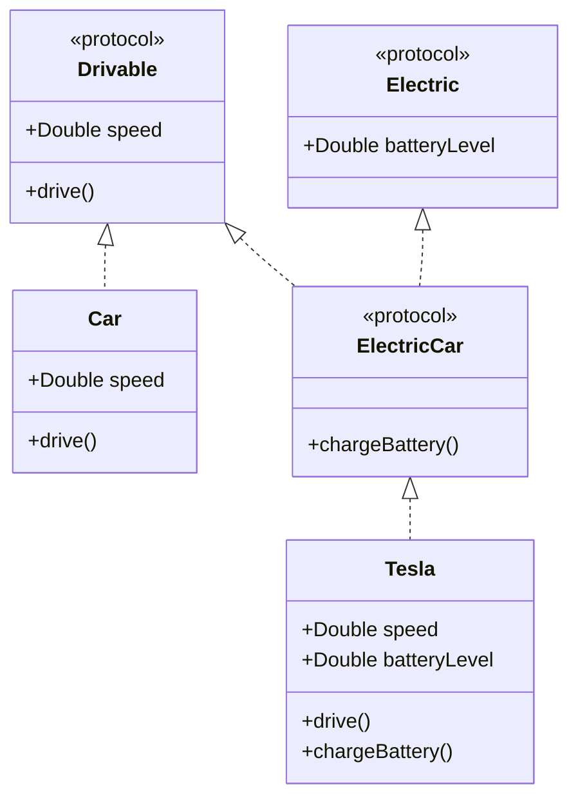

## 8.1 Protocol-Oriented Programming Patterns

Swift has revolutionized the way we think about programming paradigms by introducing Protocol-Oriented Programming (POP). This approach emphasizes the use of protocols to define blueprints of methods, properties, and other requirements that suit particular tasks or functionalities. Protocols in Swift provide a flexible alternative to class inheritance, allowing developers to create more modular and reusable code. In this section, we'll delve into the core concepts of POP, explore how to implement it in Swift, and examine its practical applications.

### Intent

The primary intent of Protocol-Oriented Programming is to embrace Swift's emphasis on protocols to build flexible and reusable code, focusing on behavior rather than inheritance. This approach encourages the composition of behaviors and functionalities through protocols, making code more adaptable and easier to maintain.

### Implementing POP in Swift

Let's explore the key components of implementing Protocol-Oriented Programming in Swift:

#### Defining Protocols

Protocols in Swift define a blueprint of methods, properties, and other requirements that suit a particular task or piece of functionality. They can be adopted by classes, structs, and enums to provide an actual implementation of those requirements.

```swift
protocol Drivable {
    var speed: Double { get }
    func drive()
}

struct Car: Drivable {
    var speed: Double
    
    func drive() {
        print("Driving at \\(speed) km/h")
    }
}
```

In the example above, `Drivable` is a protocol with a property `speed` and a method `drive()`. The `Car` struct conforms to the `Drivable` protocol by implementing the required property and method.

#### Protocol Extensions

Swift allows you to extend protocols to provide default implementations for methods and properties. This feature enables you to add functionality to types that conform to the protocol without requiring changes to the original type.

```swift
extension Drivable {
    func stop() {
        print("Stopping the vehicle.")
    }
}

let myCar = Car(speed: 80)
myCar.drive() // Outputs: Driving at 80 km/h
myCar.stop()  // Outputs: Stopping the vehicle.
```

Here, we extend the `Drivable` protocol to include a `stop()` method. Any type that conforms to `Drivable` will automatically have access to this method.

#### Protocol Inheritance

Protocols can inherit from other protocols, allowing you to build complex protocols by combining simpler ones. This inheritance enables a more modular and scalable design.

```swift
protocol Electric {
    var batteryLevel: Double { get }
}

protocol ElectricCar: Drivable, Electric {
    func chargeBattery()
}

struct Tesla: ElectricCar {
    var speed: Double
    var batteryLevel: Double
    
    func drive() {
        print("Driving at \\(speed) km/h with battery level at \\(batteryLevel)%")
    }
    
    func chargeBattery() {
        print("Charging battery...")
    }
}
```

In this example, `ElectricCar` inherits from both `Drivable` and `Electric`, creating a more specific protocol for electric cars. The `Tesla` struct conforms to `ElectricCar`, implementing all required properties and methods.

#### Generic Programming

Swift's protocols can be combined with generics to create flexible and reusable components. This combination allows you to define protocols with associated types and use them in generic programming.

```swift
protocol Container {
    associatedtype Item
    var items: [Item] { get set }
    mutating func addItem(_ item: Item)
}

struct Box<T>: Container {
    var items: [T] = []
    
    mutating func addItem(_ item: T) {
        items.append(item)
    }
}

var intBox = Box<Int>()
intBox.addItem(5)
print(intBox.items) // Outputs: [5]
```

In this code, the `Container` protocol has an associated type `Item`. The `Box` struct conforms to `Container` and uses a generic type `T` to define the type of items it can hold.

### Use Cases and Examples

Protocol-Oriented Programming offers several practical benefits and use cases:

#### Decoupling

By using protocols, you can reduce reliance on concrete types, leading to more decoupled and testable code.

```swift
protocol PaymentMethod {
    func processPayment(amount: Double)
}

class CreditCard: PaymentMethod {
    func processPayment(amount: Double) {
        print("Processing credit card payment of \\(amount)")
    }
}

class PaymentProcessor {
    var paymentMethod: PaymentMethod
    
    init(paymentMethod: PaymentMethod) {
        self.paymentMethod = paymentMethod
    }
    
    func process(amount: Double) {
        paymentMethod.processPayment(amount: amount)
    }
}

let creditCard = CreditCard()
let processor = PaymentProcessor(paymentMethod: creditCard)
processor.process(amount: 100.0)
```

Here, `PaymentProcessor` relies on the `PaymentMethod` protocol rather than a specific payment method, making it easy to swap out different payment methods.

#### Mixins

Protocols can be used to compose behaviors from multiple protocols, similar to mixins in other programming languages.

```swift
protocol Flyable {
    func fly()
}

protocol Swimmable {
    func swim()
}

struct Duck: Flyable, Swimmable {
    func fly() {
        print("Flying")
    }
    
    func swim() {
        print("Swimming")
    }
}

let duck = Duck()
duck.fly()  // Outputs: Flying
duck.swim() // Outputs: Swimming
```

In this example, `Duck` adopts both `Flyable` and `Swimmable`, allowing it to exhibit both behaviors.

#### Mocking

Protocols simplify unit testing by allowing you to mock protocol conformance. This feature is particularly useful for testing interactions with external systems.

```swift
protocol NetworkService {
    func fetchData(completion: (Data?) -> Void)
}

class MockNetworkService: NetworkService {
    func fetchData(completion: (Data?) -> Void) {
        let mockData = Data([0x00, 0x01, 0x02])
        completion(mockData)
    }
}

class DataManager {
    var networkService: NetworkService
    
    init(networkService: NetworkService) {
        self.networkService = networkService
    }
    
    func loadData() {
        networkService.fetchData { data in
            if let data = data {
                print("Data received: \\(data)")
            }
        }
    }
}

let mockService = MockNetworkService()
let dataManager = DataManager(networkService: mockService)
dataManager.loadData() // Outputs: Data received: 3 bytes
```

In this example, `MockNetworkService` conforms to `NetworkService` and provides mock data for testing purposes.

### Visualizing Protocol-Oriented Programming

To better understand how protocols interact with different types, let's visualize these relationships using a class diagram.



This diagram illustrates how protocols can be used to define interfaces and how structs or classes can conform to these protocols.

### Design Considerations

When using Protocol-Oriented Programming, consider the following:

- **Protocol Segregation**: Avoid creating large, monolithic protocols. Instead, break them down into smaller, more focused protocols.
- **Default Implementations**: Use protocol extensions to provide default implementations, but be cautious of adding too much logic, which can lead to unexpected behavior.
- **Protocol Composition**: Leverage protocol composition to create flexible and modular designs.
- **Performance**: Be aware that protocol-oriented designs can introduce some performance overhead due to dynamic dispatch.

### Swift Unique Features

Swift's unique features, such as protocol extensions and associated types, make Protocol-Oriented Programming particularly powerful. These features allow you to define flexible and reusable components that can adapt to various contexts.

### Differences and Similarities

Protocol-Oriented Programming is often compared to Object-Oriented Programming (OOP). While both paradigms allow for code reuse and abstraction, POP focuses on behavior and composition, whereas OOP emphasizes inheritance and hierarchy. Understanding these differences helps you choose the right approach for your specific use case.

### Try It Yourself

Now that we've covered the fundamentals of Protocol-Oriented Programming, try experimenting with these concepts in your own projects. Consider creating a protocol to define a common interface for different types and use protocol extensions to add shared functionality. Experiment with protocol inheritance and composition to see how they can simplify your code.

### Conclusion

Protocol-Oriented Programming in Swift offers a powerful paradigm for building flexible, reusable, and scalable code. By focusing on behavior rather than inheritance, POP encourages a more modular and adaptable design. As you continue to explore Swift, keep these principles in mind and leverage protocols to create robust and maintainable applications.

## Quiz Time!



### What is the primary intent of Protocol-Oriented Programming in Swift?

- [x] To build flexible and reusable code by focusing on behavior rather than inheritance
- [ ] To replace all object-oriented programming concepts
- [ ] To eliminate the use of classes entirely
- [ ] To make Swift code more complex

> **Explanation:** Protocol-Oriented Programming emphasizes using protocols to define behavior, leading to more flexible and reusable code.

### Which Swift feature allows you to provide default implementations for protocol methods?

- [x] Protocol Extensions
- [ ] Protocol Inheritance
- [ ] Generic Programming
- [ ] Associated Types

> **Explanation:** Protocol extensions in Swift allow you to provide default implementations for methods and properties in protocols.

### How can protocols help in unit testing?

- [x] By allowing you to mock protocol conformance
- [ ] By eliminating the need for testing
- [ ] By making tests more complex
- [ ] By reducing code readability

> **Explanation:** Protocols allow you to mock conformance, making it easier to test interactions with external systems.

### What is a potential performance consideration when using Protocol-Oriented Programming?

- [x] Dynamic dispatch can introduce performance overhead
- [ ] Protocols make code execution faster
- [ ] Protocols eliminate memory usage
- [ ] Protocols reduce the need for optimization

> **Explanation:** Protocol-oriented designs can introduce performance overhead due to dynamic dispatch.

### What should you avoid when designing protocols?

- [x] Creating large, monolithic protocols
- [ ] Using protocol extensions
- [ ] Composing protocols
- [ ] Using associated types

> **Explanation:** Large, monolithic protocols can be difficult to manage and should be avoided in favor of smaller, focused protocols.

### What is a key difference between POP and OOP?

- [x] POP focuses on behavior and composition, while OOP emphasizes inheritance and hierarchy
- [ ] POP eliminates the need for classes
- [ ] OOP is more flexible than POP
- [ ] POP and OOP are identical

> **Explanation:** POP focuses on behavior and composition, whereas OOP emphasizes inheritance and hierarchy.

### Which protocol feature allows you to define a blueprint of methods and properties?

- [x] Protocols
- [ ] Classes
- [ ] Structs
- [ ] Enums

> **Explanation:** Protocols define a blueprint of methods, properties, and other requirements that suit a particular task or functionality.

### What is the benefit of using protocol composition?

- [x] It creates flexible and modular designs
- [ ] It makes code more complex
- [ ] It reduces code readability
- [ ] It eliminates the need for testing

> **Explanation:** Protocol composition allows for flexible and modular designs by combining multiple protocols.

### What is the role of associated types in protocols?

- [x] They allow protocols to be used with generics
- [ ] They eliminate the need for generics
- [ ] They make protocols slower
- [ ] They reduce code flexibility

> **Explanation:** Associated types allow protocols to be used with generics, enhancing flexibility and reusability.

### True or False: Protocol-Oriented Programming can only be used with classes in Swift.

- [ ] True
- [x] False

> **Explanation:** Protocol-Oriented Programming can be used with classes, structs, and enums in Swift.




