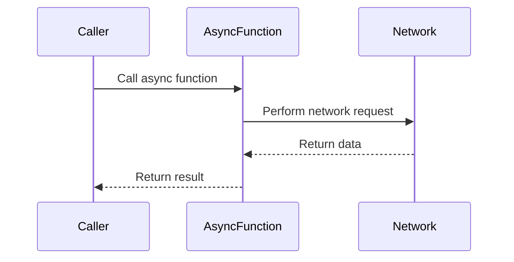

## 8.10 Swift Concurrency Patterns: Async/Await and Actors

Concurrency is a fundamental aspect of modern software development, enabling applications to perform multiple tasks simultaneously. Swift's introduction of `async/await` and `actors` offers developers powerful tools to write readable and safe asynchronous code while managing mutable state in concurrent environments. In this section, we will explore these concepts in detail, providing you with the knowledge to harness Swift's concurrency model effectively.

### Intent

The intent of using `async/await` and `actors` in Swift is to simplify asynchronous programming and ensure thread-safe access to mutable state. By leveraging these features, developers can write more maintainable and efficient code, reducing the complexity traditionally associated with concurrency.

### Implementing Async/Await in Swift

#### Asynchronous Functions

Asynchronous functions in Swift are marked with the `async` keyword. This indicates that the function can perform asynchronous operations and may suspend its execution to wait for a result. Here's how you can define an asynchronous function:

```swift
// Define an asynchronous function to fetch data from a URL
func fetchData(from url: URL) async throws -> Data {
    let (data, _) = try await URLSession.shared.data(from: url)
    return data
}
```

In this example, `fetchData(from:)` is an asynchronous function that fetches data from a given URL. The `try await` keywords are used to handle potential errors and to pause execution until the data is retrieved.

#### Awaiting Results

The `await` keyword is used to pause the execution of an asynchronous function until a result is available. This allows for a more synchronous-like flow in asynchronous code, making it easier to read and understand. Here's an example of using `await`:

```swift
// Call the asynchronous function and await its result
Task {
    do {
        let url = URL(string: "https://example.com/data")!
        let data = try await fetchData(from: url)
        print("Data received: \\(data)")
    } catch {
        print("Error fetching data: \\(error)")
    }
}
```

In this code, we create a `Task` to run the asynchronous operation, await the result of `fetchData(from:)`, and handle any errors that may occur.

#### Error Handling

Swift's `async/await` model integrates seamlessly with error handling using `throws`. This allows you to propagate errors from asynchronous functions just like you would with synchronous ones. Here's how you can handle errors in an asynchronous context:

```swift
// Define an asynchronous function that can throw errors
func performNetworkRequest() async throws -> String {
    // Simulate a network request
    let success = Bool.random()
    if success {
        return "Network request successful"
    } else {
        throw URLError(.badServerResponse)
    }
}

// Use the function with error handling
Task {
    do {
        let result = try await performNetworkRequest()
        print(result)
    } catch {
        print("Failed to perform network request: \\(error)")
    }
}
```

In this example, `performNetworkRequest()` may throw an error, which is handled using a `do-catch` block in the calling context.

### Implementing Actors

Actors in Swift provide a way to safely manage mutable state in concurrent environments. They ensure that only one task can access their mutable state at a time, preventing data races and ensuring thread safety.

#### Defining an Actor

To define an actor, use the `actor` keyword. Actors encapsulate state and provide methods to interact with that state. Here's a simple example:

```swift
// Define an actor to manage a counter
actor Counter {
    private var value: Int = 0
    
    // Method to increment the counter
    func increment() {
        value += 1
    }
    
    // Method to get the current value
    func getValue() -> Int {
        return value
    }
}
```

In this example, `Counter` is an actor that manages a simple integer counter. The `increment()` and `getValue()` methods allow interaction with the counter's state.

#### Actor Isolation

Actor isolation ensures that the mutable state of an actor is accessed safely. This means that only one task can interact with an actor's state at a time, preventing concurrent access issues. Here's how you can use an actor in practice:

```swift
// Create an instance of the Counter actor
let counter = Counter()

// Perform operations on the actor
Task {
    await counter.increment()
    let value = await counter.getValue()
    print("Counter value: \\(value)")
}
```

In this code, we create a `Counter` actor and perform operations on it using `await` to ensure safe access to its state.

#### Reentrancy

Reentrancy is an important concept when working with actors. It refers to the ability of an actor to process other messages while waiting for a result. Swift actors are reentrant by default, which means they can handle other tasks while waiting for an asynchronous operation to complete.

Consider the following scenario:

```swift
actor BankAccount {
    private var balance: Double = 0.0
    
    func deposit(amount: Double) async {
        balance += amount
        await notifyBalanceChange()
    }
    
    func getBalance() -> Double {
        return balance
    }
    
    private func notifyBalanceChange() async {
        // Simulate a network call
        try? await Task.sleep(nanoseconds: 1_000_000_000)
        print("Balance updated: \\(balance)")
    }
}
```

In this example, `BankAccount` is an actor that manages a bank account balance. The `deposit(amount:)` method updates the balance and calls `notifyBalanceChange()`, which simulates a network call. During the network call, the actor can process other messages, demonstrating reentrancy.

### Use Cases and Examples

#### Network Calls

`Async/await` simplifies the process of making asynchronous network requests. By using these features, you can write code that is both readable and efficient. Here's an example of using `async/await` for network calls:

```swift
// Define a function to fetch user data from an API
func fetchUserData(for userId: String) async throws -> User {
    let url = URL(string: "https://api.example.com/users/\\(userId)")!
    let (data, _) = try await URLSession.shared.data(from: url)
    let user = try JSONDecoder().decode(User.self, from: data)
    return user
}

// Use the function to fetch data
Task {
    do {
        let user = try await fetchUserData(for: "12345")
        print("User data: \\(user)")
    } catch {
        print("Error fetching user data: \\(error)")
    }
}
```

In this code, `fetchUserData(for:)` is an asynchronous function that fetches user data from an API and decodes it into a `User` object. The use of `async/await` makes the code straightforward and easy to follow.

#### Data Processing

Actors are ideal for managing state changes safely across threads. They provide a structured way to handle mutable state, ensuring that only one task can modify the state at a time. Here's an example of using an actor for data processing:

```swift
// Define an actor to manage a shared data resource
actor DataManager {
    private var data: [String] = []
    
    // Method to add data
    func addData(_ newData: String) {
        data.append(newData)
    }
    
    // Method to get all data
    func getAllData() -> [String] {
        return data
    }
}

// Use the actor to manage data
let dataManager = DataManager()

Task {
    await dataManager.addData("Sample Data 1")
    await dataManager.addData("Sample Data 2")
    let allData = await dataManager.getAllData()
    print("All data: \\(allData)")
}
```

In this example, `DataManager` is an actor that manages a list of strings. The `addData(_:)` and `getAllData()` methods allow for safe manipulation of the data across different tasks.

#### UI Updates

Concurrency patterns are crucial for performing background operations without blocking the main thread, especially in UI applications. Swift's `async/await` and actors make it easier to perform tasks in the background and update the UI safely. Here's an example:

```swift
import UIKit

class ViewController: UIViewController {
    @IBOutlet weak var label: UILabel!
    
    override func viewDidLoad() {
        super.viewDidLoad()
        updateLabel()
    }
    
    // Asynchronous function to update the label
    func updateLabel() {
        Task {
            let data = await fetchDataForUI()
            DispatchQueue.main.async {
                self.label.text = data
            }
        }
    }
    
    // Simulate fetching data for the UI
    func fetchDataForUI() async -> String {
        // Simulate a delay
        try? await Task.sleep(nanoseconds: 1_000_000_000)
        return "Data loaded"
    }
}
```

In this code, `updateLabel()` is an asynchronous function that fetches data in the background and updates a label on the main thread. This pattern ensures that the UI remains responsive while performing background tasks.

### Visualizing Swift Concurrency with Async/Await and Actors

To better understand how `async/await` and actors work together, let's visualize the flow of an asynchronous operation using a sequence diagram:



In this diagram, the `Caller` initiates an asynchronous operation by calling an `AsyncFunction`. The `AsyncFunction` performs a network request, waits for the response, and then returns the result to the `Caller`.

### Swift Unique Features

Swift's concurrency model is designed to be safe and efficient, leveraging the language's unique features:

- **Type Safety**: Swift's strong type system ensures that asynchronous operations are type-safe, reducing runtime errors.
- **Automatic Reference Counting (ARC)**: ARC manages memory automatically, freeing developers from manual memory management in concurrent contexts.
- **Protocol-Oriented Design**: Swift's emphasis on protocols allows for flexible and reusable concurrency patterns.

### Differences and Similarities

`Async/await` and actors are complementary patterns in Swift's concurrency model. While `async/await` focuses on simplifying asynchronous code, actors provide a mechanism for managing mutable state safely. Together, they offer a comprehensive solution for handling concurrency in Swift applications.

### Design Considerations

When using `async/await` and actors, consider the following:

- **Use `async/await` for I/O-bound tasks**: These patterns are ideal for tasks that involve waiting for external resources, such as network requests or file I/O.
- **Use actors for managing shared state**: Actors are well-suited for scenarios where multiple tasks need to access and modify shared state.
- **Be mindful of reentrancy**: Understand how actors handle incoming messages to avoid unintended side effects.

### Try It Yourself

To get hands-on experience with Swift's concurrency patterns, try modifying the provided examples:

- **Experiment with different network endpoints** in the `fetchData()` function to see how `async/await` handles various response times.
- **Add more methods to the `Counter` actor** to perform different operations, such as decrementing or resetting the counter.
- **Create a new actor** that manages a collection of objects, and implement methods to add, remove, and query the objects.

### Knowledge Check

To reinforce your understanding of Swift concurrency patterns, consider the following questions:

1. What are the benefits of using `async/await` in Swift?
2. How do actors ensure thread-safe access to mutable state?
3. What is the role of the `await` keyword in asynchronous functions?
4. How does Swift handle error propagation in asynchronous contexts?
5. What is reentrancy, and how does it affect actor behavior?

### Embrace the Journey

Concurrency in Swift is a powerful tool that enables developers to write efficient and maintainable code. By mastering `async/await` and actors, you'll be well-equipped to tackle complex concurrency challenges in your applications. Remember, this is just the beginning. Keep experimenting, stay curious, and enjoy the journey!

## Quiz Time!



### What is the primary purpose of using `async/await` in Swift?

- [x] To simplify asynchronous code and make it more readable
- [ ] To manage memory manually
- [ ] To handle synchronous operations
- [ ] To replace all synchronous code

> **Explanation:** `Async/await` is used to simplify asynchronous code, making it more readable and easier to understand.

### How do actors ensure thread-safe access to mutable state?

- [x] By allowing only one task to access the state at a time
- [ ] By using locks and semaphores
- [ ] By running on the main thread only
- [ ] By duplicating data for each task

> **Explanation:** Actors allow only one task to access their mutable state at a time, ensuring thread safety.

### What keyword is used to pause execution in an asynchronous function?

- [x] await
- [ ] async
- [ ] pause
- [ ] stop

> **Explanation:** The `await` keyword is used to pause execution in an asynchronous function until a result is available.

### How does Swift handle error propagation in asynchronous functions?

- [x] By combining `async` with `throws`
- [ ] By ignoring errors
- [ ] By using a separate error handling library
- [ ] By logging errors automatically

> **Explanation:** Swift combines `async` with `throws` to propagate errors in asynchronous functions.

### What is reentrancy in the context of actors?

- [x] The ability of an actor to process other messages while waiting for a result
- [ ] The ability to re-enter a function
- [ ] The ability to handle synchronous operations
- [ ] The ability to run on multiple threads

> **Explanation:** Reentrancy refers to an actor's ability to process other messages while waiting for a result, allowing it to handle multiple tasks efficiently.

### Which of the following is a use case for `async/await`?

- [x] Simplifying asynchronous network requests
- [ ] Managing low-level memory operations
- [ ] Handling synchronous UI updates
- [ ] Replacing all synchronous code

> **Explanation:** `Async/await` is particularly useful for simplifying asynchronous network requests, making the code more readable and maintainable.

### What is the role of the `actor` keyword in Swift?

- [x] To define a type that manages mutable state safely in concurrent environments
- [ ] To define a synchronous function
- [ ] To manage memory manually
- [ ] To replace classes

> **Explanation:** The `actor` keyword is used to define a type that manages mutable state safely in concurrent environments.

### How does `async/await` improve code readability?

- [x] By providing a more synchronous-like flow in asynchronous code
- [ ] By using complex syntax
- [ ] By requiring more boilerplate code
- [ ] By hiding all error handling

> **Explanation:** `Async/await` improves code readability by providing a more synchronous-like flow in asynchronous code, making it easier to follow.

### Can actors handle multiple tasks simultaneously?

- [x] True
- [ ] False

> **Explanation:** While actors can handle multiple tasks, they ensure that only one task accesses their mutable state at a time, maintaining thread safety.

### What is a key benefit of using actors in Swift?

- [x] They provide a structured way to handle mutable state safely across threads
- [ ] They eliminate the need for error handling
- [ ] They replace all asynchronous code
- [ ] They manage memory manually

> **Explanation:** Actors provide a structured way to handle mutable state safely across threads, preventing data races and ensuring thread safety.




