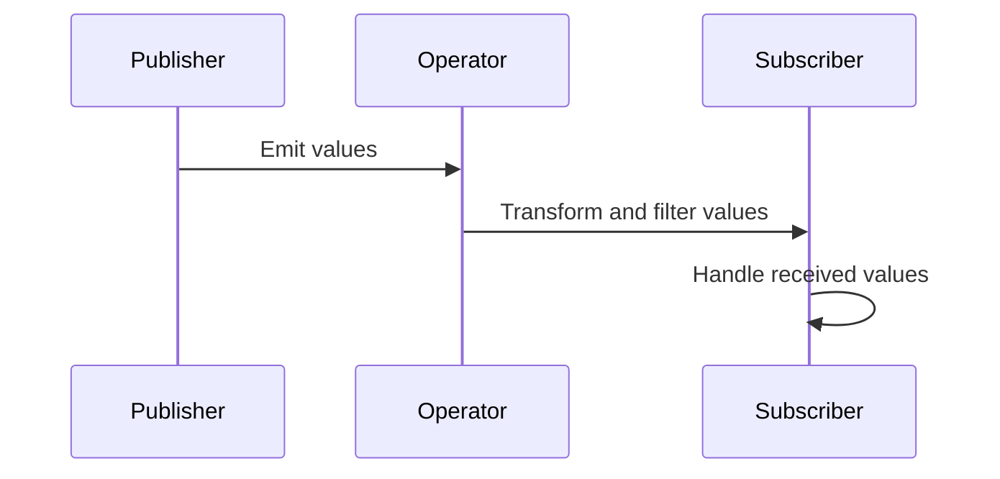

## 8.11 Using Combine Framework

In the world of modern Swift development, handling asynchronous operations and data streams efficiently is crucial. The Combine framework, introduced by Apple, provides a powerful way to manage these tasks in a declarative and composable manner. In this section, we will explore the core concepts of Combine, including publishers, subscribers, operators, and schedulers. We'll also delve into practical use cases and examples to demonstrate how Combine can be leveraged to create reactive UIs, build data pipelines, and simplify event handling.

### Intent

The primary intent of the Combine framework is to handle asynchronous events and data streams in a declarative and composable manner. This approach allows developers to write cleaner, more maintainable code by focusing on the flow of data rather than the mechanics of state management and synchronization.

### Implementing Combine in Swift

To effectively use Combine, it's essential to understand its core components: publishers, subscribers, operators, and schedulers. Let's break down each component and see how they work together to create reactive systems.

#### Publishers

**Publishers** are the backbone of the Combine framework. They emit a sequence of values over time, which can be anything from a single value to an infinite stream. Publishers define the source of data and are responsible for broadcasting changes to subscribers.

```swift
import Combine

// Example of a simple publisher
let publisher = Just("Hello, Combine!")
```

In this example, `Just` is a type of publisher that emits a single value and then completes. Combine offers a variety of built-in publishers, such as `Just`, `Future`, `PassthroughSubject`, and `CurrentValueSubject`, each serving different use cases.

#### Subscribers

**Subscribers** listen to publishers and receive the emitted values. They define how to handle the incoming data and what actions to take upon receiving it. Subscribers are responsible for processing the data and managing the lifecycle of the subscription.

```swift
let subscriber = Subscribers.Sink<String, Never>(
    receiveCompletion: { completion in
        print("Completed with: \\(completion)")
    },
    receiveValue: { value in
        print("Received value: \\(value)")
    }
)

publisher.subscribe(subscriber)
```

In this example, `Subscribers.Sink` is a built-in subscriber that allows us to handle both the completion event and the received values.

#### Operators

**Operators** are powerful tools in Combine that allow you to transform, filter, and combine publishers. They enable developers to build complex data processing pipelines by chaining operations together.

```swift
let numbers = [1, 2, 3, 4, 5]
let numberPublisher = numbers.publisher

numberPublisher
    .map { $0 * 2 }
    .filter { $0 > 5 }
    .sink(receiveValue: { print("Transformed value: \\($0)") })
```

In this example, the `map` operator transforms each emitted value by doubling it, and the `filter` operator only allows values greater than 5 to pass through.

#### Schedulers

**Schedulers** control the execution context of publishers and subscribers. They determine on which thread or queue the operations are performed, allowing for fine-grained control over concurrency and performance.

```swift
let queue = DispatchQueue(label: "com.example.queue")
numberPublisher
    .subscribe(on: queue)
    .receive(on: RunLoop.main)
    .sink(receiveValue: { print("Value received on main thread: \\($0)") })
```

In this example, the `subscribe(on:)` operator specifies that the publisher's work should be done on a background queue, while `receive(on:)` ensures that the subscriber receives values on the main thread.

### Use Cases and Examples

Combine's flexibility and power make it suitable for a wide range of use cases. Let's explore some practical examples to see how Combine can be applied in real-world scenarios.

#### Reactive UIs

One of the most common use cases for Combine is creating reactive UIs that update in response to data changes. By using Combine, you can bind UI components to data streams and automatically update them when the underlying data changes.

```swift
import SwiftUI
import Combine

struct ContentView: View {
    @State private var text = ""
    private var cancellable: AnyCancellable?

    var body: some View {
        VStack {
            TextField("Enter text", text: $text)
                .padding()
            
            Text("You entered: \\(text)")
                .padding()
        }
        .onAppear {
            self.cancellable = Just("Hello, SwiftUI!")
                .assign(to: \.text, on: self)
        }
    }
}
```

In this SwiftUI example, we use a `Just` publisher to emit a value that updates the `text` property, which in turn updates the UI.

#### Data Pipelines

Combine is also well-suited for building data pipelines that process streams of data from various sources. By chaining operators, you can create complex data transformations and processing flows.

```swift
let url = URL(string: "https://api.example.com/data")!
let dataPublisher = URLSession.shared.dataTaskPublisher(for: url)
    .map { $0.data }
    .decode(type: [String: Any].self, decoder: JSONDecoder())
    .eraseToAnyPublisher()

dataPublisher
    .sink(receiveCompletion: { completion in
        print("Data task completed with: \\(completion)")
    }, receiveValue: { data in
        print("Received data: \\(data)")
    })
    .store(in: &cancellables)
```

In this example, we use `dataTaskPublisher` to fetch data from a URL, then map and decode the data into a dictionary. The `eraseToAnyPublisher` method is used to type-erase the publisher, making it easier to work with.

#### Event Handling

Combine simplifies complex asynchronous workflows by providing a declarative way to handle events. This is particularly useful in scenarios where multiple asynchronous operations need to be coordinated.

```swift
let buttonTapPublisher = NotificationCenter.default.publisher(for: .buttonTapped)
let textFieldPublisher = NotificationCenter.default.publisher(for: UITextField.textDidChangeNotification)

buttonTapPublisher
    .merge(with: textFieldPublisher)
    .sink(receiveValue: { notification in
        print("Event received: \\(notification)")
    })
    .store(in: &cancellables)
```

In this example, we use `NotificationCenter` publishers to listen for button taps and text field changes, then merge the events into a single stream for processing.

### Visualizing Combine Framework Components

To better understand how Combine components interact, let's visualize the flow of data using a Mermaid.js sequence diagram.



This diagram illustrates the typical flow of data in a Combine pipeline, where a publisher emits values, operators transform and filter those values, and a subscriber handles the final output.

### Key Participants

- **Publishers**: Emit values over time and define the source of data.
- **Subscribers**: Receive and process values emitted by publishers.
- **Operators**: Transform, filter, and combine publishers to build data pipelines.
- **Schedulers**: Control the execution context of operations.

### Applicability

Combine is applicable in scenarios where you need to handle asynchronous events and data streams efficiently. It's particularly useful for:

- Building reactive UIs that respond to data changes.
- Creating data pipelines that process streams of data.
- Simplifying complex asynchronous workflows and event handling.

### Swift Unique Features

Combine leverages Swift's strong type system, making it easy to work with typed data streams. The use of `@Published` properties and SwiftUI's integration with Combine further enhance its usability in Swift applications.

### Differences and Similarities

Combine is often compared to other reactive programming frameworks like RxSwift. While they share similar concepts, Combine is tightly integrated with Swift and Apple's ecosystem, offering a more seamless experience for Swift developers.

### Design Considerations

When using Combine, consider the following:

- **Memory Management**: Use `AnyCancellable` to manage subscriptions and prevent memory leaks.
- **Error Handling**: Combine provides built-in mechanisms for error handling, but it's important to define how errors should be handled in your application.
- **Performance**: Be mindful of the performance implications of complex data pipelines and ensure that operations are performed on appropriate schedulers.

### Try It Yourself

To deepen your understanding of Combine, try modifying the code examples provided. Experiment with different operators, create your own publishers and subscribers, and explore how changes affect the data flow. This hands-on approach will help solidify your knowledge and skills.

### Knowledge Check

- What are the core components of the Combine framework?
- How do publishers and subscribers interact in a Combine pipeline?
- What role do operators play in data transformation?
- How can schedulers be used to control execution context?

### Embrace the Journey

Remember, mastering Combine is a journey. As you progress, you'll discover new ways to leverage its power in your applications. Keep experimenting, stay curious, and enjoy the process of building more efficient and reactive Swift applications.

## Quiz Time!



### What is the primary intent of the Combine framework?

- [x] Handle asynchronous events and data streams in a declarative and composable manner.
- [ ] Manage memory in Swift applications.
- [ ] Create complex UI animations.
- [ ] Simplify database interactions.

> **Explanation:** The Combine framework is designed to handle asynchronous events and data streams in a declarative and composable manner.

### Which component of Combine emits values over time?

- [x] Publisher
- [ ] Subscriber
- [ ] Operator
- [ ] Scheduler

> **Explanation:** Publishers are responsible for emitting values over time in the Combine framework.

### What is the role of a subscriber in Combine?

- [x] Receive and handle values emitted by publishers.
- [ ] Emit values over time.
- [ ] Transform and filter values.
- [ ] Control the execution context.

> **Explanation:** Subscribers receive and handle values emitted by publishers in the Combine framework.

### How do operators enhance the functionality of Combine?

- [x] Transform, filter, and combine publishers.
- [ ] Control execution context.
- [ ] Manage memory.
- [ ] Emit values over time.

> **Explanation:** Operators in Combine are used to transform, filter, and combine publishers to build complex data pipelines.

### Which of the following is a built-in publisher in Combine?

- [x] Just
- [ ] Sink
- [ ] Map
- [ ] DispatchQueue

> **Explanation:** `Just` is a built-in publisher in Combine that emits a single value and then completes.

### How can you control the execution context in Combine?

- [x] Using schedulers
- [ ] Using publishers
- [ ] Using subscribers
- [ ] Using operators

> **Explanation:** Schedulers are used in Combine to control the execution context of operations.

### What is the purpose of `eraseToAnyPublisher` in Combine?

- [x] Type-erase the publisher for easier handling.
- [ ] Emit a single value and complete.
- [ ] Control execution context.
- [ ] Transform and filter values.

> **Explanation:** `eraseToAnyPublisher` is used to type-erase a publisher, making it easier to handle in Combine.

### What is a common use case for Combine in Swift applications?

- [x] Building reactive UIs
- [ ] Managing memory
- [ ] Creating complex animations
- [ ] Simplifying database interactions

> **Explanation:** A common use case for Combine is building reactive UIs that update in response to data changes.

### Which operator would you use to transform emitted values in Combine?

- [x] Map
- [ ] Sink
- [ ] Just
- [ ] DispatchQueue

> **Explanation:** The `map` operator is used in Combine to transform emitted values.

### True or False: Combine is tightly integrated with Apple's ecosystem.

- [x] True
- [ ] False

> **Explanation:** Combine is tightly integrated with Apple's ecosystem, offering a seamless experience for Swift developers.



By understanding and mastering the Combine framework, you can significantly enhance your ability to handle asynchronous programming in Swift, leading to more efficient and responsive applications. Keep exploring and experimenting with Combine to unlock its full potential in your projects.


