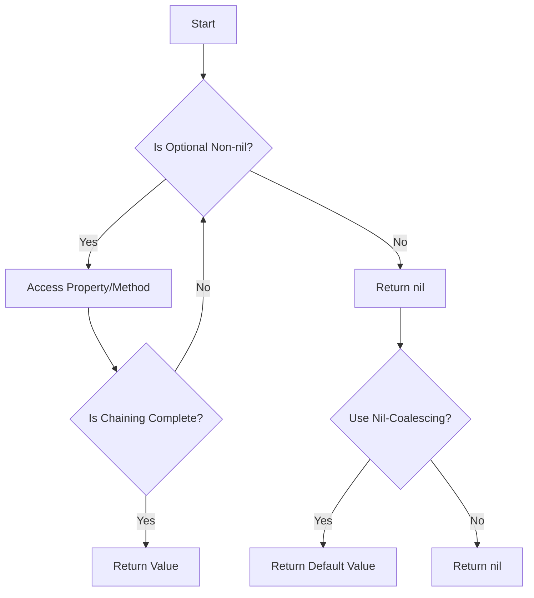

## 8.12 Optional Chaining and Nil-Coalescing Operators

In Swift, handling optional values is a fundamental aspect of programming, particularly when developing robust and error-free applications. The optional chaining and nil-coalescing operators are two powerful tools that simplify working with optionals, reducing the need for explicit unwrapping and checks. Let's dive into these concepts, explore their use cases, and understand how they contribute to cleaner and more efficient Swift code.

### Intent

**Simplify code when working with optional values, reducing the need for explicit unwrapping and checks.**

Optional chaining and nil-coalescing operators provide a streamlined way to access properties, methods, and subscripts on optional values. They allow developers to write more concise and readable code by eliminating the need for verbose unwrapping and conditional checks, thus making the code safer and less prone to runtime errors.

### Implementing Optional Chaining

Optional chaining is a process that allows you to query and call properties, methods, and subscripts on optional values in a way that gracefully handles nil values. If the optional contains a value, the property, method, or subscript call succeeds; if the optional is nil, the call returns nil.

#### Accessing Properties and Methods

To access properties and methods of an optional, use the `?` operator. This operator safely accesses the optional, and if it contains a value, the property or method call proceeds; otherwise, it returns nil.

```swift
class Person {
    var name: String
    var address: Address?
    
    init(name: String) {
        self.name = name
    }
}

class Address {
    var street: String
    var city: String
    
    init(street: String, city: String) {
        self.street = street
        self.city = city
    }
}

let john = Person(name: "John")
john.address = Address(street: "123 Elm St", city: "Gotham")

// Optional chaining to access the street property
if let streetName = john.address?.street {
    print("John lives on \\(streetName).")
} else {
    print("John's address is unknown.")
}
```

In this example, `john.address?.street` uses optional chaining to safely access the `street` property. If `address` is nil, the entire expression evaluates to nil, and the else block executes.

#### Method Calls

Optional chaining can also be used to call methods on optional values without unwrapping them explicitly.

```swift
class Car {
    var model: String?
    
    func start() {
        print("Car started.")
    }
}

let myCar: Car? = Car()
myCar?.start() // Safely calls start() if myCar is not nil
```

Here, `myCar?.start()` calls the `start()` method only if `myCar` is not nil. If `myCar` is nil, the call is ignored, and no error occurs.

#### Function Returns

Optional chaining can be extended to chain multiple optional accesses, allowing for a clean and concise way to traverse object graphs that may contain nils.

```swift
class Company {
    var ceo: Person?
}

let apple = Company()
apple.ceo = john

// Chaining multiple optional accesses
if let ceoStreet = apple.ceo?.address?.street {
    print("The CEO lives on \\(ceoStreet).")
} else {
    print("CEO's address is unknown.")
}
```

This example demonstrates chaining multiple optional accesses to retrieve the CEO's street address. If any part of the chain is nil, the entire expression evaluates to nil.

### Nil-Coalescing Operator

The nil-coalescing operator (`??`) is used to provide a default value when an optional is nil. This operator is a concise way to handle optionals by supplying a fallback value, ensuring that your code always has a non-optional value to work with.

#### Providing Defaults

Use the nil-coalescing operator to supply a default value when an optional is nil.

```swift
var optionalName: String? = nil
let defaultName = "Anonymous"

// Use nil-coalescing to provide a default value
let name = optionalName ?? defaultName
print("Hello, \\(name)!")
```

In this example, `optionalName` is nil, so the nil-coalescing operator provides the default value `"Anonymous"`, ensuring that `name` is never nil.

#### Combining with Chaining

You can combine optional chaining with the nil-coalescing operator to chain optional access and provide a default value.

```swift
let ceoCity = apple.ceo?.address?.city ?? "Unknown City"
print("The CEO lives in \\(ceoCity).")
```

Here, optional chaining attempts to access the `city` property. If any part of the chain is nil, the nil-coalescing operator provides `"Unknown City"` as a default value.

### Use Cases and Examples

#### Safe Navigation

Optional chaining is particularly useful for traversing object graphs where some properties may be nil. It allows you to safely navigate through nested objects without risking runtime errors due to nil values.

```swift
class University {
    var name: String
    var president: Person?
    
    init(name: String) {
        self.name = name
    }
}

let mit = University(name: "MIT")
mit.president = john

// Safely access nested properties
if let presidentName = mit.president?.name {
    print("The president of MIT is \\(presidentName).")
} else {
    print("The university has no president.")
}
```

#### Default Values

The nil-coalescing operator simplifies code that requires a guaranteed value by providing a fallback when optionals are nil.

```swift
func greetUser(username: String?) {
    let nameToGreet = username ?? "Guest"
    print("Welcome, \\(nameToGreet)!")
}

greetUser(username: nil) // Outputs: Welcome, Guest!
```

This function uses the nil-coalescing operator to ensure that a greeting is always addressed to a valid name.

### Visualizing Optional Chaining and Nil-Coalescing

To better understand how optional chaining and nil-coalescing operators work together, let's visualize the process using a flowchart.



This flowchart illustrates the decision-making process when using optional chaining and nil-coalescing operators. It shows how the operators handle nil values and ensure safe access to properties and methods.

### Swift Unique Features

Swift's type safety and optional handling are unique features that set it apart from other programming languages. The optional chaining and nil-coalescing operators leverage these features to provide a more robust and error-resistant way to work with optionals.

- **Type Safety**: Swift enforces type safety, ensuring that you handle optionals explicitly, reducing runtime errors.
- **Conciseness**: These operators allow for concise and readable code, minimizing boilerplate and improving maintainability.
- **Error Handling**: By using these operators, you can handle potential nil values gracefully, avoiding crashes and unexpected behavior.

### Differences and Similarities

Optional chaining and nil-coalescing operators are often used together, but they serve different purposes:

- **Optional Chaining**: Used to safely access properties, methods, and subscripts on optional values.
- **Nil-Coalescing**: Provides a default value when an optional is nil.

Both operators contribute to safer and more efficient code by reducing the need for explicit unwrapping and conditional checks.

### Try It Yourself

Experiment with the code examples provided in this guide. Try modifying the properties and methods to see how optional chaining and nil-coalescing operators handle different scenarios. For instance, change the optional values to non-nil and observe how the output changes. This hands-on approach will deepen your understanding of these powerful Swift features.

### Knowledge Check

Before we conclude, let's reinforce your understanding with some questions and exercises:

- **Question 1**: What happens if you use optional chaining on a nil value?
- **Exercise 1**: Modify the `Person` class to include an optional `phoneNumber` property. Use optional chaining to safely access and print the phone number.
- **Question 2**: How does the nil-coalescing operator ensure a non-optional value?
- **Exercise 2**: Write a function that takes an optional `Int` and returns its square, using the nil-coalescing operator to provide a default value of `0`.

### Embrace the Journey

Remember, mastering optional chaining and nil-coalescing operators is just the beginning. As you progress in Swift development, these tools will become invaluable in writing clean, efficient, and error-free code. Keep experimenting, stay curious, and enjoy the journey!

## Quiz Time!



### What is the primary purpose of optional chaining in Swift?

- [x] To safely access properties and methods on optional values
- [ ] To convert optionals into non-optional types
- [ ] To handle errors in Swift
- [ ] To optimize memory usage

> **Explanation:** Optional chaining allows safe access to properties and methods on optional values, returning nil if the optional is nil.

### How does the nil-coalescing operator (`??`) work in Swift?

- [x] It provides a default value when an optional is nil
- [ ] It unwraps an optional value
- [ ] It converts a non-optional to an optional
- [ ] It handles errors in Swift

> **Explanation:** The nil-coalescing operator provides a default value when an optional is nil, ensuring a non-optional result.

### What will be the result of `let name = optionalName ?? "Anonymous"` if `optionalName` is nil?

- [x] "Anonymous"
- [ ] nil
- [ ] An error
- [ ] "optionalName"

> **Explanation:** If `optionalName` is nil, the nil-coalescing operator assigns "Anonymous" as the default value to `name`.

### Can optional chaining be used to call methods on optional values?

- [x] Yes
- [ ] No

> **Explanation:** Optional chaining can be used to call methods on optional values, executing the method only if the optional is non-nil.

### What does the expression `john.address?.street` return if `john.address` is nil?

- [x] nil
- [ ] An error
- [ ] "Unknown"
- [ ] "123 Elm St"

> **Explanation:** If `john.address` is nil, the optional chaining returns nil, preventing a runtime error.

### Which operator would you use to provide a fallback value for an optional?

- [x] Nil-coalescing operator (`??`)
- [ ] Optional chaining (`?`)
- [ ] Force unwrapping (`!`)
- [ ] Conditional operator (`?:`)

> **Explanation:** The nil-coalescing operator (`??`) is used to provide a fallback value for an optional.

### How can you combine optional chaining and nil-coalescing operators?

- [x] Use optional chaining to access a value and nil-coalescing to provide a default if nil
- [ ] Use nil-coalescing to access a value and optional chaining to provide a default if nil
- [ ] Use both to unwrap an optional
- [ ] Use both to handle errors

> **Explanation:** Combine optional chaining to access a value and nil-coalescing to provide a default if the value is nil.

### What is the benefit of using optional chaining in Swift?

- [x] It reduces the need for explicit unwrapping and checks
- [ ] It increases code complexity
- [ ] It makes code less readable
- [ ] It decreases performance

> **Explanation:** Optional chaining reduces the need for explicit unwrapping and checks, making code cleaner and safer.

### What is the output of `let ceoCity = apple.ceo?.address?.city ?? "Unknown City"` if `apple.ceo` is nil?

- [x] "Unknown City"
- [ ] nil
- [ ] An error
- [ ] "Gotham"

> **Explanation:** If `apple.ceo` is nil, the nil-coalescing operator provides "Unknown City" as the default value.

### True or False: Optional chaining can be used to safely access subscripts on optional values.

- [x] True
- [ ] False

> **Explanation:** Optional chaining can be used to safely access subscripts on optional values, returning nil if the optional is nil.



By mastering optional chaining and nil-coalescing operators, you will enhance your Swift programming skills, making your code more robust and maintainable. Keep practicing and exploring these concepts to fully leverage their power in your Swift development journey.


