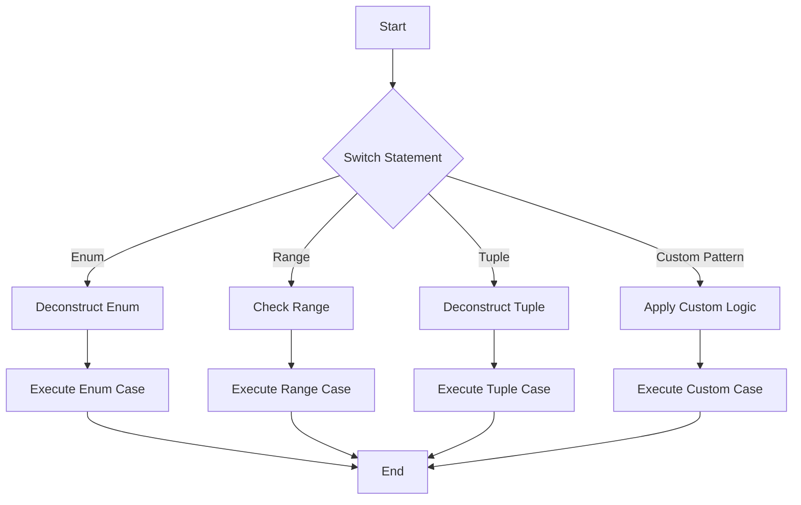

## 8.13 Pattern Matching with Switch and If-Case

Pattern matching in Swift is a powerful feature that allows developers to write expressive and concise code. It simplifies handling multiple conditions, making your code more readable and maintainable. In this section, we will explore the intent and implementation of pattern matching using `switch` statements and `if-case` syntax, along with practical use cases and examples.

### Intent

The primary intent of pattern matching in Swift is to leverage its capabilities to handle complex conditions elegantly. By using pattern matching, you can:

- **Simplify Code**: Reduce complex nested `if-else` logic into more readable constructs.
- **Enhance Readability**: Make your intentions clear with expressive syntax.
- **Increase Flexibility**: Handle various data structures, including enums, tuples, and ranges, with ease.

### Implementing Pattern Matching

#### Switch Statements

The `switch` statement in Swift is a versatile control flow construct that allows for pattern matching on a variety of data types. Unlike traditional switch statements in other languages, Swift's `switch` can match on:

- **Enums**: Deconstruct enums and handle associated values.
- **Ranges**: Match values within specified ranges.
- **Tuples**: Deconstruct tuples and match their elements.
- **Custom Patterns**: Utilize custom patterns for more complex matching.

##### Enum Matching

Enums in Swift can have associated values, making them ideal candidates for pattern matching. Here's an example of matching on an enum with associated values:

```swift
enum Vehicle {
    case car(make: String, model: String)
    case bicycle(brand: String)
    case truck(loadCapacity: Int)
}

let myVehicle = Vehicle.car(make: "Tesla", model: "Model S")

switch myVehicle {
case .car(let make, let model):
    print("Car: \\(make) \\(model)")
case .bicycle(let brand):
    print("Bicycle: \\(brand)")
case .truck(let loadCapacity):
    print("Truck with load capacity: \\(loadCapacity) tons")
}
```

In this example, the `switch` statement deconstructs the `Vehicle` enum and captures the associated values using `let` bindings.

##### Range Matching

Swift allows you to match values within ranges using the `switch` statement. This is particularly useful for numerical comparisons:

```swift
let number = 42

switch number {
case 0..<10:
    print("Single digit number")
case 10..<100:
    print("Double digit number")
default:
    print("Number with more than two digits")
}
```

Here, the `switch` statement checks which range the `number` falls into and executes the corresponding block of code.

##### Tuple Matching

Tuples can be deconstructed in a `switch` statement to match their individual elements:

```swift
let point = (2, 3)

switch point {
case (0, 0):
    print("Origin")
case (let x, 0):
    print("On the x-axis at \\(x)")
case (0, let y):
    print("On the y-axis at \\(y)")
case (let x, let y):
    print("Somewhere else at (\\(x), \\(y))")
}
```

In this example, the `switch` statement deconstructs the `point` tuple and matches based on its values.

#### Value Bindings

Value bindings in pattern matching allow you to capture values during the matching process. This is done using `let` or `var` within the pattern:

```swift
let fruit = ("apple", 5)

switch fruit {
case (let name, let count) where count > 1:
    print("There are \\(count) \\(name)s")
case (let name, 1):
    print("There is one \\(name)")
default:
    print("No fruits")
}
```

In this example, the `switch` statement captures the values of `name` and `count` and uses them in the matched case.

#### Where Clauses

`Where` clauses add additional conditions to patterns, allowing for more refined matching:

```swift
let age = 25

switch age {
case let x where x < 18:
    print("Underage")
case let x where x >= 18 && x < 65:
    print("Adult")
case let x where x >= 65:
    print("Senior")
default:
    break
}
```

Here, the `where` clause is used to add conditions to the matched cases, making the `switch` statement more expressive.

#### If-Case Syntax

The `if-case` syntax provides a concise way to perform pattern matching in conditional statements. It is particularly useful when you only need to match a single pattern:

```swift
let optionalValue: Int? = 42

if case let value? = optionalValue {
    print("Value is \\(value)")
} else {
    print("Value is nil")
}
```

In this example, the `if-case` syntax is used to check if `optionalValue` contains a value and bind it to `value`.

### Use Cases and Examples

#### Enum Handling

Pattern matching is invaluable when working with enums, especially those with associated values. It allows you to deconstruct the enum and access its values directly:

```swift
enum NetworkResponse {
    case success(data: Data)
    case failure(error: Error)
}

let response = NetworkResponse.success(data: Data())

switch response {
case .success(let data):
    print("Received data of length: \\(data.count)")
case .failure(let error):
    print("Error occurred: \\(error.localizedDescription)")
}
```

This example demonstrates how pattern matching simplifies handling different cases of a network response.

#### Data Parsing

Pattern matching can be used to parse complex data structures, such as JSON:

```swift
let json: [String: Any] = ["name": "John", "age": 30]

if case let name as String = json["name"], case let age as Int = json["age"] {
    print("Name: \\(name), Age: \\(age)")
}
```

Here, the `if-case` syntax is used to extract and match values from a dictionary.

#### Control Flow

Pattern matching can simplify control flow by reducing nested `if-else` statements:

```swift
let temperature = 75

switch temperature {
case ..<32:
    print("Freezing")
case 32..<50:
    print("Cold")
case 50..<70:
    print("Mild")
case 70..<90:
    print("Warm")
default:
    print("Hot")
}
```

This example shows how pattern matching can make control flow more readable and maintainable.

### Visualizing Pattern Matching

To better understand the flow of pattern matching in Swift, let's visualize how a `switch` statement processes different patterns.



This flowchart illustrates how a `switch` statement evaluates different patterns and executes the corresponding case.

### Try It Yourself

To deepen your understanding of pattern matching in Swift, try modifying the code examples provided:

1. **Add New Cases**: Extend the enum example by adding a new vehicle type and handle it in the `switch` statement.
2. **Experiment with Ranges**: Modify the range example to include additional ranges or change the range boundaries.
3. **Use Tuples**: Create a new tuple with more elements and match on its values using a `switch` statement.

### References and Links

For further reading on Swift pattern matching, consider the following resources:

- [Swift.org - The Swift Programming Language](https://swift.org/documentation/)
- [Apple Developer Documentation - Control Flow](https://developer.apple.com/documentation/swift/controlflow)
- [Ray Wenderlich - Pattern Matching in Swift](https://www.raywenderlich.com/)

### Knowledge Check

Before moving on, let's summarize the key takeaways:

- **Pattern Matching**: Simplifies complex conditional logic and enhances code readability.
- **Switch Statements**: Allow matching on enums, ranges, tuples, and custom patterns.
- **If-Case Syntax**: Provides a concise way to perform pattern matching in conditional statements.
- **Value Bindings and Where Clauses**: Enable capturing values and adding conditions to patterns.

Remember, mastering pattern matching in Swift is a journey. Keep experimenting, stay curious, and enjoy the process!

## Quiz Time!



### What is the primary intent of pattern matching in Swift?

- [x] To simplify handling multiple conditions with expressive and concise code
- [ ] To replace all `if-else` statements
- [ ] To make code more complex
- [ ] To avoid using enums

> **Explanation:** The primary intent of pattern matching in Swift is to simplify handling multiple conditions with expressive and concise code.

### Which Swift construct allows pattern matching on enums, ranges, tuples, and custom patterns?

- [x] Switch statement
- [ ] If-else statement
- [ ] For loop
- [ ] While loop

> **Explanation:** The switch statement in Swift allows pattern matching on enums, ranges, tuples, and custom patterns.

### How can you capture values during pattern matching in Swift?

- [x] Using value bindings with `let` or `var`
- [ ] Using `if-else` statements
- [ ] Using functions
- [ ] Using classes

> **Explanation:** You can capture values during pattern matching in Swift using value bindings with `let` or `var`.

### What is the purpose of a `where` clause in pattern matching?

- [x] To add additional conditions to patterns
- [ ] To end a switch statement
- [ ] To define a new variable
- [ ] To initialize an object

> **Explanation:** A `where` clause in pattern matching is used to add additional conditions to patterns.

### Which syntax provides a concise way to perform pattern matching in conditional statements?

- [x] If-case syntax
- [ ] For loop
- [ ] While loop
- [ ] Do-while loop

> **Explanation:** The if-case syntax provides a concise way to perform pattern matching in conditional statements.

### What can be matched using a Swift `switch` statement?

- [x] Enums, ranges, tuples, and custom patterns
- [ ] Only integers
- [ ] Only strings
- [ ] Only arrays

> **Explanation:** A Swift `switch` statement can match enums, ranges, tuples, and custom patterns.

### What is a common use case for pattern matching with enums?

- [x] Deconstructing enums with associated values
- [ ] Iterating over arrays
- [ ] Sorting lists
- [ ] Calculating sums

> **Explanation:** A common use case for pattern matching with enums is deconstructing enums with associated values.

### How can pattern matching simplify control flow?

- [x] By reducing nested `if-else` statements
- [ ] By adding more complexity
- [ ] By increasing the number of lines of code
- [ ] By making code less readable

> **Explanation:** Pattern matching can simplify control flow by reducing nested `if-else` statements.

### True or False: Pattern matching can only be used with enums in Swift.

- [ ] True
- [x] False

> **Explanation:** False. Pattern matching in Swift can be used with enums, ranges, tuples, and custom patterns.

### Which keyword is used to bind values in a pattern matching case?

- [x] let
- [ ] var
- [ ] func
- [ ] class

> **Explanation:** The `let` keyword is used to bind values in a pattern matching case.




