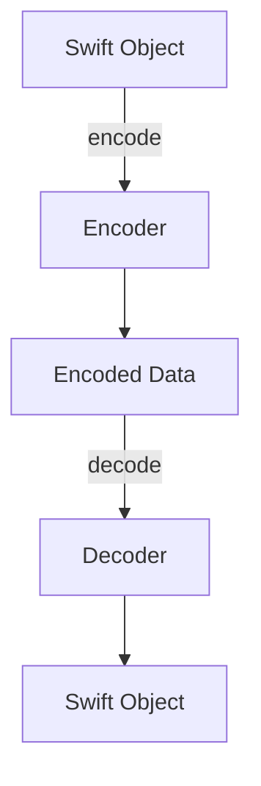

## 8.14 Codable Protocols for Serialization

In the realm of modern software development, data interchange is a fundamental aspect, especially in iOS and macOS applications. Swift's `Codable` protocols provide a robust and flexible mechanism for encoding and decoding data, making it easy to serialize custom types to and from formats like JSON, XML, and property lists. This section will guide you through the intricacies of using `Codable` protocols effectively in Swift.

### Intent

The primary intent of using `Codable` protocols is to simplify the process of encoding and decoding data structures, allowing developers to seamlessly convert between Swift objects and external data representations. This is particularly useful in networking, data persistence, and interoperability with other systems.

### Implementing Codable

#### Conforming to Codable

To make a custom type encodable and decodable, you need to conform it to the `Codable` protocol. Swift provides a synthesized implementation of `Codable` for types that only contain properties that are themselves `Codable`.

```swift
struct User: Codable {
    var id: Int
    var name: String
    var email: String
}
```

In this example, the `User` struct automatically conforms to `Codable` because all its properties (`id`, `name`, `email`) are `Codable`.

#### Default Implementations

Swift's automatic synthesis of `Codable` conformance is a powerful feature that reduces boilerplate code. For most simple types, you don't need to write any additional code to handle encoding and decoding.

```swift
let user = User(id: 1, name: "Alice", email: "alice@example.com")
let encoder = JSONEncoder()
if let encodedData = try? encoder.encode(user) {
    print("User encoded to JSON: \\(String(data: encodedData, encoding: .utf8)!)")
}

let decoder = JSONDecoder()
if let decodedUser = try? decoder.decode(User.self, from: encodedData) {
    print("User decoded from JSON: \\(decodedUser)")
}
```

#### Custom Encoding/Decoding

For more complex types, you might need to implement custom encoding and decoding logic. This is done by implementing the `encode(to:)` and `init(from:)` methods.

```swift
struct CustomDate: Codable {
    var date: Date
    
    private enum CodingKeys: String, CodingKey {
        case date
    }
    
    init(from decoder: Decoder) throws {
        let container = try decoder.container(keyedBy: CodingKeys.self)
        let dateString = try container.decode(String.self, forKey: .date)
        let formatter = DateFormatter()
        formatter.dateFormat = "yyyy-MM-dd"
        guard let date = formatter.date(from: dateString) else {
            throw DecodingError.dataCorruptedError(forKey: .date, in: container, debugDescription: "Date string does not match format expected by formatter.")
        }
        self.date = date
    }
    
    func encode(to encoder: Encoder) throws {
        var container = encoder.container(keyedBy: CodingKeys.self)
        let formatter = DateFormatter()
        formatter.dateFormat = "yyyy-MM-dd"
        let dateString = formatter.string(from: date)
        try container.encode(dateString, forKey: .date)
    }
}
```

In this example, `CustomDate` uses a specific date format for encoding and decoding, demonstrating how to handle custom serialization needs.

#### Encoding Strategies

Swift's `JSONEncoder` and `JSONDecoder` provide strategies to customize how dates and keys are encoded and decoded.

```swift
let encoder = JSONEncoder()
encoder.dateEncodingStrategy = .iso8601
encoder.keyEncodingStrategy = .convertToSnakeCase

let decoder = JSONDecoder()
decoder.dateDecodingStrategy = .iso8601
decoder.keyDecodingStrategy = .convertFromSnakeCase
```

These strategies can be used to match the format expected by an API or a data storage system, ensuring seamless data interchange.

### Use Cases and Examples

#### Networking

In networking, `Codable` is invaluable for parsing JSON responses into model objects. This allows for clean and maintainable code when dealing with API responses.

```swift
struct ApiResponse: Codable {
    var status: String
    var data: [User]
}

let jsonData = """
{
    "status": "success",
    "data": [
        {"id": 1, "name": "Alice", "email": "alice@example.com"},
        {"id": 2, "name": "Bob", "email": "bob@example.com"}
    ]
}
""".data(using: .utf8)!

let decoder = JSONDecoder()
if let response = try? decoder.decode(ApiResponse.self, from: jsonData) {
    print("Decoded API response: \\(response)")
}
```

#### Data Persistence

`Codable` can also be used for data persistence, allowing you to save and load user data easily.

```swift
let userDefaults = UserDefaults.standard
if let encodedUser = try? encoder.encode(user) {
    userDefaults.set(encodedUser, forKey: "savedUser")
}

if let savedUserData = userDefaults.data(forKey: "savedUser"),
   let savedUser = try? decoder.decode(User.self, from: savedUserData) {
    print("Loaded user from UserDefaults: \\(savedUser)")
}
```

#### Interoperability

When communicating with external systems, `Codable` facilitates the conversion of data to and from formats like JSON, XML, or property lists, making your Swift applications more interoperable.

### Visualizing Codable Process

To better understand the `Codable` process, let's visualize the encoding and decoding workflow using a diagram.



**Figure 1: Codable Encoding and Decoding Workflow**  
This diagram illustrates the flow of data from a Swift object through the encoding process to become encoded data, and then back through the decoding process to a Swift object.

### Swift Unique Features

Swift's `Codable` protocol leverages several unique language features:

- **Automatic Synthesis**: Swift automatically provides `Codable` conformance for types with `Codable` properties, reducing boilerplate.
- **Keyed and Unkeyed Containers**: Swift's encoders and decoders use containers to organize data, supporting both keyed and unkeyed data structures.
- **Error Handling**: Swift's error-handling mechanism is integrated into the `Codable` process, allowing you to handle encoding and decoding errors gracefully.

### Design Considerations

When using `Codable`, consider the following:

- **Performance**: While `Codable` is efficient, it's important to profile your application if performance becomes an issue, especially with large data sets.
- **Complex Data Structures**: For complex data structures, custom encoding and decoding logic may be necessary, which can increase code complexity.
- **Versioning**: Plan for data format changes over time, especially if your app needs to maintain backward compatibility with older data formats.

### Differences and Similarities

`Codable` is often compared to other serialization frameworks like `NSCoding`. While `NSCoding` is more flexible for complex object graphs, `Codable` is simpler and more type-safe, making it a better choice for most modern Swift applications.

### Try It Yourself

To deepen your understanding, try modifying the provided code examples:

- **Experiment with Custom Types**: Create a custom type with nested structures and arrays, and implement custom encoding and decoding logic.
- **Change Encoding Strategies**: Modify the date and key encoding strategies to see how they affect the serialized output.
- **Handle Errors**: Introduce errors in the data format and handle them using Swift's error-handling mechanisms.

### Knowledge Check

- **What are the benefits of using `Codable` over `NSCoding`?**
- **How does Swift's automatic synthesis of `Codable` conformance reduce boilerplate code?**
- **What strategies can you use to customize key mappings in `Codable`?**

### Embrace the Journey

Remember, mastering `Codable` is just one step in your Swift development journey. As you progress, you'll find new ways to leverage Swift's powerful features to build robust and efficient applications. Keep experimenting, stay curious, and enjoy the journey!

## Quiz Time!



### What is the primary intent of using Codable protocols in Swift?

- [x] To simplify the process of encoding and decoding data structures
- [ ] To enhance performance of Swift applications
- [ ] To replace all other serialization methods
- [ ] To create custom data formats

> **Explanation:** Codable protocols are designed to simplify encoding and decoding data structures, making data interchange seamless.

### How does Swift provide Codable conformance for simple types?

- [x] Through automatic synthesis
- [ ] By requiring manual implementation of encode and decode methods
- [ ] By using external libraries
- [ ] By converting types to strings

> **Explanation:** Swift automatically synthesizes Codable conformance for types with Codable properties, reducing the need for manual code.

### Which method do you implement for custom decoding logic?

- [x] init(from:)
- [ ] encode(to:)
- [ ] decode(from:)
- [ ] init(to:)

> **Explanation:** The `init(from:)` method is used to implement custom decoding logic in Swift.

### What is a common use case for Codable in networking?

- [x] Parsing JSON responses into model objects
- [ ] Enhancing security of network requests
- [ ] Optimizing network speed
- [ ] Managing network connections

> **Explanation:** Codable is commonly used to parse JSON responses into model objects, making it easier to work with API data.

### Which encoding strategy can be used to match API key formats?

- [x] .convertToSnakeCase
- [ ] .iso8601
- [ ] .formatted
- [ ] .custom

> **Explanation:** The `.convertToSnakeCase` strategy can be used to match API key formats that use snake_case.

### What is a benefit of using Codable for data persistence?

- [x] It allows easy saving and loading of user data
- [ ] It increases the speed of database queries
- [ ] It provides encryption for stored data
- [ ] It reduces memory usage

> **Explanation:** Codable allows for easy saving and loading of user data, simplifying data persistence tasks.

### How can you handle errors in the Codable process?

- [x] Using Swift's error-handling mechanisms
- [ ] By ignoring them
- [ ] Using external error libraries
- [ ] By converting errors to warnings

> **Explanation:** Swift's error-handling mechanisms can be used to handle errors in the Codable process gracefully.

### What is a key feature of Swift's Codable protocol?

- [x] Automatic synthesis of conformance
- [ ] Manual memory management
- [ ] Built-in encryption
- [ ] Real-time data processing

> **Explanation:** Automatic synthesis of conformance is a key feature of Swift's Codable protocol, reducing boilerplate code.

### True or False: Codable can be used for both JSON and XML serialization.

- [x] True
- [ ] False

> **Explanation:** Codable can be used for both JSON and XML serialization, as well as other formats like property lists.

### Which method is used for custom encoding logic?

- [x] encode(to:)
- [ ] init(from:)
- [ ] decode(from:)
- [ ] init(to:)

> **Explanation:** The `encode(to:)` method is used to implement custom encoding logic in Swift.



By mastering Swift's `Codable` protocols, you empower yourself to handle data serialization and deserialization with ease, enhancing your applications' capabilities in networking, data persistence, and interoperability. Keep exploring, and you'll continue to uncover the full potential of Swift in your development journey!


