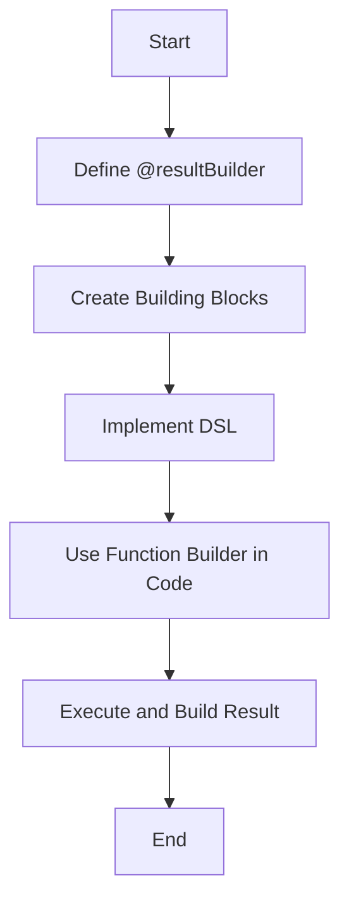

## 8.15 Builder Pattern with Function Builders

The Builder Pattern is a well-known design pattern that provides a flexible solution to construct complex objects step-by-step. In Swift, the introduction of function builders, particularly with SwiftUI, has brought a new dimension to this pattern, allowing developers to create complex hierarchies and configurations using a declarative syntax. This section will delve into the intricacies of the Builder Pattern using function builders in Swift, exploring how they simplify object construction and enhance code readability and maintainability.

### Intent

The primary intent of the Builder Pattern with function builders in Swift is to simplify the construction of complex objects or configurations using a declarative syntax. This approach provides a more readable and maintainable code structure, especially when dealing with nested or hierarchical data.

### Implementing Function Builders in Swift

Function builders in Swift are a powerful feature that allows the creation of domain-specific languages (DSLs) within Swift. This section will cover the key components necessary to implement function builders effectively.

#### @resultBuilder Attribute

The `@resultBuilder` attribute is the cornerstone of function builders in Swift. It allows developers to define custom types that can build values from a series of statements within a closure. This attribute is crucial for creating DSLs that can transform a sequence of expressions into a single value.

```swift
@resultBuilder
struct ArrayBuilder {
    static func buildBlock(_ components: Int...) -> [Int] {
        return components
    }
}

func buildArray(@ArrayBuilder content: () -> [Int]) -> [Int] {
    return content()
}

let numbers = buildArray {
    1
    2
    3
    4
    5
}
print(numbers) // Output: [1, 2, 3, 4, 5]
```

In this example, the `ArrayBuilder` type uses the `@resultBuilder` attribute to define how a sequence of integers is combined into an array. The `buildArray` function utilizes this builder to construct an array declaratively.

#### Building Blocks

Function builders rely on several building blocks to define how expressions are combined. These blocks include:

- **buildBlock**: Combines multiple expressions into a single value.
- **buildOptional**: Handles optional values within the builder.
- **buildEither**: Supports conditional logic with `if-else` statements.
- **buildArray**: Combines an array of expressions into a single value.

These building blocks allow developers to create complex logic within function builders, enabling more flexible and powerful DSLs.

```swift
@resultBuilder
struct StringBuilder {
    static func buildBlock(_ components: String...) -> String {
        return components.joined(separator: " ")
    }
    
    static func buildOptional(_ component: String?) -> String {
        return component ?? ""
    }
    
    static func buildEither(first component: String) -> String {
        return component
    }
    
    static func buildEither(second component: String) -> String {
        return component
    }
}

func buildString(@StringBuilder content: () -> String) -> String {
    return content()
}

let greeting = buildString {
    "Hello"
    if true {
        "World"
    } else {
        "Swift"
    }
    "!"
}
print(greeting) // Output: "Hello World !"
```

In this example, the `StringBuilder` uses various building blocks to construct a string based on conditional logic, demonstrating the flexibility of function builders.

#### DSLs: Domain-Specific Languages

Function builders enable the creation of DSLs within Swift, allowing developers to express complex logic and structures in a concise and readable manner. This capability is particularly useful in scenarios like SwiftUI, where UI hierarchies are built declaratively.

### Use Cases and Examples

Function builders have a wide range of use cases in Swift, from building UI hierarchies in SwiftUI to generating HTML structures and assembling complex configuration objects.

#### SwiftUI: Building UI Hierarchies Declaratively

SwiftUI is a prime example of function builders in action. It uses function builders to allow developers to construct UI hierarchies declaratively, making the code more readable and maintainable.

```swift
import SwiftUI

struct ContentView: View {
    var body: some View {
        VStack {
            Text("Hello, SwiftUI!")
                .font(.largeTitle)
            Button(action: {
                print("Button tapped")
            }) {
                Text("Tap me")
            }
        }
    }
}
```

In this SwiftUI example, the `VStack` and `Button` components are constructed using function builders, allowing for a clean and declarative UI structure.

#### HTML Builders: Generate HTML or XML Structures in Code

Function builders can also be used to generate HTML or XML structures in code, providing a more intuitive way to construct these documents.

```swift
@resultBuilder
struct HTMLBuilder {
    static func buildBlock(_ components: String...) -> String {
        return components.joined(separator: "\n")
    }
}

func buildHTML(@HTMLBuilder content: () -> String) -> String {
    return content()
}

let html = buildHTML {
    "<html>"
    "<head>"
    "<title>Page Title</title>"
    "</head>"
    "<body>"
    "<h1>This is a Heading</h1>"
    "<p>This is a paragraph.</p>"
    "</body>"
    "</html>"
}
print(html)
```

This example demonstrates how function builders can be used to create HTML documents declaratively, improving readability and maintainability.

#### Configuration Objects: Assemble Complex Configurations Step-by-Step

Function builders can simplify the process of assembling complex configuration objects, allowing developers to define configurations in a declarative manner.

```swift
struct Configuration {
    var settings: [String: Any] = [:]
}

@resultBuilder
struct ConfigurationBuilder {
    static func buildBlock(_ components: (String, Any)...) -> Configuration {
        var config = Configuration()
        for (key, value) in components {
            config.settings[key] = value
        }
        return config
    }
}

func buildConfiguration(@ConfigurationBuilder content: () -> Configuration) -> Configuration {
    return content()
}

let config = buildConfiguration {
    ("theme", "dark")
    ("fontSize", 12)
    ("showNotifications", true)
}
print(config.settings) // Output: ["theme": "dark", "fontSize": 12, "showNotifications": true]
```

In this example, the `ConfigurationBuilder` allows developers to define configuration settings declaratively, making the code more intuitive and easier to manage.

### Visualizing Function Builders

To better understand how function builders work, let's visualize the process using a flowchart that illustrates the flow of data through the builder pattern.



This flowchart represents the steps involved in creating and using a function builder in Swift, from defining the `@resultBuilder` to executing the builder and obtaining the final result.

### Swift Unique Features

Swift's unique features, such as type inference and protocol extensions, enhance the capabilities of function builders, allowing for more concise and expressive code. These features, combined with Swift's strong type system, make function builders a powerful tool for creating DSLs and simplifying complex object construction.

### Differences and Similarities

While the Builder Pattern and function builders share similarities in simplifying object construction, they differ in their approach. The traditional Builder Pattern involves creating a separate builder class, while function builders leverage Swift's language features to provide a more integrated and declarative solution.

### Design Considerations

When using function builders, consider the following design considerations:

- **Readability**: Ensure that the declarative syntax enhances code readability.
- **Maintainability**: Use function builders to simplify complex logic and structures.
- **Performance**: Evaluate the performance implications of using function builders, especially in performance-critical applications.

### Try It Yourself

To truly grasp the power of function builders, try modifying the code examples provided. Experiment with different building blocks, create your own DSLs, and see how function builders can simplify your code.

### Knowledge Check

- What is the primary intent of using function builders in Swift?
- How does the `@resultBuilder` attribute enhance the Builder Pattern?
- What are some common use cases for function builders in Swift?
- How do function builders differ from the traditional Builder Pattern?

Remember, mastering function builders in Swift is a journey. As you explore and experiment with these concepts, you'll discover new ways to simplify and enhance your code. Keep experimenting, stay curious, and enjoy the journey!

## Quiz Time!



### What is the primary intent of using function builders in Swift?

- [x] Simplify the construction of complex objects using declarative syntax.
- [ ] Improve the performance of Swift applications.
- [ ] Replace all imperative programming paradigms in Swift.
- [ ] Automatically generate UI code.

> **Explanation:** The primary intent of function builders is to simplify the construction of complex objects or configurations using a declarative syntax, making code more readable and maintainable.

### What attribute is used to define function builders in Swift?

- [x] @resultBuilder
- [ ] @functionBuilder
- [ ] @builder
- [ ] @swiftBuilder

> **Explanation:** The `@resultBuilder` attribute is used to define function builders in Swift, allowing developers to create custom types that build values from closures.

### Which of the following is a building block used in function builders?

- [x] buildBlock
- [ ] buildClosure
- [ ] buildFunction
- [ ] buildSwift

> **Explanation:** The `buildBlock` function is a key building block in function builders, used to combine multiple expressions into a single value.

### How do function builders enhance SwiftUI?

- [x] By allowing developers to construct UI hierarchies declaratively.
- [ ] By automatically generating animations.
- [ ] By improving the performance of UI rendering.
- [ ] By replacing UIKit entirely.

> **Explanation:** Function builders enhance SwiftUI by allowing developers to construct UI hierarchies declaratively, making the code more readable and maintainable.

### What is a common use case for function builders outside of SwiftUI?

- [x] Generating HTML or XML structures.
- [ ] Compiling Swift code.
- [ ] Managing memory allocation.
- [ ] Debugging applications.

> **Explanation:** Function builders can be used to generate HTML or XML structures in code, providing a more intuitive way to construct these documents.

### What is the role of the `buildOptional` function in function builders?

- [x] To handle optional values within the builder.
- [ ] To combine multiple expressions into a single value.
- [ ] To create conditional logic with `if-else` statements.
- [ ] To define custom types for function builders.

> **Explanation:** The `buildOptional` function handles optional values within the builder, allowing for more flexible and robust DSLs.

### How do function builders differ from the traditional Builder Pattern?

- [x] Function builders leverage Swift's language features to provide a more integrated and declarative solution.
- [ ] Function builders require a separate builder class.
- [ ] Function builders are only used for UI development.
- [ ] Function builders are slower than the traditional Builder Pattern.

> **Explanation:** Function builders differ from the traditional Builder Pattern by leveraging Swift's language features to provide a more integrated and declarative solution.

### What are some benefits of using function builders in Swift?

- [x] Enhanced readability and maintainability of code.
- [ ] Improved performance of Swift applications.
- [ ] Automatic error handling.
- [ ] Simplified memory management.

> **Explanation:** Function builders enhance the readability and maintainability of code by allowing for a more declarative syntax, especially in complex object construction.

### Can function builders be used to create DSLs in Swift?

- [x] True
- [ ] False

> **Explanation:** True. Function builders can be used to create domain-specific languages (DSLs) within Swift, enabling more expressive and concise code.

### What should be considered when using function builders?

- [x] Readability, maintainability, and performance implications.
- [ ] Only performance optimization.
- [ ] Compatibility with other programming languages.
- [ ] Avoiding all use of closures.

> **Explanation:** When using function builders, consider readability, maintainability, and performance implications to ensure they enhance the overall code quality.




