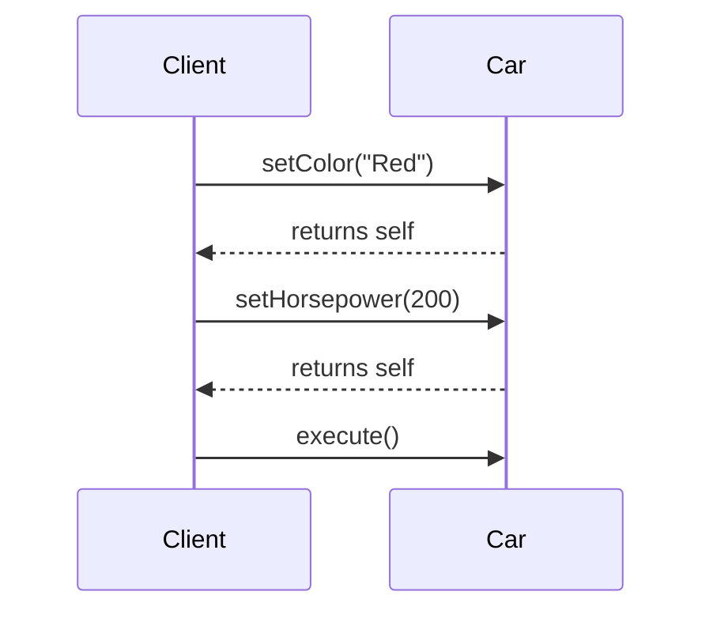

## 8.16 Method Chaining and Fluent Interfaces

Method chaining and fluent interfaces are powerful design patterns that enable developers to write clean, expressive, and readable code. By allowing multiple method calls to be chained together, these patterns enhance the usability of APIs and make complex configurations more intuitive. In this section, we will explore the intent behind these patterns, how to implement them in Swift, and various use cases where they shine.

### Intent

The primary intent of method chaining and fluent interfaces is to design APIs that allow for chaining method calls, thereby improving code readability and expressiveness. This pattern is particularly useful in scenarios where objects need to be configured through a series of method calls, such as setting up UI components, constructing database queries, or configuring network requests.

### Implementing Fluent Interfaces

Fluent interfaces are designed to provide a more natural and readable way of interacting with an API. The key to implementing fluent interfaces is to ensure that each method returns an instance of the object, allowing for subsequent method calls to be chained together.

#### Returning Self

One of the simplest ways to implement method chaining is by having methods return `self`. This approach allows the same instance to be modified through a sequence of method calls.

```swift
class Car {
    var color: String = "White"
    var horsepower: Int = 150

    @discardableResult
    func setColor(_ color: String) -> Car {
        self.color = color
        return self
    }

    @discardableResult
    func setHorsepower(_ horsepower: Int) -> Car {
        self.horsepower = horsepower
        return self
    }
}

// Usage
let car = Car()
    .setColor("Red")
    .setHorsepower(200)
```

In this example, each method returns `self`, allowing the `Car` object to be configured in a single, fluent statement.

#### Immutable Builders

Another approach is to use immutable builders, where each method returns a new instance of the object with the desired modifications. This pattern is particularly useful in functional programming paradigms where immutability is preferred.

```swift
struct ImmutableCar {
    let color: String
    let horsepower: Int

    func withColor(_ color: String) -> ImmutableCar {
        return ImmutableCar(color: color, horsepower: self.horsepower)
    }

    func withHorsepower(_ horsepower: Int) -> ImmutableCar {
        return ImmutableCar(color: self.color, horsepower: horsepower)
    }
}

// Usage
let immutableCar = ImmutableCar(color: "White", horsepower: 150)
    .withColor("Blue")
    .withHorsepower(250)
```

Here, each method returns a new instance of `ImmutableCar`, preserving immutability while allowing for fluent configuration.

#### Overloading Operators

In some cases, you might choose to overload operators to further enhance the chaining experience. This approach, while less common, can provide a more concise syntax for certain operations.

```swift
struct Vector {
    var x: Double
    var y: Double

    static func +(lhs: Vector, rhs: Vector) -> Vector {
        return Vector(x: lhs.x + rhs.x, y: lhs.y + rhs.y)
    }

    static func *(lhs: Vector, rhs: Double) -> Vector {
        return Vector(x: lhs.x * rhs, y: lhs.y * rhs)
    }
}

// Usage
let vector = Vector(x: 1.0, y: 2.0) + Vector(x: 3.0, y: 4.0) * 2.0
```

In this example, operator overloading allows vectors to be added and scaled in a fluent manner.

### Use Cases and Examples

Method chaining and fluent interfaces are versatile patterns that can be applied in various scenarios. Let's explore some common use cases.

#### Configuration Setup

Fluent interfaces are ideal for configuring objects, such as setting up UI components or network requests. By chaining method calls, you can create clear and concise configuration code.

```swift
class NetworkRequest {
    private var url: String = ""
    private var method: String = "GET"
    private var headers: [String: String] = [:]

    @discardableResult
    func setUrl(_ url: String) -> NetworkRequest {
        self.url = url
        return self
    }

    @discardableResult
    func setMethod(_ method: String) -> NetworkRequest {
        self.method = method
        return self
    }

    @discardableResult
    func addHeader(key: String, value: String) -> NetworkRequest {
        self.headers[key] = value
        return self
    }

    func execute() {
        // Execute the network request
    }
}

// Usage
let request = NetworkRequest()
    .setUrl("https://api.example.com/data")
    .setMethod("POST")
    .addHeader(key: "Authorization", value: "Bearer token")
    .execute()
```

In this example, the `NetworkRequest` class uses method chaining to configure and execute a network request in a single statement.

#### Query Builders

Constructing complex database or search queries can benefit from method chaining, allowing for readable and maintainable query construction.

```swift
class QueryBuilder {
    private var query: String = ""

    @discardableResult
    func select(_ fields: String) -> QueryBuilder {
        query += "SELECT \\(fields) "
        return self
    }

    @discardableResult
    func from(_ table: String) -> QueryBuilder {
        query += "FROM \\(table) "
        return self
    }

    @discardableResult
    func whereClause(_ condition: String) -> QueryBuilder {
        query += "WHERE \\(condition) "
        return self
    }

    func build() -> String {
        return query
    }
}

// Usage
let sqlQuery = QueryBuilder()
    .select("*")
    .from("users")
    .whereClause("age > 18")
    .build()
```

The `QueryBuilder` class demonstrates how method chaining can be used to construct SQL queries in a readable manner.

#### Testing APIs

Fluent interfaces can also enhance the readability of test setups, making it easier to understand test configurations and expectations.

```swift
class TestSetup {
    private var configuration: [String: Any] = [:]

    @discardableResult
    func withEnvironment(_ environment: String) -> TestSetup {
        configuration["environment"] = environment
        return self
    }

    @discardableResult
    func withTimeout(_ timeout: Int) -> TestSetup {
        configuration["timeout"] = timeout
        return self
    }

    func execute() {
        // Execute the test with the given configuration
    }
}

// Usage
let test = TestSetup()
    .withEnvironment("staging")
    .withTimeout(30)
    .execute()
```

In this example, the `TestSetup` class uses method chaining to configure and execute a test setup.

### Design Considerations

When implementing method chaining and fluent interfaces, there are several design considerations to keep in mind:

- **Readability**: Ensure that the chained methods are intuitive and improve code readability. Avoid overly complex chains that can become difficult to understand.
- **Error Handling**: Consider how errors will be handled in a chain. Ensure that each method can gracefully handle errors and provide meaningful feedback.
- **Performance**: Be mindful of performance implications, especially when using immutable builders that create new instances with each method call.
- **Consistency**: Maintain consistency in method naming and behavior to provide a predictable API experience.

### Swift Unique Features

Swift offers several unique features that can enhance the implementation of method chaining and fluent interfaces:

- **Optionals**: Use optionals to handle cases where a method might not return a valid result, enabling safer chaining.
- **Protocol Extensions**: Leverage protocol extensions to provide default implementations for chaining methods, reducing boilerplate code.
- **Generics**: Utilize generics to create flexible and reusable chaining methods that work with different types.

### Differences and Similarities

Method chaining and fluent interfaces are often confused with each other, but they have distinct differences:

- **Method Chaining**: Focuses on returning `self` to allow for consecutive method calls on the same instance.
- **Fluent Interfaces**: Emphasizes creating a more readable and expressive API by designing methods that naturally flow together.

While both patterns aim to improve code readability, fluent interfaces place a stronger emphasis on the overall design and flow of the API.

### Try It Yourself

To fully grasp the power of method chaining and fluent interfaces, try modifying the examples provided. Experiment with adding new methods, handling errors, or implementing a new use case. By actively engaging with the code, you'll gain a deeper understanding of these patterns and how they can enhance your Swift development.

### Visualizing Method Chaining

To better understand how method chaining works, let's visualize the flow of method calls using a sequence diagram.



This diagram illustrates the sequence of method calls in a method chaining pattern, where each method returns the instance (`self`) to enable further chaining.

### Knowledge Check

Before we conclude, let's reinforce your understanding with a few questions:

- What is the primary intent of method chaining and fluent interfaces?
- How does returning `self` enable method chaining?
- What are the benefits of using immutable builders?
- How can operator overloading enhance method chaining?
- What are some common use cases for fluent interfaces?

### Embrace the Journey

Remember, mastering method chaining and fluent interfaces is just one step in your Swift development journey. As you continue to explore and experiment with these patterns, you'll discover new ways to write expressive and maintainable code. Stay curious, keep learning, and enjoy the process of becoming a more proficient Swift developer!

## Quiz Time!



### What is the primary intent of method chaining and fluent interfaces?

- [x] To design APIs that allow for chaining method calls, improving code readability and expressiveness.
- [ ] To create complex algorithms.
- [ ] To enhance security features.
- [ ] To reduce memory usage.

> **Explanation:** The primary intent is to design APIs that allow for chaining method calls, which improves code readability and expressiveness.

### How does returning `self` enable method chaining?

- [x] It allows multiple methods to be called on the same instance consecutively.
- [ ] It creates a new instance for each method call.
- [ ] It prevents method calls from modifying the instance.
- [ ] It automatically handles errors in the chain.

> **Explanation:** Returning `self` allows multiple methods to be called consecutively on the same instance, enabling method chaining.

### What are the benefits of using immutable builders?

- [x] They preserve immutability while allowing for fluent configuration.
- [ ] They reduce the number of lines of code.
- [ ] They automatically optimize performance.
- [ ] They handle errors automatically.

> **Explanation:** Immutable builders preserve immutability by returning new instances with each method call, while still allowing for fluent configuration.

### How can operator overloading enhance method chaining?

- [x] It provides a more concise syntax for certain operations.
- [ ] It increases the complexity of the code.
- [ ] It reduces the need for method chaining.
- [ ] It automatically handles errors.

> **Explanation:** Operator overloading can provide a more concise syntax for certain operations, enhancing the chaining experience.

### What are some common use cases for fluent interfaces?

- [x] Configuration setup, query builders, and testing APIs.
- [ ] Error handling, security, and memory management.
- [ ] User authentication, data encryption, and logging.
- [ ] File I/O, threading, and network protocols.

> **Explanation:** Fluent interfaces are commonly used for configuration setup, query builders, and testing APIs.

### What is a key design consideration when implementing method chaining?

- [x] Ensure that the chained methods are intuitive and improve code readability.
- [ ] Focus on reducing the number of methods.
- [ ] Prioritize performance over readability.
- [ ] Avoid using optionals.

> **Explanation:** It is important to ensure that the chained methods are intuitive and improve code readability.

### How can Swift's protocol extensions be leveraged in method chaining?

- [x] To provide default implementations for chaining methods, reducing boilerplate code.
- [ ] To enforce immutability in all methods.
- [ ] To automatically handle errors in the chain.
- [ ] To create new instances for each method call.

> **Explanation:** Protocol extensions can be used to provide default implementations for chaining methods, reducing boilerplate code.

### What is a difference between method chaining and fluent interfaces?

- [x] Method chaining focuses on returning `self`, while fluent interfaces emphasize readable and expressive APIs.
- [ ] Method chaining is only used in Swift, while fluent interfaces are used in all languages.
- [ ] Method chaining is for performance, while fluent interfaces are for security.
- [ ] Method chaining requires operator overloading, while fluent interfaces do not.

> **Explanation:** Method chaining focuses on returning `self` to allow consecutive method calls, while fluent interfaces emphasize creating readable and expressive APIs.

### How can optionals be used in method chaining?

- [x] To handle cases where a method might not return a valid result, enabling safer chaining.
- [ ] To automatically create new instances for each method call.
- [ ] To enforce immutability in the chain.
- [ ] To reduce the number of methods in the chain.

> **Explanation:** Optionals can be used to handle cases where a method might not return a valid result, enabling safer chaining.

### True or False: Fluent interfaces are only useful in object-oriented programming.

- [ ] True
- [x] False

> **Explanation:** Fluent interfaces can be used in various programming paradigms, including functional programming, to create expressive and readable APIs.






