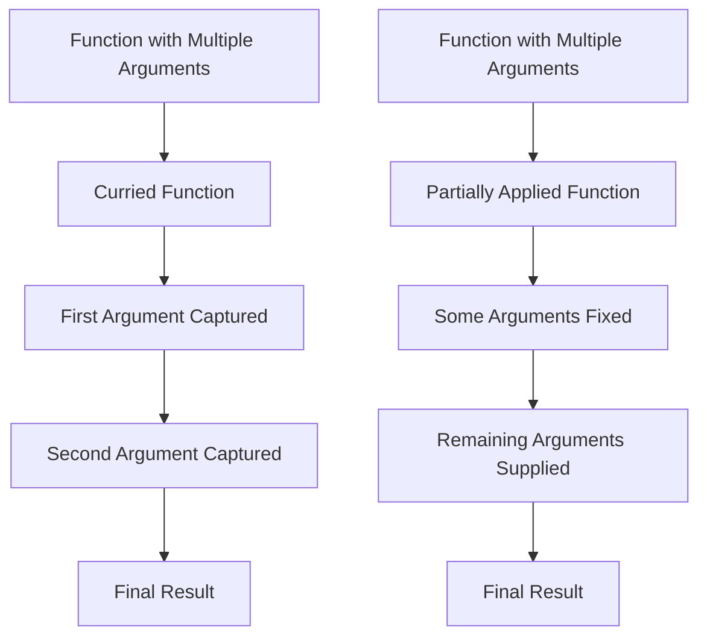

## 8.17 Currying and Partial Application

In the world of functional programming, currying and partial application are powerful techniques that can transform the way we write and use functions. These concepts allow us to break down complex functions into simpler, more manageable pieces, and increase the flexibility and reusability of our code. In this section, we will explore how to implement currying and partial application in Swift, delve into practical use cases, and provide comprehensive code examples to illustrate these concepts.

### Understanding Currying and Partial Application

**Currying** is the process of transforming a function that takes multiple arguments into a series of functions that each take a single argument. This technique is named after the mathematician Haskell Curry and is a fundamental concept in functional programming.

**Partial Application**, on the other hand, involves fixing a few arguments of a function, producing another function of smaller arity. While currying always transforms a function into a sequence of unary functions, partial application allows us to fix some arguments and leave the rest to be supplied later.

#### Intent

The intent of currying and partial application is to transform functions to enable the partial application of arguments, thereby increasing flexibility and reusability. This can lead to more modular and maintainable code, as it allows developers to create specialized functions from general ones.

### Implementing Currying in Swift

Swift, with its powerful type system and support for functional programming concepts, provides a robust environment for implementing currying and partial application. Let's explore how we can achieve this in Swift.

#### Nested Functions

In Swift, we can implement currying using nested functions. A nested function can capture an argument and return another function that captures the next argument, and so on, until all arguments are captured.

```swift
// Example of currying using nested functions
func add(_ x: Int) -> (Int) -> Int {
    return { y in
        return x + y
    }
}

let addFive = add(5)
let result = addFive(10) // result is 15
```

In this example, `add` is a curried function that takes an integer `x` and returns another function that takes an integer `y`. The returned function adds `x` and `y` together.

#### Partial Application

Partial application in Swift can be achieved by fixing some arguments of a function and returning a new function that takes the remaining arguments.

```swift
// Example of partial application
func multiply(_ x: Int, _ y: Int) -> Int {
    return x * y
}

func partiallyApplyMultiply(_ x: Int) -> (Int) -> Int {
    return { y in
        return multiply(x, y)
    }
}

let double = partiallyApplyMultiply(2)
let doubledValue = double(5) // doubledValue is 10
```

Here, `partiallyApplyMultiply` fixes the first argument of the `multiply` function, returning a new function that only requires the second argument.

### Use Cases and Examples

Currying and partial application can be extremely useful in various scenarios. Let's explore some practical use cases.

#### Customizable Functions

Currying allows us to create specialized functions from general ones, making our code more modular and reusable.

```swift
// General function
func greet(_ greeting: String, _ name: String) -> String {
    return "\\(greeting), \\(name)!"
}

// Curried function
func curriedGreet(_ greeting: String) -> (String) -> String {
    return { name in
        return greet(greeting, name)
    }
}

let sayHello = curriedGreet("Hello")
let personalizedGreeting = sayHello("Alice") // "Hello, Alice!"
```

In this example, `curriedGreet` allows us to create a specialized greeting function, `sayHello`, that can be reused with different names.

#### Functional Libraries

In functional libraries, currying and partial application can be used to pass functions as parameters with some arguments pre-filled, making it easier to compose and reuse functions.

```swift
// Higher-order function example
func filter<T>(_ array: [T], _ predicate: (T) -> Bool) -> [T] {
    return array.filter(predicate)
}

let numbers = [1, 2, 3, 4, 5, 6]
let isEven: (Int) -> Bool = { $0 % 2 == 0 }
let evenNumbers = filter(numbers, isEven) // [2, 4, 6]
```

By partially applying the `isEven` predicate, we can easily filter the array for even numbers.

#### Event Handlers

Currying and partial application can be particularly useful for capturing context in event handlers or callbacks.

```swift
// Event handler example
func makeButtonHandler(for buttonName: String) -> () -> Void {
    return {
        print("\\(buttonName) button pressed")
    }
}

let playButtonHandler = makeButtonHandler(for: "Play")
playButtonHandler() // "Play button pressed"
```

Here, `makeButtonHandler` captures the button name, allowing us to create a specific handler for each button.

### Visualizing Currying and Partial Application

To better understand the flow of currying and partial application, let's visualize these concepts using a flowchart.



In the diagram above, the currying process transforms a function with multiple arguments into a sequence of functions, each capturing one argument. Partial application, on the other hand, fixes some arguments and creates a new function that takes the remaining arguments.

### Swift Unique Features

Swift's support for closures and type inference makes it particularly well-suited for implementing currying and partial application. The language's emphasis on safety and expressiveness allows developers to write concise and readable code while leveraging these functional programming techniques.

#### Key Considerations

- **Readability**: While currying and partial application can lead to more modular code, they can also make code harder to read for those unfamiliar with these concepts. It's important to strike a balance between abstraction and clarity.
- **Performance**: Currying and partial application can introduce additional function calls, which may impact performance. Consider the trade-offs in performance-sensitive code.

### Try It Yourself

To solidify your understanding of currying and partial application in Swift, try modifying the code examples above. For instance, experiment with creating a curried function that takes three arguments, or partially apply a function with different argument orders. Observe how these changes affect the behavior of your code.

### Knowledge Check

- Explain the difference between currying and partial application.
- How can currying improve code reusability?
- What are some potential downsides of using currying and partial application?

### Embrace the Journey

Remember, mastering currying and partial application is just one step in your journey to becoming a more proficient Swift developer. These techniques are powerful tools that can enhance the flexibility and reusability of your code. Keep experimenting, stay curious, and enjoy the journey!

## Quiz Time!



### What is currying?

- [x] Transforming a function that takes multiple arguments into a series of functions that each take a single argument
- [ ] Fixing a few arguments of a function to produce another function of smaller arity
- [ ] Combining multiple functions into one
- [ ] None of the above

> **Explanation:** Currying transforms a function with multiple arguments into a sequence of unary functions.

### What is partial application?

- [ ] Transforming a function that takes multiple arguments into a series of functions that each take a single argument
- [x] Fixing a few arguments of a function to produce another function of smaller arity
- [ ] Combining multiple functions into one
- [ ] None of the above

> **Explanation:** Partial application involves fixing some arguments of a function to create a new function that takes the remaining arguments.

### Which of the following is a use case for currying?

- [x] Creating specialized functions from general ones
- [ ] Reducing code readability
- [ ] Increasing function arity
- [ ] None of the above

> **Explanation:** Currying allows us to create specialized functions from general ones, enhancing code reusability.

### How does Swift support currying?

- [x] By using nested functions and closures
- [ ] By using only classes
- [ ] By using only structs
- [ ] None of the above

> **Explanation:** Swift supports currying through nested functions and closures, which can capture arguments and return new functions.

### What is a potential downside of using currying?

- [x] It can make code harder to read
- [ ] It increases code performance
- [ ] It reduces function reusability
- [ ] None of the above

> **Explanation:** While currying can enhance modularity, it can also make code harder to read for those unfamiliar with the concept.

### Which of the following is true about partial application?

- [x] It fixes some arguments of a function
- [ ] It always returns a function of arity one
- [ ] It cannot be used with closures
- [ ] None of the above

> **Explanation:** Partial application fixes some arguments of a function, creating a new function that takes the remaining arguments.

### Can currying and partial application be used together?

- [x] Yes
- [ ] No

> **Explanation:** Currying and partial application can be used together to enhance function flexibility and reusability.

### What is the primary benefit of using currying?

- [x] It increases function flexibility and reusability
- [ ] It reduces code execution time
- [ ] It simplifies function definitions
- [ ] None of the above

> **Explanation:** Currying increases function flexibility and reusability by breaking down complex functions into simpler parts.

### Which Swift feature enhances the implementation of currying?

- [x] Closures
- [ ] Enums
- [ ] Protocols
- [ ] None of the above

> **Explanation:** Swift's support for closures enhances the implementation of currying by allowing functions to capture arguments and return new functions.

### Currying always results in a series of functions with how many arguments?

- [x] One
- [ ] Two
- [ ] Three
- [ ] None of the above

> **Explanation:** Currying transforms a function into a series of unary functions, each taking a single argument.




