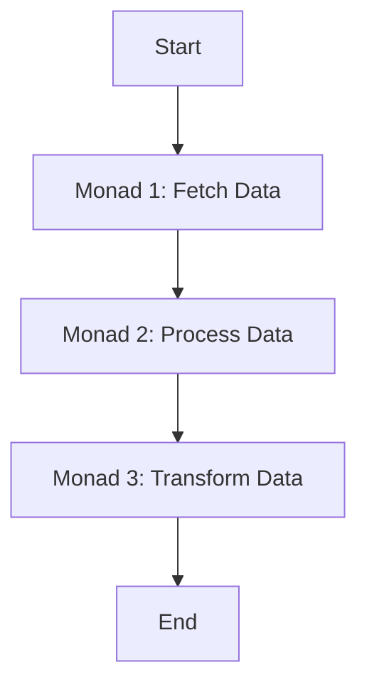

## 8.18 Monads and Functional Composition

In the world of functional programming, monads and functional composition are powerful tools that allow developers to manage side effects and represent complex computations as a series of steps. This approach not only enhances code composability and reusability but also leads to cleaner and more maintainable code. In this section, we will delve into the concepts of monads and functional composition in Swift, exploring their implementation, use cases, and benefits.

### Intent

The primary intent of using monads and functional composition in Swift is to manage side effects and represent computations as a series of steps. This approach enhances code composability and reusability, making it easier to build robust and scalable applications.

### Implementing Monads in Swift

To understand how to implement monads in Swift, we need to first grasp the Monad Protocol. Monads are a type of abstract data type used to represent computations instead of data in the domain model. They are defined by two main operations: `map` and `flatMap`.

#### Understanding the Monad Protocol

The Monad Protocol in Swift can be thought of as a blueprint for creating monads. It involves implementing two essential functions: `map` and `flatMap`.

- **`map`**: This function applies a transformation to the value inside the monad, returning a new monad containing the transformed value.
- **`flatMap`**: This function is similar to `map`, but it allows for chaining operations that return monads themselves, effectively flattening nested monads.

Here's a simple example of how you might define a Monad Protocol in Swift:

```swift
protocol Monad {
    associatedtype A
    func map<B>(_ transform: (A) -> B) -> Self
    func flatMap<B>(_ transform: (A) -> Monad<B>) -> Monad<B>
}
```

#### Optionals as Monads

Optionals in Swift can be considered monads because they provide the `flatMap` function, which allows for safe chaining of operations that might fail.

Consider the following example:

```swift
func divide(_ numerator: Double, by denominator: Double) -> Double? {
    guard denominator != 0 else { return nil }
    return numerator / denominator
}

let result = divide(10, by: 2)
    .flatMap { divide($0, by: 2) }
    .flatMap { divide($0, by: 2) }

print(result) // Optional(1.25)
```

In this example, we chain multiple division operations using `flatMap`, ensuring that if any operation fails, the entire chain fails gracefully.

#### Result Type

The `Result` type in Swift is another example of a monad. It allows us to chain computations that may fail, propagating errors without the need for nested code.

Here's how you might use the `Result` type:

```swift
enum NetworkError: Error {
    case badURL
    case requestFailed
}

func fetchData(from url: String) -> Result<Data, NetworkError> {
    guard url.starts(with: "http") else {
        return .failure(.badURL)
    }
    // Simulate network request
    return .success(Data())
}

let data = fetchData(from: "http://example.com")
    .flatMap { data in
        // Process data
        return .success(data)
    }
    .flatMap { processedData in
        // Further processing
        return .success(processedData)
    }

switch data {
case .success(let finalData):
    print("Data processed successfully: \\(finalData)")
case .failure(let error):
    print("Failed with error: \\(error)")
}
```

#### Custom Monads

Creating custom monads in Swift allows you to tailor monadic behavior to specific use cases. This can be particularly useful for handling domain-specific logic or managing side effects.

For example, let's create a custom monad for logging operations:

```swift
struct Logger<T> {
    let value: T
    let log: String

    func map<U>(_ transform: (T) -> U) -> Logger<U> {
        return Logger<U>(value: transform(value), log: log)
    }

    func flatMap<U>(_ transform: (T) -> Logger<U>) -> Logger<U> {
        let newLogger = transform(value)
        return Logger<U>(value: newLogger.value, log: log + newLogger.log)
    }
}

let initialLog = Logger(value: 10, log: "Starting value: 10\n")
let finalLog = initialLog
    .flatMap { Logger(value: $0 * 2, log: "Doubled value: \\($0 * 2)\n") }
    .flatMap { Logger(value: $0 + 5, log: "Added 5: \\($0 + 5)\n") }

print(finalLog.log)
// Output:
// Starting value: 10
// Doubled value: 20
// Added 5: 25
```

### Use Cases and Examples

Monads and functional composition are particularly useful in several scenarios, including error handling, asynchronous operations, and data transformations.

#### Error Handling

Monads allow for elegant error propagation without deeply nested code structures. By using the `Result` type or custom monads, you can handle errors gracefully and maintain clean code.

#### Asynchronous Operations

Monads can be used to chain asynchronous operations, such as network calls or database queries, in a way that is both readable and maintainable.

Consider the following example of chaining network calls:

```swift
func fetchUserData() -> Result<Data, NetworkError> {
    // Simulate fetching user data
    return .success(Data())
}

func fetchUserPosts() -> Result<Data, NetworkError> {
    // Simulate fetching user posts
    return .success(Data())
}

let userData = fetchUserData()
    .flatMap { data in
        // Process user data
        return fetchUserPosts()
    }
    .flatMap { postsData in
        // Process posts data
        return .success(postsData)
    }

switch userData {
case .success(let data):
    print("Successfully fetched user data and posts: \\(data)")
case .failure(let error):
    print("Failed with error: \\(error)")
}
```

#### Data Transformations

Monads and functional composition can simplify complex data transformations by allowing you to apply multiple transformations in a pipeline.

Here's an example of transforming an array of numbers using functional composition:

```swift
let numbers = [1, 2, 3, 4, 5]

let transformedNumbers = numbers
    .map { $0 * 2 }
    .filter { $0 > 5 }
    .reduce(0, +)

print(transformedNumbers) // Output: 18
```

### Visualizing Monads and Functional Composition

To better understand how monads and functional composition work, let's visualize the process using a flowchart.



In this diagram, each monad represents a step in the computation process, with data flowing from one step to the next. This visualization highlights the composable nature of monads and functional composition, allowing for clear and maintainable code.

### References and Links

For further reading on monads and functional programming, consider exploring the following resources:

- [Swift.org: Swift Language Guide](https://swift.org/documentation/#the-swift-programming-language)
- [Apple Developer Documentation: Swift Standard Library](https://developer.apple.com/documentation/swift)
- [Functional Programming in Swift](https://www.objc.io/books/functional-swift/)

### Knowledge Check

To reinforce your understanding of monads and functional composition in Swift, consider the following questions:

1. What are the two main operations that define a monad?
2. How can `Optionals` be used as monads in Swift?
3. What is the purpose of the `Result` type in Swift?
4. How can custom monads be beneficial in specific use cases?
5. What are some common use cases for monads and functional composition?

### Embrace the Journey

Remember, mastering monads and functional composition in Swift is a journey. As you continue to explore these concepts, you'll discover new ways to enhance your code's composability and reusability. Keep experimenting, stay curious, and enjoy the journey!

### Quiz Time!



### What are the two main operations that define a monad?

- [x] map and flatMap
- [ ] filter and reduce
- [ ] append and remove
- [ ] init and deinit

> **Explanation:** Monads are defined by the operations `map` and `flatMap`, which allow for transformations and chaining of computations.

### How can Optionals be used as monads in Swift?

- [x] By using flatMap to chain operations safely
- [ ] By using reduce to combine values
- [ ] By using filter to exclude nil values
- [ ] By using append to add new values

> **Explanation:** Optionals in Swift can be used as monads by utilizing `flatMap` to safely chain operations that might fail.

### What is the purpose of the Result type in Swift?

- [x] To chain computations that may fail and propagate errors
- [ ] To store multiple values in a list
- [ ] To perform mathematical operations
- [ ] To manage memory allocation

> **Explanation:** The `Result` type in Swift is used to chain computations that may fail, allowing for error propagation without nested code.

### How can custom monads be beneficial in specific use cases?

- [x] They allow for domain-specific logic and managing side effects
- [ ] They simplify memory management
- [ ] They enhance user interface design
- [ ] They improve network connectivity

> **Explanation:** Custom monads can be tailored to handle domain-specific logic and manage side effects, providing more flexibility in specific use cases.

### What are some common use cases for monads and functional composition?

- [x] Error handling, asynchronous operations, data transformations
- [ ] User interface design, memory management, network connectivity
- [ ] Hardware interaction, file system management, database access
- [ ] Graphics rendering, audio processing, video playback

> **Explanation:** Monads and functional composition are commonly used for error handling, asynchronous operations, and data transformations.

### Which Swift feature allows safe chaining of operations that might fail?

- [x] Optionals with flatMap
- [ ] Arrays with map
- [ ] Dictionaries with filter
- [ ] Sets with reduce

> **Explanation:** Optionals in Swift allow safe chaining of operations that might fail using `flatMap`.

### What is the main benefit of using functional composition in Swift?

- [x] It enhances code composability and reusability
- [ ] It improves network speed
- [ ] It reduces memory usage
- [ ] It simplifies user interface design

> **Explanation:** Functional composition enhances code composability and reusability, making it easier to build robust applications.

### How does the Result type handle errors in Swift?

- [x] By propagating errors without nested code
- [ ] By ignoring errors and continuing execution
- [ ] By converting errors to warnings
- [ ] By logging errors to the console

> **Explanation:** The `Result` type in Swift handles errors by propagating them without the need for deeply nested code structures.

### What is a common use case for creating custom monads in Swift?

- [x] Managing side effects in domain-specific logic
- [ ] Enhancing user interface animations
- [ ] Improving file system performance
- [ ] Simplifying database queries

> **Explanation:** Custom monads are often created to manage side effects in domain-specific logic, providing more control over computations.

### True or False: Monads in Swift are only used for error handling.

- [ ] True
- [x] False

> **Explanation:** Monads in Swift are used for a variety of purposes, including error handling, asynchronous operations, and data transformations, not just error handling.



By exploring monads and functional composition in Swift, you can unlock new levels of code composability and reusability. As you continue your journey, remember to experiment, learn, and enjoy the process of mastering these powerful concepts!


