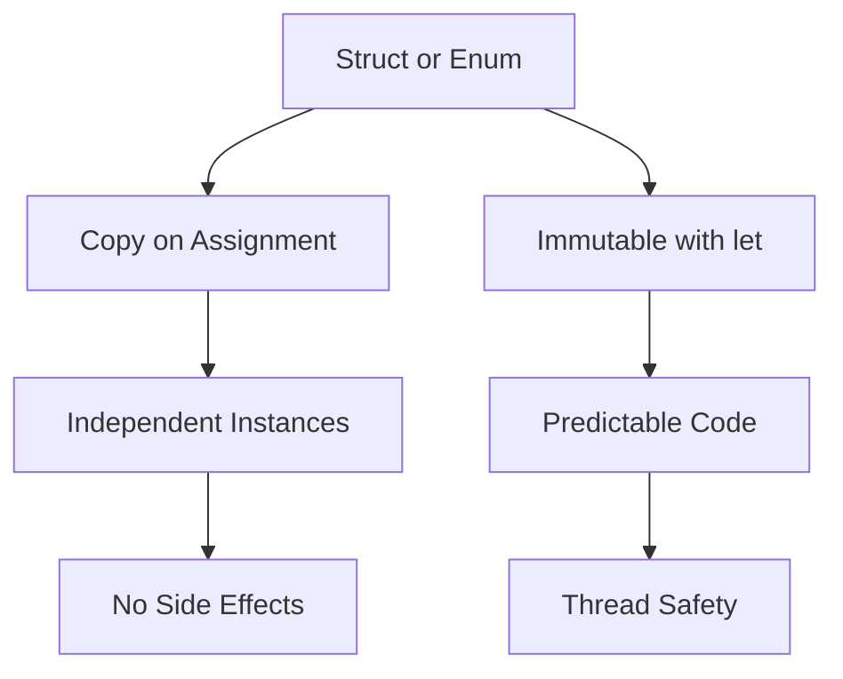

## 8.2 Value Semantics and Immutability

In the realm of Swift programming, understanding and leveraging value semantics and immutability is crucial for crafting efficient, predictable, and thread-safe applications. This section delves into the core principles of value semantics and immutability, demonstrating how they can be utilized to enhance your Swift development practices.

### Intent

The primary intent of embracing value semantics and immutability in Swift is to leverage value types, such as structs and enums, to create predictable and thread-safe code. By doing so, developers can ensure that their applications are not only efficient but also maintainable and robust.

### Implementing Value Semantics in Swift

#### Using Structs and Enums

In Swift, value types are primarily represented by structs and enums. Unlike classes, which are reference types, structs and enums are copied when they are passed around in your code. This means that each instance maintains its own separate copy of data, ensuring that changes to one instance do not affect others. This behavior is known as value semantics.

**Example: Structs in Swift**

```swift
struct Point {
    var x: Double
    var y: Double
}

var pointA = Point(x: 1.0, y: 2.0)
var pointB = pointA // pointB is a copy of pointA

pointB.x = 3.0 // Modifying pointB does not affect pointA

print(pointA.x) // Outputs: 1.0
print(pointB.x) // Outputs: 3.0
```

**Example: Enums in Swift**

```swift
enum Direction {
    case north, south, east, west
}

var currentDirection = Direction.north
var newDirection = currentDirection // newDirection is a copy

newDirection = .south

print(currentDirection) // Outputs: north
print(newDirection) // Outputs: south
```

By preferring structs and enums over classes when reference semantics are not required, you can create more predictable and safer code.

#### Constants with `let`

Swift encourages immutability by allowing developers to declare constants using the `let` keyword. This ensures that once a value is assigned, it cannot be changed, leading to more predictable and reliable code.

**Example: Using `let` for Immutability**

```swift
let fixedPoint = Point(x: 0.0, y: 0.0)
// fixedPoint.x = 1.0 // Error: Cannot assign to property: 'fixedPoint' is a 'let' constant
```

By making properties and variables immutable, you can prevent unintended side effects and reduce bugs.

#### Copy-on-Write Semantics

Swift employs an optimization technique known as copy-on-write (CoW) for its value types. This means that a copy of a value is only made when it is modified, not when it is initially assigned. This optimization helps improve performance while maintaining the benefits of value semantics.

**Example: Copy-on-Write in Action**

```swift
var arrayA = [1, 2, 3]
var arrayB = arrayA // No copy is made here

arrayB.append(4) // A copy is made at this point

print(arrayA) // Outputs: [1, 2, 3]
print(arrayB) // Outputs: [1, 2, 3, 4]
```

Understanding how Swift optimizes value types with copy-on-write semantics allows you to write efficient and performant code.

#### Thread Safety

One of the significant advantages of value semantics is thread safety. Since each instance is a separate copy, value types can be safely shared across threads without the need for synchronization mechanisms like locks.

**Example: Thread Safety with Value Types**

```swift
import Foundation

struct SafeCounter {
    var count: Int = 0
}

var counter = SafeCounter()

DispatchQueue.concurrentPerform(iterations: 10) { _ in
    var localCounter = counter
    localCounter.count += 1
    print(localCounter.count)
}

// The original counter remains unchanged
print(counter.count) // Outputs: 0
```

By leveraging value semantics, you can avoid synchronization issues and write safer concurrent code.

### Use Cases and Examples

#### Data Models

When representing data models, using structs can provide safety and clarity. Structs ensure that each instance of your data model is independent, reducing the risk of unintended mutations.

**Example: Data Model with Structs**

```swift
struct User {
    let id: Int
    let name: String
    let email: String
}

let user1 = User(id: 1, name: "Alice", email: "alice@example.com")
// user1.name = "Bob" // Error: Cannot assign to property: 'user1' is a 'let' constant
```

By representing data with structs, you can create safer and more reliable data models.

#### Functional Programming

Value semantics and immutability are essential principles in functional programming. By writing pure functions that do not modify their inputs, you can create code that is easier to reason about and test.

**Example: Pure Function**

```swift
func addPoints(_ point1: Point, _ point2: Point) -> Point {
    return Point(x: point1.x + point2.x, y: point1.y + point2.y)
}

let result = addPoints(Point(x: 1.0, y: 2.0), Point(x: 3.0, y: 4.0))
print(result) // Outputs: Point(x: 4.0, y: 6.0)
```

By embracing immutability, you can write functions without side effects, leading to more predictable and maintainable code.

#### Concurrency

In concurrent programming, avoiding synchronization issues is critical. By using value semantics, you can ensure that data is safely shared across threads without the need for complex synchronization mechanisms.

**Example: Concurrent Programming with Value Types**

```swift
import Foundation

struct Vector {
    var x: Double
    var y: Double
}

var vector = Vector(x: 0.0, y: 0.0)

DispatchQueue.concurrentPerform(iterations: 5) { index in
    var localVector = vector
    localVector.x += Double(index)
    localVector.y += Double(index)
    print("Vector \\(index): \\(localVector)")
}

// The original vector remains unchanged
print("Original vector: \\(vector)")
```

By avoiding synchronization issues, you can write safer and more efficient concurrent code.

### Visualizing Value Semantics and Immutability

To better understand the concepts of value semantics and immutability, let's visualize how they work in Swift.



**Diagram Description**: This flowchart illustrates how structs and enums in Swift are copied on assignment, leading to independent instances without side effects. When combined with immutability using `let`, this results in predictable code and enhanced thread safety.

### References and Links

- [Swift Language Guide: Structures and Classes](https://docs.swift.org/swift-book/LanguageGuide/ClassesAndStructures.html)
- [Understanding Copy-on-Write in Swift](https://www.swiftbysundell.com/articles/understanding-copy-on-write-in-swift/)
- [Swift.org: The Swift Programming Language](https://swift.org/documentation/)

### Knowledge Check

To reinforce your understanding of value semantics and immutability in Swift, consider the following questions:

1. What are the primary differences between value types and reference types in Swift?
2. How does Swift's copy-on-write optimization improve performance?
3. Why is immutability important in functional programming?
4. How can value semantics help in writing thread-safe code?
5. What are the benefits of using structs over classes for data models?

### Embrace the Journey

Remember, mastering value semantics and immutability in Swift is just the beginning. As you continue your journey, you'll discover more advanced techniques and patterns that will further enhance your Swift development skills. Keep experimenting, stay curious, and enjoy the process!

---

## Quiz Time!



### What is the primary advantage of using value types in Swift?

- [x] They ensure each instance is a separate copy, preventing unintended mutations.
- [ ] They are faster than reference types.
- [ ] They consume less memory.
- [ ] They are easier to write.

> **Explanation:** Value types, such as structs and enums, ensure that each instance is a separate copy, which prevents unintended mutations and enhances predictability.

### How does Swift implement copy-on-write semantics?

- [x] A copy is only made when a value is modified.
- [ ] A copy is made every time a value is assigned.
- [ ] A copy is made when a value is read.
- [ ] A copy is never made.

> **Explanation:** Swift employs copy-on-write semantics, meaning a copy of a value is only made when it is modified, not when it is initially assigned.

### Why is immutability important in functional programming?

- [x] It prevents side effects and makes functions easier to reason about.
- [ ] It makes code run faster.
- [ ] It reduces memory usage.
- [ ] It simplifies syntax.

> **Explanation:** Immutability prevents side effects, making functions easier to reason about and test, which is a core principle of functional programming.

### How can value semantics help in writing thread-safe code?

- [x] By ensuring data is safely shared across threads without synchronization.
- [ ] By reducing the number of threads needed.
- [ ] By making threads run faster.
- [ ] By simplifying thread management.

> **Explanation:** Value semantics ensure that data is safely shared across threads without the need for synchronization mechanisms, enhancing thread safety.

### What is a key benefit of using structs over classes for data models?

- [x] Structs provide safety by ensuring each instance is independent.
- [ ] Structs are faster to write.
- [ ] Structs consume less memory.
- [ ] Structs are easier to debug.

> **Explanation:** Structs provide safety by ensuring each instance is independent, reducing the risk of unintended mutations.

### Which keyword is used in Swift to declare constants?

- [x] `let`
- [ ] `var`
- [ ] `const`
- [ ] `immutable`

> **Explanation:** In Swift, the `let` keyword is used to declare constants, ensuring immutability.

### What happens when you modify a value type in Swift?

- [x] A new copy of the value is created.
- [ ] The original value is modified.
- [ ] An error is thrown.
- [ ] The value is deleted.

> **Explanation:** When you modify a value type in Swift, a new copy of the value is created, preserving the original value.

### How does Swift's type system contribute to immutability?

- [x] By allowing developers to declare constants with `let`.
- [ ] By enforcing strict typing.
- [ ] By simplifying syntax.
- [ ] By reducing memory usage.

> **Explanation:** Swift's type system contributes to immutability by allowing developers to declare constants with `let`, ensuring values cannot be changed.

### What is the effect of using `let` on a variable?

- [x] The variable becomes immutable.
- [ ] The variable becomes mutable.
- [ ] The variable is deleted.
- [ ] The variable is initialized to zero.

> **Explanation:** Using `let` on a variable makes it immutable, meaning its value cannot be changed after it is set.

### True or False: Enums in Swift are reference types.

- [ ] True
- [x] False

> **Explanation:** Enums in Swift are value types, not reference types, meaning they are copied when passed around.




