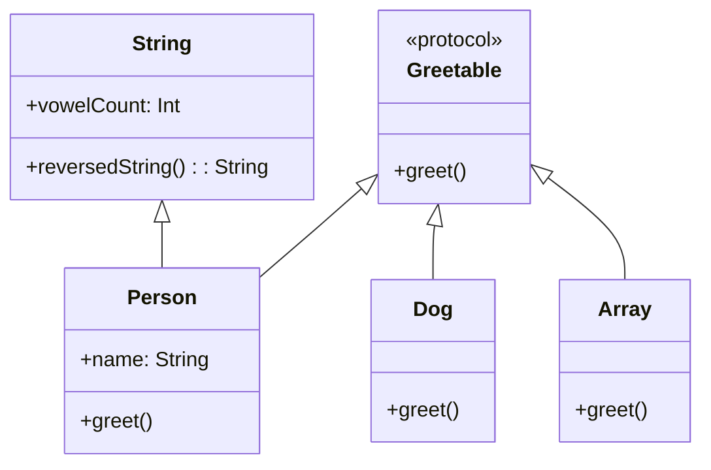

## 8.3 Extensions and Protocol Extensions

In Swift, extensions and protocol extensions are powerful tools that allow developers to add functionality to existing types and protocols. This feature promotes code organization, reusability, and clarity, making Swift a robust language for modern software development. In this section, we will delve into the intent and implementation of extensions and protocol extensions, explore their use cases, and provide practical examples to illustrate their utility.

### Intent

The primary intent of using extensions and protocol extensions in Swift is to enhance existing types and protocols without modifying their original source code. This approach allows developers to:

- **Add functionality**: Introduce new methods, computed properties, or nested types to existing classes, structs, or enums.
- **Promote code organization**: Group related functionality together, improving readability and maintainability.
- **Facilitate code reusability**: Share common behavior across different types through protocol extensions.

### Implementing Extensions in Swift

#### Type Extensions

Type extensions allow you to add new functionality to existing types, such as classes, structs, or enums. This is particularly useful when you want to extend the capabilities of a type without subclassing or modifying its original implementation.

```swift
extension String {
    // Add a computed property to count vowels in a string
    var vowelCount: Int {
        return self.lowercased().filter { "aeiou".contains($0) }.count
    }
    
    // Add a method to reverse the string
    func reversedString() -> String {
        return String(self.reversed())
    }
}

// Usage
let sampleText = "Hello, Swift!"
print("Vowel count: \\(sampleText.vowelCount)") // Output: Vowel count: 3
print("Reversed: \\(sampleText.reversedString())") // Output: Reversed: !tfiwS ,olleH
```

**Key Points**:
- Extensions can add computed properties, methods, and even new initializers.
- Extensions cannot add stored properties or override existing functionality.

#### Protocol Extensions

Protocol extensions allow you to provide default implementations for methods and properties declared in a protocol. This enables you to define shared behavior across all conforming types without requiring each type to implement the same code.

```swift
protocol Greetable {
    func greet()
}

extension Greetable {
    // Provide a default implementation of the greet method
    func greet() {
        print("Hello! Nice to meet you.")
    }
}

struct Person: Greetable {
    let name: String
    
    // Person does not need to implement greet() unless custom behavior is required
}

let john = Person(name: "John")
john.greet() // Output: Hello! Nice to meet you.
```

**Key Points**:
- Protocol extensions can be used to add default behavior to protocols.
- Conforming types can still provide their own implementation if needed.

#### Conditional Conformance

Swift allows you to extend types conditionally based on certain criteria, such as type constraints. This feature is particularly useful when working with generic types.

```swift
extension Array: Greetable where Element: Greetable {
    func greet() {
        forEach { $0.greet() }
    }
}

struct Dog: Greetable {
    func greet() {
        print("Woof! Woof!")
    }
}

let dogs: [Dog] = [Dog(), Dog()]
dogs.greet() // Output: Woof! Woof! Woof! Woof!
```

**Key Points**:
- Conditional conformance allows you to extend a type only when certain conditions are met.
- This is often used with generic types to provide additional functionality based on type parameters.

#### Organizing Code

Extensions can be used to organize code by grouping related functionality together. This approach helps keep the main implementation of a type clean and focused.

```swift
struct Calculator {
    var value: Double
}

// Organize mathematical operations in a separate extension
extension Calculator {
    mutating func add(_ number: Double) {
        value += number
    }
    
    mutating func subtract(_ number: Double) {
        value -= number
    }
}

// Organize display-related functionality in another extension
extension Calculator {
    func displayValue() -> String {
        return "Current value: \\(value)"
    }
}

// Usage
var calc = Calculator(value: 10)
calc.add(5)
print(calc.displayValue()) // Output: Current value: 15
```

**Key Points**:
- Use extensions to separate concerns and improve code readability.
- Extensions can be used to conform to protocols, organize methods, or add utility functions.

### Use Cases and Examples

#### Standard Library Enhancements

Extensions are commonly used to add utility methods to built-in types, enhancing their functionality without altering the original implementation.

```swift
extension Int {
    // Add a method to check if a number is even
    var isEven: Bool {
        return self % 2 == 0
    }
}

let number = 4
print(number.isEven) // Output: true
```

**Key Points**:
- Extend standard library types to add custom utility methods.
- Keep extensions focused on adding meaningful functionality.

#### Protocol Default Behavior

Protocol extensions are ideal for sharing common functionality across types that conform to a protocol. This reduces code duplication and enforces consistency.

```swift
protocol Printable {
    func printDetails()
}

extension Printable {
    func printDetails() {
        print("Default details.")
    }
}

struct Book: Printable {
    let title: String
    let author: String
    
    func printDetails() {
        print("Title: \\(title), Author: \\(author)")
    }
}

struct Magazine: Printable {
    let name: String
    let issue: Int
}

let book = Book(title: "Swift Programming", author: "Apple")
let magazine = Magazine(name: "Tech Today", issue: 42)

book.printDetails() // Output: Title: Swift Programming, Author: Apple
magazine.printDetails() // Output: Default details.
```

**Key Points**:
- Use protocol extensions to provide default behavior for protocols.
- Conforming types can override default implementations if needed.

#### Code Clarity

Extensions help keep types focused and clean by separating concerns and organizing related functionality. This improves code clarity and maintainability.

```swift
struct User {
    let username: String
    let email: String
}

// Organize validation logic in a separate extension
extension User {
    func isValidEmail() -> Bool {
        return email.contains("@")
    }
}

// Organize display logic in another extension
extension User {
    func displayInfo() -> String {
        return "User: \\(username), Email: \\(email)"
    }
}

// Usage
let user = User(username: "johndoe", email: "john@example.com")
print(user.isValidEmail()) // Output: true
print(user.displayInfo()) // Output: User: johndoe, Email: john@example.com
```

**Key Points**:
- Use extensions to separate different aspects of a type's functionality.
- This approach enhances code readability and maintainability.

### Visualizing Extensions and Protocol Extensions

To better understand how extensions and protocol extensions work, let's visualize their interactions and relationships using a class diagram.



**Diagram Explanation**:
- The `String` class is extended to include `vowelCount` and `reversedString` methods.
- The `Greetable` protocol provides a default `greet()` implementation.
- `Person` and `Dog` conform to `Greetable`, with `Person` providing its own implementation.
- The `Array` type conditionally conforms to `Greetable` when its elements do.

### Try It Yourself

To solidify your understanding of extensions and protocol extensions, try modifying the examples provided:

- Add more utility methods to the `String` extension, such as checking for palindromes.
- Create a new protocol with a default implementation and conform different types to it.
- Experiment with conditional conformance by extending other generic types.

### References and Links

For further reading and exploration, consider the following resources:

- [Swift Language Guide: Extensions](https://docs.swift.org/swift-book/LanguageGuide/Extensions.html)
- [Swift Language Guide: Protocols](https://docs.swift.org/swift-book/LanguageGuide/Protocols.html)
- [Apple Developer Documentation: Protocol-Oriented Programming](https://developer.apple.com/videos/play/wwdc2015/408/)

### Knowledge Check

- How do extensions enhance code organization and reusability?
- What are the limitations of extensions in Swift?
- How can protocol extensions provide default behavior to conforming types?

### Embrace the Journey

Remember, mastering extensions and protocol extensions in Swift is a journey that enhances your ability to write clean, organized, and reusable code. As you progress, you'll find more opportunities to apply these concepts in your projects, leading to more efficient and maintainable software. Keep exploring, stay curious, and enjoy the process!

## Quiz Time!



### What is the primary intent of using extensions in Swift?

- [x] To add functionality to existing types without modifying their original source code.
- [ ] To create new types from scratch.
- [ ] To override existing methods in a class.
- [ ] To replace the need for inheritance.

> **Explanation:** Extensions allow developers to add new functionality to existing types without altering their original implementation, promoting code organization and reusability.

### Which of the following can you NOT do with a Swift extension?

- [ ] Add computed properties
- [ ] Add new methods
- [x] Add stored properties
- [ ] Add new initializers

> **Explanation:** Extensions in Swift cannot add stored properties to existing types; they can only add computed properties, methods, and initializers.

### What is a protocol extension used for?

- [x] To provide default implementations for methods and properties in a protocol.
- [ ] To create a new protocol from scratch.
- [ ] To enforce strict type checking.
- [ ] To replace existing protocol methods.

> **Explanation:** Protocol extensions allow developers to provide default implementations for methods and properties, enabling shared behavior across conforming types.

### What is conditional conformance in Swift?

- [x] Extending types based on certain conditions.
- [ ] Creating new types conditionally.
- [ ] Overriding methods conditionally.
- [ ] Implementing protocols conditionally.

> **Explanation:** Conditional conformance allows you to extend a type only when certain conditions are met, often used with generic types.

### How can extensions improve code clarity?

- [x] By grouping related functionality together and separating concerns.
- [ ] By adding more lines of code to a type.
- [ ] By making the code more complex.
- [ ] By removing all comments from the code.

> **Explanation:** Extensions help organize code by grouping related functionality together, making the code more readable and maintainable.

### Can protocol extensions be used to override existing method implementations in conforming types?

- [ ] Yes, they can override any method.
- [x] No, they provide default implementations but do not override.
- [ ] Yes, but only in certain conditions.
- [ ] No, they cannot provide any implementations.

> **Explanation:** Protocol extensions provide default implementations, but conforming types can still provide their own implementations if needed.

### What is a common use case for extending standard library types?

- [x] To add utility methods that enhance their functionality.
- [ ] To change their core behavior.
- [ ] To remove existing methods.
- [ ] To make them abstract.

> **Explanation:** Extensions are often used to add utility methods to standard library types, enhancing their functionality without altering their core behavior.

### How can you use extensions to organize code?

- [x] By separating different aspects of a type's functionality into distinct extensions.
- [ ] By merging all functionality into a single extension.
- [ ] By creating duplicate code in multiple extensions.
- [ ] By removing all extensions and writing everything in the main type.

> **Explanation:** Extensions allow developers to separate different aspects of a type's functionality, improving code organization and readability.

### What is the benefit of providing default behavior in protocol extensions?

- [x] It reduces code duplication and enforces consistency across conforming types.
- [ ] It increases the complexity of the code.
- [ ] It requires each conforming type to implement the same code.
- [ ] It limits the flexibility of the protocol.

> **Explanation:** Protocol extensions reduce code duplication by providing default behavior, ensuring consistency across conforming types.

### True or False: Extensions in Swift can be used to add stored properties to existing types.

- [ ] True
- [x] False

> **Explanation:** False. Extensions in Swift cannot add stored properties to existing types; they can only add computed properties, methods, and initializers.






