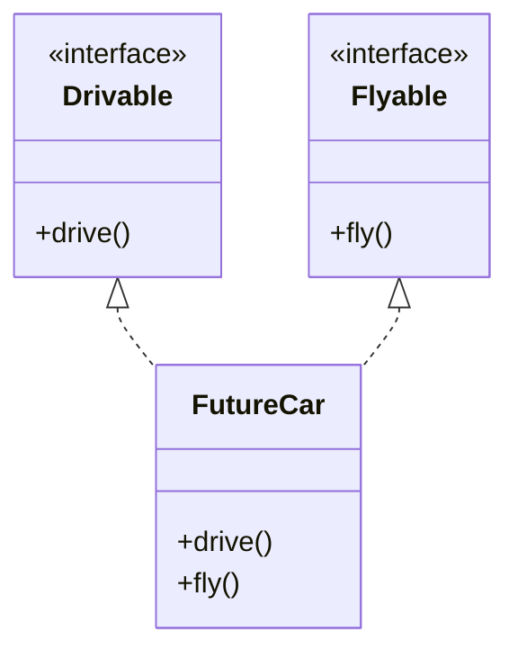

## 8.4 Protocol Composition

In the world of Swift programming, protocols are a powerful tool that allow us to define blueprints of methods, properties, and other requirements that suit a particular task or piece of functionality. Protocol Composition takes this concept further by allowing us to combine multiple protocols into a single requirement. This approach promotes flexibility, reusability, and type safety, making it an essential pattern in robust Swift development.

### Intent

The primary intent of Protocol Composition is to enable the combination of multiple protocols into a single requirement. This promotes flexibility and reusability by allowing different types to conform to multiple protocols, thus providing a way to mix behaviors without relying on inheritance.

### Implementing Protocol Composition in Swift

#### Combining Protocols

In Swift, you can use the `&` operator to combine multiple protocols. This operator allows you to specify that a type must conform to all the protocols in the composition. Here's a simple example:

```swift
protocol Drivable {
    func drive()
}

protocol Flyable {
    func fly()
}

typealias FlyingCar = Drivable & Flyable

struct FutureCar: FlyingCar {
    func drive() {
        print("Driving on the road.")
    }
    
    func fly() {
        print("Flying in the sky.")
    }
}

let myCar = FutureCar()
myCar.drive()
myCar.fly()
```

In this example, `FutureCar` conforms to both `Drivable` and `Flyable` protocols, and the `FlyingCar` typealias represents the protocol composition.

#### Generic Constraints

Protocol Composition is especially useful in generic programming. You can constrain a generic type to conform to multiple protocols, ensuring that the type meets all the specified criteria.

```swift
func performAction<T: Drivable & Flyable>(on vehicle: T) {
    vehicle.drive()
    vehicle.fly()
}

let flyingCar = FutureCar()
performAction(on: flyingCar)
```

Here, the `performAction` function accepts any type that conforms to both `Drivable` and `Flyable`, demonstrating the flexibility of protocol composition in generics.

#### Dynamic Dispatch

When working with types that conform to multiple protocols at runtime, Swift uses dynamic dispatch to call the appropriate methods. This ensures that the correct implementation is executed, even when the exact type is not known at compile time.

```swift
func executeAction(on object: Drivable & Flyable) {
    object.drive()
    object.fly()
}

executeAction(on: FutureCar())
```

In this example, the `executeAction` function works with any object conforming to both `Drivable` and `Flyable`, showcasing the dynamic dispatch capability of protocol composition.

### Use Cases and Examples

#### Flexible APIs

Protocol Composition allows you to write flexible APIs that can accept any type conforming to the desired protocols. This is particularly useful when designing libraries or frameworks where you want to provide maximum flexibility to the users.

```swift
protocol Readable {
    func read() -> String
}

protocol Writable {
    func write(_ content: String)
}

typealias ReadWrite = Readable & Writable

func performReadWriteOperation(on device: ReadWrite) {
    let content = device.read()
    print("Read content: \\(content)")
    device.write("New Content")
}
```

Here, the `performReadWriteOperation` function can operate on any device that is both `Readable` and `Writable`, making it highly flexible.

#### Mixing Behaviors

One of the key advantages of Protocol Composition is the ability to mix different behaviors without relying on inheritance. This allows for more modular and maintainable code.

```swift
protocol Swimmable {
    func swim()
}

protocol Runnable {
    func run()
}

typealias Amphibious = Swimmable & Runnable

struct AmphibiousVehicle: Amphibious {
    func swim() {
        print("Swimming in water.")
    }
    
    func run() {
        print("Running on land.")
    }
}

let vehicle = AmphibiousVehicle()
vehicle.swim()
vehicle.run()
```

In this example, `AmphibiousVehicle` combines the behaviors of both `Swimmable` and `Runnable`, demonstrating how Protocol Composition can be used to mix capabilities.

#### Type Safety

By using Protocol Composition, you can ensure that objects meet multiple criteria, enhancing type safety. This is particularly useful when you want to enforce strict requirements on the types that can be used in certain contexts.

```swift
protocol Identifiable {
    var id: String { get }
}

protocol Trackable {
    func trackLocation() -> String
}

typealias IdentifiableTrackable = Identifiable & Trackable

struct Device: IdentifiableTrackable {
    var id: String
    
    func trackLocation() -> String {
        return "Current location: 123 Main St."
    }
}

let myDevice = Device(id: "Device123")
print("Device ID: \\(myDevice.id)")
print(myDevice.trackLocation())
```

In this example, `Device` is required to be both `Identifiable` and `Trackable`, ensuring that it meets all necessary criteria.

### Visualizing Protocol Composition

To better understand how Protocol Composition works, let's visualize it using a class diagram.



This diagram illustrates how `FutureCar` conforms to both `Drivable` and `Flyable` protocols, effectively combining their behaviors.

### Design Considerations

When using Protocol Composition, consider the following:

- **Complexity**: While Protocol Composition provides flexibility, it can also increase complexity if overused. Strive for a balance between flexibility and simplicity.
- **Naming Conventions**: Use clear and descriptive names for composed protocols to enhance code readability.
- **Performance**: Be mindful of potential performance implications, especially when using dynamic dispatch.

### Swift Unique Features

Swift's emphasis on protocol-oriented programming makes Protocol Composition a natural fit. By leveraging Swift's powerful protocol system, you can create highly modular and reusable code. Key Swift features that enhance Protocol Composition include:

- **Protocol Extensions**: Extend composed protocols with default implementations.
- **Associated Types**: Use associated types to add flexibility to composed protocols.

### Differences and Similarities

Protocol Composition is often compared to multiple inheritance. However, unlike multiple inheritance, Protocol Composition does not inherit implementation, only requirements. This makes it a safer and more flexible alternative.

### Try It Yourself

To deepen your understanding of Protocol Composition, try modifying the examples provided:

- Add a new protocol, such as `Hoverable`, and compose it with existing protocols.
- Create a generic function that uses protocol composition to constrain its parameters.
- Experiment with protocol extensions to add default implementations to composed protocols.

### Knowledge Check

Before moving on, let's summarize the key takeaways:

- Protocol Composition allows for combining multiple protocols into a single requirement.
- It promotes flexibility, reusability, and type safety.
- Use the `&` operator to compose protocols.
- Protocol Composition is especially useful in generic programming and dynamic dispatch.

Remember, mastering Protocol Composition is just one step in your journey to becoming a proficient Swift developer. Keep experimenting, stay curious, and enjoy the process!

## Quiz Time!



### What is the primary intent of Protocol Composition in Swift?

- [x] To combine multiple protocols into a single requirement.
- [ ] To inherit implementation from multiple protocols.
- [ ] To replace inheritance in Swift.
- [ ] To define a new protocol with default implementations.

> **Explanation:** Protocol Composition allows combining multiple protocols into a single requirement, promoting flexibility and reusability.

### How do you combine protocols in Swift?

- [x] Using the `&` operator.
- [ ] Using the `|` operator.
- [ ] Using the `+` operator.
- [ ] Using the `*` operator.

> **Explanation:** The `&` operator is used to combine multiple protocols in Swift.

### What is a key advantage of Protocol Composition over inheritance?

- [x] It allows mixing behaviors without inheriting implementation.
- [ ] It provides default implementations for methods.
- [ ] It simplifies code by reducing the number of protocols.
- [ ] It enforces strict type constraints.

> **Explanation:** Protocol Composition allows mixing behaviors without relying on inheritance, making code more modular and maintainable.

### In what context is Protocol Composition especially useful?

- [x] In generic programming.
- [ ] In defining new classes.
- [ ] In implementing single inheritance.
- [ ] In creating default protocol methods.

> **Explanation:** Protocol Composition is especially useful in generic programming, where it allows for flexible type constraints.

### What does the following code snippet demonstrate?

```swift
func performAction<T: Drivable & Flyable>(on vehicle: T) {
    vehicle.drive()
    vehicle.fly()
}
```

- [x] Generic constraints using Protocol Composition.
- [ ] Dynamic dispatch with protocols.
- [ ] Protocol inheritance.
- [ ] Protocol extensions.

> **Explanation:** The code snippet demonstrates using Protocol Composition in generic constraints to ensure the type conforms to both `Drivable` and `Flyable`.

### What is a potential downside of overusing Protocol Composition?

- [x] Increased complexity.
- [ ] Reduced flexibility.
- [ ] Decreased code readability.
- [ ] Limited reusability.

> **Explanation:** While Protocol Composition provides flexibility, overusing it can lead to increased complexity.

### Which Swift feature enhances Protocol Composition by providing default implementations?

- [x] Protocol Extensions.
- [ ] Associated Types.
- [ ] Inheritance.
- [ ] Dynamic Dispatch.

> **Explanation:** Protocol Extensions in Swift allow adding default implementations to protocols, enhancing Protocol Composition.

### What is the difference between Protocol Composition and multiple inheritance?

- [x] Protocol Composition does not inherit implementation, only requirements.
- [ ] Protocol Composition allows inheriting implementation.
- [ ] Multiple inheritance is safer than Protocol Composition.
- [ ] Protocol Composition is limited to two protocols.

> **Explanation:** Protocol Composition does not inherit implementation, making it a safer alternative to multiple inheritance.

### What keyword is used to define a typealias for a composed protocol?

- [x] `typealias`
- [ ] `protocol`
- [ ] `struct`
- [ ] `class`

> **Explanation:** The `typealias` keyword is used to define a new name for a composed protocol.

### Is Protocol Composition unique to Swift?

- [x] No
- [ ] Yes

> **Explanation:** Protocol Composition is not unique to Swift, but Swift's protocol-oriented programming makes it particularly powerful.



By understanding and applying Protocol Composition, you can create flexible, reusable, and robust Swift applications. Keep exploring and experimenting with these concepts to enhance your Swift development skills!


