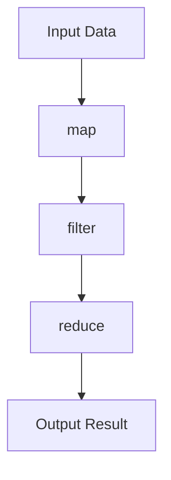

## 8.5 Functional Programming Patterns in Swift

Functional programming (FP) is a paradigm that treats computation as the evaluation of mathematical functions and avoids changing state or mutable data. In Swift, embracing functional programming patterns can lead to cleaner, more predictable, and more maintainable code. This section delves into the core concepts of functional programming in Swift, including first-class functions, higher-order functions, immutability, and pure functions, and demonstrates their application through practical examples.

### Intent

The intent of incorporating functional programming patterns in Swift is to write cleaner, more predictable code. By understanding and applying these patterns, developers can create robust applications that are easier to reason about, especially in multi-threaded environments.

### Implementing Functional Patterns in Swift

#### First-Class Functions

In Swift, functions are first-class citizens, meaning they can be assigned to variables, passed as arguments, and returned from other functions. This capability allows for a flexible and expressive coding style.

**Example:**

```swift
// Define a simple function that adds two integers
func add(_ a: Int, _ b: Int) -> Int {
    return a + b
}

// Assign the function to a variable
let addition: (Int, Int) -> Int = add

// Use the function variable
let sum = addition(3, 5)
print("Sum: \\(sum)")  // Output: Sum: 8
```

In this example, the `add` function is assigned to a variable `addition`, showcasing the first-class nature of functions in Swift.

#### Higher-Order Functions

Higher-order functions are functions that take other functions as parameters or return them as results. Swift provides several built-in higher-order functions such as `map`, `filter`, `reduce`, and `flatMap`, which are particularly useful for processing collections.

**Example: Using `map` to Transform Data**

```swift
let numbers = [1, 2, 3, 4, 5]

// Use map to square each number in the array
let squaredNumbers = numbers.map { $0 * $0 }
print("Squared Numbers: \\(squaredNumbers)")  // Output: Squared Numbers: [1, 4, 9, 16, 25]
```

The `map` function applies a given closure to each element of the array, transforming the data in a concise and expressive manner.

**Example: Filtering Data with `filter`**

```swift
// Use filter to get even numbers
let evenNumbers = numbers.filter { $0 % 2 == 0 }
print("Even Numbers: \\(evenNumbers)")  // Output: Even Numbers: [2, 4]
```

The `filter` function is used to include only those elements that satisfy a given condition, making it easy to extract specific data from a collection.

**Example: Reducing Data with `reduce`**

```swift
// Use reduce to sum all numbers in the array
let totalSum = numbers.reduce(0, +)
print("Total Sum: \\(totalSum)")  // Output: Total Sum: 15
```

The `reduce` function combines all elements of a collection into a single value, using a closure that specifies how to combine elements.

#### Immutability

Immutability is a core principle of functional programming, emphasizing the use of constants and immutable data structures. This approach helps prevent unintended side effects and makes code easier to reason about.

**Example:**

```swift
// Define an immutable array
let immutableArray = [1, 2, 3]

// Attempting to modify the array will result in a compile-time error
// immutableArray.append(4)  // Error: Cannot use mutating member on immutable value
```

By using `let` instead of `var`, we ensure that the data cannot be altered after its initial assignment, promoting stability and predictability in our code.

#### Pure Functions

Pure functions are functions that have no side effects and return the same output given the same input. They do not modify any state or interact with the outside world, making them highly predictable and easy to test.

**Example:**

```swift
// Define a pure function that calculates the factorial of a number
func factorial(_ n: Int) -> Int {
    return n == 0 ? 1 : n * factorial(n - 1)
}

let result = factorial(5)
print("Factorial: \\(result)")  // Output: Factorial: 120
```

The `factorial` function is pure because it relies solely on its input and produces consistent results without side effects.

### Use Cases and Examples

#### Data Transformation

Functional programming patterns are particularly effective for data transformation tasks, allowing developers to process collections in a concise and expressive way.

**Example: Chaining Higher-Order Functions**

```swift
let numbers = [1, 2, 3, 4, 5]

// Chain map, filter, and reduce to process the array
let result = numbers
    .map { $0 * 2 }
    .filter { $0 > 5 }
    .reduce(0, +)

print("Result: \\(result)")  // Output: Result: 18
```

In this example, we first double each number, filter out those less than or equal to 5, and then sum the remaining numbers. This chain of operations is both concise and expressive, highlighting the power of functional programming.

#### Concurrency

Functional programming patterns make it easier to reason about code in multi-threaded environments. By avoiding shared mutable state and using pure functions, developers can reduce the complexity of concurrent code.

**Example:**

Consider a scenario where multiple threads need to process a collection of data. Using pure functions and immutability ensures that each thread operates independently, reducing the risk of race conditions.

#### Declarative Code

Functional programming encourages a declarative coding style, where developers express the "what" over the "how". This approach often leads to more readable and maintainable code.

**Example:**

```swift
let names = ["Alice", "Bob", "Charlie", "David"]

// Use map and filter to process the names
let filteredNames = names
    .map { $0.uppercased() }
    .filter { $0.hasPrefix("A") }

print("Filtered Names: \\(filteredNames)")  // Output: Filtered Names: ["ALICE"]
```

In this example, we declare the desired outcome (uppercase names starting with "A") without explicitly detailing the steps to achieve it, resulting in clearer code.

### Visualizing Functional Programming Concepts

To better understand the flow of data through functional programming patterns, let's visualize the process using a diagram.



**Diagram Description:** This flowchart illustrates the sequential application of higher-order functions (`map`, `filter`, `reduce`) on input data to produce an output result. Each function transforms the data, demonstrating the power of functional programming patterns in Swift.

### Design Considerations

When applying functional programming patterns in Swift, consider the following:

- **Performance:** While functional patterns can lead to cleaner code, they may introduce performance overhead due to additional function calls and data copying. Profile your code to ensure acceptable performance.
- **Readability:** Ensure that the use of functional patterns enhances readability. Overuse or misuse can lead to complex and hard-to-understand code.
- **Compatibility:** Some functional patterns may not be directly applicable to all problem domains. Evaluate the suitability of functional patterns for your specific use case.

### Swift Unique Features

Swift's powerful type system, protocol-oriented programming, and support for closures make it an ideal language for functional programming. Leverage these features to implement functional patterns effectively.

- **Closures:** Swift's closures are lightweight, anonymous functions that can capture and store references to variables and constants from the surrounding context. Use closures to create concise and expressive functional code.
- **Generics:** Utilize Swift's generics to create flexible and reusable functional components that work with any data type.

### Try It Yourself

Experiment with the following modifications to the code examples:

- Modify the `map` example to convert numbers to their string representations.
- Use `reduce` to find the maximum value in an array.
- Create a pure function that calculates the nth Fibonacci number.

### Knowledge Check

Test your understanding of functional programming patterns in Swift with the following questions and exercises.

## Quiz Time!



### Which of the following is a characteristic of pure functions?

- [x] They have no side effects.
- [ ] They modify global state.
- [ ] They depend on external input.
- [ ] They produce different outputs for the same input.

> **Explanation:** Pure functions have no side effects and produce the same output given the same input.

### What is the purpose of the `filter` function in Swift?

- [ ] To transform each element of a collection.
- [x] To include only elements that satisfy a condition.
- [ ] To combine elements into a single value.
- [ ] To sort elements in ascending order.

> **Explanation:** The `filter` function is used to include only those elements that satisfy a given condition.

### How does immutability benefit functional programming?

- [x] It prevents unintended side effects.
- [ ] It allows for faster execution.
- [ ] It increases memory usage.
- [ ] It simplifies syntax.

> **Explanation:** Immutability prevents unintended side effects, making code more predictable and easier to reason about.

### What is a higher-order function?

- [x] A function that takes other functions as parameters or returns them as results.
- [ ] A function that performs arithmetic operations.
- [ ] A function that modifies global variables.
- [ ] A function that runs asynchronously.

> **Explanation:** Higher-order functions take other functions as parameters or return them as results.

### Which Swift feature allows functions to be treated as first-class citizens?

- [x] Closures
- [ ] Classes
- [ ] Enums
- [ ] Protocols

> **Explanation:** Closures in Swift allow functions to be treated as first-class citizens, enabling them to be assigned to variables, passed as arguments, and returned from other functions.

### What is the output of the following code snippet?
```swift
let numbers = [1, 2, 3, 4, 5]
let result = numbers.filter { $0 % 2 == 0 }
print(result)
```

- [ ] [1, 3, 5]
- [x] [2, 4]
- [ ] [1, 2, 3, 4, 5]
- [ ] []

> **Explanation:** The `filter` function is used to include only even numbers, resulting in `[2, 4]`.

### Which of the following is an example of a declarative coding style?

- [x] Using `map` to transform an array.
- [ ] Implementing a loop to iterate over an array.
- [ ] Using `if` statements to check conditions.
- [ ] Modifying global variables directly.

> **Explanation:** Using `map` to transform an array is an example of a declarative coding style, where the focus is on the "what" rather than the "how".

### What is the main advantage of using higher-order functions in Swift?

- [x] They enable concise and expressive code.
- [ ] They increase execution speed.
- [ ] They reduce memory usage.
- [ ] They simplify syntax.

> **Explanation:** Higher-order functions enable concise and expressive code by allowing developers to apply operations to collections in a straightforward manner.

### Which of the following is NOT a higher-order function in Swift?

- [ ] map
- [ ] filter
- [ ] reduce
- [x] sort

> **Explanation:** `sort` is not a higher-order function because it does not take a function as a parameter or return a function as a result.

### True or False: Immutability in functional programming means that data cannot be changed once it is created.

- [x] True
- [ ] False

> **Explanation:** Immutability means that data cannot be changed once it is created, which helps prevent unintended side effects and makes code more predictable.



Remember, this is just the beginning. As you progress, you'll build more complex and interactive applications using functional programming patterns in Swift. Keep experimenting, stay curious, and enjoy the journey!


