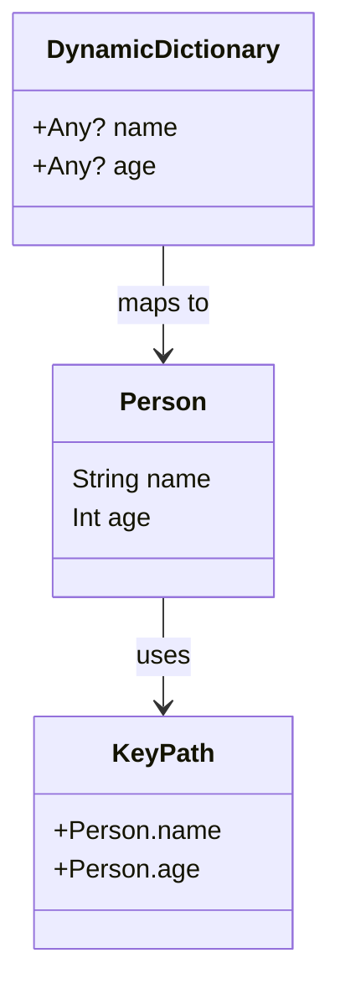

## 8.6 Using KeyPaths and Dynamic Member Lookup

In the world of Swift programming, the ability to access properties dynamically and write expressive code is crucial for building robust applications. This section delves into two powerful features of Swift: KeyPaths and Dynamic Member Lookup. These features allow developers to write more flexible and concise code, enhancing the overall expressiveness of Swift.

### Intent

The primary intent of using KeyPaths and Dynamic Member Lookup is to provide a mechanism for accessing properties dynamically, enabling developers to write more expressive and flexible code. These features are particularly useful in scenarios where reflection, data mapping, and domain-specific languages (DSLs) are required.

### Implementing KeyPaths in Swift

#### KeyPath Syntax

KeyPaths in Swift provide a way to reference properties of a type in a type-safe manner. They are represented using the `\Type.property` syntax, allowing you to create a reference to a property without accessing its value immediately.

```swift
struct Person {
    var name: String
    var age: Int
}

let nameKeyPath = \Person.name
let ageKeyPath = \Person.age
```

In this example, `nameKeyPath` and `ageKeyPath` are KeyPaths that reference the `name` and `age` properties of the `Person` struct, respectively.

#### Subscripts with KeyPaths

KeyPaths can be used in conjunction with subscripts to access or modify values dynamically. This allows you to write generic code that can operate on different properties without knowing them at compile time.

```swift
var person = Person(name: "Alice", age: 30)

// Accessing a property using a KeyPath
let name = person[keyPath: nameKeyPath]
print("Name: \\(name)")

// Modifying a property using a KeyPath
person[keyPath: ageKeyPath] = 31
print("Updated Age: \\(person.age)")
```

In this example, we use the `keyPath:` subscript to access and modify properties of the `person` instance dynamically.

#### Dynamic Member Lookup

Dynamic Member Lookup is a feature in Swift that allows you to access properties using dynamic member names. This is achieved by using the `@dynamicMemberLookup` attribute, which enables you to write more flexible and expressive code.

```swift
@dynamicMemberLookup
struct DynamicDictionary {
    private var storage: [String: Any] = [:]

    subscript(dynamicMember member: String) -> Any? {
        get {
            return storage[member]
        }
        set {
            storage[member] = newValue
        }
    }
}

var dictionary = DynamicDictionary()
dictionary.name = "Bob"
dictionary.age = 25

print("Name: \\(dictionary.name ?? "Unknown")")
print("Age: \\(dictionary.age ?? "Unknown")")
```

In this example, the `DynamicDictionary` struct uses `@dynamicMemberLookup` to allow dynamic access to its properties using dot syntax. This makes the code more readable and expressive.

### Use Cases and Examples

#### Reflection

Reflection is a powerful technique that allows you to inspect and interact with the properties of an object at runtime. KeyPaths can be used to iterate over properties dynamically, making reflection more type-safe and expressive.

```swift
func printProperties<T>(_ object: T) {
    let mirror = Mirror(reflecting: object)
    for child in mirror.children {
        if let label = child.label {
            print("\\(label): \\(child.value)")
        }
    }
}

let person = Person(name: "Charlie", age: 28)
printProperties(person)
```

This example demonstrates how to use reflection to print all properties of an object. KeyPaths can further enhance this by allowing type-safe access to properties.

#### Data Mapping

KeyPaths are particularly useful in data mapping scenarios, where you need to map data from one model to another. This is common in applications that interact with APIs or databases.

```swift
struct UserDTO {
    var fullName: String
    var userAge: Int
}

struct User {
    var name: String
    var age: Int
}

func mapUserDTOToUser(dto: UserDTO) -> User {
    return User(name: dto.fullName, age: dto.userAge)
}

let userDTO = UserDTO(fullName: "David", userAge: 35)
let user = mapUserDTOToUser(dto: userDTO)
print("Mapped User: \\(user.name), Age: \\(user.age)")
```

In this example, KeyPaths can be used to create a more generic data mapping function that can handle different types of models.

#### Domain-Specific Languages (DSLs)

Domain-Specific Languages (DSLs) are specialized languages tailored to a specific application domain. KeyPaths and Dynamic Member Lookup can be used to create more natural and expressive DSLs in Swift.

```swift
@dynamicMemberLookup
struct Configuration {
    private var settings: [String: Any] = [:]

    subscript(dynamicMember member: String) -> Any? {
        get {
            return settings[member]
        }
        set {
            settings[member] = newValue
        }
    }
}

var config = Configuration()
config.serverURL = "https://api.example.com"
config.timeout = 30

print("Server URL: \\(config.serverURL ?? "Not set")")
print("Timeout: \\(config.timeout ?? "Not set")")
```

This example shows how to use Dynamic Member Lookup to create a configuration DSL that allows setting and getting configuration values in a natural way.

### Visualizing KeyPaths and Dynamic Member Lookup

To better understand how KeyPaths and Dynamic Member Lookup work, let's visualize their interaction in a typical Swift application.



This diagram illustrates the relationship between a `Person` object, KeyPaths, and a `DynamicDictionary`. The `Person` class has properties that can be accessed using KeyPaths, while the `DynamicDictionary` uses Dynamic Member Lookup to map to these properties.

### Design Considerations

When using KeyPaths and Dynamic Member Lookup, consider the following design considerations:

- **Type Safety**: KeyPaths provide type-safe access to properties, reducing the risk of runtime errors.
- **Readability**: Dynamic Member Lookup can improve code readability by allowing more natural property access.
- **Performance**: While these features offer flexibility, they may introduce overhead, so use them judiciously in performance-critical code.
- **Maintainability**: Ensure that the use of dynamic features does not compromise code maintainability.

### Swift Unique Features

Swift's type system and protocol-oriented programming model make KeyPaths and Dynamic Member Lookup particularly powerful. KeyPaths leverage Swift's strong typing to provide safe and expressive property access, while Dynamic Member Lookup allows for flexible API design.

### Differences and Similarities

KeyPaths and Dynamic Member Lookup are both tools for dynamic property access, but they serve different purposes:

- **KeyPaths**: Provide type-safe, compile-time checked references to properties.
- **Dynamic Member Lookup**: Allows for runtime, dynamic property access using dot syntax.

Both features can be used together to create flexible and expressive Swift code.

### Try It Yourself

To deepen your understanding of KeyPaths and Dynamic Member Lookup, try modifying the code examples provided. Experiment with different types and properties, and explore how these features can be applied in your projects.

### Knowledge Check

- Can you create a KeyPath for a computed property?
- How does Dynamic Member Lookup improve code readability?
- What are the performance implications of using Dynamic Member Lookup?

### Embrace the Journey

Remember, mastering KeyPaths and Dynamic Member Lookup is just the beginning. As you continue to explore Swift, you'll discover even more powerful features and patterns. Keep experimenting, stay curious, and enjoy the journey!

## Quiz Time!



### What is the primary intent of using KeyPaths in Swift?

- [x] To provide a mechanism for accessing properties dynamically
- [ ] To replace all property access in Swift
- [ ] To improve the performance of Swift applications
- [ ] To allow unsafe property access

> **Explanation:** KeyPaths are used to access properties dynamically in a type-safe manner.

### How do you reference a property using KeyPath syntax?

- [x] \Type.property
- [ ] Type.property
- [ ] property.Type
- [ ] Type\property

> **Explanation:** The correct syntax for referencing a property using KeyPath is `\Type.property`.

### What attribute is used to enable Dynamic Member Lookup in Swift?

- [x] @dynamicMemberLookup
- [ ] @dynamicProperty
- [ ] @dynamicAccess
- [ ] @dynamicLookup

> **Explanation:** The `@dynamicMemberLookup` attribute is used to enable Dynamic Member Lookup.

### What is a use case for Dynamic Member Lookup?

- [x] Creating more readable and expressive code
- [ ] Improving application security
- [ ] Enhancing network performance
- [ ] Reducing memory usage

> **Explanation:** Dynamic Member Lookup allows for more readable and expressive code by enabling dynamic property access.

### Can KeyPaths be used for computed properties?

- [ ] Yes, always
- [x] No, KeyPaths are for stored properties
- [ ] Yes, but only in classes
- [ ] Yes, but only in structs

> **Explanation:** KeyPaths can only be used for stored properties, not computed properties.

### What is one advantage of using KeyPaths?

- [x] Type-safe access to properties
- [ ] Faster execution time
- [ ] Reduced code size
- [ ] Increased memory usage

> **Explanation:** KeyPaths provide type-safe access to properties, reducing the risk of runtime errors.

### How does Dynamic Member Lookup affect code maintainability?

- [x] It can improve readability but may introduce complexity
- [ ] It always simplifies code
- [ ] It has no impact on maintainability
- [ ] It makes code less readable

> **Explanation:** While Dynamic Member Lookup can improve readability, it may introduce complexity that affects maintainability.

### What is a potential downside of using Dynamic Member Lookup?

- [x] It may introduce runtime overhead
- [ ] It always increases performance
- [ ] It makes code less expressive
- [ ] It reduces type safety

> **Explanation:** Dynamic Member Lookup may introduce runtime overhead due to its dynamic nature.

### Which feature provides compile-time checked references to properties?

- [x] KeyPaths
- [ ] Dynamic Member Lookup
- [ ] Reflection
- [ ] Protocols

> **Explanation:** KeyPaths provide compile-time checked references to properties, ensuring type safety.

### True or False: KeyPaths and Dynamic Member Lookup can be used together in Swift.

- [x] True
- [ ] False

> **Explanation:** KeyPaths and Dynamic Member Lookup can be used together to create flexible and expressive Swift code.




