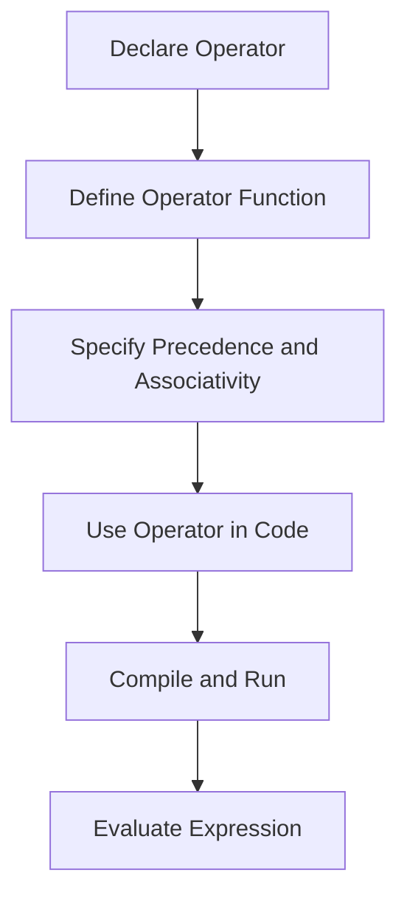

## 8.7 Custom Operators

In Swift, custom operators can be a powerful tool for enhancing code readability and expressiveness, particularly when working within domain-specific contexts. By defining new operators, developers can create a more intuitive and natural syntax for their code, making it easier to understand and maintain. In this section, we will explore the intent behind custom operators, how to implement them, and their various use cases.

### Intent

The primary intent of custom operators is to define new operators that allow for more readable and expressive code. This is particularly useful in domain-specific contexts where traditional operators may not suffice. Custom operators can help simplify complex expressions, making the code more intuitive and easier to maintain.

### Implementing Custom Operators in Swift

Implementing custom operators in Swift involves several key steps: operator declaration, defining the operator function, and specifying precedence and associativity. Let's delve into each of these components.

#### Operator Declaration

To declare a custom operator in Swift, you need to specify whether it is an infix, prefix, or postfix operator. This is done using the `infix`, `prefix`, or `postfix` keywords. Here's a brief overview of each type:

- **Infix Operators**: These operators appear between two operands, like the addition operator (`+`). For example, `a + b`.
- **Prefix Operators**: These operators appear before a single operand, like the negation operator (`-`). For example, `-a`.
- **Postfix Operators**: These operators appear after a single operand, like the increment operator (`++`). For example, `a++`.

```swift
// Declaring a custom infix operator
infix operator **: MultiplicationPrecedence

// Declaring a custom prefix operator
prefix operator √

// Declaring a custom postfix operator
postfix operator ++
```

#### Operator Functions

Once an operator is declared, you must implement its functionality through an operator function. This function defines the logic that the operator will perform. Here are examples for each type of operator:

```swift
// Implementing the infix operator **
func **(base: Int, exponent: Int) -> Int {
    return Int(pow(Double(base), Double(exponent)))
}

// Implementing the prefix operator √
prefix func √(value: Double) -> Double {
    return sqrt(value)
}

// Implementing the postfix operator ++
postfix func ++(value: inout Int) -> Int {
    let originalValue = value
    value += 1
    return originalValue
}
```

#### Precedence and Associativity

Precedence and associativity determine how operators are grouped in expressions. Precedence is the priority level of the operator, while associativity defines how operators of the same precedence are grouped (either left-to-right or right-to-left).

- **Precedence**: You can assign a precedence group to an operator to control its evaluation order relative to other operators.
- **Associativity**: This can be left, right, or none, indicating how operators of the same precedence are grouped.

```swift
// Defining a custom precedence group
precedencegroup ExponentiationPrecedence {
    higherThan: MultiplicationPrecedence
    associativity: right
}

// Assigning the precedence group to an operator
infix operator **: ExponentiationPrecedence
```

### Use Cases and Examples

Custom operators are particularly useful in specific scenarios where they can significantly enhance code clarity and expressiveness. Below are some common use cases and examples.

#### Mathematical Libraries

In mathematical libraries, custom operators can provide a natural expression of complex mathematical operations. For example, implementing an exponentiation operator (`**`) can make mathematical expressions more intuitive.

```swift
let result = 2 ** 3 // Equivalent to pow(2, 3) = 8
```

#### Domain-Specific Languages (DSLs)

Custom operators can be used to create concise syntax for domain-specific languages (DSLs). This allows developers to define operations that closely match the domain's terminology, improving code readability and maintainability.

```swift
// Example of a DSL for vector operations
struct Vector {
    var x: Double
    var y: Double
}

infix operator +: AdditionPrecedence
func +(lhs: Vector, rhs: Vector) -> Vector {
    return Vector(x: lhs.x + rhs.x, y: lhs.y + rhs.y)
}

let vector1 = Vector(x: 1.0, y: 2.0)
let vector2 = Vector(x: 3.0, y: 4.0)
let resultVector = vector1 + vector2 // Vector addition
```

#### Chaining Operations

Custom operators can simplify method chaining by providing a more readable and expressive syntax. This is particularly useful when working with complex data transformations or processing pipelines.

```swift
// Example of chaining operations with custom operators
infix operator >>>: AdditionPrecedence

func >>>(lhs: String, rhs: (String) -> String) -> String {
    return rhs(lhs)
}

let result = "Hello"
    >>> { $0.uppercased() }
    >>> { $0.reversed() }
    >>> { String($0) }

print(result) // Output: "OLLEH"
```

### Visualizing Custom Operators

To better understand how custom operators work in Swift, let's visualize the process of defining and using them with a flowchart.



This flowchart illustrates the steps involved in implementing and using custom operators in Swift. Starting from declaring the operator, defining its function, specifying precedence and associativity, and finally using it in code.

### Try It Yourself

To get hands-on experience with custom operators, try modifying the code examples provided. Experiment with different operator functions, precedence, and associativity to see how they affect the evaluation of expressions. Consider creating a custom operator for a specific domain or use case relevant to your projects.

### References and Links

For further reading on custom operators in Swift, consider exploring the following resources:

- [Swift.org - The Swift Programming Language](https://swift.org/documentation/)
- [Apple Developer Documentation - Operators](https://developer.apple.com/documentation/swift/swift_standard_library/operators)
- [Ray Wenderlich - Custom Operators in Swift](https://www.raywenderlich.com/)

### Knowledge Check

- Explain the difference between infix, prefix, and postfix operators.
- How do precedence and associativity affect the evaluation of expressions?
- What are some potential use cases for custom operators in Swift?

### Embrace the Journey

Remember, mastering custom operators in Swift is just one step in your journey to becoming a proficient Swift developer. As you continue to explore and experiment with different design patterns and language features, you'll gain a deeper understanding of how to write clean, efficient, and expressive code. Keep experimenting, stay curious, and enjoy the journey!

## Quiz Time!



### What is the primary intent of custom operators in Swift?

- [x] To create more readable and expressive code
- [ ] To replace all standard operators
- [ ] To make code less maintainable
- [ ] To increase code complexity

> **Explanation:** Custom operators are designed to enhance code readability and expressiveness, especially in domain-specific contexts.

### Which keyword is used to declare an infix operator in Swift?

- [ ] prefix
- [ ] postfix
- [x] infix
- [ ] operator

> **Explanation:** The `infix` keyword is used to declare an infix operator, which appears between two operands.

### How do you define the logic for a custom operator in Swift?

- [ ] By using a protocol
- [x] By implementing an operator function
- [ ] By declaring a class
- [ ] By using a struct

> **Explanation:** The logic for a custom operator is defined by implementing an operator function.

### What does associativity determine in the context of custom operators?

- [ ] The data type of the operator
- [ ] The number of operands
- [x] How operators of the same precedence are grouped
- [ ] The return type of the operator

> **Explanation:** Associativity determines how operators of the same precedence are grouped (left-to-right or right-to-left).

### Which of the following is a valid use case for custom operators?

- [x] Creating domain-specific languages
- [ ] Obfuscating code
- [ ] Removing all standard operators
- [ ] Increasing code complexity

> **Explanation:** Custom operators can be used to create concise syntax for domain-specific languages, enhancing code readability.

### What is the role of precedence in custom operators?

- [ ] To define the operator's return type
- [x] To control the evaluation order of operators
- [ ] To determine the number of operands
- [ ] To specify the operator's data type

> **Explanation:** Precedence controls the evaluation order of operators relative to others.

### Which of the following is NOT a type of operator in Swift?

- [ ] infix
- [ ] prefix
- [ ] postfix
- [x] suffix

> **Explanation:** Swift supports infix, prefix, and postfix operators, but not suffix operators.

### What is a potential benefit of using custom operators in mathematical libraries?

- [x] Natural expression of mathematical operations
- [ ] Increased code complexity
- [ ] Reduced code readability
- [ ] Obfuscation of logic

> **Explanation:** Custom operators allow for a natural expression of complex mathematical operations, enhancing readability.

### Can custom operators be used to simplify method chaining?

- [x] True
- [ ] False

> **Explanation:** Custom operators can provide a more readable and expressive syntax for method chaining.

### What should you consider when defining a custom operator?

- [x] Precedence and associativity
- [ ] The operator's color
- [ ] The operator's font size
- [ ] The operator's background

> **Explanation:** When defining a custom operator, it's important to consider its precedence and associativity to ensure correct evaluation order.


